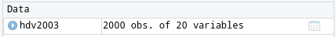

# Introduction à R

Après avoir complété cet exercice de laboratoire, vous pourrez :

- Ouvrir des fichiers de données R déjà existants
- Importer des ensembles de données rectangulaires
- Exporter des donnes de R vers un fichier texte
- Vérifier si les données ont été correctement importées
- Examiner la distribution des observations d’une variable
- Examiner visuellement et tester la normalité d’une variable
- Calculer des statistiques descriptives d’une variable
- Effectuer des transformations de données

## Paquets et données requises pour le labo {#set-intro}

Ce laboratoire nécessite:

* les paquets R:
  * questionr
  * ggplot2
* les fichiers de données
  * ErablesGatineau.csv
  * sturgeon.csv

## Premier pas avec R

Une fois R et RStudio installés sur votre machine, nous n'allons pas lancer R mais plutôt RStudio.

RStudio n'est pas à proprement parler une interface graphique qui permettrait d'utiliser R de manière "classique" via la souris, des menus et des boîtes de dialogue. Il s'agit plutôt de ce qu'on appelle un *Environnement de développement intégré* (IDE) qui facilite l'utilisation de R et le développement de scripts.

### La console

#### L'invite de commandes

Au premier lancement de RStudio, l'écran principal est découpé en trois grandes zones :

<!--  -->


```{r, fig.cap = "Interface de RStudio", out.width = "100%", echo = FALSE }
knitr::include_graphics("images/screenshots/rstudio_start.png")
```


La zone de gauche se nomme *Console*. À son démarrage, RStudio a lancé une nouvelle session de R et c'est dans cette fenêtre que nous allons pouvoir interagir avec lui.

La *Console* doit normalement afficher un texte de bienvenue ressemblant à ceci :

```
R version 4.0.2 (2020-06-22) -- "Taking Off Again"
Copyright (C) 2020 The R Foundation for Statistical Computing
Platform: x86_64-pc-linux-gnu (64-bit)

R est un logiciel libre livré sans AUCUNE GARANTIE.
Vous pouvez le redistribuer sous certaines conditions.
Tapez 'license()' ou 'licence()' pour plus de détails.

R est un projet collaboratif avec de nombreux contributeurs.
Tapez 'contributors()' pour plus d'information et
'citation()' pour la façon de le citer dans les publications.

Tapez 'demo()' pour des démonstrations, 'help()' pour l'aide
en ligne ou 'help.start()' pour obtenir l'aide au format HTML.
Tapez 'q()' pour quitter R.
```

suivi d'une ligne commençant par le caractère `>` et sur laquelle devrait se trouver votre curseur. Cette ligne est appelée l'*invite de commande* (ou *prompt* en anglais). Elle signifie que R est disponible et en attente de votre prochaine commande.

Nous pouvons tout de suite lui fournir une première commande, en saisissant le texte suivant puis en appuyant sur `Entrée` :

```{r}
2 + 2
```

R nous répond immédiatement, et nous pouvons constater avec soulagement qu'il sait faire des additions à un chiffre^[On peut ignorer pour le moment la présence du `[1]` en début de ligne.]. On peut donc continuer avec d'autres opérations :


```{r}
5 - 7
4 * 12
-10 / 3
5^2
```

Cette dernière opération utilise le symbole `^` qui représente l'opération *puissance*. `5^2` signifie donc "5 au carré", soit 25.

#### Précisions concernant la saisie des commandes

Lorsqu'on saisit une commande, les espaces autour des opérateurs n'ont pas d'importance. Les trois commandes suivantes sont donc équivalentes, mais on privilégie en général la deuxième pour des raisons de lisibilité du code.

```{r eval=FALSE}
10+2
10 + 2
10       +       2
```


Quand vous êtes dans la console, vous pouvez utiliser les flèches vers le haut et vers le bas pour naviguer dans l'historique des commandes que vous avez tapées précédemment. Vous pouvez à tout moment modifier la commande affichée, et l'exécuter en appuyant sur `Entrée`.

Enfin, il peut arriver qu'on saisisse une commande de manière incomplète : oubli d'une parenthèse, faute de frappe, etc. Dans ce cas, R remplace l'invite de commande habituel par un signe `+` :

```{r eval=FALSE}
4 *
+
```

Cela signifie qu'il "attend la suite". On peut alors soit compléter la commande sur cette nouvelle ligne et appuyer sur `Entrée`, soit, si on est perdu, tout annuler et revenir à l'invite de commandes normal en appuyant sur `Esc` ou `Échap`.


### Objets

#### Objets simples

Faire des calculs c'est bien, mais il serait intéressant de pouvoir stocker un résultat quelque part pour pouvoir le réutiliser ultérieurement sans avoir à faire du copier/coller.

Pour conserver le résultat d'une opération, on peut le stocker dans un *objet* à l'aide de l'opérateur d'assignation `<-`. Cette "flèche" stocke ce qu'il y a à sa droite dans un objet dont le nom est indiqué à sa gauche.

Prenons tout de suite un exemple :

```{r}
x <- 2
```

Cette commande peut se lire *"prend la valeur 2 et mets la dans un objet qui s'appelle `x`"*.

Si on exécute une commande comportant juste le nom d'un objet, R affiche son contenu :

```{r}
x
```

On voit donc que notre objet `x` contient bien la valeur 2.

On peut évidemment réutiliser cet objet dans d'autres opérations. R le remplacera alors par sa valeur :

```{r}
x + 4
```

On peut créer autant d'objets qu'on le souhaite.

```{r}
x <- 2
y <- 5
resultat <- x + y
resultat
```

::: {.callout-important}
Les noms d'objets peuvent contenir des lettres, des chiffres, les symboles `.` et `_`. Ils ne peuvent pas commencer par un chiffre. Attention, R fait la différence entre minuscules et majuscules dans les noms d'objets, ce qui signifie que `x` et `X` seront deux objets différents, tout comme `resultat` et `Resultat`.

De manière générale, il est préférable d'éviter les majuscules (pour les risques d'erreur) et les caractères accentués (pour des questions d'encodage) dans les noms d'objets.

De même, il faut essayer de trouver un équilibre entre clarté du nom (comprendre à quoi sert l'objet, ce qu'il contient) et sa longueur. Par exemple, on préfèrera comme nom d'objet `taille_conj1` à `taille_du_conjoint_numero_1` (trop long) ou à `t1` (pas assez explicite).
:::

Quand on assigne une nouvelle valeur à un objet déjà existant, la valeur précédente est perdue. Les objets n'ont pas de mémoire.

```{r}
x <- 2
x <- 5
x
```

De la même manière, assigner un objet à un autre ne crée pas de "lien" entre les deux. Cela copie juste la valeur de l'objet de droite dans celui de gauche :

```{r}
x <- 1
y <- 3
x <- y
x
## Si on modifie y, cela ne modifie pas x
y <- 4
x
```

On le verra, les objets peuvent contenir tout un tas d'informations. Jusqu'ici on n'a stocké que des nombres, mais ils peuvent aussi contenir des chaînes de caractères (du texte), qu'on délimite avec des guillemets simples ou doubles (`'` ou `"`) :

```{r}
chien <- "Chihuahua"
chien
```


### Vecteurs

Imaginons maintenant qu'on a demandé la taille en centimètres de 5 personnes et qu'on souhaite calculer leur taille moyenne. On pourrait créer autant d'objets que de tailles et faire l'opération mathématique qui va bien :

```{r}
taille1 <- 156
taille2 <- 164
taille3 <- 197
taille4 <- 147
taille5 <- 173
(taille1 + taille2 + taille3 + taille4 + taille5) / 5
```

Cette manière de faire n'est évidemment pas pratique du tout. On va plutôt stocker l'ensemble de nos tailles dans un seul objet, de type *vecteur*, avec la syntaxe suivante :

```{r}
tailles <- c(156, 164, 197, 147, 173)
```

Si on affiche le contenu de cet objet, on voit qu'il contient bien l'ensemble des tailles saisies :

```{r}
tailles
```

Un *vecteur* dans R est un objet qui peut contenir plusieurs informations du même type, potentiellement en très grand nombre.

L'avantage d'un vecteur est que lorsqu'on lui applique une opération, celle-ci s'applique à toutes les valeurs qu'il contient. Ainsi, si on veut la taille en mètres plutôt qu'en centimètres, on peut faire :

```{r}
tailles_m <- tailles / 100
tailles_m
```

Cela fonctionne pour toutes les opérations de base :

```{r}
tailles + 10
tailles^2
```

Imaginons maintenant qu'on a aussi demandé aux cinq mêmes personnes leur poids en kilos. On peut alors créer un deuxième vecteur :

```{r}
poids <- c(45, 59, 110, 44, 88)
```

On peut alors effectuer des calculs utilisant nos deux vecteurs `tailles` et `poids`. On peut par exemple calculer l'indice de masse corporelle (IMC) de chacun de nos enquêtés en divisant leur poids en kilo par leur taille en mètre au carré :

```{r}
imc <- poids / (tailles / 100) ^ 2
imc
```

Un vecteur peut contenir des nombres, mais il peut aussi contenir du texte. Imaginons qu'on a demandé aux 5 mêmes personnes leur niveau de diplôme : on peut regrouper l'information dans un vecteur de *chaînes de caractères*. Une chaîne de caractère contient du texte libre, délimité par des guillemets simples ou doubles :

```{r}
diplome <- c("PHD", "Bac", "MSc", "MSc", "Bac")
diplome
```

L'opérateur `:`, lui, permet de générer rapidement un vecteur comprenant tous les nombres entre deux valeurs, opération assez courante sous R :

```{r}
x <- 1:10
x
```

Enfin, notons qu'on peut accéder à un élément particulier d'un vecteur en faisant suivre le nom du vecteur de crochets contenant le numéro de l'élément désiré. Par exemple :

```{r}
diplome[2]
```

Cette opération, qui utilise l'opérateur `[]`, permet donc la sélection d'éléments d'un vecteur.

Dernière remarque, si on affiche dans la console un vecteur avec beaucoup d'éléments, ceux-ci seront répartis sur plusieurs lignes. Par exemple, si on a un vecteur de 50 nombres on peut obtenir quelque chose comme :

     [1] 294 425 339 914 114 896 716 648 915 587 181 926 489
    [14] 848 583 182 662 888 417 133 146 322 400 698 506 944
    [27] 237 324 333 443 487 658 793 288 897 588 697 439 697
    [40] 914 694 126 969 744 927 337 439 226 704 635

On remarque que R ajoute systématiquement un nombre entre crochets au début de chaque ligne : il s'agit en fait de la position du premier élément de la ligne dans le vecteur. Ainsi, le 848 de la deuxième ligne est le 14e élément du vecteur, le 914 de la dernière ligne est le 40e, etc.

Ceci explique le `[1]` qu'on obtient quand on affiche un simple nombre et permet de constater que pour R, un nombre est un vecteur à un seul élément :

     [1] 4


### Fonctions

#### Principe

Nous savons désormais effectuer des opérations arithmétiques de base sur des nombres et des vecteurs, et stocker des valeurs dans des objets pour pouvoir les réutiliser plus tard.

Pour aller plus loin, nous devons aborder les *fonctions* qui sont, avec les objets, un deuxième concept de base de R. On utilise des fonctions pour effectuer des calculs, obtenir des résultats et accomplir des actions.

Formellement, une fonction a un *nom*, elle prend en entrée entre parenthèses un ou plusieurs *arguments* (ou *paramètres*), et retourne un *résultat*.

Prenons tout de suite un exemple. Si on veut connaître le nombre d'éléments du vecteur `tailles` que nous avons construit précédemment, on peut utiliser la fonction `length`, de cette manière :

```{r}
length(tailles)
```

Ici, `length` est le nom de la fonction, on l'appelle en lui passant un argument entre parenthèses (en l'occurrence notre vecteur `tailles`), et elle nous renvoie un résultat, à savoir le nombre d'éléments du vecteur passé en paramètre.

Autre exemple, les fonctions `min` et `max` retournent respectivement les valeurs minimales et maximales d'un vecteur de nombres :

```{r}
min(tailles)
max(tailles)
```

La fonction `mean` calcule et retourne la moyenne d'un vecteur de nombres :

```{r}
mean(tailles)
```

La fonction `sum` retourne la somme de tous les éléments du vecteur :

```{r}
sum(tailles)
```


Jusqu'à présent on n'a vu que des fonctions qui calculent et retournent un unique nombre. Mais une fonction peut renvoyer d'autres types de résultats. Par exemple, la fonction `range` (étendue) renvoie un vecteur de deux nombres, le minimum et le maximum :

```{r}
range(tailles)
```

Ou encore, la fonction `unique`, qui supprime toutes les valeurs en double dans un vecteur, qu'il s'agisse de nombres ou de chaînes de caractères :

```{r}
diplome
unique(diplome)
```


#### Arguments

Une fonction peut prendre plusieurs arguments, dans ce cas on les indique toujours entre parenthèses, séparés par des virgules.

On a déjà rencontré un exemple de fonction acceptant plusieurs arguments : la fonction `c`, qui combine l'ensemble de ses arguments en un vecteur^[`c` est l'abbréviation de *combine*, son nom est très court car on l'utilise très souvent] :

```{r}
tailles <- c(156, 164, 197, 181, 173)
```

Ici, `c` est appelée en lui passant cinq arguments, les cinq tailles séparées par des virgules, et elle renvoie un vecteur numérique regroupant ces cinq valeurs.

Supposons maintenant que dans notre vecteur `tailles` nous avons une valeur manquante (une personne a refusé de répondre, ou notre mètre mesureur était en panne). On symbolise celle-ci dans R avec le code interne `NA` :

```{r}
tailles <- c(156, 164, 197, NA, 173)
tailles
```

::: {.callout-note}
`NA` est l'abbréviation de *Not available*, non disponible. Cette valeur particulière peut être utilisée pour indiquer une valeur manquante, qu'il s'agisse d'un nombre, d'une chaîne de caractères, etc.
:::

Si je calcule maintenant la taille moyenne à l'aide de la fonction `mean`, j'obtiens :

```{r}
mean(tailles)
```

En effet, R considère par défaut qu'il ne peut pas calculer la moyenne si une des valeurs n'est pas disponible. Il considère alors que cette moyenne est elle-même "non disponible" et renvoie donc comme résultat `NA`.

On peut cependant indiquer à `mean` d'effectuer le calcul en ignorant les valeurs manquantes. Ceci se fait en ajoutant un argument supplémentaire, nommé `na.rm` (abbréviation de *NA remove*, "enlever les NA"), et de lui attribuer la valeur `TRUE` (code interne de R signifiant *vrai*) :

```{r}
mean(tailles, na.rm = TRUE)
```

Positionner le paramètre `na.rm` à `TRUE`  indique à la fonction `mean` de ne pas tenir compte des valeurs manquantes dans le calcul.

Si on ne dit rien à la fonction `mean`, cet argument a une valeur par défaut, en l'occurrence `FALSE` (faux), qui fait qu'il ne supprime pas les valeurs manquantes. Les deux commandes suivantes sont donc rigoureusement équivalentes :

```{r}
mean(tailles)
mean(tailles, na.rm = FALSE)
```

::: {.callout-note}
Lorsqu'on passe un argument à une fonction de cette manière, c'est-à-dire sous la forme `nom = valeur`, on parle d'*argument nommé*.
:::

#### Aide sur une fonction

Il est fréquent de ne pas savoir (ou d'avoir oublié) quels sont les arguments d'une fonction, ou comment ils se nomment. On peut à tout moment faire appel à l'aide intégrée à R en passant le nom de la fonction (entre guillemets) à la fonction `help` :

```{r, eval = FALSE}
help("mean")
```

On peut aussi utiliser le raccourci `?mean`.

Ces deux commandes affichent une page (en anglais) décrivant la fonction, ses paramètres, son résultat, le tout accompagné de diverses notes, références et exemples. Ces pages d'aide contiennent à peu près tout ce que vous pourrez chercher à savoir, mais elles ne sont pas toujours d'une lecture aisée.

Dans RStudio, les pages d'aide en ligne s'ouvriront par défaut dans la zone en bas à droite,
sous l'onglet *Help*. Un clic sur l'icône en forme de maison vous affichera la page d'accueil de l'aide.


### Regrouper ses commandes dans des scripts

Jusqu'ici on a utilisé R de manière "interactive", en saisissant des commandes directement dans la console. Ça n'est cependant pas la manière dont on va utiliser R au quotidien, pour une raison simple : lorsque R redémarre, tout ce qui a été effectué dans la console est perdu.

Plutôt que de saisir nos commandes dans la console, on va donc les regrouper dans des scripts (de simples fichiers texte), qui vont garder une trace de toutes les opérations effectuées, et ce sont ces scripts, sauvegardés régulièrement, qui seront le "coeur" de notre travail. C'est en rouvrant les scripts et en réexécutant les commandes qu'ils contiennent qu'on pourra "reproduire" les données, leur traitement, les analyses et leurs résultats.

Pour créer un script, il suffit de sélectionner le menu *File*, puis *New file* et *R script*. Une quatrième zone apparaît alors en haut à gauche de l'interface de RStudio. On peut enregistrer notre script à tout moment dans un fichier avec l'extension `.R`, en cliquant sur l'icône de disquette ou en choissant *File* puis *Save*.

Un script est un fichier texte brut, qui s'édite de la manière habituelle. À la différence de la console, quand on appuie sur `Entrée`, cela n'exécute pas la commande en cours mais insère un saut de ligne (comme on pouvait s'y attendre).

Pour exécuter une commande saisie dans un script, il suffit de positionner le curseur sur la ligne de la commande en question, et de cliquer sur le bouton *Run* dans la barre d'outils juste au-dessus de la zone d'édition du script. On peut aussi utiliser le raccourci clavier `Ctrl + Entrée` (`Cmd + Entrée` sous Mac). On peut enfin sélectionner plusieurs lignes avec la souris ou le clavier et cliquer sur *Run* (ou utiliser le raccourci clavier), et l'ensemble des lignes est exécuté d'un coup.

Au final, un script pourra ressembler à quelque chose comme ça :

```{r, eval=FALSE}
tailles <- c(156, 164, 197, 147, 173)
poids <- c(45, 59, 110, 44, 88)

mean(tailles)
mean(poids)

imc <- poids / (tailles / 100) ^ 2
min(imc)
max(imc)
```


#### Commentaires

Les commentaires sont un élément très important d'un script. Il s'agit de texte libre, ignoré par R, et qui permet de décrire les étapes du script, sa logique, les raisons pour lesquelles on a procédé de telle ou telle manière... Il est primordial de documenter ses scripts à l'aide de commentaires, car il est très facile de ne plus se retrouver dans un programme qu'on a produit soi-même, même après une courte interruption.

Pour ajouter un commentaire, il suffit de le faire précéder d'un ou plusieurs symboles `#`. En effet, dès que R rencontre ce caractère, il ignore tout ce qui se trouve derrière, jussqu'à la fin de la ligne.

On peut donc documenter le script précédent :

```{r, eval=FALSE}
# Saisie des tailles et poids des enquêtés
tailles <- c(156, 164, 197, 147, 173)
poids <- c(45, 59, 110, 44, 88)

# Calcul des tailles et poids moyens
mean(tailles)
mean(poids)

# Calcul de l'IMC (poids en kilo divisé par les tailles en mètre au carré)
imc <- poids / (tailles / 100) ^ 2
# Valeurs extrêmes de l'IMC
min(imc)
max(imc)
```


### Installer et charger des extensions (*packages*) {#packages}

R étant un logiciel libre, il bénéficie d'un développement communautaire riche et dynamique. L'installation de base de R permet de faire énormément de choses, mais le langage dispose en plus d'un système d'extensions permettant d'ajouter facilement de nouvelles fonctionnalités. La plupart des extensions sont développées et maintenues par la communauté des utilisateurs de R, et diffusées via un réseau de serveurs nommé CRAN (*Comprehensive R Archive Network*).

Pour installer une extension, si on dispose d'une connexion Internet, on peut utiliser le bouton *Install* de l'onglet *Packages* de RStudio.

<!--  -->

```{r, fig.cap = "Installer une extension", out.width = "50%", echo = FALSE }
knitr::include_graphics("images/screenshots/rstudio_package_install.png")
```

Il suffit alors d'indiquer le nom de l'extension dans le champ *Package* et de cliquer sur *Install*.

<!--  -->

```{r, fig.cap = "Installation une extension", out.width = "50%", echo = FALSE }
knitr::include_graphics("images/screenshots/rstudio_package_install2.png")
```

images/screenshots/rstudio_package_install.png
On peut aussi installer des extensions en utilisant la fonction `install.packages()` directement dans la console. Par exemple, pour installer le *package* `questionr` on peut exécuter la commande :

```{r, eval = FALSE}
install.packages("questionr")
```

Installer une extension via l'une des deux méthodes précédentes va télécharger l'ensemble des fichiers nécessaires depuis l'une des machines du CRAN, puis installer tout ça sur le disque dur de votre ordinateur. Vous n'avez besoin de le faire qu'une fois, comme vous le faites pour installer un programme sur votre Mac ou PC.

Une fois l'extension installée, il faut la "charger" avant de pouvoir utiliser les fonctions qu'elle propose. Ceci se fait avec la fonction `library`. Par exemple, pour pouvoir utiliser les fonctions de `questionr`, vous devrez exécuter la commande suivante :

```{r eval = FALSE}
library(questionr)
```

Ainsi, bien souvent, on regroupe en début de script toute une série d'appels à `library` qui permettent de charger tous les packages utilisés dans le script. Quelque chose comme :

```{r, eval = FALSE}
library(readxl)
library(ggplot2)
library(questionr)
```

Si vous essayez d'exécuter une fonction d'une extension et que vous obtenez le message d'erreur `impossible de trouver la fonction`, c'est certainement parce que vous n'avez pas exécuté la commande `library` correspondante.


### Exercices {#ex-introR}

#### Exercice 1

Construire le vecteur `x` suivant :

```{r echo=FALSE}
x <- c(120, 134, 256, 12)
x
```


::: {.callout-tip collapse="true"}
# Solution
```{r, eval = FALSE}
x <- c(120, 134, 256, 12)
```
:::

Utiliser ce vecteur `x` pour générer les deux vecteurs suivants :

```{r echo=FALSE}
x + 100
x * 2
```


::: {.callout-tip collapse="true"}
# Solution
```{r, eval = FALSE}
x + 100
x * 2
```
:::


#### Exercice 2

On a demandé à 4 ménages le revenu des deux conjoints, et le nombre de personnes du ménage :

```{r eval=FALSE}
conjoint1 <- c(1200, 1180, 1750, 2100)
conjoint2 <- c(1450, 1870, 1690, 0)
nb_personnes <- c(4, 2, 3, 2)
```

Calculer le revenu total de chaque ménage, puis diviser par le nombre de personnes pour obtenir le revenu par personne de chaque ménage.


::: {.callout-tip collapse="true"}
# Solution
```{r, eval = FALSE}
revenu_total <- conjoint1 + conjoint2
revenu_total / nb_personnes
```
:::


#### Exercice 3

Dans l'exercice précédent, calculer le revenu minimum et maximum parmi ceux du premier conjoint.

```{r eval=FALSE}
conjoint1 <- c(1200, 1180, 1750, 2100)
```


::: {.callout-tip collapse="true"}
# Solution
```{r, eval = FALSE}
range(conjoint1)
```
:::


Recommencer avec les revenus suivants, parmi lesquels l'un des enquetés n'a pas voulu répondre :

```{r eval=FALSE}
conjoint1 <- c(1200, 1180, 1750, NA)
```


::: {.callout-tip collapse="true"}
# Solution
```{r, eval = FALSE}
range(conjoint1, na.rm = TRUE)
```
:::


#### Exercice 4

Les deux vecteurs suivants représentent les précipitations (en mm) et la température (en °C) moyennes sur la ville de Lyon, pour chaque mois de l'année, entre 1981 et 2010 :

```{r}
temperature <- c(3.4, 4.8, 8.4, 11.4, 15.8, 19.4, 22.2, 21.6, 17.6, 13.4, 7.6, 4.4)
precipitations <- c(47.2, 44.1, 50.4, 74.9, 90.8, 75.6, 63.7, 62, 87.5, 98.6, 81.9, 55.2)
```

Calculer la température moyenne sur l'année.

Calculer la quantité totale de précipitations sur l'année.


::: {.callout-tip collapse="true"}
# Solution
```{r, eval = FALSE}
mean(temperature)
sum(precipitations)
```
:::


À quoi correspond et comment peut-on interpréter le résultat de la fonction suivante ? Vous pouvez vous aider de la page d'aide de la fonction si nécessaire.

```{r}
cumsum(precipitations)
```

Même question pour :

```{r}
diff(temperature)
```


::: {.callout-tip collapse="true"}
# Solution
`cumsum(precipitations)` correspond à la somme cumulée des précipitations sur l'année. Par exemple, la 6e valeur du vecteur résultat correspond au total de précipitations de janvier à juin.

`diff(temperature)` correspond à la différence de température d'un mois sur l'autre. Par exemple, la 2e valeur de ce vecteur correspond à l'écart de température entre le mois de février et le mois de janvier.
:::


#### Exercice 5

On a relevé les notes en maths, anglais et sport d'une classe de 6 élèves et on a stocké ces données dans trois vecteurs :

```{r}
maths <- c(12, 16, 8, 18, 6, 10)
anglais <- c(14, 9, 13, 15, 17, 11)
sport <- c(18, 11, 14, 10, 8, 12)
```

Calculer la moyenne des élèves de la classe en anglais.

Calculer la moyenne générale de chaque élève.


::: {.callout-tip collapse="true"}
# Solution
```{r, eval = FALSE}
mean(anglais)
(maths + anglais + sport) / 3
```
:::


Essayez de comprendre le résultat des deux fonctions suivantes (vous pouvez vous aider de la page d'aide de ces fonctions) :

```{r}
pmin(maths, anglais, sport)
```

```{r}
pmax(maths, anglais, sport)
```


::: {.callout-tip collapse="true"}
# Solution
`pmin` et `pmax` renvoient les minimum et maximum "parallèles" des trois vecteurs passés en argument. Ainsi, `pmin` renvoie pour chaque élève la note minimale dans les trois matières, et `pmax` la note maximale.
:::


## Premier travail avec des données


### Jeu de données d'exemple

Dans cette partie nous allons (enfin) travailler sur des "vraies" données, et utiliser un jeu de données présent dans l'extension `questionr`. Nous devons donc avant toute chose installer cette extension.

Pour installer ce package, deux possibilités :

- Dans l'onglet *Packages* de la zone de l'écran en bas à droite, cliquez sur le bouton *Install*. Dans le dialogue qui s'ouvre, entrez "questionr" dans le champ *Packages* puis cliquez sur *Install*.
- Saisissez directement la commande suivante dans la console : `install.packages("questionr")`

Dans les deux cas, tout un tas de messages devraient s'afficher dans la console. Attendez que l'invite de commandes `>` apparaisse à nouveau.

Pour plus d'informations sur les extensions et leur installation, voir la section \@ref(packages).

Le jeu de données que nous allons utiliser est un extrait de l'enquête *Histoire de vie* réalisée par l'INSEE en 2003. Il contient 2000 individus et 20 variables.

Pour pouvoir utiliser ces données, il faut d'abord charger l'extension `questionr` (après l'avoir installée, bien entendu) :

```{r}
library(questionr)
```

L'utilisation de `library` permet de rendre "disponibles", dans notre session R, les fonctions et jeux de données inclus dans l'extension.

Nous devons ensuite indiquer à R que nous souhaitons accéder au jeu de données à l'aide de la commande `data` :

```{r}
data(hdv2003)
```

Cette commande ne renvoie aucun résultat particulier (sauf en cas d'erreur), mais vous devriez voir apparaître dans l'onglet *Environment* de RStudio un nouvel objet nommé `hdv2003` :

<!--  -->

```{r, fig.cap = "Onglet Environment", out.width = "75%", echo = FALSE }
knitr::include_graphics("images/screenshots/rstudio_environment.png")
```

Cet objet est d'un type nouveau : il s'agit d'un tableau de données.


### Tableau de données (*data frame*)


Un *data frame* (ou tableau de données, ou table) est un type d'objet R qui contient des données au format tabulaire, avec les observations en ligne et les variables en colonnes, comme dans une feuille de tableur de type LibreOffice ou Excel.

Si on se contente d'exécuter le nom de notre tableau de données :

```{r, eval=FALSE}
hdv2003
```

R va, comme à son habitude, nous l'afficher dans la console, ce qui est tout sauf utile.

Une autre manière d'afficher le contenu du tableau est de cliquer sur l'icône en forme de tableau à droite du nom de l'objet dans l'onglet *Environment* :

<!--  -->

```{r, fig.cap = "Icone view", out.width = "75%", echo = FALSE }

```

Ou d'utiliser la fonction `View` :

```{r, eval = FALSE}
View(hdv2003)
```

Dans les deux cas votre tableau devrait s'afficher dans RStudio avec une interface de type tableur :

<!--  -->

```{r, fig.cap = "Interface View", out.width = "100%", echo = FALSE }
knitr::include_graphics("images/screenshots/rstudio_view.png")
```

Il est important de comprendre que l'objet `hdv2003` contient *l'intégralité* des données du tableau.
On voit donc qu'un objet peut contenir des données de types très différents (simple nombre, texte, vecteur, tableau de données entier), et être potentiellement de très grande taille^[La seule limite pour la taille d'un objet étant la mémoire vive (RAM) de la machine sur laquelle tourne la session R.].

::: {.callout-note}
Sous R, on peut importer ou créer autant de tableaux de données qu'on le souhaite, dans les limites des capacités de sa machine.
:::

Un *data frame* peut être manipulé comme les autres objets vus précédemment. On peut par exemple faire :

```{r}
d <- hdv2003
```

ce qui va entraîner la copie de l'ensemble de nos données dans un nouvel objet nommé `d`. Ceci peut paraître parfaitement inutile mais a en fait l'avantage de fournir un objet avec un nom beaucoup plus court, ce qui diminuera la quantité de texte à saisir par la suite.

**Pour résumer**, comme nous avons désormais décidé de saisir nos commandes dans un script et non plus directement dans la console, les premières lignes de notre fichier de travail sur les données de l'enquête *Histoire de vie* pourraient donc ressembler à ceci :


```{r, eval = FALSE}
## Chargement des extensions nécessaires
library(questionr)

## Jeu de données hdv2003
data(hdv2003)
d <- hdv2003
```


#### Structure du tableau

Un tableau étant un objet comme un autre, on peut lui appliquer des fonctions. Par exemple, `nrow` et `ncol` retournent le nombre de lignes et de colonnes du tableau :

```{r}
nrow(d)
```

```{r}
ncol(d)
```

La fonction `dim` renvoie ses dimensions, donc les deux nombres précédents :

```{r}
dim(d)
```

La fonction `names` retourne les noms des colonnes du tableau, c'est-à-dire la liste de nos *variables* :

```{r}
names(d)
```

Enfin, la fonction `str` renvoie un descriptif plus détaillé de la structure du tableau. Elle liste les différentes variables, indique leur type ^[Les différents types de variables seront décrits plus en détail dans le chapitre \@ref(vectorfactor) sur les recodages.] et affiche les premières valeurs :

```{r}
str(d)
```


Sous RStudio, on peut afficher à tout moment la structure d'un objet en cliquant sur l'icône de triangle sur fond bleu à gauche du nom de l'objet dans l'onglet *Environment* :

<!--  -->

```{r, fig.cap = "Structure d'un objet", out.width = "100%", echo = FALSE }
knitr::include_graphics("images/screenshots/rstudio_environment_str.png")
```

#### Accéder aux variables d'un tableau

Une opération très importante est l'accès aux variables du tableau (à ses colonnes) pour pouvoir les manipuler, effectuer des calculs, etc. On utilise pour cela l'opérateur `$`, qui permet d'accéder aux colonnes du tableau. Ainsi, si l'on tape :

```{r include=FALSE}
options(max.print = 200)
```


```{r}
d$sexe
```

R va nous afficher l'ensemble des valeurs de notre variable `sexe` dans la console, ce qui est à nouveau fort peu utile. Mais cela nous permet de constater que `d$sexe` est un vecteur de chaînes de caractères tels qu'on en a déjà rencontré précédemment.

La fonction `table$colonne` renvoie donc la colonne nommée `colonne` du tableau `table`, c'est-à-dire un vecteur, en général de nombres ou de chaînes de caractères.

Si on souhaite afficher seulement les premières ou dernières valeurs d'une variable, on peut utiliser les fonctions `head` et `tail` :

```{r}
head(d$age)
```


```{r}
tail(d$age, 10)
```

Le deuxième argument numérique permet d'indiquer le nombre de valeurs à afficher.

#### Créer une nouvelle variable

On peut aussi utiliser l'opérateur `$` pour créer une nouvelle variable dans notre tableau : pour cela, il suffit de lui assigner une valeur.

Par exemple, la variable `heures.tv` contient le nombre d'heures passées quotidiennement devant la télé :

```{r}
head(d$heures.tv, 10)
```

On peut vouloir créer une nouvelle variable dans notre tableau qui contienne la même durée mais en minutes. On va donc créer une nouvelle variables `minutes.tv` de la manière suivante :

```{r}
d$minutes.tv <- d$heures.tv * 60
```

On peut alors constater, soit visuellement soit dans la console, qu'une nouvelle variable (une nouvelle colonne) a bien été ajoutée au tableau :

```{r}
head(d$minutes.tv)
```


### Analyse univariée

On a donc désormais accès à un tableau de données `d`, dont les lignes sont des observations (des individus enquêtés), et les colonnes des variables (des caractéristiques de chacun de ces individus), et on sait accéder à ces variables grâce à l'opérateur `$`.

Si on souhaite analyser ces variables, les méthodes et fonctions utilisées seront différentes selon qu'il s'agit d'une variable *quantitative* (variable numérique pouvant prendre un grand nombre de valeurs : l'âge, le revenu, un pourcentage...) ou d'une variable *qualitative* (variable pouvant prendre un nombre limité de valeurs appelées modalités : le sexe, la profession, le dernier diplôme obtenu, etc.).

#### Analyser une variable quantitative

Une variable quantitative est une variable de type numérique (un nombre) qui peut prendre un grand nombre de valeurs. On en a plusieurs dans notre jeu de données, notamment l'âge (variable `age`) ou le nombre d'heures passées devant la télé (`heures.tv`).


##### Indicateurs de centralité

Caractériser une variable quantitative, c'est essayer de décrire la manière dont ses valeurs se répartissent, ou se distribuent.

Pour cela on peut commencer par regarder les valeurs extrêmes, avec les fonctions `min`, `max` ou `range` :

```{r}
min(d$age)
max(d$age)
range(d$age)
```

On peut aussi calculer des indicateurs de *centralité* : ceux-ci indiquent autour de quel nombre se répartissent les valeurs de la variable. Il y en a plusieurs, le plus connu étant la moyenne, qu'on peut calculer avec la fonction `mean` :

```{r}
mean(d$age)
```

Il existe aussi la médiane, qui est la valeur qui sépare notre population en deux : on a la moitié de nos observations en-dessous, et la moitié au-dessus. Elle se calcule avec la fonction `median` :

```{r}
median(d$age)
```

Une différence entre les deux indicateurs est que la médiane est beaucoup moins sensible aux valeurs "extrêmes" : on dit qu'elle est plus *robuste*. Ainsi, en 2013, le salaire net *moyen* des salariés à temps plein en France était de 2202 euros, tandis que le salaire net *médian* n'était que de 1772 euros. La différence étant due à des très hauts salaires qui "tirent" la moyenne vers le haut.


##### Indicateurs de dispersion

Les indicateurs de dispersion permettent de mesurer si les valeurs sont plutôt regroupées ou au contraire plutôt dispersées.

L'indicateur le plus simple est l'étendue de la distribution, qui décrit l'écart maximal observé entre les observations :

```{r}
max(d$age) - min(d$age)
```

Les indicateurs de dispersion les plus utilisés sont la variance ou, de manière équivalente, l'écart-type (qui est égal à la racine carrée de la variance). On obtient la première avec la fonction `var`, et le second avec `sd` (abbréviation de *standard deviation*) :

```{r}
var(d$age)
```

```{r}
sd(d$age)
```

Plus la variance ou l'écart-type sont élevés, plus les valeurs sont dispersées autour de la moyenne. À l'inverse, plus ils sont faibles et plus les valeurs sont regroupées.

Une autre manière de mesurer la dispersion est de calculer les quartiles :

- le premier quartile est la valeur pour laquelle on a 25% des observations en dessous et 75% au dessus
- le deuxième quartile est la valeur pour laquelle on a 50% des observations en dessous et 50% au dessus (c'est donc la médiane)
- le troisième quartile est la valeur pour laquelle on a 75% des observations en dessous et 25% au dessus

On peut les calculer avec la fonction `quantile` :

```{r}
### Premier quartile
quantile(d$age, prob = 0.25)
```

```{r}
## Troisième quartile
quantile(d$age, prob = 0.75)
```

`quantile` prend deux arguments principaux : le vecteur dont on veut calculer le quantile, et un argument `prob` qui indique quel quantile on souhaite obtenir. `prob` prend une valeur entre 0 et 1 : 0.5 est la médiane, 0.25 le premier quartile, 0.1 le premier décile, etc.

Notons enfin que la fonction `summary` permet d'obtenir d'un coup plusieurs indicateurs classiques :

```{r}
summary(d$age)
```

##### Représentation graphique

L'outil le plus utile pour étudier la distribution des valeurs d'une variable quantitative reste la représentation graphique.

La représentation la plus courante est sans doute l'histogramme. On peut l'obtenir avec la fonction `hist` :

```{r, fig.cap = "Histogramme de l'age par défaut"}
hist(d$age)
```

Cette fonction n'a pas pour effet direct d'effectuer un calcul ou de nous renvoyer un résultat : elle génère un graphique qui va s'afficher dans l'onglet *Plots* de RStudio.

On peut personnaliser l'apparence de l'histogramme en ajoutant des arguments supplémentaires à la fonction `hist`. L'argument le plus important est `breaks`, qui permet d'indiquer le nombre de classes que l'on souhaite.

```{r, fig.cap = "Histogramme de l'age avec 10 classes"}
hist(d$age, breaks = 10, main = "")
```

```{r, fig.cap = "Histogramme de l'age avec 70 classes"}
hist(d$age, breaks = 70, main = "")
```


Le choix d'un "bon" nombre de classes pour un histogramme n'est pas un problème simple : si on a trop peu de classes, on risque d'effacer quasiment toutes les variations, et si on en a trop on risque d'avoir trop de détails et de masquer les grandes tendances.

Les arguments de `hist` permettent également de modifier la présentation du graphique. On peut ainsi changer la couleur des barres avec `col`^[Les différentes manières de spécifier des couleurs sont indiquées dans l'encadré de la section \@ref(scalecolor).], le titre avec `main`, les étiquettes des axes avec `xlab` et `ylab`, etc. :

```{r, fig.cap = "Histogramme modifié"}
hist(d$age,
  col = "skyblue",
  main = "Répartition des âges des enquêtés",
  xlab = "Âge",
  ylab = "Effectif"
)
```

La fonction `hist` fait partie des fonctions graphique de base de R. On verra plus en détail d'autres fonctions graphiques
<!-- dans la partie \@ref(ggplot2) de ce document, consacrée à l'extension -->
avec l'extension `ggplot2` qui permet la production et la personnalisation de graphiques complexes.


#### Analyser une variable qualitative

Une variable qualitative est une variable qui ne peut prendre qu'un nombre limité de valeurs, appelées modalités. Dans notre jeu de données on trouvera par exemple le sexe (`sexe`), le niveau d'études (`nivetud`), la catégorie socio-professionnelle (`qualif`)...

À noter qu'une variable qualitative peut tout-à-fait être numérique, et que certaines variables peuvent être traitées soit comme quantitatives, soit comme qualitatives : c'est le cas par exemple du nombre d'enfants ou du nombre de frères et soeurs.

##### Tri à plat

L'outil le plus utilisé pour représenter la répartition des valeurs d'une variable qualitative est le *tri à plat* : il s'agit simplement de compter, pour chacune des valeurs possibles de la variable (pour chacune des modalités), le nombre d'observations ayant cette valeur. Un tri à plat s'obtient sous R à l'aide de la fonction `table` :

```{r}
table(d$sexe)
```

Ce tableau nous indique donc que parmi nos enquêtés on trouve 899 hommes et 1101 femmes.

```{r}
table(d$qualif)
```

Un tableau de ce type peut être affiché ou stocké dans un objet, et on peut à son tour lui appliquer des fonctions. Par exemple, la fonction `sort` permet de trier le tableau selon la valeur de l'effectif. On peut donc faire :

```{r}
tab <- table(d$qualif)
sort(tab)
```

::: {.callout-important}
Attention, par défaut la fonction `table` n'affiche pas les valeurs manquantes (`NA`). Si on souhaite les inclure il faut utiliser l'argument `useNA = "always"`, soit : `table(d$qualif, useNA = "always")`.
:::

À noter qu'on peut aussi appliquer `summary` à une variable qualitative. Le résultat est également le tri à plat de la variable, avec en plus le nombre de valeurs manquantes éventuelles :

```{r}
summary(d$qualif)
```


Par défaut ces tris à plat sont en effectifs et ne sont donc pas toujours très lisibles, notamment quand on a des effectifs importants. On leur rajoute donc en général la répartition en pourcentages. Pour cela, nous allons utiliser la fonction `freq` de l'extension `questionr`, qui devra donc avoir précédemment été chargée avec `library(questionr)` :

```{r}
## À rajouter en haut de script et à exécuter
library(questionr)
```

On peut alors utiliser la fonction :

```{r, eval=FALSE}
freq(d$qualif)
```
```{r, echo=FALSE}
print(freq(d$qualif))
```


La colonne `n` représente les effectifs de chaque catégorie, la colonne `%` le pourcentage, et la colonne `val%` le pourcentage calculé sur les valeurs valides, donc en excluant les `NA`. Une ligne a également été rajoutée pour indiquer le nombre et la proportion de `NA`.

`freq` accepte un certain nombre d'arguments pour personnaliser son affichage. Par exemple :

- `valid` indique si on souhaite ou non afficher les pourcentages sur les valeurs valides
- `cum` indique si on souhaite ou non afficher les pourcentages cumulés
- `total` permet d'ajouter une ligne avec les effectifs totaux
- `sort` permet de trier le tableau par fréquence croissante (`sort="inc"`) ou décroissante (`sort="dec"`).

```{r eval=FALSE}
freq(d$qualif, valid = FALSE, total = TRUE, sort = "dec")
```
```{r echo=FALSE}
print(freq(d$qualif, valid = FALSE, total = TRUE, sort = "dec"))
```


##### Représentations graphiques

On peut représenter graphiquement le tri à plat d'une variable qualitative avec un diagramme en barres, obtenu avec la fonction `barplot`. Attention, contrairement à `hist` cette fonction ne s'applique pas directement à la variable mais au résultat du tri à plat de cette variable, calculé avec `table`. Il faut donc procéder en deux étapes :

```{r, fig.cap = "Graphique en barre"}
tab <- table(d$clso)
barplot(tab)
```


On peut aussi trier le tri à plat avec la fonction `sort` avant de le représenter graphiquement, ce qui peut faciliter la lecture du graphique :

```{r, fig.cap = "Graphique en barre trié"}
barplot(sort(tab))
```

Une alternative au graphique en barres est le *diagramme de Cleveland*, qu'on peut obtenir avec la fonction `dotchart`. Celle-ci s'applique elle aussi au tri à plat de la variable calculé avec `table`.

```{r, warning = FALSE, fig.cap = "Graphique de Cleveland"}
dotchart(table(d$qualif))
```
Là aussi, pour améliorer la lisibilité du graphique il est préférable de trier le tri à plat de la variable avant de le représenter :

```{r, warning = FALSE,fig.cap = "Graphique de Cleveland trié"}
dotchart(sort(table(d$qualif)))
```

### Exercices {#ex-introR-univ}

**Exercice 1**

Créer un nouveau script qui effectue les actions suivantes :

- charger l'extension `questionr`
- charger le jeu de données nommé `hdv2003`
- copier le jeu de données dans un nouvel objet nommé `df`
- afficher les dimensions et la liste des variables de `df`


::: {.callout-tip collapse="true"}
# Solution
```{r, eval = FALSE}
library(questionr)

data(hdv2003)
df <- hdv2003

dim(df)
names(df)
```
:::


**Exercice 2**

On souhaite étudier la répartition du temps passé devant la télévision par les enquêtés (variable `heures.tv`). Pour cela, affichez les principaux indicateurs de cette variable : valeur minimale, maximale, moyenne, médiane et écart-type. Représentez ensuite sa distribution par un histogramme en 10 classes.


::: {.callout-tip collapse="true"}
# Solution
```{r, eval = FALSE}
summary(df$heures.tv)
sd(df$heures.tv)

hist(df$heures.tv, breaks = 10)
```
:::


**Exercice 3**

On s'intéresse maintenant à l'importance accordée par les enquêtés à leur travail (variable `trav.imp`). Faites un tri à plat des effectifs des modalités de cette variable avec la commande `table`.


::: {.callout-tip collapse="true"}
# Solution
```{r, eval = FALSE}
table(df$trav.imp)
```
:::


Faites un tri à plat affichant à la fois les effectifs et les pourcentages de chaque modalité. Y'a-t-il des valeurs manquantes ?


::: {.callout-tip collapse="true"}
# Solution
```{r, eval = FALSE}
freq(df$trav.imp)
```
:::


Représentez graphiquement les effectifs des modalités à l'aide d'un graphique en barres.


::: {.callout-tip collapse="true"}
# Solution
```{r, eval = FALSE}
tab <- sort(table(df$trav.imp))
barplot(tab)
```
:::


Utilisez l'argument `col` de la fonction `barplot` pour modifier la couleur du graphique en
`tomato`.


::: {.callout-tip collapse="true"}
# Solution
```{r, eval = FALSE}
barplot(tab, col = "tomato")
```
:::


Tapez `colors()` dans la console pour afficher l'ensemble des noms de couleurs disponibles dans R. Testez chaque couleur une à une pour trouver votre couleur préférée.

::: {.callout-tip collapse="true"}
# Solution
C'est une blague, hein ! Cela dit `moccasin` ou `palevioletred` sont pas mal, si vous voulez essayer :-)
:::

## Analyse de 2 variables

Faire une analyse bivariée, c'est étudier la relation entre deux variables : sont-elles liées ? les valeurs de l'une influencent-elles les valeurs de l'autre ? ou sont-elles au contraire indépendantes ?

À noter qu'on va parler ici d'influence ou de lien, mais pas de relation de cause à effet : les outils présentés permettent de visualiser ou de déterminer une relation, mais des liens de causalité proprement dit sont plus difficiles à mettre en évidence. Il faut en effet vérifier que c'est bien telle variable qui influence telle autre et pas l'inverse, qu'il n'y a pas de "variable cachée", etc.

Là encore, le type d'analyse ou de visualisation est déterminé par la nature qualitative ou quantitative des deux variables.


### Croisement de deux variables qualitatives

#### Tableaux croisés

On va continuer à travailler avec le jeu de données tiré de l'enquête *Histoire de vie* inclus dans l'extension `questionr`. On commence donc par charger l'extension, le jeu de données, et à le renommer en un nom plus court pour gagner un peu de temps de saisie au clavier :

```{r}
library(questionr)
data(hdv2003)
d <- hdv2003
```


Quand on veut croiser deux variables qualitatives, on fait un *tableau croisé*. Comme pour un tri à plat ceci s'obtient avec la fonction `table` de R, mais à laquelle on passe cette fois deux variables en argument. Par exemple, si on veut croiser la catégorie socio-professionnelle et le sexe des enquêtés :

```{r}
table(d$qualif, d$sexe)
```

Pour pouvoir interpréter ce tableau on doit passer du tableau en effectifs au tableau en pourcentages ligne ou colonne. Pour cela, on peut utiliser les fonctions `lprop` et `cprop` de l'extension `questionr`, qu'on applique au tableau croisé précédent.

Pour calculer les pourcentages ligne :

```{r}
tab <- table(d$qualif, d$sexe)
lprop(tab)
```

Et pour les pourcentages colonne :

```{r}
cprop(tab)
```

::: {.callout-note}
Pour savoir si on doit faire des pourcentages ligne ou colonne, on pourra se référer à l'article suivant :

http://alain-leger.lescigales.org/textes/lignecolonne.pdf

En résumé, quand on fait un tableau croisé, celui-ci est parfaitement symétrique : on peut inverser les lignes et les colonnes, ça ne change pas son interprétation. Par contre, on a toujours en tête un "sens" de lecture dans le sens où on considère que l'une des variables *dépend* de l'autre. Par exemple, si on croise sexe et type de profession, on dira que le type de profession dépend du sexe, et non l'inverse : le type de profession est alors la variable *dépendante* (à expliquer), et le sexe la variable *indépendante* (explicative).

Pour faciliter la lecture d'un tableau croisé, il est recommandé de **faire les pourcentages sur la variable indépendante**. Dans notre exemple, la variable indépendante est le sexe, elle est en colonne, on calcule donc les pourcentages colonnes qui permettent de comparer directement, pour chaque sexe, la répartition des catégories socio-professionnelles.
:::

<!--### Test du χ²

Comme on travaille sur un échantillon et pas sur une population entière, on peut compléter ce tableau croisé par un test d'indépendance du χ². Celui-ci permet de rejeter l'hypothèse d'indépendance des lignes et des colonnes du tableau, c'est à dire de rejeter l'hypothèse que les écarts à l'indépendance observés seraient uniquement dus au biais d'échantillonnage (au fait qu'on n'a pas interrogé toute notre population).

Pour effectuer un test de ce type, on applique la fonction `chisq.test` au tableau croisé calculé précédemment :

```{r}
chisq.test(tab)
```

Le résultat nous indique trois valeurs :

- `X-squared`, la valeur de la statistique du χ² pour notre tableau, c'est-à-dire une "distance" entre notre tableau observé et celui attendu si les deux variables étaient indépendantes.
- `df`, le nombre de degrés de libertés du test.
- `p-value`, le fameux *p*, qui indique la probabilité d'obtenir une valeur de la statistique du χ² au moins aussi extrême sous l'hypothèse d'indépendance.

Ici, le *p* est extrêmement petit (la notation `< 2.2e-16` indique qu'il est plus petit que la plus petite valeur proche de zéro calculable par R), donc certainement en-dessous du seuil de décision choisi préalablement au test (souvent 5%, soit 0.05). On peut donc rejeter l'hypothèse d'indépendance des lignes et des colonnes du tableau.

En complément du test du χ², on peut aussi regarder les *résidus* de ce test pour affiner la lecture du tableau. Ceux-ci s'obtiennent avec la fonction `chisq.residuals` de `questionr` :

```{r}
chisq.residuals(tab)
```

L'interprétation des résidus est la suivante :

- si la valeur du résidu pour une case est inférieure à -2, alors il y a une sous-représentation de cette case dans le tableau : les effectifs sont significativement plus faibles que ceux attendus sous l'hypothèse d'indépendance
- à l'inverse, si le résidu est supérieur à 2, il y a sur-représentatation de cette case
- si le résidu est compris entre -2 et 2, il n'y a pas d'écart à l'indépendance significatif

Les résidus peuvent être une aide utile à l'interprétation, notamment pour des tableaux de grande dimension.
-->

#### Représentation graphique

Il est possible de faire une représentation graphique d'un tableau croisé, par exemple avec la fonction `mosaicplot` :

```{r fig.height=6, fig.width=6,fig.cap = "Graphique mosaique"}
mosaicplot(tab)
```


On peut améliorer ce graphique en colorant les cases selon les résidus du test du χ² (argument `shade = TRUE`) et en orientant verticalement les labels de colonnes (argument `las = 3`) :

```{r fig.height=6, fig.width=6, fig.cap = "Graphique mosaique modifié"}
mosaicplot(tab, las = 3, shade = TRUE)
```

Chaque rectangle de ce graphique représente une case de tableau. Sa largeur correspond au pourcentage des modalités en colonnes (il y'a beaucoup d'employés et d'ouvriers et très peu d'"autres"). Sa hauteur correspond aux pourcentages colonnes : la proportion d'hommes chez les cadres est plus élevée que chez les employés. Enfin, la couleur de la case correspond au résidu du test du χ² correspondant : les cases en rouge sont sous-représentées, les cases en bleu sur-représentées, et les cases blanches sont proches des effectifs attendus sous l'hypothèse d'indépendance.


### Croisement d'une variable quantitative et d'une variable qualitative

#### Représentation graphique

Croiser une variable quantitative et une variable qualitative, c'est essayer de voir si les valeurs de la variable quantitative se répartissent différemment selon la catégorie d'appartenance de la variable qualitative.

Pour cela, l'idéal est de commencer par une représentation graphique de type "boîte à moustache" à l'aide de la fonction `boxplot`. Par exemple, si on veut visualiser la répartition des âges selon la pratique ou non d'un sport, on va utiliser la syntaxe suivante :

```{r eval=FALSE, fig.cap = "Graphique en boites à moustaches"}
boxplot(age ~ sport, data = d)
```

::: {.callout-note}
Cette syntaxe de `boxplot` utilise une nouvelle notation de type "formule". Celle-ci est utilisée notamment pour la spécification des modèles de régression. Ici le `~` peut se lire comme "en fonction de" : on veut représenter le boxplot de l'âge en fonction du sport.
:::

Ce qui va nous donner le résultat suivant :

```{r echo=FALSE, fig.cap = "Graphique en boites à moustaches"}
boxplot(age ~ sport, data = d)
```


::: {.callout-note}
L'interprétation d'un boxplot est la suivante : Les bords inférieurs et supérieurs du carré central représentent le premier et le troisième quartile de la variable représentée sur l'axe vertical. On a donc 50% de nos observations dans cet intervalle. Le trait horizontal dans le carré représente la médiane. Enfin, des "moustaches" s'étendent de chaque côté du carré, jusqu'aux valeurs minimales et maximales, avec une exception : si des valeurs sont éloignées du carré de plus de 1,5 fois l'écart interquartile (la hauteur du carré), alors on les représente sous forme de points (symbolisant des valeurs considérées comme "extrêmes").
:::

Dans le graphique ci-dessus, on voit que ceux qui ont pratiqué un sport au cours des douze derniers mois ont l'air d'être sensiblement plus jeunes que les autres.


#### Calculs d'indicateurs

On peut aussi vouloir comparer certains indicateurs (moyenne, médiane) d'une variable quantitative selon les modalités d'une variable qualitative. Si on reprend l'exemple précédent, on peut calculer la moyenne d'âge pour ceux qui pratiquent un sport et pour ceux qui n'en pratiquent pas.

Une première méthode pour cela est d'extraire de notre population autant de sous-populations qu'il y a de modalités dans la variable qualitative. On peut le faire notamment avec la fonction `subset`.

<!-- ^[Le package en question est présenté en détail dans la partie \@ref(dplyr).].

On commence par charger `dplyr` (en l'ayant préalablement installé) :

```{r, message=FALSE}
library(dplyr)
```
-->

On applique `subset` pour créer deux sous-populations, stockées dans deux nouveaux tableaux de données :

```{r}
d_sport <- subset(d, sport == "Oui")
d_nonsport <- subset(d, sport == "Non")
```

On peut ensuite utiliser ces deux nouveaux tableaux de données comme on en a l'habitude, et calculer les deux moyennes d'âge :

```{r}
mean(d_sport$age)
```
```{r}
mean(d_nonsport$age)
```

Une autre possibilité est d'utiliser la fonction `tapply`, qui prend en paramètre une variable quantitative, une variable qualitative et une fonction, puis applique automatiquement la fonction aux valeurs de la variables quantitative pour chaque niveau de la variable qualitative :

```{r}
tapply(d$age, d$sport, mean)
```

<!-- ### Tests statistiques

Un des tests les plus connus est le test du *t* de Student, qui permet de tester si les moyennes de deux sous-populations peuvent être considérées comme différentes (compte tenu des fluctuations aléatoires provenant du biais d'échantillonnage).

Un test *t* s'effectue à l'aide de la fonction `t.test`. Ainsi, on peut tester l'hypothèse d'égalité des âges moyens selon la pratique ou non d'un sport avec la commande suivante :

```{r}
t.test(d$age ~ d$sport)
```

Le résultat du test est significatif, avec un *p* extrêmement petit, et on peut rejeter l'hypothèse nulle d'égalité des moyennes des deux groupes. Le test nous donne même un intervalle de confiance à 95% pour la valeur de la différence entre les deux moyennes.

Nous sommes cependant allés un peu vite, et avons négligé le fait que le test *t* s'applique normalement à des distributions normales. On peut se faire un premier aperçu visuel de cette normalité en traçant les histogrammes des deux répartitions :

```{r}
hist(d_sport$age)
```

```{r}
hist(d_nonsport$age)
```

Si l'âge dans le groupe des non sportifs se rapproche d'une distribution normale, celui des sportifs en semble assez éloigné, notamment du fait de la limite d'âge à 18 ans imposée par construction de l'enquête.

On peut tester cette normalité à l'aide du test de Shapiro-Wilk et de la fonction `shapiro.test` :


```{r}
shapiro.test(d_sport$age)
```

```{r}
shapiro.test(d_nonsport$age)
```

Le test est significatif dans les deux cas et rejette l'hypothèse d'une normalité des deux distributions.

Dans ce cas on peut faire appel à un test non-paramétrique, qui ne fait donc pas d'hypothèses sur les lois de distribution des variables testées, en l'occurrence le test des rangs de Wilcoxon, à l'aide de la fonction `wilcox.test` :

```{r}
wilcox.test(d$age ~ d$sport)
```

La valeur *p* étant à nouveau extrêmement petite, on peut rejeter l'hypothèse d'indépendance et considérer que les distributions des âges dans les deux sous-populations sont différentes.
-->


### Croisement de deux variables quantitatives

Le jeu de données `hdv2003` comportant assez peu de variables quantitatives, on va s'intéresser maintenant à un autre jeu de données comportant des informations du recensement de la population de 2012. On le charge avec :

```{r}
data(rp2012)
```

Un nouveau tableau de données `rp2012` devrait apparaître dans votre environnement. Celui-ci comprend les 5170 communes de France métropolitaine de plus de 2000 habitants, et une soixantaine de variables telles que le département, la population, le taux de chômage, etc. Pour une description plus complète et une liste des variables, voir section \@ref(rp2012).


#### Représentation graphique

Quand on croise deux variables quantitatives, l'idéal est de faire une représentation graphique sous forme de nuage de points à l'aide de la fonction `plot`. On va représenter le croisement entre le pourcentage de cadres et le pourcentage de propriétaires dans la commune :

```{r, fig.cap = "Graphique du pourcentage de propriétaire en fonction du pourcentage de cadre"}
plot(rp2012$cadres, rp2012$proprio)
```

Une représentation graphique est l'idéal pour visualiser l'existence d'un lien entre les deux variables. Voici quelques exemples d'interprétation :

```{r, echo = FALSE, fig.height=10, fig.width=6, fig.cap = "Illustration des relations bivariées"}
par(mfrow = c(3, 2))

x <- rnorm(100)
y <- 2 * x + 1 + rnorm(100, 0, 0.4)
plot(x, y,
  main = "Dépendance linéaire positive",
  xlab = "", ylab = "", col = "red"
)

x <- rnorm(100)
y <- -3 * x + 15 + rnorm(100, 0, 0.4)
plot(x, y,
  main = "Dépendance linéaire négative",
  xlab = "", ylab = "", col = "red"
)

x <- rnorm(100)
y <- exp(x) + 1 + rnorm(100, 0, 0.4)
plot(x, y,
  main = "Dépendance non-linéaire monotone",
  xlab = "", ylab = "", col = "red"
)

x <- rnorm(100)
y <- 2 * x^2 + 1 + rnorm(100, 0, 0.4)
plot(x, y,
  main = "Dépendance non-linéaire non monotone",
  xlab = "", ylab = "", col = "red"
)

x <- rnorm(100)
y <- rnorm(100)
plot(x, y,
  main = "Indépendance",
  xlab = "", ylab = "", col = "red"
)

x <- rnorm(100)
y <- rnorm(100, 0, 0.03)
plot(x, y,
  main = "Indépendance",
  xlab = "", ylab = "", col = "red", ylim = c(-2, 2)
)
```


Dans ce premier graphique généré sur nos données, il semble difficile de mettre en évidence une relation de dépendance. Si par contre on croise le pourcentage de cadres et celui de diplômés du supérieur, on obtient une belle relation de dépendance linéaire.

```{r, fig.cap = "Relation entre le nombre de personnes diplomées à l'université et le nombre de cadre"}
plot(dipl_sup ~ cadres, data = rp2012)
```


<!-- ### Calcul d'indicateurs

En plus d'une représentation graphique, on peut calculer certains indicateurs permettant de mesurer le degré d'association de deux variables quantitatives.

##### Corrélation linéaire (Pearson)

La corrélation est une mesure du lien d'association *linéaire* entre deux variables quantitatives. Sa valeur varie entre -1 et 1. Si la corrélation vaut -1, il s'agit d'une association linéaire négative parfaite. Si elle vaut 1, il s'agit d'une association linéaire positive parfaite. Si elle vaut 0, il n'y a aucune association linéaire entre les variables.

On la calcule dans R à l'aide de la fonction `cor`.

Ainsi la corrélation entre le pourcentage de cadres et celui de diplômés du supérieur vaut :

```{r}
cor(rp2012$cadres, rp2012$dipl_sup)
```

Ce qui est extrêmement fort. Il y a donc un lien linéaire et positif entre les deux variables (quand la valeur de l'une augmente, la valeur de l'autre augmente également).

À l'inverse, la corrélation entre le pourcentage de cadres et le pourcentage de propriétaires vaut :

```{r}
cor(rp2012$cadres, rp2012$proprio)
```

Ce qui indique, pour nos données, une absence de liaison linéaire entre les deux variables.


##### Corrélation des rangs (Spearman)

Le coefficient de corrélation de Pearson ci-dessus fait une hypothèse forte sur les données : elles doivent être liées par une association linéaire. Quand ça n'est pas le cas mais qu'on est en présence d'une association monotone, on peut utiliser un autre coefficient, le coefficient de corrélation des rangs de Spearman.

Plutôt que de se baser sur les valeurs des variables, cette corrélation va se baser sur leurs rangs, c'est-à-dire sur leur position parmi les différentes valeurs prises par les variables.

Ainsi, si la valeur la plus basse de la première variable est associée à la valeur la plus basse de la deuxième, et ainsi de suite jusqu'à la valeur la plus haute, on obtiendra une corrélation de 1. Si la valeur la plus forte de la première variable est associée à la valeur la plus faible de la seconde, et ainsi de suite, et que la valeur la plus faible de la première est associée à la plus forte de la deuxième, on obtiendra une corrélation de -1. Si les rangs sont "mélangés", sans rapports entre eux, on obtiendra une corrélation autour de 0.


```{r, echo = FALSE, fig.height=10, fig.width=6}
par(mfrow = c(3, 2))

x <- rnorm(100)
y <- 2 * x + 1 + rnorm(100, 0, 0.4)
p <- round(cor(x, y), 2)
s <- round(cor(x, y, method = "spearman"), 2)
title <- paste0("Pearson : ", p, " - Spearman : ", s)
plot(x, y,
  main = title,
  xlab = "", ylab = "", col = "red"
)

x <- rnorm(100)
y <- -3 * x + 15 + rnorm(100, 0, 0.4)
p <- round(cor(x, y), 2)
s <- round(cor(x, y, method = "spearman"), 2)
title <- paste0("Pearson : ", p, " - Spearman : ", s)
plot(x, y,
  main = title,
  xlab = "", ylab = "", col = "red"
)

x <- rnorm(100)
y <- exp(x) + 1 + rnorm(100, 0, 0.4)
p <- round(cor(x, y), 2)
s <- round(cor(x, y, method = "spearman"), 2)
title <- paste0("Pearson : ", p, " - Spearman : ", s)
plot(x, y,
  main = title,
  xlab = "", ylab = "", col = "red"
)

x <- rnorm(100)
y <- 2 * x^2 + 1 + rnorm(100, 0, 0.4)
p <- round(cor(x, y), 2)
s <- round(cor(x, y, method = "spearman"), 2)
title <- paste0("Pearson : ", p, " - Spearman : ", s)
plot(x, y,
  main = title,
  xlab = "", ylab = "", col = "red"
)

x <- rnorm(100)
y <- rnorm(100)
p <- round(cor(x, y), 2)
s <- round(cor(x, y, method = "spearman"), 2)
title <- paste0("Pearson : ", p, " - Spearman : ", s)
plot(x, y,
  main = title,
  xlab = "", ylab = "", col = "red"
)

x <- rnorm(20)
y <- x + 1 + rnorm(20, 0, 0.4)
x <- c(x, 2, 1.8)
y <- c(y, -2, -1.9)
p <- round(cor(x, y), 2)
s <- round(cor(x, y, method = "spearman"), 2)
title <- paste0("Pearson : ", p, " - Spearman : ", s)
plot(x, y,
  main = title,
  xlab = "", ylab = "", col = "red", ylim = c(-2, 2)
)
```

La corrélation des rangs a aussi pour avantage d'être moins sensibles aux valeurs extrêmes ou aux points isolés. On dit qu'elle est plus "robuste".

Pour calculer une corrélation de Spearman, on utilise la fonction `cor` mais avec l'argument `method = "spearman"` :

```{r}
cor(rp2012$cadres, rp2012$dipl_sup, method = "spearman")
```

#### Régression linéaire

Quand on est en présence d'une association linéaire entre deux variables, on peut vouloir faire la régression linéaire d'une des variables sur l'autres.

Une régression linéaire simple se fait à l'aide de la fonction `lm` :

```{r}
lm(rp2012$cadres ~ rp2012$dipl_sup)
```

::: {.callout-note}
On retrouve avec `lm` la syntaxe "formule" déjà rencontrée avec `boxplot`. Elle permet ici de spécifier des modèles de régression : la variable dépendante se place à gauche du `~`, et la variable indépendante à droite. Si on souhaite faire une régression multiple avec plusieurs variables indépendantes, on aura une formule du type `dep ~ indep1 + indep2`. Il est également possible de spécifier des termes plus complexes, des interactions, etc.
:::

`lm` nous renvoie par défaut les coefficients de la droite de régression :

- l'ordonnée à l'origine `(Intercept)` vaut 0.92
- le coefficient associé à `dipl_sup` vaut 1.08

Pour des résultats plus détaillés, on peut stocker le résultat de la régression dans un objet et utiliser la fonction `summary` :

```{r}
reg <- lm(rp2012$cadres ~ rp2012$dipl_sup)
summary(reg)
```

Ces résultats montrent notamment que les coefficients sont significativement
différents de 0. La part de cadres augmente donc bien avec celle de diplômés du supérieur.

On peut enfin représenter la droite de régression sur notre nuage de points à l'aide de la fonction `abline` :

```{r}
plot(rp2012$dipl_sup, rp2012$cadres)
abline(reg, col = "red")
```
-->


### Exercices {#ex-introR-biv}

**Exercice 1**

Dans le jeu de données `hdv2003`, faire le tableau croisé entre la catégorie socio-professionnelle (variable `qualif`) et le fait de croire ou non en l'existence des classes sociales (variable `clso`). Identifier la variable indépendante et la variable dépendante, et calculer les pourcentages ligne ou colonne. Interpréter le résultat.

```{r include=FALSE, eval=FALSE}
library(questionr)
data(hdv2003)
tab <- table(hdv2003$qualif, hdv2003$clso)
tab
lprop(tab)
mosaicplot(tab, shade = TRUE)
```


::: {.callout-tip collapse="true"}
# Solution
```{r, eval = FALSE}
library(questionr)
data(hdv2003)
tab <- table(hdv2003$qualif, hdv2003$clso)

## Ici la variable indépendante est `qualif`, on calcule donc
## les pourcentages lignes
lprop(tab)
```
:::


<!--
Faire un test du χ². Peut-on rejeter l'hypothèse d'indépendance ?


::: {.callout-tip collapse="true"}
# Solution
```{r, eval = FALSE}
chisq.test(tab)
```
## On peut rejeter l'hypothèse d'indépendance au seuil de 0.05,
## et même au seuil de 0.001
:::
-->

Représenter ce tableau croisé sous la forme d'un `mosaicplot` en colorant les cases selon les résidus du test du χ².


::: {.callout-tip collapse="true"}
# Solution
```{r, eval = FALSE}
mosaicplot(tab, shade = TRUE)
```
:::


**Exercice 2**

Toujours sur le jeu de données `hdv2003`, faire le boxplot qui croise le nombre d'heures passées devant la télévision (variable `heures.tv`) avec le statut d'occupation (variable `occup`).


::: {.callout-tip collapse="true"}
# Solution
```{r, eval = FALSE}
boxplot(hdv2003$heures.tv ~ hdv2003$occup)
```
:::


Calculer la durée moyenne devant la télévision en fonction du statut d'occupation à l'aide de `tapply`.


::: {.callout-tip collapse="true"}
# Solution
```{r, eval = FALSE}
tapply(hdv2003$heures.tv, hdv2003$occup, mean, na.rm = TRUE)
```
:::

**Exercice 3**

Sur le jeu de données `rp2012`, représenter le nuage de points croisant le pourcentage de personnes sans diplôme (variable `dipl_aucun`) et le pourcentage de propriétaires (variable `proprio`).

::: {.callout-tip collapse="true"}
# Solution
```{r, eval = FALSE}
library(questionr)
data(rp2012)
plot(rp2012$dipl_aucun, rp2012$proprio)
## ou
plot(proprio ~ dipl_aucun, data = rp2012)
```
:::

<!--
Calculer le coefficient de corrélation linéaire correspondant.


::: {.callout-tip collapse="true"}
# Solution
```{r, eval = FALSE}
cor(rp2012$dipl_aucun, rp2012$proprio)
```
:::
-->

## Gérer les données

### Importer et exporter des données

Il existe de multiple format four sauvegarder les données, les 2 plus utiles sont `.csv` et `.Rdata`.
Les fichiers `.csv` sont utilisés pour stocker des données.
Ils sont ouvrables par les éditeurs de texte (e.g. Word, Writer, atom, ...) et les tableurs (e.g. MS Excel, LO Calc).
Ils sont lus avec la fonction `read.csv` et créés avec `write.csv`.
Les fichiers `.Rdata` sont utilisés pour stocker n'importe quel objet R pas uniquement des données.
Cependant, ces fichiers ne peuvent être lus et utilisés que par R.
Ces fichiers sont lus avec la fonction `load` et créés avec la fonction `save`.

Les données pour les exercices de laboratoire et pour les devoirs vous sont fournies en format `.csv`.


#### Répertoire de travail

::: {.callout-warning}
Une des erreurs les plus communes lorsque l'on débute avec R est lié au chargement des données et la lecture de fichier externe à R.
:::
Un message d'erreur typique est:

```r
Error in file(file, "rt") : cannot open the connection
In addition: Warning message:
In file(file, "rt") :
  cannot open file 'ou_est_mon_fichier.csv': No such file or directory
```

L'erreur est du au fait que R ne sache pas où trouver le fichier. Par défaut lorsqu'on ouvre R, R utilise le dossier utilisateur sur l'ordinateur comme dossier de travail. Cela signifie que R va cherhcer à lire les fichiers dans ce dossier et écrire les nouveaux fichiers dans ce dossier. Ceci n'est pas toujours pratique surtout lorsque l'on débute avec R.
Pour lire/écrire un fichier dans un endroit particulier sur l'ordinateur, il faut spécifier à R le chemin de cet endroit. Cela peut ce faire de 3 manières différentes:

1. avec la fonction `file.choose()`. La fonction ouvrira une boîte de dialogue vous permettant d’aller choisir un fichier sur votre ordinateur. Si cette option semble très attirante de part sa simplicité, je ne recommande pas de s'en servir car elle ne permet pas de reproduire l'analyse facilement. En effet, elle nécessite de choisir le document chaque fois que l'on souhaite l'utiliser.
2. en spécifiant le chemin complet du fichier dans la commande. Par example `"/home/julien/Documents/cours/BIO4558/labo/data/monfichier.csv"`. C'est assez long à taper et surtout cela ne permet pas de facilement utliser le code sur un autre ordinateur.
3. en spécifiant un répertoire de travail avec la fonction `setwd()`. Ceci indique à R de chercher et d'écrire les fichiers dans un dossier en particulier. Le chemin des fichiers est toujours interprété de manière relative au répertoire de travail. Cela à l'avantage de pouvoir facilement utiliser le même code sur plusieurs ordinateur ssi la structure du dossier est la même.

POur connaitre le répertoire de travail de R il faut utiliser la fonction `getwd()`. La fonction `setwd()` permet de spécifier le chemin du dossier à utiliser comme répertoire de travail.

::: {.callout-note}
Si vous ouvrez `RStudio` en double-cliquant sur un fichier `.R` alors `Rstudio` utlisera le dossier où ce fichier est présent comme répertoire de travail. Plutôt pratique car cela évite d'avoir à utiliser la fonction `setwd()`.
:::

::: {.callout-important}
Pour l'ensemble des laboratoire du cours, je suggère de créer un dossier dans lequel seront sauvegardés tous les scripts d'analyses et de sauvegardés tous les fichiers de données dans un sous dossier `data`. Le code du labo est structuré de cette manière. C'est pourquoi tous les codes de chargement ou d'écriture de données seront du type `data/mon_fichier.xxx`.
:::

#### Ouvrir un fichier de données en format `.Rdata`

Pour ouvrir ces fichiers, vous pouvez cliquer dessus et laisser votre système d’exploitation démarrer une nouvelle session de R ou encore, à partir de la console de R, utliser la fonction `load` avec le nom et le chemin du fichier de données.
Par example, pour ouvrir le fichier `ErablesGatineau.Rdata` qui se situe dans le dossier `data` du dossier de travail, il faut taper:

```{r load, eval = FALSE}
load("data/ErablesGatineau.Rdata")
```


#### Ouvrir un fichier de données en format `.csv`

Pour importer ces données en format `.csv` dans R, il faut utiliser la commande `read.csv()`.
Par exemple, pour créer un objet R `erables` qui contient les données du fichier `ErablesGatineau.csv`, il faut utiliser la commande suivant.

```{r erables}
erables <- read.csv("data/ErablesGatineau.csv")
```

::: {.callout-warning}
Attention si vous travaillez dans une langue utilisant la virgule au lieu du point décimal.
Par défaut, R utilise le point décimal et vous n’obtiendrez pas le résultat escompté.
Il existe une version modifiée de `read.csv()` appelée `read.csv2()` qui règle ce problème.
Googlez-la si vous en avez besoin.
:::

Pour vérifier si les données ont bel et bien été lues, vous pouvez lister les objets en mémoire avec la fonction `ls()` ou en obtenir une liste avec une description plus détaillée avec `ls.str()`.

::: {.callout-note}
Je vous déconseille cependant, la fonction `ls.str()` car elle peut produire des sorties extrèmementn longue si vous avez beaucoup d'objet dans l'environnement R. Je vous suggère donc d'utliser `ls()` et ensuite `str()` sur l'objet qui vous intéresse.
:::

```{r ls}
ls()
str(erables)
```

R confirme avoir en mémoire l’objet `erables`.
`erables` est un tableau de données rectangulaire (data.frame) contenant 100 observations (lignes) de 3 variables (colonnes): `station`, une variable de type Facteur avec 2 niveaux, et `diam` et `biom` qui sont 2 variables numériques.


#### Entrer des données

R n’est pas un environnement idéal pour entrer des données.
C’est possible, mais la syntaxe est lourde et peut inciter à s'arracher les cheveux.
Utilisez votre chiffrier préféré pour faire l’entrée de données.
Ce sera plus efficace et moins frustrant.


#### Nettoyer/corriger des données

Une autre opération qui peut être frustrante en R.
Mon conseil : ne le faites pas là.
Retournez au fichier original, faites la correction, puis re-exportez les données vers R.
Il est finalement plus simple de refaire exécuter les quelques lignes de code par la machine.
Vous aurez à la fin une seule version (corrigée) de vos données et un code qui vous permet de refaire votre analyse.


#### Exporter des données à partir de R.

Vous pouvez utiliser la fonction,

```{r write, eval =FALSE}
write.csv(mydata, file = "outfilename.csv", row.names = FALSE)
```

où `mydata` est le nom du base de données à exporter et `outfilename.csv` est le nom du fichier à produire.
Notez que ce fichier sera créé dans le répertoire de travail (qui peut être changé par le menu à `File>Change dir`, ou par la commande `setwd()`)


### Examen préliminaire des données

La première étape de toute analyse est l’examen des données.
Elle nous permet de découvrir si on a bien importé les données, si les nombres enregistrés sont possibles, si toutes les données ont bien été lues, etc.
L’examen préliminaire des données permet souvent aussi d’identifier des observations suspectes, possiblement dûes à des erreurs d’entrée de donnée.
Finalement, l’examen graphique préliminaire permet en général de visualiser les tendances principales qui seront confirmées par l’analyse statistique en tant que telle.
Le fichier `sturgeon.csv` contient les données d’une étude effectuée sur les esturgeons de la rivière Saskatchewan.
Ces données ont été récoltées, entre autres, pour examiner comment la taille des esturgeons varie entre les sexes (sex), les sites (location), et les années (year).

<!-- - Pour recommencer avec une ardoise vide, videz la mémoire de R de tout son contenu en tapant la commande `rm(list=ls())`-->

- Chargez les données du fichier `sturgeon.csv` dans un objet `sturgeon`.
- Pour obtenir un aperçu des éléments du fichier qui ont été chargés en mémoire, taper la commande `str(sturgeon)`.

```{r load-stur}
sturgeon <- read.csv("data/sturgeon.csv")
str(sturgeon)
```

#### Sommaire statistique

Pour un sommaire du contenu du base de données appelé sturgeon qui est en mémoire, taper la commande

```{r sum-stur}
summary(sturgeon)
```

Pour chaque variable, R donne le minimum, le maximum, la médiane qui est la valeur au milieu de la liste des observations ordonnées (appelée le 50 ième percentile), ici, la 93 ième valeur des 186 observations, les valeurs au premier (25%) et troisième quartile (75%), et si il y a des valeurs manquantes dans la colonne.
Notez que plusieurs des variables ont des observations manquantes (NA).
Donc, seules les variables fklngth (longueur à la fourche), sex, location et year ont 186 observations.

::: {.callout-warning}
**Attention aux valeurs manquantes**
Plusieurs fonctions de R y réagissent mal et on doit souvent faire les analyses sur des sous- ensembles sans valeur manquante, par des commandes ou des options dans les commandes.
On y reviendra, mais prenez l’habitude de noter mentalement si il y a des données manquantes et de vous en rappeler en faisant l’analyse.
:::

#### Histogramme, densité de probabilité empirique, boxplot et examen visuel de la normalité

Examinons maintenant de plus près la distribution de fklngth.
La commande `hist()` permet de tracer un histogramme de la variable fklngth dans le base de données sturgeon.

```{r hist-stur}
hist(sturgeon$fklngth)
```

Les données semblent suivre approximativement une distribution normale.

::: {.callout-note}
Cette syntaxe peut paraître un peu lourde puisqu’on doit ajouter le préfixe `sturgeon$` devant chaque nom de variable.
On pourrait se faciliter la tâche en utilisant la commande `attach()` **mais cela est fortement déconseillé** et jamais utilisé dans ce document.
:::

Cet histogramme est la représentation classique.
Mais les histogrammes ne sont pas parfaits.
Leur forme dépend en partie du nombre de catégories utilisées, surtout pour les petits échantillons.
On peut faire mieux, particulièrement si on est intéressé à comparer visuellement la distribution des observations à une distribution normale.
Mais il faut programmer un peu (ou savoir copier-coller...).
Le code suivant est un histogramme fait avec l'extension `ggplot2`.

::: {.callout-caution}
# Exercice
Copiez-collez le code suivant dans une nouvelle fenêtre script (File->New script, ou Ctrl-n dans Windows), puis exécutez le.
:::

```{r stur-g1, warning = FALSE, message =  FALSE}
## Chargez l'extension ggplot si besoin
library(ggplot2)
##  créer un graphique `mygraph` utilisant les données de "sturgeon"
## et définir l'axe des X comme la longueur `fklngth`
mygraph <- ggplot(data = sturgeon, aes(x = fklngth))

## ajouter différentes parties au graphique
mygraph <- mygraph +
  ## histogramme semi-transparent
  geom_histogram(aes(y = ..density..), bins = 30, color = "black", alpha = 0.3) +
  ##  line de densité
  geom_density() +
  ##  localisation des observations
  geom_rug() +
  ##  courbe de distribution normale approximé au données
  stat_function(
    fun = dnorm,
    args = list(
      mean = mean(sturgeon$fklngth),
      sd = sd(sturgeon$fklngth)
    ),
    color = "red"
  )

## montrer le graphique
mygraph
```

Chaque observation est représentée par une barre sous l’axe des x (rug).
En rouge est la distribution normale de données avec la même moyenne et écart-type que les observations.
Et l’autre ligne est la densité de probabilité empirique, « lissée » à partir des observations.
Si vous êtes plus aventureux, vous pouvez examiner la distribution des observations de fklngth par sous-groupes (par exemple sex et year) avec :

```{r aventure}
mygraph + facet_grid(year ~ sex)
```

Chaque panneau illustre la distribution pour un sexe cette année-là, et la courbe en rouge récurrente représente la distribution normale pour l’ensemble des données.
Cette courbe peut servir à mieux évaluer visuellement les différences entre les panneaux.
Une autre façon d’évaluer la normalité de données visuellement est de faire un QQ plot avec la paire de commandes `qqnorm()` et `qqline()`.
```{r stur-norm}
qqnorm(sturgeon$fklngth)
qqline(sturgeon$fklngth)
```

Des données parfaitement normales suivraient la ligne droite diagonale.
Ici, il y a des déviations dans les queues de la distribution, et un peu à droite du centre.
Comparez cette représentation à celle des deux graphiques précédents.
Vous conviendrez sans doute avec moi qu’il est plus facile de visualiser comment la distribution dévie de la normalité sur les histogrammes et les graphiques de la densité empirique de probabilité que sur les QQ plots.
Ceci dit, les QQ plots sont souvent utilisés et vous devriez être capable de les interpréter.
De plus, on peut facilement éprouver statistiquement l’hypothèse que les données sont distribuées normalement avec R par la commande `shapiro.test()` qui calcule une statistique (W) qui est une mesure de la tendance des points d’un QQ plot à former une ligne parfaite.
Si oui, alors W=1.
Si W s’éloigne de 1 (vers 0), alors les données s’éloignent de la normalité.
Ici,
```{r shapito-stur}
shapiro.test(sturgeon$fklngth)
```

W n’est pas très loin de 1, mais suffisamment pour que la différence soit significative.
L’examen visuel des grands échantillons est souvent compliqué par le fait que plusieurs points se superposent et qu’il devient plus difficile de bien visualiser la tendance centrale.
Les boxplots avec "moustaches" (box and whiskers plots) offrent une alternative intéressante.
La commande `boxplot()` peut produire un boxplot de fklngth pour chaque niveau de sex, et ajoute les coches.

```{r boxplot-stur}
boxplot(fklngth ~ sex, data = sturgeon, notch = TRUE)
```

La ligne un peu plus épaisse dans la boîte de la Figure indique la médiane.
La coche est proportionnelle à l’incertitude quant à la position de la médiane.
On peut visuellement interpréter approximativement les différences entre médianes en examinant si il y a chevauchement entre les coches (ici, il n’y a pas chevauchement, et on conclurait provisoirement que la médiane de fklngth pour les femelles est supérieure à celle des mâles).
Les boîtes s’étendent du premier au troisième quartile (du 25ième au 75ième percentile si vous préférez), Les barres (moustaches ou whiskers) au-dessus et en dessous des boîtes s’étendent soit de la valeur minimum à la valeur maximum, ou, si il y a des valeurs extrêmes, de la plus petite à la plus grande valeur à l’intérieur de 1.5x la largeur de l’étendue interquartile .
Enfin, les observations qui excèdent les limites des moustaches (donc à plus de 1.5x l’étendue interquartile de chaque côté de la médiane) sont indiquées par des symboles.Ce sont des valeurs qui pourraient être considérées comme extrêmes et possiblement aberrantes.

#### Diagrammes de dispersion bivariés

En plus des graphiques pour chacune des variables séparément, il est très souvent intéressant de jeter un coup d’oeil aux diagrammes de dispersion .
La commande `plot(y~x)` permet de faire le graphique de y sur l’axe vertical (l’ordonnée) en fonction de x sur l’axe horizontal (l’abscisse).

::: {.callout-caution}
# Exercice
 Faites un graphique de fklngth en fonction de age avec la commande plot.
:::

Vous devriez obtenir:

```{r stur-biv-plot}
plot(fklngth ~ age, data = sturgeon)
```

R a une fonction qui permet la création des graphiques de dispersion de toutes les paires de variables (`pairs()`).
Une des option de ¬ est l’ajout d’une trace lowess qui indique la tendance de la relation entre les variables.
Pour obtenir la matrice de ces graphiques avec la trace lowess pour toutes les variable dans sturgeon, entrer la commande `pairs(sturgeon[,1:6], panel=panel.smooth)` et vous devriez obtenir

```{r pairs-stur}
pairs(sturgeon[, 1:6], panel = panel.smooth)
```

### Créer des sous-ensembles de cas

Il arrive fréquemment qu'une analyse se concentre sur un sous-ensemble des observations contenues dans un fichier de données.
Les cas sont d’habitude sélectionnés selon un critère en particulier.
Pour utiliser un sous-ensemble de vos données en créant un graphique ou en performant une analyse, on peut utiliser la commande `subset()`.
Par exemple, pour créer un sous ensemble des données du tableau sturgeon qui ne contient que les femelles capturées en 1978, on peut écrire :

```{r stur-subset}
sturgeon_female_1978 <- subset(sturgeon, sex == "FEMALE" & year == "1978")
sturgeon_female_1978
```

::: {.callout-warning}
Dans ces comparaisons, il faut toujours utiliser `==` pour égal à.
Dans ce contexte, si vous utilisez `=` seulement, vous n’obtiendrez pas ce que vous désirez.
Dans le tableau qui suit se trouve une liste de commandes communes que vous allez probablement utiliser pour créer des expressions en R.
:::

Operateur | Explication | Operateur | Explication
----------|----------|----------|----------
 ==       | Égal à   | !=       | Pas égal à
 \>       | Plus que | <        | Moins que
 \>=      | Plus que ou égal à | <= | Moins que ou égal à
 \& | Et vectorisé | \| | Ou vectorisé
 \&\& | Et contrôle | \|\| | Ou contrôle
 ! | Pas | |

::: {.callout-caution}
# Exercice
En utilisant les commandes `subset()` et `hist()`, essayez de faire un histogramme pour le sous-ensemble de cas correspondant aux femelles capturées en 1979 et 1980 (donc `sex == "FEMALE" & (year == "1979" | year == "1980")`)
:::

::: {.callout-tip collapse="true"}
# Solution
```{r intror-subex, warning = FALSE, message = FALSE }
sub_female_7980 <- subset(sturgeon, sex == "FEMALE" & (year == "1979" | year == "1980"))
hist(sub_female_7980$fklngth)
```
:::

### Transformations de données

Il est très fréquemment nécessaire d’effectuer des transformations mathématiques sur les données brutes pour mieux satisfaire aux conditions d’application de tests statistiques.
R étant aussi un langage de programmation complet, il peut donc effectuer les transformations désirées.
Les fonctions les plus fréquemment utilisées sont:

- `log()`
- `sqrt()`
- `ifelse()`

On peut employer ces fonctions directement dans les lignes de commandes, ou encore créer de nouvelles variables orphelines ou faisant partie d’un data.frame.
Par exemple, pour faire un graphique du logarithme décimal de fklngth en fonction de l’âge, on peut écrire

```{r plot-translog-stur-plot, eval = FALSE}
plot(log(fklngth) ~ age, data = sturgeon)
```

 Pour créer une variable orpheline (i.e. non incluse dans le data.frame) appelée logfklngth et contenant le logarithme décimal de fklngth, on peut écrire

 ```{r translog-stur-orph, eval = FALSE}
logfklngth <- log10(sturgeon$fklngth)
 ```

Si on veut ajouter cette variable transformée à un tableau de données (data.frame), alors, on doit préfixer le nom de la variable par le nom du base de données et du symbole `$`, par exemple, pour ajouter une variable nommée `lfkl` contenant le log10 de fklngth au tableau sturgeon, on peut écrire:

```{r translog-stur-dat, eval = FALSE}
sturgeon$logfkl <- log10(sturgeon$fklngth)
```

N’oubliez pas de sauvegarder ce tableau modifié si vous voulez avoir accès à cette nouvelle variable dans le futur.
Pour les transformations conditionnelles, on peut utiliser la fonction `ifelse()`.
Par exemple, pour créer une nouvelle variable appelée dummy qui sera égale à 1 pour les mâles et 0 pour les femelles, on peut écrire:

```{r translog-stur-dummy, eval = FALSE}
sturgeon$dummy <- ifelse(sturgeon$sex == "MALE", 1, 0)
```


### Exercice sur R

Vous trouverez dans le fichier `salmonella.csv`, des valeurs numériques du ratio d'infection des cellules par la salmonelle dans deux milieux (IN VITRO et IN VIVO) et pour trois souches différentes de salmonelles.
Examinez les données pour le ratio et faites des graphiques pour évaluer la normalité de la distribution des ratios pour la souche SAUVAGE dans les 2 milieux combinés et produire un graphique.

::: {.callout-tip collapse="true"}
# Solution
```{r intror-exer, warning = FALSE, message = FALSE , fig.cap = "Distibution des ratios d'infections par la souche sauvage de salmonelle"}
## Charger les données
salmonella <- read.csv("data/salmonella.csv")

## creer le graph en utilisant juste la souche sauvage et définir x
mygraph <- ggplot(subset(salmonella, souche == "SAUVAGE"), aes(x = ratio))
## ajouter des composants graphiques
mygraph <- mygraph +
  # line densité
  geom_density() +
  # position des observations
  geom_rug() +
  # histogramme
  geom_histogram(aes(y = ..density..),
    bins = 30,
    color = "black",
    alpha = 0.3
  ) +
  # distribution normal ajustée
  stat_function(
    fun = dnorm,
    args = list(
      mean = mean(subset(salmonella, souche == "SAUVAGE")$ratio),
      sd = sd(subset(salmonella, souche == "SAUVAGE")$ratio)
    ),
    color = "red"
  )
## faire le graphique
mygraph
```
:::


