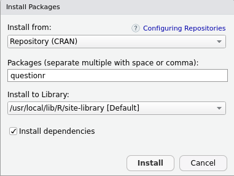
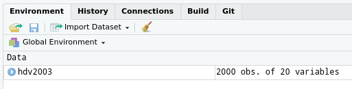
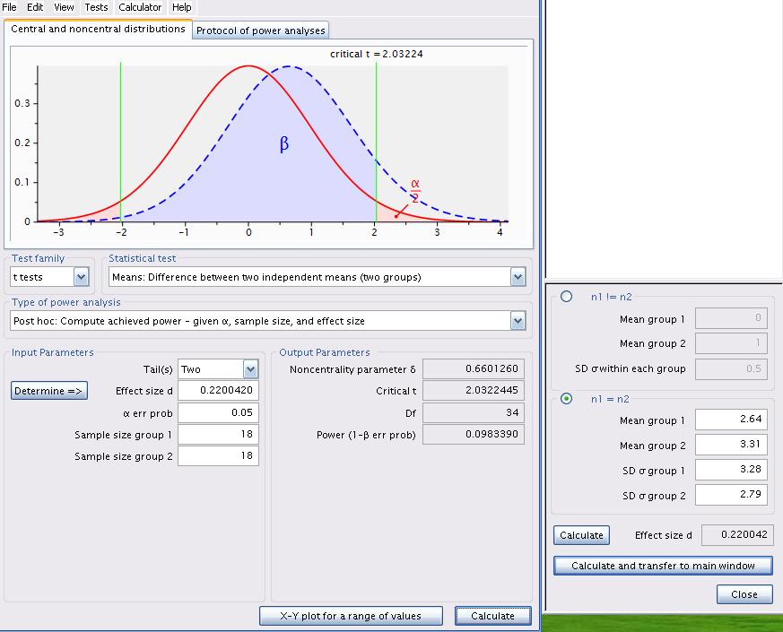

```{r setup, include=FALSE}
knitr::opts_chunk$set(echo = TRUE)#, warning = FALSE, message = FALSE)
# knitr::opts_chunk$set(out.extra = 'class="plot"')
# knitr::opts_chunk$set(fig.pos = "!H", out.extra = "")
library(ggplot2)
library(car)
library(lmtest)
library(boot)
library(lmPerm)
library(multcomp)
library(questionr)
library(simpleboot)
library(svglite)
library(pwr)
#svglite
```
# Note {-}
Version en cours de développement pour le cours de l'automne 2020. Les chapitres vont apparaitre au cours de la session.


# Préface {-}
<!-- {-} pour enlever num/rotation -->

Les exercices de laboratoire que vous retrouverez dans les pages qui suivent sont conçus de manière à vous permettre de développer une expérience pratique en analyse de données à l'aide d'un logiciel (R).
R est un logiciel très puissant, mais comme tous les logiciels, il a des limites.
En particulier il ne peut réfléchir à votre place, vous dire si l'analyse que vous tentez d'effectuer est appropriée ou sensée, ou interpréter biologiquement les résultats.

## Quelques points importants à retenir {-}

* Avant de commencer une analyse statistique, il faut d'abord vous familiariser son fonctionnement.
Cela ne veut pas dire que vous devez connaître les outils mathématiques qui la sous-tendent, mais vous devriez au moins comprendre les principes utilisés lors de cette analyse.
Avant de faire un exercice de laboratoire, lisez donc la section correspondante dans les notes de cours.
Sans cette lecture préalable, il est très probable que les résultats produits par le logiciel, même si l'analyse a été effectuée correctement, seront indéchiffrables.
* Les laboratoires sont conçus pour compléter les cours théoriques et vice versa.
À cause des contraintes d'horaires, il se pourrait que le cours et le laboratoire ne soient pas parfaitement synchronisés.
N'hésitez donc pas à poser des questions sur le labo en classe ou des questions théoriques au laboratoire.
* Travaillez sur les exercices de laboratoire à votre propre rythme.
Certains exercices prennent beaucoup moins de temps que d'autres et il n'est pas nécessaire de compléter un exercice par séance de laboratoire.
En fait deux séances de laboratoire sont prévues pour certains des exercices.
Même si vous n'êtes pas notés sur les exercices de laboratoire, soyez conscient que ces exercices
sont essentiels.
Si vous ne les faites pas, il est très peu probable que vous serez capable de compléter les devoirs et le projet de session.
Prenez donc ces exercices de laboratoire au sérieux !
* Les 2 premier laboratoires sont conçu pour vous permettre d'acquérir ou de réviser le minimum de connaissances requises pour vous permettre de réaliser les exercices de laboratoires avec R.
Il y a presque toujours de multiples façons de faire les choses avec R et vous ne trouverez ici que des méthodes simples.
Ceux et celles d'entre vous qui y sont enclins pourront trouver en ligne des instructions plus détaillées et complexes.
En particulier, je vous conseille :

  * R pour les débutants
http://cran.r-project.org/doc/contrib/Paradis-rdebuts_fr.pdf
  * An introduction to R
http://cran.r-project.org/doc/manuals/R-intro.html
  * Si vous préférez des manuels, le site web de CRAN en garde une liste commentée à :
http://www.r-project.org/doc/bib/R-books.html
  * Une liste impressionnante de très bon livre sur R
https://www.bigbookofr.com/
  * Finalement, comme aide-mémoire à garder sous la main, je vous recommande R reference card par Tom Short
http://cran.r-project.org/doc/contrib/Short-refcard.pdf

## Qu'est-ce que R et pourquoi l'utiliser dans ce cours? {-}

R est un logiciel libre et multi-plateforme formant un système statistique et graphique.
R est également un langage de  programmation spécialisé pour les statistiques.

R a deux très grands avantages pour ce cours, et un inconvénient embêtant initialement mais qui vous forcera à acquérir des excellentes habitudes de travail.
Le premier avantage est que vous pouvez tous l'installer sur votre (ou vos) ordinateurs personnel gratuitement.
C'est important parce que c'est à l'usage que vous apprendrez et maîtriserez réellement les biostatistiques et cela implique que vous devez avoir un accès facile et illimité à un logiciel statistique.
Le deuxième avantage est que R peut tout faire en statistiques.
R est conçu pour être extensible et est devenu l'outil de prédilection des statisticiens mondialement.
La question n'est plus : " Est-ce que R peut faire ceci? ", mais devient " Comment faire ceci avec R ".
Et la recherche internet est votre ami.
Aucun autre logiciel n'offre ces deux avantages.

L'inconvénient embêtant initialement est que l'on doit opérer R en tapant des instructions (ou en copiant des sections de code) plutôt qu'en utilisant des menus et en cliquant sur différentes options.
Si on ne sait pas quelle commande taper, rien ne se passe.
Ce n'est donc pas facile d'utilisation à priori.
Cependant, il est possible d'apprendre rapidement à faire certaines des opérations de base (ouvrir un fichier de données, faire un graphique pour examiner ces données, effectuer un test statistique simple).
Et une fois que l'on comprend le principe de la chose, on peut assez facilement trouver sur le web des exemples d'analyses ou de graphiques plus complexes et adapter le code à nos propres besoins.
C'est ce que vous ferez dans le premier laboratoire pour vous familiariser avec R.

Pourquoi cet inconvénient est-il d'une certaine façon un avantage? Parce que vous allez sauver du temps en fin de compte.
Garanti.
Croyez-moi, on ne fait jamais une analyse une seule fois.
En cours de route, on découvre des erreurs d'entrée de données, ou que l'on doit faire l'analyse séparément pour des sous-groupes, ou on obtient des données supplémentaires, ou on fait une erreur.
On doit alors recommencer l'analyse.
Avec une interface graphique et des menus, cela implique recommencer à cliquer ici, entre des paramètres dans des boîtes et sélectionner des boutons.
Chaque fois avec possibilité d'erreur.
Avec une série de commandes écrites, il suffit de corriger ce qui doit l'être puis de copier-coller l'ensemble pour répéter instantanément.
Et vous avez la possibilité de parfaitement documenter ce que vous avez fait.
C'est comme cela que les professionnels travaillent et offrent une assurance de qualité de leurs résultats.

## Installation des logiciels nécessaires {-}
### R{-}
Pour installer R sur un nouvel ordinateur, allez au site http://cran.r-project.org/.
Vous y trouverez des versions compilées (binaries) ou non (sources) pour votre système d'exploitation de prédilection (Windows, MacOS, Linux).

Note : R a déjà été installé sur les ordinateurs du laboratoire (la version pourrait être un peu plus ancienne, mais cela devrait être sans conséquences).

### Rstudio {-}
RStudio est un environnement de développement intégré (IDE) créé spécifiquement pour travailler avec R. Sa popularité connaît une progression foudroyante depuis 2014.
Il permet de consulter dans une interface conviviale ses fichiers de script, la ligne de commande R, les rubriques d’aide,
les graphiques, etc.

RStudio est disponible à l’identique pour les plateformes Windows, OS X et Linux.
Pour une utilisation locale sur son poste de travail, on installera la version libre (Open Source) de RStudio Desktop depuis le site
https://www.rstudio.com/products/rstudio/download/

### Paquets pour R {-}
* Rmarkdown
* tinytex

Ces 2 paquets devrait être installé automatiquement avec RStudio, mais pas toujours. Je vous recommande donc de les installer manuellement. Pour ce faire, simplement copier-coller le texte suivant dans le terminal R.

```{r, ind-install, eval = FALSE}
install.packages(c("rmarkdown", "tinytex"))
```


### G\*Power {-}
G\*Power est un programme gratuit, développé par des psychologues de l’Université de Dusseldorf en Allemagne.
Le programme existe en version Mac et Windows.
Il peut cependant être utilisé sous linux via Wine.
G\*Power vous permettra d’effectuer une analyse de puissance pour la majorité des tests que nous verrons au cours de la session sans avoir à effectuer des calculs complexes ou farfouiller dans des tableaux ou des figures décrivant des distributions ou des courbes de puissance.

Téléchargez le programme  sur le site https://www.psychologie.hhu.de/arbeitsgruppen/allgemeine-psychologie-und-arbeitspsychologie/gpower.html


## Instructions générales pour les laboratoires {-}

- Apporter une clé USB ou son équivalent à chaque séance de laboratoire pour sauvegarder votre travail.
- Lire l’exercice de laboratoire AVANT la séance, lire le code R correspondant et préparer vos questions sur le code.
- Durant les pré-labs, écouter les instructions et posez vos questions au moment approprié.
- Faites les exercices du manuel de laboratoire à votre rythme, en équipe, puis je vous recommande de commencer (compléter?) le devoir.
Profitez de la présence du démonstrateur et du prof...
- Pendant vos analyses, copiez-collez des fragments de sorties de R dans un document (par exemple dans votre traitement de texte favori) et annotez abondamment.
- Ne tapez pas directement vos commandes dans R mais plutôt dans un script.
Vous pourrez ainsi refaire le labo instantanément, récupérer des fragments de code, ou plus facilement identifier les erreurs dans vos analyses.
- Créez votre propre librairie de fragments de codes (snippets).
Annotez-là abondamment.
Vous vous en féliciterez plus tard.

## Notes sur le manuel {-}

Vous trouverez dans le manuel des explications sur la théorie, du code R, des explications sur R et des exercises.

Le manuel essaie aussi de mettre en évidence le texte de différentes manières.


```{block2, type = "rmdcode"}
Avec des sections à vous de jouer, ui indique un exercise à faire, idéalement sans regarder la solution qui se trouve plus bas.
```

```{block2, type = "rmdcaution"}
des avertissements
```

```{block2, type = "rmdwarning"}
des avertissements
```

```{block2, type = "rmdimportant"}
des points importants
```

```{block2, type = "rmdnote"}
des notes
```

```{block2, type = "rmdtip"}
et des conseils
```
### Resources {-}

Ce document est généré par l'excellente extension [bookdown](https://bookdown.org/) de [Yihui Xie](https://yihui.name/). Il est basé sur le précédent manuel de laboratoire *BIO4558 manuel de laboratoire* par Antoine Morin. L'introduction à R est largement reprise de l'excellent manuel de **Julien Barnier** intitulé [*Introduction à R et au tidyverse*](https://juba.github.io/tidyverse/)


### Licence {-}

Ce document est mis à disposition selon les termes de la [Licence Creative Commons Attribution - Pas d’Utilisation Commerciale - Partage dans les Mêmes Conditions 4.0 International](http://creativecommons.org/licenses/by-nc-sa/4.0/).


<!--chapter:end:index.Rmd-->

<!-- # (PART) Introduction à R {-} -->
# Introduction à R

Après avoir complété cet exercice de laboratoire, vous pourrez :
- Ouvrir des fichiers de données R déjà existants
- Importer des ensembles de données rectangulaires
- Exporter des donnes de R vers un fichier texte
- Vérifier si les données ont été correctement importées
- Examiner la distribution des observations d’une variable
- Examiner visuellement et tester la normalité d’une variable
- Calculer des statistiques descriptives d’une variable
- Effectuer des transformations de données

## Paquets et données requises pour le labo {#set-intro}

Ce laboratoire nécessite:

* les paquets R:
  * questionr
  * ggplot2
* les fichiers de données
  * ErablesGatineau.csv
  * sturgeon.csv

## Premier pas avec R

Une fois R et RStudio installés sur votre machine, nous n'allons pas lancer R mais plutôt RStudio.

RStudio n'est pas à proprement parler une interface graphique qui permettrait d'utiliser R de manière "classique" via la souris, des menus et des boîtes de dialogue. Il s'agit plutôt de ce qu'on appelle un *Environnement de développement intégré* (IDE) qui facilite l'utilisation de R et le développement de scripts.

### La console

#### L'invite de commandes

Au premier lancement de RStudio, l'écran principal est découpé en trois grandes zones :

<!--  -->


```{r, fig.cap = "Interface de RStudio", out.width = "100%", echo = FALSE }

```


La zone de gauche se nomme *Console*. À son démarrage, RStudio a lancé une nouvelle session de R et c'est dans cette fenêtre que nous allons pouvoir interagir avec lui.

La *Console* doit normalement afficher un texte de bienvenue ressemblant à ceci :

```
R version 4.0.2 (2020-06-22) -- "Taking Off Again"
Copyright (C) 2020 The R Foundation for Statistical Computing
Platform: x86_64-pc-linux-gnu (64-bit)

R est un logiciel libre livré sans AUCUNE GARANTIE.
Vous pouvez le redistribuer sous certaines conditions.
Tapez 'license()' ou 'licence()' pour plus de détails.

R est un projet collaboratif avec de nombreux contributeurs.
Tapez 'contributors()' pour plus d'information et
'citation()' pour la façon de le citer dans les publications.

Tapez 'demo()' pour des démonstrations, 'help()' pour l'aide
en ligne ou 'help.start()' pour obtenir l'aide au format HTML.
Tapez 'q()' pour quitter R.
```

suivi d'une ligne commençant par le caractère `>` et sur laquelle devrait se trouver votre curseur. Cette ligne est appelée l'*invite de commande* (ou *prompt* en anglais). Elle signifie que R est disponible et en attente de votre prochaine commande.

Nous pouvons tout de suite lui fournir une première commande, en saisissant le texte suivant puis en appuyant sur `Entrée` :

```{r}
2 + 2
```

R nous répond immédiatement, et nous pouvons constater avec soulagement qu'il sait faire des additions à un chiffre^[On peut ignorer pour le moment la présence du `[1]` en début de ligne.]. On peut donc continuer avec d'autres opérations :


```{r}
5 - 7
4 * 12
-10 / 3
5^2
```

Cette dernière opération utilise le symbole `^` qui représente l'opération *puissance*. `5^2` signifie donc "5 au carré", soit 25.

#### Précisions concernant la saisie des commandes

Lorsqu'on saisit une commande, les espaces autour des opérateurs n'ont pas d'importance. Les trois commandes suivantes sont donc équivalentes, mais on privilégie en général la deuxième pour des raisons de lisibilité du code.

```{r eval=FALSE}
10+2
10 + 2
10       +       2
```


Quand vous êtes dans la console, vous pouvez utiliser les flèches vers le haut et vers le bas pour naviguer dans l'historique des commandes que vous avez tapées précédemment. Vous pouvez à tout moment modifier la commande affichée, et l'exécuter en appuyant sur `Entrée`.

Enfin, il peut arriver qu'on saisisse une commande de manière incomplète : oubli d'une parenthèse, faute de frappe, etc. Dans ce cas, R remplace l'invite de commande habituel par un signe `+` :

```{r eval=FALSE}
4 *
+
```

Cela signifie qu'il "attend la suite". On peut alors soit compléter la commande sur cette nouvelle ligne et appuyer sur `Entrée`, soit, si on est perdu, tout annuler et revenir à l'invite de commandes normal en appuyant sur `Esc` ou `Échap`.


### Objets

#### Objets simples

Faire des calculs c'est bien, mais il serait intéressant de pouvoir stocker un résultat quelque part pour pouvoir le réutiliser ultérieurement sans avoir à faire du copier/coller.

Pour conserver le résultat d'une opération, on peut le stocker dans un *objet* à l'aide de l'opérateur d'assignation `<-`. Cette "flèche" stocke ce qu'il y a à sa droite dans un objet dont le nom est indiqué à sa gauche.

Prenons tout de suite un exemple :

```{r}
x <- 2
```

Cette commande peut se lire *"prend la valeur 2 et mets la dans un objet qui s'appelle `x`"*.

Si on exécute une commande comportant juste le nom d'un objet, R affiche son contenu :

```{r}
x
```

On voit donc que notre objet `x` contient bien la valeur 2.

On peut évidemment réutiliser cet objet dans d'autres opérations. R le remplacera alors par sa valeur :

```{r}
x + 4
```

On peut créer autant d'objets qu'on le souhaite.

```{r}
x <- 2
y <- 5
resultat <- x + y
resultat
```

```{block2, type='rmdimportant'}
Les noms d'objets peuvent contenir des lettres, des chiffres, les symboles `.` et `_`. Ils ne peuvent pas commencer par un chiffre. Attention, R fait la différence entre minuscules et majuscules dans les noms d'objets, ce qui signifie que `x` et `X` seront deux objets différents, tout comme `resultat` et `Resultat`.

De manière générale, il est préférable d'éviter les majuscules (pour les risques d'erreur) et les caractères accentués (pour des questions d'encodage) dans les noms d'objets.

De même, il faut essayer de trouver un équilibre entre clarté du nom (comprendre à quoi sert l'objet, ce qu'il contient) et sa longueur. Par exemple, on préfèrera comme nom d'objet `taille_conj1` à `taille_du_conjoint_numero_1` (trop long) ou à `t1` (pas assez explicite).
```

Quand on assigne une nouvelle valeur à un objet déjà existant, la valeur précédente est perdue. Les objets n'ont pas de mémoire.

```{r}
x <- 2
x <- 5
x
```

De la même manière, assigner un objet à un autre ne crée pas de "lien" entre les deux. Cela copie juste la valeur de l'objet de droite dans celui de gauche :

```{r}
x <- 1
y <- 3
x <- y
x
## Si on modifie y, cela ne modifie pas x
y <- 4
x
```

On le verra, les objets peuvent contenir tout un tas d'informations. Jusqu'ici on n'a stocké que des nombres, mais ils peuvent aussi contenir des chaînes de caractères (du texte), qu'on délimite avec des guillemets simples ou doubles (`'` ou `"`) :

```{r}
chien <- "Chihuahua"
chien
```


### Vecteurs

Imaginons maintenant qu'on a demandé la taille en centimètres de 5 personnes et qu'on souhaite calculer leur taille moyenne. On pourrait créer autant d'objets que de tailles et faire l'opération mathématique qui va bien :

```{r}
taille1 <- 156
taille2 <- 164
taille3 <- 197
taille4 <- 147
taille5 <- 173
(taille1 + taille2 + taille3 + taille4 + taille5) / 5
```

Cette manière de faire n'est évidemment pas pratique du tout. On va plutôt stocker l'ensemble de nos tailles dans un seul objet, de type *vecteur*, avec la syntaxe suivante :

```{r}
tailles <- c(156, 164, 197, 147, 173)
```

Si on affiche le contenu de cet objet, on voit qu'il contient bien l'ensemble des tailles saisies :

```{r}
tailles
```

Un *vecteur* dans R est un objet qui peut contenir plusieurs informations du même type, potentiellement en très grand nombre.

L'avantage d'un vecteur est que lorsqu'on lui applique une opération, celle-ci s'applique à toutes les valeurs qu'il contient. Ainsi, si on veut la taille en mètres plutôt qu'en centimètres, on peut faire :

```{r}
tailles_m <- tailles / 100
tailles_m
```

Cela fonctionne pour toutes les opérations de base :

```{r}
tailles + 10
tailles^2
```

Imaginons maintenant qu'on a aussi demandé aux cinq mêmes personnes leur poids en kilos. On peut alors créer un deuxième vecteur :

```{r}
poids <- c(45, 59, 110, 44, 88)
```

On peut alors effectuer des calculs utilisant nos deux vecteurs `tailles` et `poids`. On peut par exemple calculer l'indice de masse corporelle (IMC) de chacun de nos enquêtés en divisant leur poids en kilo par leur taille en mètre au carré :

```{r}
imc <- poids / (tailles / 100) ^ 2
imc
```

Un vecteur peut contenir des nombres, mais il peut aussi contenir du texte. Imaginons qu'on a demandé aux 5 mêmes personnes leur niveau de diplôme : on peut regrouper l'information dans un vecteur de *chaînes de caractères*. Une chaîne de caractère contient du texte libre, délimité par des guillemets simples ou doubles :

```{r}
diplome <- c("PHD", "Bac", "MSc", "MSc", "Bac")
diplome
```

L'opérateur `:`, lui, permet de générer rapidement un vecteur comprenant tous les nombres entre deux valeurs, opération assez courante sous R :

```{r}
x <- 1:10
x
```

Enfin, notons qu'on peut accéder à un élément particulier d'un vecteur en faisant suivre le nom du vecteur de crochets contenant le numéro de l'élément désiré. Par exemple :

```{r}
diplome[2]
```

Cette opération, qui utilise l'opérateur `[]`, permet donc la sélection d'éléments d'un vecteur.

Dernière remarque, si on affiche dans la console un vecteur avec beaucoup d'éléments, ceux-ci seront répartis sur plusieurs lignes. Par exemple, si on a un vecteur de 50 nombres on peut obtenir quelque chose comme :

     [1] 294 425 339 914 114 896 716 648 915 587 181 926 489
    [14] 848 583 182 662 888 417 133 146 322 400 698 506 944
    [27] 237 324 333 443 487 658 793 288 897 588 697 439 697
    [40] 914 694 126 969 744 927 337 439 226 704 635

On remarque que R ajoute systématiquement un nombre entre crochets au début de chaque ligne : il s'agit en fait de la position du premier élément de la ligne dans le vecteur. Ainsi, le 848 de la deuxième ligne est le 14e élément du vecteur, le 914 de la dernière ligne est le 40e, etc.

Ceci explique le `[1]` qu'on obtient quand on affiche un simple nombre et permet de constater que pour R, un nombre est un vecteur à un seul élément :

     [1] 4


### Fonctions

#### Principe

Nous savons désormais effectuer des opérations arithmétiques de base sur des nombres et des vecteurs, et stocker des valeurs dans des objets pour pouvoir les réutiliser plus tard.

Pour aller plus loin, nous devons aborder les *fonctions* qui sont, avec les objets, un deuxième concept de base de R. On utilise des fonctions pour effectuer des calculs, obtenir des résultats et accomplir des actions.

Formellement, une fonction a un *nom*, elle prend en entrée entre parenthèses un ou plusieurs *arguments* (ou *paramètres*), et retourne un *résultat*.

Prenons tout de suite un exemple. Si on veut connaître le nombre d'éléments du vecteur `tailles` que nous avons construit précédemment, on peut utiliser la fonction `length`, de cette manière :

```{r}
length(tailles)
```

Ici, `length` est le nom de la fonction, on l'appelle en lui passant un argument entre parenthèses (en l'occurrence notre vecteur `tailles`), et elle nous renvoie un résultat, à savoir le nombre d'éléments du vecteur passé en paramètre.

Autre exemple, les fonctions `min` et `max` retournent respectivement les valeurs minimales et maximales d'un vecteur de nombres :

```{r}
min(tailles)
max(tailles)
```

La fonction `mean` calcule et retourne la moyenne d'un vecteur de nombres :

```{r}
mean(tailles)
```

La fonction `sum` retourne la somme de tous les éléments du vecteur :

```{r}
sum(tailles)
```


Jusqu'à présent on n'a vu que des fonctions qui calculent et retournent un unique nombre. Mais une fonction peut renvoyer d'autres types de résultats. Par exemple, la fonction `range` (étendue) renvoie un vecteur de deux nombres, le minimum et le maximum :

```{r}
range(tailles)
```

Ou encore, la fonction `unique`, qui supprime toutes les valeurs en double dans un vecteur, qu'il s'agisse de nombres ou de chaînes de caractères :

```{r}
diplome
unique(diplome)
```


#### Arguments

Une fonction peut prendre plusieurs arguments, dans ce cas on les indique toujours entre parenthèses, séparés par des virgules.

On a déjà rencontré un exemple de fonction acceptant plusieurs arguments : la fonction `c`, qui combine l'ensemble de ses arguments en un vecteur^[`c` est l'abbréviation de *combine*, son nom est très court car on l'utilise très souvent] :

```{r}
tailles <- c(156, 164, 197, 181, 173)
```

Ici, `c` est appelée en lui passant cinq arguments, les cinq tailles séparées par des virgules, et elle renvoie un vecteur numérique regroupant ces cinq valeurs.

Supposons maintenant que dans notre vecteur `tailles` nous avons une valeur manquante (une personne a refusé de répondre, ou notre mètre mesureur était en panne). On symbolise celle-ci dans R avec le code interne `NA` :

```{r}
tailles <- c(156, 164, 197, NA, 173)
tailles
```

```{block2, type='rmdnote'}
`NA` est l'abbréviation de *Not available*, non disponible. Cette valeur particulière peut être utilisée pour indiquer une valeur manquante, qu'il s'agisse d'un nombre, d'une chaîne de caractères, etc.
```

Si je calcule maintenant la taille moyenne à l'aide de la fonction `mean`, j'obtiens :

```{r}
mean(tailles)
```

En effet, R considère par défaut qu'il ne peut pas calculer la moyenne si une des valeurs n'est pas disponible. Il considère alors que cette moyenne est elle-même "non disponible" et renvoie donc comme résultat `NA`.

On peut cependant indiquer à `mean` d'effectuer le calcul en ignorant les valeurs manquantes. Ceci se fait en ajoutant un argument supplémentaire, nommé `na.rm` (abbréviation de *NA remove*, "enlever les NA"), et de lui attribuer la valeur `TRUE` (code interne de R signifiant *vrai*) :

```{r}
mean(tailles, na.rm = TRUE)
```

Positionner le paramètre `na.rm` à `TRUE`  indique à la fonction `mean` de ne pas tenir compte des valeurs manquantes dans le calcul.

Si on ne dit rien à la fonction `mean`, cet argument a une valeur par défaut, en l'occurrence `FALSE` (faux), qui fait qu'il ne supprime pas les valeurs manquantes. Les deux commandes suivantes sont donc rigoureusement équivalentes :

```{r}
mean(tailles)
mean(tailles, na.rm = FALSE)
```

```{block2, type='rmdnote'}
Lorsqu'on passe un argument à une fonction de cette manière, c'est-à-dire sous la forme `nom = valeur`, on parle d'*argument nommé*.
```

#### Aide sur une fonction

Il est fréquent de ne pas savoir (ou d'avoir oublié) quels sont les arguments d'une fonction, ou comment ils se nomment. On peut à tout moment faire appel à l'aide intégrée à R en passant le nom de la fonction (entre guillemets) à la fonction `help` :

```{r, eval = FALSE}
help("mean")
```

On peut aussi utiliser le raccourci `?mean`.

Ces deux commandes affichent une page (en anglais) décrivant la fonction, ses paramètres, son résultat, le tout accompagné de diverses notes, références et exemples. Ces pages d'aide contiennent à peu près tout ce que vous pourrez chercher à savoir, mais elles ne sont pas toujours d'une lecture aisée.

Dans RStudio, les pages d'aide en ligne s'ouvriront par défaut dans la zone en bas à droite,
sous l'onglet *Help*. Un clic sur l'icône en forme de maison vous affichera la page d'accueil de l'aide.


### Regrouper ses commandes dans des scripts

Jusqu'ici on a utilisé R de manière "interactive", en saisissant des commandes directement dans la console. Ça n'est cependant pas la manière dont on va utiliser R au quotidien, pour une raison simple : lorsque R redémarre, tout ce qui a été effectué dans la console est perdu.

Plutôt que de saisir nos commandes dans la console, on va donc les regrouper dans des scripts (de simples fichiers texte), qui vont garder une trace de toutes les opérations effectuées, et ce sont ces scripts, sauvegardés régulièrement, qui seront le "coeur" de notre travail. C'est en rouvrant les scripts et en réexécutant les commandes qu'ils contiennent qu'on pourra "reproduire" les données, leur traitement, les analyses et leurs résultats.

Pour créer un script, il suffit de sélectionner le menu *File*, puis *New file* et *R script*. Une quatrième zone apparaît alors en haut à gauche de l'interface de RStudio. On peut enregistrer notre script à tout moment dans un fichier avec l'extension `.R`, en cliquant sur l'icône de disquette ou en choissant *File* puis *Save*.

Un script est un fichier texte brut, qui s'édite de la manière habituelle. À la différence de la console, quand on appuie sur `Entrée`, cela n'exécute pas la commande en cours mais insère un saut de ligne (comme on pouvait s'y attendre).

Pour exécuter une commande saisie dans un script, il suffit de positionner le curseur sur la ligne de la commande en question, et de cliquer sur le bouton *Run* dans la barre d'outils juste au-dessus de la zone d'édition du script. On peut aussi utiliser le raccourci clavier `Ctrl + Entrée` (`Cmd + Entrée` sous Mac). On peut enfin sélectionner plusieurs lignes avec la souris ou le clavier et cliquer sur *Run* (ou utiliser le raccourci clavier), et l'ensemble des lignes est exécuté d'un coup.

Au final, un script pourra ressembler à quelque chose comme ça :

```{r, eval=FALSE}
tailles <- c(156, 164, 197, 147, 173)
poids <- c(45, 59, 110, 44, 88)

mean(tailles)
mean(poids)

imc <- poids / (tailles / 100) ^ 2
min(imc)
max(imc)
```


#### Commentaires

Les commentaires sont un élément très important d'un script. Il s'agit de texte libre, ignoré par R, et qui permet de décrire les étapes du script, sa logique, les raisons pour lesquelles on a procédé de telle ou telle manière... Il est primordial de documenter ses scripts à l'aide de commentaires, car il est très facile de ne plus se retrouver dans un programme qu'on a produit soi-même, même après une courte interruption.

Pour ajouter un commentaire, il suffit de le faire précéder d'un ou plusieurs symboles `#`. En effet, dès que R rencontre ce caractère, il ignore tout ce qui se trouve derrière, jussqu'à la fin de la ligne.

On peut donc documenter le script précédent :

```{r, eval=FALSE}
# Saisie des tailles et poids des enquêtés
tailles <- c(156, 164, 197, 147, 173)
poids <- c(45, 59, 110, 44, 88)

# Calcul des tailles et poids moyens
mean(tailles)
mean(poids)

# Calcul de l'IMC (poids en kilo divisé par les tailles en mètre au carré)
imc <- poids / (tailles / 100) ^ 2
# Valeurs extrêmes de l'IMC
min(imc)
max(imc)
```


### Installer et charger des extensions (*packages*) {#packages}

R étant un logiciel libre, il bénéficie d'un développement communautaire riche et dynamique. L'installation de base de R permet de faire énormément de choses, mais le langage dispose en plus d'un système d'extensions permettant d'ajouter facilement de nouvelles fonctionnalités. La plupart des extensions sont développées et maintenues par la communauté des utilisateurs de R, et diffusées via un réseau de serveurs nommé CRAN (*Comprehensive R Archive Network*).

Pour installer une extension, si on dispose d'une connexion Internet, on peut utiliser le bouton *Install* de l'onglet *Packages* de RStudio.

<!--  -->

```{r, fig.cap = "Installer une extension", out.width = "50%", echo = FALSE }
knitr::include_graphics("images/screenshots/rstudio_package_install.png")
```

Il suffit alors d'indiquer le nom de l'extension dans le champ *Package* et de cliquer sur *Install*.

<!--  -->

```{r, fig.cap = "Installation une extension", out.width = "50%", echo = FALSE }

```

images/screenshots/rstudio_package_install.png
On peut aussi installer des extensions en utilisant la fonction `install.packages()` directement dans la console. Par exemple, pour installer le *package* `questionr` on peut exécuter la commande :

```{r, eval = FALSE}
install.packages("questionr")
```

Installer une extension via l'une des deux méthodes précédentes va télécharger l'ensemble des fichiers nécessaires depuis l'une des machines du CRAN, puis installer tout ça sur le disque dur de votre ordinateur. Vous n'avez besoin de le faire qu'une fois, comme vous le faites pour installer un programme sur votre Mac ou PC.

Une fois l'extension installée, il faut la "charger" avant de pouvoir utiliser les fonctions qu'elle propose. Ceci se fait avec la fonction `library`. Par exemple, pour pouvoir utiliser les fonctions de `questionr`, vous devrez exécuter la commande suivante :

```{r eval = FALSE}
library(questionr)
```

Ainsi, bien souvent, on regroupe en début de script toute une série d'appels à `library` qui permettent de charger tous les packages utilisés dans le script. Quelque chose comme :

```{r, eval = FALSE}
library(readxl)
library(ggplot2)
library(questionr)
```

Si vous essayez d'exécuter une fonction d'une extension et que vous obtenez le message d'erreur `impossible de trouver la fonction`, c'est certainement parce que vous n'avez pas exécuté la commande `library` correspondante.


### Exercices {#ex-introR}

**Exercice 1**

Construire le vecteur `x` suivant :

```{r echo=FALSE}
x <- c(120, 134, 256, 12)
x
```


```{r, eval = FALSE, echo = params$echo_sol, class.source = "exer"}
```{r eval=FALSE}
x <- c(120, 134, 256, 12)
```


Utiliser ce vecteur `x` pour générer les deux vecteurs suivants :

```{r echo=FALSE}
x + 100
x * 2
```


```{r, eval = FALSE, echo = params$echo_sol, class.source = "exer"}
x + 100
x * 2
```


**Exercice 2**

On a demandé à 4 ménages le revenu des deux conjoints, et le nombre de personnes du ménage :

```{r eval=FALSE}
conjoint1 <- c(1200, 1180, 1750, 2100)
conjoint2 <- c(1450, 1870, 1690, 0)
nb_personnes <- c(4, 2, 3, 2)
```

Calculer le revenu total de chaque ménage, puis diviser par le nombre de personnes pour obtenir le revenu par personne de chaque ménage.


```{r, eval = FALSE, echo = params$echo_sol, class.source = "exer"}
revenu_total <- conjoint1 + conjoint2
revenu_total / nb_personnes
```


**Exercice 3**

Dans l'exercice précédent, calculer le revenu minimum et maximum parmi ceux du premier conjoint.

```{r eval=FALSE}
conjoint1 <- c(1200, 1180, 1750, 2100)
```


```{r, eval = FALSE, echo = params$echo_sol, class.source = "exer"}
range(conjoint1)
```


Recommencer avec les revenus suivants, parmi lesquels l'un des enquetés n'a pas voulu répondre :

```{r eval=FALSE}
conjoint1 <- c(1200, 1180, 1750, NA)
```


```{r, eval = FALSE, echo = params$echo_sol, class.source = "exer"}
range(conjoint1, na.rm = TRUE)
```


**Exercice 4**

Les deux vecteurs suivants représentent les précipitations (en mm) et la température (en °C) moyennes sur la ville de Lyon, pour chaque mois de l'année, entre 1981 et 2010 :

```{r}
temperature <- c(3.4, 4.8, 8.4, 11.4, 15.8, 19.4, 22.2, 21.6, 17.6, 13.4, 7.6, 4.4)
precipitations <- c(47.2, 44.1, 50.4, 74.9, 90.8, 75.6, 63.7, 62, 87.5, 98.6, 81.9, 55.2)
```

Calculer la température moyenne sur l'année.

Calculer la quantité totale de précipitations sur l'année.


```{r, eval = FALSE, echo = params$echo_sol, class.source = "exer"}
mean(temperature)
sum(precipitations)
```


À quoi correspond et comment peut-on interpréter le résultat de la fonction suivante ? Vous pouvez vous aider de la page d'aide de la fonction si nécessaire.

```{r}
cumsum(precipitations)
```

Même question pour :

```{r}
diff(temperature)
```


```{block2, echo = params$echo_sol, type = "exer"}
`cumsum(precipitations)` correspond à la somme cumulée des précipitations sur l'année. Par exemple, la 6e valeur du vecteur résultat correspond au total de précipitations de janvier à juin.

`diff(temperature)` correspond à la différence de température d'un mois sur l'autre. Par exemple, la 2e valeur de ce vecteur correspond à l'écart de température entre le mois de février et le mois de janvier.
```


**Exercice 5**

On a relevé les notes en maths, anglais et sport d'une classe de 6 élèves et on a stocké ces données dans trois vecteurs :

```{r}
maths <- c(12, 16, 8, 18, 6, 10)
anglais <- c(14, 9, 13, 15, 17, 11)
sport <- c(18, 11, 14, 10, 8, 12)
```

Calculer la moyenne des élèves de la classe en anglais.

Calculer la moyenne générale de chaque élève.


```{r, eval = FALSE, echo = params$echo_sol, class.source = "exer"}
mean(anglais)
(maths + anglais + sport) / 3
```


Essayez de comprendre le résultat des deux fonctions suivantes (vous pouvez vous aider de la page d'aide de ces fonctions) :

```{r}
pmin(maths, anglais, sport)
```

```{r}
pmax(maths, anglais, sport)
```


```{block2, echo = params$echo_sol, type = "exer"}
`pmin` et `pmax` renvoient les minimum et maximum "parallèles" des trois vecteurs passés en argument. Ainsi, `pmin` renvoie pour chaque élève la note minimale dans les trois matières, et `pmax` la note maximale.
```

<!--chapter:end:01-introR_1.Rmd-->

## Premier travail avec des données


### Jeu de données d'exemple

Dans cette partie nous allons (enfin) travailler sur des "vraies" données, et utiliser un jeu de données présent dans l'extension `questionr`. Nous devons donc avant toute chose installer cette extension.

Pour installer ce package, deux possibilités :

- Dans l'onglet *Packages* de la zone de l'écran en bas à droite, cliquez sur le bouton *Install*. Dans le dialogue qui s'ouvre, entrez "questionr" dans le champ *Packages* puis cliquez sur *Install*.
- Saisissez directement la commande suivante dans la console : `install.packages("questionr")`

Dans les deux cas, tout un tas de messages devraient s'afficher dans la console. Attendez que l'invite de commandes `>` apparaisse à nouveau.

Pour plus d'informations sur les extensions et leur installation, voir la section \@ref(packages).

Le jeu de données que nous allons utiliser est un extrait de l'enquête *Histoire de vie* réalisée par l'INSEE en 2003. Il contient 2000 individus et 20 variables.

Pour pouvoir utiliser ces données, il faut d'abord charger l'extension `questionr` (après l'avoir installée, bien entendu) :

```{r}
library(questionr)
```

L'utilisation de `library` permet de rendre "disponibles", dans notre session R, les fonctions et jeux de données inclus dans l'extension.

Nous devons ensuite indiquer à R que nous souhaitons accéder au jeu de données à l'aide de la commande `data` :

```{r}
data(hdv2003)
```

Cette commande ne renvoie aucun résultat particulier (sauf en cas d'erreur), mais vous devriez voir apparaître dans l'onglet *Environment* de RStudio un nouvel objet nommé `hdv2003` :

<!--  -->

```{r, fig.cap = "Onglet Environment", out.width = "75%", echo = FALSE }

```

Cet objet est d'un type nouveau : il s'agit d'un tableau de données.


### Tableau de données (*data frame*)


Un *data frame* (ou tableau de données, ou table) est un type d'objet R qui contient des données au format tabulaire, avec les observations en ligne et les variables en colonnes, comme dans une feuille de tableur de type LibreOffice ou Excel.

Si on se contente d'exécuter le nom de notre tableau de données :

```{r, eval=FALSE}
hdv2003
```

R va, comme à son habitude, nous l'afficher dans la console, ce qui est tout sauf utile.

Une autre manière d'afficher le contenu du tableau est de cliquer sur l'icône en forme de tableau à droite du nom de l'objet dans l'onglet *Environment* :

<!--  -->

```{r, fig.cap = "Icone view", out.width = "75%", echo = FALSE }
knitr::include_graphics("images/screenshots/rstudio_view_icon.png")
```

Ou d'utiliser la fonction `View` :

```{r, eval = FALSE}
View(hdv2003)
```

Dans les deux cas votre tableau devrait s'afficher dans RStudio avec une interface de type tableur :

<!--  -->

```{r, fig.cap = "Interface View", out.width = "100%", echo = FALSE }
knitr::include_graphics("images/screenshots/rstudio_view.png")
```

Il est important de comprendre que l'objet `hdv2003` contient *l'intégralité* des données du tableau.
On voit donc qu'un objet peut contenir des données de types très différents (simple nombre, texte, vecteur, tableau de données entier), et être potentiellement de très grande taille^[La seule limite pour la taille d'un objet étant la mémoire vive (RAM) de la machine sur laquelle tourne la session R.].

```{block2, type='rmdnote'}
Sous R, on peut importer ou créer autant de tableaux de données qu'on le souhaite, dans les limites des capacités de sa machine.
```

Un *data frame* peut être manipulé comme les autres objets vus précédemment. On peut par exemple faire :

```{r}
d <- hdv2003
```

ce qui va entraîner la copie de l'ensemble de nos données dans un nouvel objet nommé `d`. Ceci peut paraître parfaitement inutile mais a en fait l'avantage de fournir un objet avec un nom beaucoup plus court, ce qui diminuera la quantité de texte à saisir par la suite.

**Pour résumer**, comme nous avons désormais décidé de saisir nos commandes dans un script et non plus directement dans la console, les premières lignes de notre fichier de travail sur les données de l'enquête *Histoire de vie* pourraient donc ressembler à ceci :


```{r, eval = FALSE}
## Chargement des extensions nécessaires
library(questionr)

## Jeu de données hdv2003
data(hdv2003)
d <- hdv2003
```


#### Structure du tableau

Un tableau étant un objet comme un autre, on peut lui appliquer des fonctions. Par exemple, `nrow` et `ncol` retournent le nombre de lignes et de colonnes du tableau :

```{r}
nrow(d)
```

```{r}
ncol(d)
```

La fonction `dim` renvoie ses dimensions, donc les deux nombres précédents :

```{r}
dim(d)
```

La fonction `names` retourne les noms des colonnes du tableau, c'est-à-dire la liste de nos *variables* :

```{r}
names(d)
```

Enfin, la fonction `str` renvoie un descriptif plus détaillé de la structure du tableau. Elle liste les différentes variables, indique leur type ^[Les différents types de variables seront décrits plus en détail dans le chapitre \@ref(vectorfactor) sur les recodages.] et affiche les premières valeurs :

```{r}
str(d)
```


Sous RStudio, on peut afficher à tout moment la structure d'un objet en cliquant sur l'icône de triangle sur fond bleu à gauche du nom de l'objet dans l'onglet *Environment* :

<!--  -->

```{r, fig.cap = "Structure d'un objet", out.width = "100%", echo = FALSE }
knitr::include_graphics("images/screenshots/rstudio_environment_str.png")
```

#### Accéder aux variables d'un tableau

Une opération très importante est l'accès aux variables du tableau (à ses colonnes) pour pouvoir les manipuler, effectuer des calculs, etc. On utilise pour cela l'opérateur `$`, qui permet d'accéder aux colonnes du tableau. Ainsi, si l'on tape :

```{r include=FALSE}
options(max.print=200)
```


```{r}
d$sexe
```

R va nous afficher l'ensemble des valeurs de notre variable `sexe` dans la console, ce qui est à nouveau fort peu utile. Mais cela nous permet de constater que `d$sexe` est un vecteur de chaînes de caractères tels qu'on en a déjà rencontré précédemment.

La fonction `table$colonne` renvoie donc la colonne nommée `colonne` du tableau `table`, c'est-à-dire un vecteur, en général de nombres ou de chaînes de caractères.

Si on souhaite afficher seulement les premières ou dernières valeurs d'une variable, on peut utiliser les fonctions `head` et `tail` :

```{r}
head(d$age)
```


```{r}
tail(d$age, 10)
```

Le deuxième argument numérique permet d'indiquer le nombre de valeurs à afficher.

#### Créer une nouvelle variable

On peut aussi utiliser l'opérateur `$` pour créer une nouvelle variable dans notre tableau : pour cela, il suffit de lui assigner une valeur.

Par exemple, la variable `heures.tv` contient le nombre d'heures passées quotidiennement devant la télé :

```{r}
head(d$heures.tv, 10)
```

On peut vouloir créer une nouvelle variable dans notre tableau qui contienne la même durée mais en minutes. On va donc créer une nouvelle variables `minutes.tv` de la manière suivante :

```{r}
d$minutes.tv <- d$heures.tv * 60
```

On peut alors constater, soit visuellement soit dans la console, qu'une nouvelle variable (une nouvelle colonne) a bien été ajoutée au tableau :

```{r}
head(d$minutes.tv)
```


### Analyse univariée

On a donc désormais accès à un tableau de données `d`, dont les lignes sont des observations (des individus enquêtés), et les colonnes des variables (des caractéristiques de chacun de ces individus), et on sait accéder à ces variables grâce à l'opérateur `$`.

Si on souhaite analyser ces variables, les méthodes et fonctions utilisées seront différentes selon qu'il s'agit d'une variable *quantitative* (variable numérique pouvant prendre un grand nombre de valeurs : l'âge, le revenu, un pourcentage...) ou d'une variable *qualitative* (variable pouvant prendre un nombre limité de valeurs appelées modalités : le sexe, la profession, le dernier diplôme obtenu, etc.).

#### Analyser une variable quantitative

Une variable quantitative est une variable de type numérique (un nombre) qui peut prendre un grand nombre de valeurs. On en a plusieurs dans notre jeu de données, notamment l'âge (variable `age`) ou le nombre d'heures passées devant la télé (`heures.tv`).


##### Indicateurs de centralité

Caractériser une variable quantitative, c'est essayer de décrire la manière dont ses valeurs se répartissent, ou se distribuent.

Pour cela on peut commencer par regarder les valeurs extrêmes, avec les fonctions `min`, `max` ou `range` :

```{r}
min(d$age)
max(d$age)
range(d$age)
```

On peut aussi calculer des indicateurs de *centralité* : ceux-ci indiquent autour de quel nombre se répartissent les valeurs de la variable. Il y en a plusieurs, le plus connu étant la moyenne, qu'on peut calculer avec la fonction `mean` :

```{r}
mean(d$age)
```

Il existe aussi la médiane, qui est la valeur qui sépare notre population en deux : on a la moitié de nos observations en-dessous, et la moitié au-dessus. Elle se calcule avec la fonction `median` :

```{r}
median(d$age)
```

Une différence entre les deux indicateurs est que la médiane est beaucoup moins sensible aux valeurs "extrêmes" : on dit qu'elle est plus *robuste*. Ainsi, en 2013, le salaire net *moyen* des salariés à temps plein en France était de 2202 euros, tandis que le salaire net *médian* n'était que de 1772 euros. La différence étant due à des très hauts salaires qui "tirent" la moyenne vers le haut.


##### Indicateurs de dispersion

Les indicateurs de dispersion permettent de mesurer si les valeurs sont plutôt regroupées ou au contraire plutôt dispersées.

L'indicateur le plus simple est l'étendue de la distribution, qui décrit l'écart maximal observé entre les observations :

```{r}
max(d$age) - min(d$age)
```

Les indicateurs de dispersion les plus utilisés sont la variance ou, de manière équivalente, l'écart-type (qui est égal à la racine carrée de la variance). On obtient la première avec la fonction `var`, et le second avec `sd` (abbréviation de *standard deviation*) :

```{r}
var(d$age)
```

```{r}
sd(d$age)
```

Plus la variance ou l'écart-type sont élevés, plus les valeurs sont dispersées autour de la moyenne. À l'inverse, plus ils sont faibles et plus les valeurs sont regroupées.

Une autre manière de mesurer la dispersion est de calculer les quartiles :

- le premier quartile est la valeur pour laquelle on a 25% des observations en dessous et 75% au dessus
- le deuxième quartile est la valeur pour laquelle on a 50% des observations en dessous et 50% au dessus (c'est donc la médiane)
- le troisième quartile est la valeur pour laquelle on a 75% des observations en dessous et 25% au dessus

On peut les calculer avec la fonction `quantile` :

```{r}
### Premier quartile
quantile(d$age, prob = 0.25)
```

```{r}
## Troisième quartile
quantile(d$age, prob = 0.75)
```

`quantile` prend deux arguments principaux : le vecteur dont on veut calculer le quantile, et un argument `prob` qui indique quel quantile on souhaite obtenir. `prob` prend une valeur entre 0 et 1 : 0.5 est la médiane, 0.25 le premier quartile, 0.1 le premier décile, etc.

Notons enfin que la fonction `summary` permet d'obtenir d'un coup plusieurs indicateurs classiques :

```{r}
summary(d$age)
```

##### Représentation graphique

L'outil le plus utile pour étudier la distribution des valeurs d'une variable quantitative reste la représentation graphique.

La représentation la plus courante est sans doute l'histogramme. On peut l'obtenir avec la fonction `hist` :

```{r, fig.cap = "Histogramme de l'age par défaut"}
hist(d$age)
```

Cette fonction n'a pas pour effet direct d'effectuer un calcul ou de nous renvoyer un résultat : elle génère un graphique qui va s'afficher dans l'onglet *Plots* de RStudio.

On peut personnaliser l'apparence de l'histogramme en ajoutant des arguments supplémentaires à la fonction `hist`. L'argument le plus important est `breaks`, qui permet d'indiquer le nombre de classes que l'on souhaite.

```{r, fig.cap = "Histogramme de l'age avec 10 classes"}
hist(d$age, breaks = 10, main = "")
```

```{r, fig.cap = "Histogramme de l'age avec 70 classes"}
hist(d$age, breaks = 70, main = "")
```


Le choix d'un "bon" nombre de classes pour un histogramme n'est pas un problème simple : si on a trop peu de classes, on risque d'effacer quasiment toutes les variations, et si on en a trop on risque d'avoir trop de détails et de masquer les grandes tendances.

Les arguments de `hist` permettent également de modifier la présentation du graphique. On peut ainsi changer la couleur des barres avec `col`^[Les différentes manières de spécifier des couleurs sont indiquées dans l'encadré de la section \@ref(scalecolor).], le titre avec `main`, les étiquettes des axes avec `xlab` et `ylab`, etc. :

```{r, fig.cap = "Histogramme modifié"}
hist(d$age, col = "skyblue",
     main = "Répartition des âges des enquêtés",
     xlab = "Âge",
     ylab = "Effectif")
```

La fonction `hist` fait partie des fonctions graphique de base de R. On verra plus en détail d'autres fonctions graphiques
<!-- dans la partie \@ref(ggplot2) de ce document, consacrée à l'extension -->
avec l'extension `ggplot2` qui permet la production et la personnalisation de graphiques complexes.


#### Analyser une variable qualitative

Une variable qualitative est une variable qui ne peut prendre qu'un nombre limité de valeurs, appelées modalités. Dans notre jeu de données on trouvera par exemple le sexe (`sexe`), le niveau d'études (`nivetud`), la catégorie socio-professionnelle (`qualif`)...

À noter qu'une variable qualitative peut tout-à-fait être numérique, et que certaines variables peuvent être traitées soit comme quantitatives, soit comme qualitatives : c'est le cas par exemple du nombre d'enfants ou du nombre de frères et soeurs.

##### Tri à plat

L'outil le plus utilisé pour représenter la répartition des valeurs d'une variable qualitative est le *tri à plat* : il s'agit simplement de compter, pour chacune des valeurs possibles de la variable (pour chacune des modalités), le nombre d'observations ayant cette valeur. Un tri à plat s'obtient sous R à l'aide de la fonction `table` :

```{r}
table(d$sexe)
```

Ce tableau nous indique donc que parmi nos enquêtés on trouve 899 hommes et 1101 femmes.

```{r}
table(d$qualif)
```

Un tableau de ce type peut être affiché ou stocké dans un objet, et on peut à son tour lui appliquer des fonctions. Par exemple, la fonction `sort` permet de trier le tableau selon la valeur de l'effectif. On peut donc faire :

```{r}
tab <- table(d$qualif)
sort(tab)
```

```{block2, type='rmdimportant'}
Attention, par défaut la fonction `table` n'affiche pas les valeurs manquantes (`NA`). Si on souhaite les inclure il faut utiliser l'argument `useNA = "always"`, soit : `table(d$qualif, useNA = "always")`.
```

À noter qu'on peut aussi appliquer `summary` à une variable qualitative. Le résultat est également le tri à plat de la variable, avec en plus le nombre de valeurs manquantes éventuelles :

```{r}
summary(d$qualif)
```


Par défaut ces tris à plat sont en effectifs et ne sont donc pas toujours très lisibles, notamment quand on a des effectifs importants. On leur rajoute donc en général la répartition en pourcentages. Pour cela, nous allons utiliser la fonction `freq` de l'extension `questionr`, qui devra donc avoir précédemment été chargée avec `library(questionr)` :

```{r}
## À rajouter en haut de script et à exécuter
library(questionr)
```

On peut alors utiliser la fonction :

```{r, eval=FALSE}
freq(d$qualif)
```
```{r, echo=FALSE}
print(freq(d$qualif))
```


La colonne `n` représente les effectifs de chaque catégorie, la colonne `%` le pourcentage, et la colonne `val%` le pourcentage calculé sur les valeurs valides, donc en excluant les `NA`. Une ligne a également été rajoutée pour indiquer le nombre et la proportion de `NA`.

`freq` accepte un certain nombre d'arguments pour personnaliser son affichage. Par exemple :

- `valid` indique si on souhaite ou non afficher les pourcentages sur les valeurs valides
- `cum` indique si on souhaite ou non afficher les pourcentages cumulés
- `total` permet d'ajouter une ligne avec les effectifs totaux
- `sort` permet de trier le tableau par fréquence croissante (`sort="inc"`) ou décroissante (`sort="dec"`).

```{r eval=FALSE}
freq(d$qualif, valid= FALSE, total = TRUE, sort = "dec")
```
```{r echo=FALSE}
print(freq(d$qualif, valid= FALSE, total = TRUE, sort = "dec"))
```


##### Représentations graphiques

On peut représenter graphiquement le tri à plat d'une variable qualitative avec un diagramme en barres, obtenu avec la fonction `barplot`. Attention, contrairement à `hist` cette fonction ne s'applique pas directement à la variable mais au résultat du tri à plat de cette variable, calculé avec `table`. Il faut donc procéder en deux étapes :

```{r, fig.cap = "Graphique en barre"}
tab <- table(d$clso)
barplot(tab)
```


On peut aussi trier le tri à plat avec la fonction `sort` avant de le représenter graphiquement, ce qui peut faciliter la lecture du graphique :

```{r, fig.cap = "Graphique en barre trié"}
barplot(sort(tab))
```

Une alternative au graphique en barres est le *diagramme de Cleveland*, qu'on peut obtenir avec la fonction `dotchart`. Celle-ci s'applique elle aussi au tri à plat de la variable calculé avec `table`.

```{r, warning = FALSE, fig.cap = "Graphique de Cleveland"}
dotchart(table(d$qualif))
```
Là aussi, pour améliorer la lisibilité du graphique il est préférable de trier le tri à plat de la variable avant de le représenter :

```{r, warning = FALSE,fig.cap = "Graphique de Cleveland trié"}
dotchart(sort(table(d$qualif)))
```

### Exercices {#ex-introR-univ}

**Exercice 1**

Créer un nouveau script qui effectue les actions suivantes :

- charger l'extension `questionr`
- charger le jeu de données nommé `hdv2003`
- copier le jeu de données dans un nouvel objet nommé `df`
- afficher les dimensions et la liste des variables de `df`


```{r, eval = FALSE, echo = params$echo_sol, class.source = "exer"}
library(questionr)

data(hdv2003)
df <- hdv2003

dim(df)
names(df)
```


**Exercice 2**

On souhaite étudier la répartition du temps passé devant la télévision par les enquêtés (variable `heures.tv`). Pour cela, affichez les principaux indicateurs de cette variable : valeur minimale, maximale, moyenne, médiane et écart-type. Représentez ensuite sa distribution par un histogramme en 10 classes.


```{r, eval = FALSE, echo = params$echo_sol, class.source = "exer"}
summary(df$heures.tv)
sd(df$heures.tv)

hist(df$heures.tv, breaks = 10)
```


**Exercice 3**

On s'intéresse maintenant à l'importance accordée par les enquêtés à leur travail (variable `trav.imp`). Faites un tri à plat des effectifs des modalités de cette variable avec la commande `table`.


```{r, eval = FALSE, echo = params$echo_sol, class.source = "exer"}
table(df$trav.imp)
```


Faites un tri à plat affichant à la fois les effectifs et les pourcentages de chaque modalité. Y'a-t-il des valeurs manquantes ?


```{r, eval = FALSE, echo = params$echo_sol, class.source = "exer"}
freq(df$trav.imp)
```


Représentez graphiquement les effectifs des modalités à l'aide d'un graphique en barres.


```{r, eval = FALSE, echo = params$echo_sol, class.source = "exer"}
tab <- sort(table(df$trav.imp))
barplot(tab)
```


Utilisez l'argument `col` de la fonction `barplot` pour modifier la couleur du graphique en
`tomato`.


```{r, eval = FALSE, echo = params$echo_sol, class.source = "exer"}
barplot(tab, col = "tomato")
```

Tapez `colors()` dans la console pour afficher l'ensemble des noms de couleurs disponibles dans R. Testez chaque couleur une à une pour trouver votre couleur préférée.

```{block2, echo = params$echo_sol, type = "exer"}
C'est une blague, hein ! Cela dit `moccasin` ou `palevioletred` sont pas mal, si vous voulez essayer :-)
```

<!--chapter:end:01-introR_2.Rmd-->

## Analyse de 2 variables

Faire une analyse bivariée, c'est étudier la relation entre deux variables : sont-elles liées ? les valeurs de l'une influencent-elles les valeurs de l'autre ? ou sont-elles au contraire indépendantes ?

À noter qu'on va parler ici d'influence ou de lien, mais pas de relation de cause à effet : les outils présentés permettent de visualiser ou de déterminer une relation, mais des liens de causalité proprement dit sont plus difficiles à mettre en évidence. Il faut en effet vérifier que c'est bien telle variable qui influence telle autre et pas l'inverse, qu'il n'y a pas de "variable cachée", etc.

Là encore, le type d'analyse ou de visualisation est déterminé par la nature qualitative ou quantitative des deux variables.


### Croisement de deux variables qualitatives

#### Tableaux croisés

On va continuer à travailler avec le jeu de données tiré de l'enquête *Histoire de vie* inclus dans l'extension `questionr`. On commence donc par charger l'extension, le jeu de données, et à le renommer en un nom plus court pour gagner un peu de temps de saisie au clavier :

```{r}
library(questionr)
data(hdv2003)
d <- hdv2003
```


Quand on veut croiser deux variables qualitatives, on fait un *tableau croisé*. Comme pour un tri à plat ceci s'obtient avec la fonction `table` de R, mais à laquelle on passe cette fois deux variables en argument. Par exemple, si on veut croiser la catégorie socio-professionnelle et le sexe des enquêtés :

```{r}
table(d$qualif, d$sexe)
```

Pour pouvoir interpréter ce tableau on doit passer du tableau en effectifs au tableau en pourcentages ligne ou colonne. Pour cela, on peut utiliser les fonctions `lprop` et `cprop` de l'extension `questionr`, qu'on applique au tableau croisé précédent.

Pour calculer les pourcentages ligne :

```{r}
tab <- table(d$qualif, d$sexe)
lprop(tab)
```

Et pour les pourcentages colonne :

```{r}
cprop(tab)
```

```{block, type='rmdnote'}
Pour savoir si on doit faire des pourcentages ligne ou colonne, on pourra se référer à l'article suivant :

http://alain-leger.lescigales.org/textes/lignecolonne.pdf

En résumé, quand on fait un tableau croisé, celui-ci est parfaitement symétrique : on peut inverser les lignes et les colonnes, ça ne change pas son interprétation. Par contre, on a toujours en tête un "sens" de lecture dans le sens où on considère que l'une des variables *dépend* de l'autre. Par exemple, si on croise sexe et type de profession, on dira que le type de profession dépend du sexe, et non l'inverse : le type de profession est alors la variable *dépendante* (à expliquer), et le sexe la variable *indépendante* (explicative).

Pour faciliter la lecture d'un tableau croisé, il est recommandé de **faire les pourcentages sur la variable indépendante**. Dans notre exemple, la variable indépendante est le sexe, elle est en colonne, on calcule donc les pourcentages colonnes qui permettent de comparer directement, pour chaque sexe, la répartition des catégories socio-professionnelles.
```

<!--### Test du χ²

Comme on travaille sur un échantillon et pas sur une population entière, on peut compléter ce tableau croisé par un test d'indépendance du χ². Celui-ci permet de rejeter l'hypothèse d'indépendance des lignes et des colonnes du tableau, c'est à dire de rejeter l'hypothèse que les écarts à l'indépendance observés seraient uniquement dus au biais d'échantillonnage (au fait qu'on n'a pas interrogé toute notre population).

Pour effectuer un test de ce type, on applique la fonction `chisq.test` au tableau croisé calculé précédemment :

```{r}
chisq.test(tab)
```

Le résultat nous indique trois valeurs :

- `X-squared`, la valeur de la statistique du χ² pour notre tableau, c'est-à-dire une "distance" entre notre tableau observé et celui attendu si les deux variables étaient indépendantes.
- `df`, le nombre de degrés de libertés du test.
- `p-value`, le fameux *p*, qui indique la probabilité d'obtenir une valeur de la statistique du χ² au moins aussi extrême sous l'hypothèse d'indépendance.

Ici, le *p* est extrêmement petit (la notation `< 2.2e-16` indique qu'il est plus petit que la plus petite valeur proche de zéro calculable par R), donc certainement en-dessous du seuil de décision choisi préalablement au test (souvent 5%, soit 0.05). On peut donc rejeter l'hypothèse d'indépendance des lignes et des colonnes du tableau.

En complément du test du χ², on peut aussi regarder les *résidus* de ce test pour affiner la lecture du tableau. Ceux-ci s'obtiennent avec la fonction `chisq.residuals` de `questionr` :

```{r}
chisq.residuals(tab)
```

L'interprétation des résidus est la suivante :

- si la valeur du résidu pour une case est inférieure à -2, alors il y a une sous-représentation de cette case dans le tableau : les effectifs sont significativement plus faibles que ceux attendus sous l'hypothèse d'indépendance
- à l'inverse, si le résidu est supérieur à 2, il y a sur-représentatation de cette case
- si le résidu est compris entre -2 et 2, il n'y a pas d'écart à l'indépendance significatif

Les résidus peuvent être une aide utile à l'interprétation, notamment pour des tableaux de grande dimension.
-->

#### Représentation graphique

Il est possible de faire une représentation graphique d'un tableau croisé, par exemple avec la fonction `mosaicplot` :

```{r fig.height=6, fig.width=6,fig.cap = "Graphique mosaique"}
mosaicplot(tab)
```


On peut améliorer ce graphique en colorant les cases selon les résidus du test du χ² (argument `shade = TRUE`) et en orientant verticalement les labels de colonnes (argument `las = 3`) :

```{r fig.height=6, fig.width=6, fig.cap = "Graphique mosaique modifié"}
mosaicplot(tab, las = 3, shade = TRUE)
```

Chaque rectangle de ce graphique représente une case de tableau. Sa largeur correspond au pourcentage des modalités en colonnes (il y'a beaucoup d'employés et d'ouvriers et très peu d'"autres"). Sa hauteur correspond aux pourcentages colonnes : la proportion d'hommes chez les cadres est plus élevée que chez les employés. Enfin, la couleur de la case correspond au résidu du test du χ² correspondant : les cases en rouge sont sous-représentées, les cases en bleu sur-représentées, et les cases blanches sont proches des effectifs attendus sous l'hypothèse d'indépendance.


### Croisement d'une variable quantitative et d'une variable qualitative

#### Représentation graphique

Croiser une variable quantitative et une variable qualitative, c'est essayer de voir si les valeurs de la variable quantitative se répartissent différemment selon la catégorie d'appartenance de la variable qualitative.

Pour cela, l'idéal est de commencer par une représentation graphique de type "boîte à moustache" à l'aide de la fonction `boxplot`. Par exemple, si on veut visualiser la répartition des âges selon la pratique ou non d'un sport, on va utiliser la syntaxe suivante :

```{r eval=FALSE, fig.cap = "Graphique en boites à moustaches"}
boxplot(age ~ sport, data = d)
```

```{block type='rmdnote'}
Cette syntaxe de `boxplot` utilise une nouvelle notation de type "formule". Celle-ci est utilisée notamment pour la spécification des modèles de régression. Ici le `~` peut se lire comme "en fonction de" : on veut représenter le boxplot de l'âge en fonction du sport.
```

Ce qui va nous donner le résultat suivant :

```{r echo=FALSE, fig.cap = "Graphique en boites à moustaches"}
boxplot(age ~ sport, data = d)
```


```{block type='rmdnote'}
L'interprétation d'un boxplot est la suivante : Les bords inférieurs et supérieurs du carré central représentent le premier et le troisième quartile de la variable représentée sur l'axe vertical. On a donc 50% de nos observations dans cet intervalle. Le trait horizontal dans le carré représente la médiane. Enfin, des "moustaches" s'étendent de chaque côté du carré, jusqu'aux valeurs minimales et maximales, avec une exception : si des valeurs sont éloignées du carré de plus de 1,5 fois l'écart interquartile (la hauteur du carré), alors on les représente sous forme de points (symbolisant des valeurs considérées comme "extrêmes").
```

Dans le graphique ci-dessus, on voit que ceux qui ont pratiqué un sport au cours des douze derniers mois ont l'air d'être sensiblement plus jeunes que les autres.


#### Calculs d'indicateurs

On peut aussi vouloir comparer certains indicateurs (moyenne, médiane) d'une variable quantitative selon les modalités d'une variable qualitative. Si on reprend l'exemple précédent, on peut calculer la moyenne d'âge pour ceux qui pratiquent un sport et pour ceux qui n'en pratiquent pas.

Une première méthode pour cela est d'extraire de notre population autant de sous-populations qu'il y a de modalités dans la variable qualitative. On peut le faire notamment avec la fonction `subset`.

<!-- ^[Le package en question est présenté en détail dans la partie \@ref(dplyr).].

On commence par charger `dplyr` (en l'ayant préalablement installé) :

```{r, message=FALSE}
library(dplyr)
```
-->

On applique `subset` pour créer deux sous-populations, stockées dans deux nouveaux tableaux de données :

```{r}
d_sport <- subset(d, sport == "Oui")
d_nonsport <- subset(d, sport == "Non")
```

On peut ensuite utiliser ces deux nouveaux tableaux de données comme on en a l'habitude, et calculer les deux moyennes d'âge :

```{r}
mean(d_sport$age)
```
```{r}
mean(d_nonsport$age)
```

Une autre possibilité est d'utiliser la fonction `tapply`, qui prend en paramètre une variable quantitative, une variable qualitative et une fonction, puis applique automatiquement la fonction aux valeurs de la variables quantitative pour chaque niveau de la variable qualitative :

```{r}
tapply(d$age, d$sport, mean)
```

<!-- ### Tests statistiques

Un des tests les plus connus est le test du *t* de Student, qui permet de tester si les moyennes de deux sous-populations peuvent être considérées comme différentes (compte tenu des fluctuations aléatoires provenant du biais d'échantillonnage).

Un test *t* s'effectue à l'aide de la fonction `t.test`. Ainsi, on peut tester l'hypothèse d'égalité des âges moyens selon la pratique ou non d'un sport avec la commande suivante :

```{r}
t.test(d$age ~ d$sport)
```

Le résultat du test est significatif, avec un *p* extrêmement petit, et on peut rejeter l'hypothèse nulle d'égalité des moyennes des deux groupes. Le test nous donne même un intervalle de confiance à 95% pour la valeur de la différence entre les deux moyennes.

Nous sommes cependant allés un peu vite, et avons négligé le fait que le test *t* s'applique normalement à des distributions normales. On peut se faire un premier aperçu visuel de cette normalité en traçant les histogrammes des deux répartitions :

```{r}
hist(d_sport$age)
```

```{r}
hist(d_nonsport$age)
```

Si l'âge dans le groupe des non sportifs se rapproche d'une distribution normale, celui des sportifs en semble assez éloigné, notamment du fait de la limite d'âge à 18 ans imposée par construction de l'enquête.

On peut tester cette normalité à l'aide du test de Shapiro-Wilk et de la fonction `shapiro.test` :


```{r}
shapiro.test(d_sport$age)
```

```{r}
shapiro.test(d_nonsport$age)
```

Le test est significatif dans les deux cas et rejette l'hypothèse d'une normalité des deux distributions.

Dans ce cas on peut faire appel à un test non-paramétrique, qui ne fait donc pas d'hypothèses sur les lois de distribution des variables testées, en l'occurrence le test des rangs de Wilcoxon, à l'aide de la fonction `wilcox.test` :

```{r}
wilcox.test(d$age ~ d$sport)
```

La valeur *p* étant à nouveau extrêmement petite, on peut rejeter l'hypothèse d'indépendance et considérer que les distributions des âges dans les deux sous-populations sont différentes.
-->


### Croisement de deux variables quantitatives

Le jeu de données `hdv2003` comportant assez peu de variables quantitatives, on va s'intéresser maintenant à un autre jeu de données comportant des informations du recensement de la population de 2012. On le charge avec :

```{r}
data(rp2012)
```

Un nouveau tableau de données `rp2012` devrait apparaître dans votre environnement. Celui-ci comprend les 5170 communes de France métropolitaine de plus de 2000 habitants, et une soixantaine de variables telles que le département, la population, le taux de chômage, etc. Pour une description plus complète et une liste des variables, voir section \@ref(rp2012).


#### Représentation graphique

Quand on croise deux variables quantitatives, l'idéal est de faire une représentation graphique sous forme de nuage de points à l'aide de la fonction `plot`. On va représenter le croisement entre le pourcentage de cadres et le pourcentage de propriétaires dans la commune :

```{r, fig.cap = "Graphique du pourcentage de propriétaire en fonction du pourcentage de cadre"}
plot(rp2012$cadres, rp2012$proprio)
```

Une représentation graphique est l'idéal pour visualiser l'existence d'un lien entre les deux variables. Voici quelques exemples d'interprétation :

```{r, echo = FALSE, fig.height=10, fig.width=6, fig.cap = "Illustration des relations bivariées"}
par(mfrow=c(3,2))

x <- rnorm(100)
y <- 2*x + 1 + rnorm(100, 0, 0.4)
plot(x, y, main = "Dépendance linéaire positive",
     xlab = "", ylab = "", col="red")

x <- rnorm(100)
y <- -3*x + 15 + rnorm(100, 0, 0.4)
plot(x, y, main = "Dépendance linéaire négative",
     xlab = "", ylab = "", col="red")

x <- rnorm(100)
y <- exp(x) + 1 + rnorm(100, 0, 0.4)
plot(x, y, main = "Dépendance non-linéaire monotone",
     xlab = "", ylab = "", col="red")

x <- rnorm(100)
y <- 2*x^2 + 1 + rnorm(100, 0, 0.4)
plot(x, y, main = "Dépendance non-linéaire non monotone",
     xlab = "", ylab = "", col="red")

x <- rnorm(100)
y <- rnorm(100)
plot(x, y, main = "Indépendance",
     xlab = "", ylab = "", col="red")

x <- rnorm(100)
y <- rnorm(100, 0, 0.03)
plot(x, y, main = "Indépendance",
     xlab = "", ylab = "", col="red", ylim = c(-2,2))

```


Dans ce premier graphique généré sur nos données, il semble difficile de mettre en évidence une relation de dépendance. Si par contre on croise le pourcentage de cadres et celui de diplômés du supérieur, on obtient une belle relation de dépendance linéaire.

```{r, fig.cap = "Relation entre le nombre de personnes diplomées à l'université et le nombre de cadre"}
plot(dipl_sup ~ cadres, data = rp2012)
```


<!-- ### Calcul d'indicateurs

En plus d'une représentation graphique, on peut calculer certains indicateurs permettant de mesurer le degré d'association de deux variables quantitatives.

##### Corrélation linéaire (Pearson)

La corrélation est une mesure du lien d'association *linéaire* entre deux variables quantitatives. Sa valeur varie entre -1 et 1. Si la corrélation vaut -1, il s'agit d'une association linéaire négative parfaite. Si elle vaut 1, il s'agit d'une association linéaire positive parfaite. Si elle vaut 0, il n'y a aucune association linéaire entre les variables.

On la calcule dans R à l'aide de la fonction `cor`.

Ainsi la corrélation entre le pourcentage de cadres et celui de diplômés du supérieur vaut :

```{r}
cor(rp2012$cadres, rp2012$dipl_sup)
```

Ce qui est extrêmement fort. Il y a donc un lien linéaire et positif entre les deux variables (quand la valeur de l'une augmente, la valeur de l'autre augmente également).

À l'inverse, la corrélation entre le pourcentage de cadres et le pourcentage de propriétaires vaut :

```{r}
cor(rp2012$cadres, rp2012$proprio)
```

Ce qui indique, pour nos données, une absence de liaison linéaire entre les deux variables.


##### Corrélation des rangs (Spearman)

Le coefficient de corrélation de Pearson ci-dessus fait une hypothèse forte sur les données : elles doivent être liées par une association linéaire. Quand ça n'est pas le cas mais qu'on est en présence d'une association monotone, on peut utiliser un autre coefficient, le coefficient de corrélation des rangs de Spearman.

Plutôt que de se baser sur les valeurs des variables, cette corrélation va se baser sur leurs rangs, c'est-à-dire sur leur position parmi les différentes valeurs prises par les variables.

Ainsi, si la valeur la plus basse de la première variable est associée à la valeur la plus basse de la deuxième, et ainsi de suite jusqu'à la valeur la plus haute, on obtiendra une corrélation de 1. Si la valeur la plus forte de la première variable est associée à la valeur la plus faible de la seconde, et ainsi de suite, et que la valeur la plus faible de la première est associée à la plus forte de la deuxième, on obtiendra une corrélation de -1. Si les rangs sont "mélangés", sans rapports entre eux, on obtiendra une corrélation autour de 0.


```{r, echo = FALSE, fig.height=10, fig.width=6}
par(mfrow=c(3,2))

x <- rnorm(100)
y <- 2*x + 1 + rnorm(100, 0, 0.4)
p <- round(cor(x, y), 2)
s <- round(cor(x, y, method = "spearman"), 2)
title <- paste0("Pearson : ", p, " - Spearman : ", s)
plot(x, y, main = title,
     xlab = "", ylab = "", col="red")

x <- rnorm(100)
y <- -3*x + 15 + rnorm(100, 0, 0.4)
p <- round(cor(x, y), 2)
s <- round(cor(x, y, method = "spearman"), 2)
title <- paste0("Pearson : ", p, " - Spearman : ", s)
plot(x, y, main = title,
     xlab = "", ylab = "", col="red")

x <- rnorm(100)
y <- exp(x) + 1 + rnorm(100, 0, 0.4)
p <- round(cor(x, y), 2)
s <- round(cor(x, y, method = "spearman"), 2)
title <- paste0("Pearson : ", p, " - Spearman : ", s)
plot(x, y, main = title,
     xlab = "", ylab = "", col="red")

x <- rnorm(100)
y <- 2*x^2 + 1 + rnorm(100, 0, 0.4)
p <- round(cor(x, y), 2)
s <- round(cor(x, y, method = "spearman"), 2)
title <- paste0("Pearson : ", p, " - Spearman : ", s)
plot(x, y, main = title,
     xlab = "", ylab = "", col="red")

x <- rnorm(100)
y <- rnorm(100)
p <- round(cor(x, y), 2)
s <- round(cor(x, y, method = "spearman"), 2)
title <- paste0("Pearson : ", p, " - Spearman : ", s)
plot(x, y, main = title,
     xlab = "", ylab = "", col="red")

x <- rnorm(20)
y <- x + 1 + rnorm(20, 0, 0.4)
x <- c(x, 2, 1.8)
y <- c(y, -2, -1.9)
p <- round(cor(x, y), 2)
s <- round(cor(x, y, method = "spearman"), 2)
title <- paste0("Pearson : ", p, " - Spearman : ", s)
plot(x, y, main = title,
     xlab = "", ylab = "", col="red", ylim = c(-2,2))


```

La corrélation des rangs a aussi pour avantage d'être moins sensibles aux valeurs extrêmes ou aux points isolés. On dit qu'elle est plus "robuste".

Pour calculer une corrélation de Spearman, on utilise la fonction `cor` mais avec l'argument `method = "spearman"` :

```{r}
cor(rp2012$cadres, rp2012$dipl_sup, method = "spearman")
```

#### Régression linéaire

Quand on est en présence d'une association linéaire entre deux variables, on peut vouloir faire la régression linéaire d'une des variables sur l'autres.

Une régression linéaire simple se fait à l'aide de la fonction `lm` :

```{r}
lm(rp2012$cadres ~ rp2012$dipl_sup)
```

```{block type='rmdnote'}
On retrouve avec `lm` la syntaxe "formule" déjà rencontrée avec `boxplot`. Elle permet ici de spécifier des modèles de régression : la variable dépendante se place à gauche du `~`, et la variable indépendante à droite. Si on souhaite faire une régression multiple avec plusieurs variables indépendantes, on aura une formule du type `dep ~ indep1 + indep2`. Il est également possible de spécifier des termes plus complexes, des interactions, etc.
```

`lm` nous renvoie par défaut les coefficients de la droite de régression :

- l'ordonnée à l'origine `(Intercept)` vaut 0.92
- le coefficient associé à `dipl_sup` vaut 1.08

Pour des résultats plus détaillés, on peut stocker le résultat de la régression dans un objet et utiliser la fonction `summary` :

```{r}
reg <- lm(rp2012$cadres ~ rp2012$dipl_sup)
summary(reg)
```

Ces résultats montrent notamment que les coefficients sont significativement
différents de 0. La part de cadres augmente donc bien avec celle de diplômés du supérieur.

On peut enfin représenter la droite de régression sur notre nuage de points à l'aide de la fonction `abline` :

```{r}
plot(rp2012$dipl_sup, rp2012$cadres)
abline(reg, col="red")
```
-->


### Exercices {#ex-introR-biv}

**Exercice 1**

Dans le jeu de données `hdv2003`, faire le tableau croisé entre la catégorie socio-professionnelle (variable `qualif`) et le fait de croire ou non en l'existence des classes sociales (variable `clso`). Identifier la variable indépendante et la variable dépendante, et calculer les pourcentages ligne ou colonne. Interpréter le résultat.

```{r include=FALSE, eval=FALSE}
library(questionr)
data(hdv2003)
tab <- table(hdv2003$qualif, hdv2003$clso)
tab
lprop(tab)
mosaicplot(tab, shade=TRUE)
```


```{r, eval = FALSE, echo = params$echo_sol, class.source = "exer"}
library(questionr)
data(hdv2003)
tab <- table(hdv2003$qualif, hdv2003$clso)

## Ici la variable indépendante est `qualif`, on calcule donc
## les pourcentages lignes
lprop(tab)
```


<!--
Faire un test du χ². Peut-on rejeter l'hypothèse d'indépendance ?


```{r, eval = FALSE, echo = params$echo_sol, class.source = "exer"}
chisq.test(tab)
```
## On peut rejeter l'hypothèse d'indépendance au seuil de 0.05,
## et même au seuil de 0.001
-->

Représenter ce tableau croisé sous la forme d'un `mosaicplot` en colorant les cases selon les résidus du test du χ².


```{r, eval = FALSE, echo = params$echo_sol, class.source = "exer"}
mosaicplot(tab, shade = TRUE)
```


**Exercice 2**

Toujours sur le jeu de données `hdv2003`, faire le boxplot qui croise le nombre d'heures passées devant la télévision (variable `heures.tv`) avec le statut d'occupation (variable `occup`).


```{r, eval = FALSE, echo = params$echo_sol, class.source = "exer"}
boxplot(hdv2003$heures.tv ~ hdv2003$occup)
```


Calculer la durée moyenne devant la télévision en fonction du statut d'occupation à l'aide de `tapply`.


```{r, eval = FALSE, echo = params$echo_sol, class.source = "exer"}
tapply(hdv2003$heures.tv, hdv2003$occup, mean, na.rm = TRUE)

```

**Exercice 3**

Sur le jeu de données `rp2012`, représenter le nuage de points croisant le pourcentage de personnes sans diplôme (variable `dipl_aucun`) et le pourcentage de propriétaires (variable `proprio`).

```{r, eval = FALSE, echo = params$echo_sol, class.source = "exer"}
library(questionr)
data(rp2012)
plot(rp2012$dipl_aucun, rp2012$proprio)
## ou
plot(proprio ~ dipl_aucun, data = rp2012)
```

<!--
Calculer le coefficient de corrélation linéaire correspondant.


```{r, eval = FALSE, echo = params$echo_sol, class.source = "exer"}
cor(rp2012$dipl_aucun, rp2012$proprio)
```
-->

<!--chapter:end:01-introR_3.Rmd-->

## Gérer les données

### Importer et exporter des données

Il existe de multiple format four sauvegarder les données, les 2 plus utiles sont `.csv` et `.Rdata`.
Les fichiers `.csv` sont utilisés pour stocker des données.
Ils sont ouvrables par les éditeurs de texte (e.g. Word, Writer, atom, ...) et les tableurs (e.g. MS Excel, LO Calc).
Ils sont lus avec la fonction `read.csv` et créés avec `write.csv`.
Les fichiers `.Rdata` sont utilisés pour stocker n'importe quel objet R pas uniquement des données.
Cependant, ces fichiers ne peuvent être lus et utilisés que par R.
Ces fichiers sont lus avec la fonction `load` et créés avec la fonction `save`.

Les données pour les exercices de laboratoire et pour les devoirs vous sont fournies en format `.csv`.


#### Répertoire de travail

```{block2, type='rmdwarning'}
Une des erreurs les plus communes lorsque l'on débute avec R est lié au chargement des données et la lecture de fichier externe à R.
```
Un message d'erreur typique est:

```
Error in file(file, "rt") : cannot open the connection
In addition: Warning message:
In file(file, "rt") :
  cannot open file 'ou_est_mon_fichier.csv': No such file or directory
```

L'erreur est du au fait que R ne sache pas où trouver le fichier. Par défaut lorsqu'on ouvre R, R utilise le dossier utilisateur sur l'ordinateur comme dossier de travail. Cela signifie que R va cherhcer à lire les fichiers dans ce dossier et écrire les nouveaux fichiers dans ce dossier. Ceci n'est pas toujours pratique surtout lorsque l'on débute avec R.
Pour lire/écrire un fichier dans un endroit particulier sur l'ordinateur, il faut spécifier à R le chemin de cet endroit. Cela peut ce faire de 3 manières différentes:

1. avec la fonction `file.choose()`. La fonction ouvrira une boîte de dialogue vous permettant d’aller choisir un fichier sur votre ordinateur. Si cette option semble très attirante de part sa simplicité, je ne recommande pas de s'en servir car elle ne permet pas de reproduire l'analyse facilement. En effet, elle nécessite de choisir le document chaque fois que l'on souhaite l'utiliser.
2. en spécifiant le chemin complet du fichier dans la commande. Par example `"/home/julien/Documents/cours/BIO4558/labo/data/monfichier.csv"`. C'est assez long à taper et surtout cela ne permet pas de facilement utliser le code sur un autre ordinateur.
3. en spécifiant un répertoire de travail avec la fonction `setwd()`. Ceci indique à R de chercher et d'écrire les fichiers dans un dossier en particulier. Le chemin des fichiers est toujours interprété de manière relative au répertoire de travail. Cela à l'avantage de pouvoir facilement utiliser le même code sur plusieurs ordinateur ssi la structure du dossier est la même.

POur connaitre le répertoire de travail de R il faut utiliser la fonction `getwd()`. La fonction `setwd()` permet de spécifier le chemin du dossier à utiliser comme répertoire de travail.

```{block2, type='rmdtip'}
Si vous ouvrez `RStudio` en double-cliquant sur un fichier `.R` alors `Rstudio` utlisera le dossier où ce fichier est présent comme répertoire de travail. Plutôt pratique car cela évite d'avoir à utiliser la fonction `setwd()`.
```

```{block2, type = "rmdimportant"}
Pour l'ensemble des laboratoire du cours, je suggère de créer un dossier dans lequel seront sauvegardés tous les scripts d'analyses et de sauvegardés tous les fichiers de données dans un sous dossier `data`. Le code du labo est structuré de cette manière. C'est pourquoi tous les codes de chargement ou d'écriture de données seront du type `data/mon_fichier.xxx`.
```

#### Ouvrir un fichier de données en format `.Rdata`

Pour ouvrir ces fichiers, vous pouvez cliquer dessus et laisser votre système d’exploitation démarrer une nouvelle session de R ou encore, à partir de la console de R, utliser la fonction `load` avec le nom et le chemin du fichier de données.
Par example, pour ouvrir le fichier `ErablesGatineau.Rdata` qui se situe dans le dossier `data` du dossier de travail, il faut taper:

```{r load, eval = FALSE}
load("data/ErablesGatineau.Rdata")
```


#### Ouvrir un fichier de données en format `.csv`

Pour importer ces données en format `.csv` dans R, il faut utiliser la commande `read.csv()`.
Par exemple, pour créer un objet R `erables` qui contient les données du fichier `ErablesGatineau.csv`, il faut utiliser la commande suivant.

```{r erables}
erables <- read.csv("data/ErablesGatineau.csv")
```

```{block2, type='rmdwarning'}
Attention si vous travaillez dans une langue utilisant la virgule au lieu du point décimal.
Par défaut, R utilise le point décimal et vous n’obtiendrez pas le résultat escompté.
Il existe une version modifiée de `read.csv()` appelée `read.csv2()` qui règle ce problème.
Googlez-la si vous en avez besoin.
```

Pour vérifier si les données ont bel et bien été lues, vous pouvez lister les objets en mémoire avec la fonction `ls()` ou en obtenir une liste avec une description plus détaillée avec `ls.str()`.

```{block2, type = "rmdtip"}
Je vous déconseille cependant, la fonction `ls.str()` car elle peut produire des sorties extrèmementn longue si vous avez beaucoup d'objet dans l'environnement R. Je vous suggère donc d'utliser `ls()` et ensuite `str()` sur l'objet qui vous intéresse.
```

```{r ls}
ls()
str(erables)
```

R confirme avoir en mémoire l’objet `erables`.
`erables` est un tableau de données rectangulaire (data.frame) contenant 100 observations (lignes) de 3 variables (colonnes): `station`, une variable de type Facteur avec 2 niveaux, et `diam` et `biom` qui sont 2 variables numériques.


#### Entrer des données

R n’est pas un environnement idéal pour entrer des données.
C’est possible, mais la syntaxe est lourde et peut inciter à s'arracher les cheveux.
Utilisez votre chiffrier préféré pour faire l’entrée de données.
Ce sera plus efficace et moins frustrant.


#### Nettoyer/corriger des données

Une autre opération qui peut être frustrante en R.
Mon conseil : ne le faites pas là.
Retournez au fichier original, faites la correction, puis re-exportez les données vers R.
Il est finalement plus simple de refaire exécuter les quelques lignes de code par la machine.
Vous aurez à la fin une seule version (corrigée) de vos données et un code qui vous permet de refaire votre analyse.


#### Exporter des données à partir de R.

Vous pouvez utiliser la fonction,

```{r write, eval =FALSE}
  write.csv(mydata, file = "outfilename.csv", row.names = FALSE)
```

où `mydata` est le nom du base de données à exporter et `outfilename.csv` est le nom du fichier à produire.
Notez que ce fichier sera créé dans le répertoire de travail (qui peut être changé par le menu à `File>Change dir`, ou par la commande `setwd()`)


### Examen préliminaire des données

La première étape de toute analyse est l’examen des données.
Elle nous permet de découvrir si on a bien importé les données, si les nombres enregistrés sont possibles, si toutes les données ont bien été lues, etc.
L’examen préliminaire des données permet souvent aussi d’identifier des observations suspectes, possiblement dûes à des erreurs d’entrée de donnée.
Finalement, l’examen graphique préliminaire permet en général de visualiser les tendances principales qui seront confirmées par l’analyse statistique en tant que telle.
Le fichier `sturgeon.csv` contient les données d’une étude effectuée sur les esturgeons de la rivière Saskatchewan.
Ces données ont été récoltées, entre autres, pour examiner comment la taille des esturgeons varie entre les sexes (sex), les sites (location), et les années (year).

<!-- - Pour recommencer avec une ardoise vide, videz la mémoire de R de tout son contenu en tapant la commande `rm(list=ls())`-->

- Chargez les données du fichier `sturgeon.csv` dans un objet `sturgeon`.
- Pour obtenir un aperçu des éléments du fichier qui ont été chargés en mémoire, taper la commande `str(sturgeon)`.

```{r load-stur}
sturgeon <- read.csv("data/sturgeon.csv")
str(sturgeon)
```

#### Sommaire statistique

Pour un sommaire du contenu du base de données appelé sturgeon qui est en mémoire, taper la commande

```{r sum-stur}
summary(sturgeon)
```

Pour chaque variable, R donne le minimum, le maximum, la médiane qui est la valeur au milieu de la liste des observations ordonnées (appelée le 50 ième percentile), ici, la 93 ième valeur des 186 observations, les valeurs au premier (25%) et troisième quartile (75%), et si il y a des valeurs manquantes dans la colonne.
Notez que plusieurs des variables ont des observations manquantes (NA).
Donc, seules les variables fklngth (longueur à la fourche), sex, location et year ont 186 observations.

```{block2, type='rmdwarning'}
**Attention aux valeurs manquantes**
Plusieurs fonctions de R y réagissent mal et on doit souvent faire les analyses sur des sous- ensembles sans valeur manquante, par des commandes ou des options dans les commandes.
On y reviendra, mais prenez l’habitude de noter mentalement si il y a des données manquantes et de vous en rappeler en faisant l’analyse.
```

#### Histogramme, densité de probabilité empirique, boxplot et examen visuel de la normalité

Examinons maintenant de plus près la distribution de fklngth.
La commande `hist()` permet de tracer un histogramme de la variable fklngth dans le base de données sturgeon.

```{r hist-stur}
hist(sturgeon$fklngth)
```

Les données semblent suivre approximativement une distribution normale.

```{block2, type = "rmdnote"}
Cette syntaxe peut paraître un peu lourde puisqu’on doit ajouter le préfixe `sturgeon$` devant chaque nom de variable.
On pourrait se faciliter la tâche en utilisant la commande `attach()` **mais cela est fortement déconseillé** et jamais utilisé dans ce document.
```

Cet histogramme est la représentation classique.
Mais les histogrammes ne sont pas parfaits.
Leur forme dépend en partie du nombre de catégories utilisées, surtout pour les petits échantillons.
On peut faire mieux, particulièrement si on est intéressé à comparer visuellement la distribution des observations à une distribution normale.
Mais il faut programmer un peu (ou savoir copier-coller...).
Le code suivant est un histogramme fait avec l'extension `ggplot2`.

```{block2, type = "rmdcode"}
Copiez-collez le code suivant dans une nouvelle fenêtre script (File->New script, ou Ctrl-n dans Windows), puis exécutez le.
```

```{r stur-g1, warning = FALSE, message =  FALSE}
## Chargez l'extension ggplot si besoin
library(ggplot2)
##  créer un graphique `mygraph` utilisant les données de "sturgeon"
## et définir l'axe des X comme la longueur `fklngth`
mygraph <- ggplot(data = sturgeon, aes(x = fklngth))

## ajouter différentes parties au graphique
mygraph <- mygraph +
## histogramme semi-transparent
    geom_histogram(aes(y = ..density..), bins = 30, color = "black",   alpha = 0.3) +
##  line de densité
    geom_density() +
##  localisation des observations
    geom_rug() +
##  courbe de distribution normale approximé au données
    stat_function(fun = dnorm,
                   args = list(
                     mean = mean(sturgeon$fklngth),
                     sd = sd(sturgeon$fklngth)),
                   color = "red")

## montrer le graphique
mygraph
```

Chaque observation est représentée par une barre sous l’axe des x (rug).
En rouge est la distribution normale de données avec la même moyenne et écart-type que les observations.
Et l’autre ligne est la densité de probabilité empirique, « lissée » à partir des observations.
Si vous êtes plus aventureux, vous pouvez examiner la distribution des observations de fklngth par sous-groupes (par exemple sex et year) avec :

```{r aventure}
mygraph + facet_grid(year ~ sex)
```

Chaque panneau illustre la distribution pour un sexe cette année-là, et la courbe en rouge récurrente représente la distribution normale pour l’ensemble des données.
Cette courbe peut servir à mieux évaluer visuellement les différences entre les panneaux.
Une autre façon d’évaluer la normalité de données visuellement est de faire un QQ plot avec la paire de commandes `qqnorm()` et `qqline()`.
```{r stur-norm}
qqnorm(sturgeon$fklngth)
qqline(sturgeon$fklngth)
```

Des données parfaitement normales suivraient la ligne droite diagonale.
Ici, il y a des déviations dans les queues de la distribution, et un peu à droite du centre.
Comparez cette représentation à celle des deux graphiques précédents.
Vous conviendrez sans doute avec moi qu’il est plus facile de visualiser comment la distribution dévie de la normalité sur les histogrammes et les graphiques de la densité empirique de probabilité que sur les QQ plots.
Ceci dit, les QQ plots sont souvent utilisés et vous devriez être capable de les interpréter.
De plus, on peut facilement éprouver statistiquement l’hypothèse que les données sont distribuées normalement avec R par la commande `shapiro.test()` qui calcule une statistique (W) qui est une mesure de la tendance des points d’un QQ plot à former une ligne parfaite.
Si oui, alors W=1.
Si W s’éloigne de 1 (vers 0), alors les données s’éloignent de la normalité.
Ici,
```{r shapito-stur}
shapiro.test(sturgeon$fklngth)
```

W n’est pas très loin de 1, mais suffisamment pour que la différence soit significative.
L’examen visuel des grands échantillons est souvent compliqué par le fait que plusieurs points se superposent et qu’il devient plus difficile de bien visualiser la tendance centrale.
Les boxplots avec "moustaches" (box and whiskers plots) offrent une alternative intéressante.
La commande `boxplot()` peut produire un boxplot de fklngth pour chaque niveau de sex, et ajoute les coches.

```{r boxplot-stur}
boxplot(fklngth ~ sex, data = sturgeon, notch = TRUE)
```

La ligne un peu plus épaisse dans la boîte de la Figure indique la médiane.
La coche est proportionnelle à l’incertitude quant à la position de la médiane.
On peut visuellement interpréter approximativement les différences entre médianes en examinant si il y a chevauchement entre les coches (ici, il n’y a pas chevauchement, et on conclurait provisoirement que la médiane de fklngth pour les femelles est supérieure à celle des mâles).
Les boîtes s’étendent du premier au troisième quartile (du 25ième au 75ième percentile si vous préférez), Les barres (moustaches ou whiskers) au-dessus et en dessous des boîtes s’étendent soit de la valeur minimum à la valeur maximum, ou, si il y a des valeurs extrêmes, de la plus petite à la plus grande valeur à l’intérieur de 1.5x la largeur de l’étendue interquartile .
Enfin, les observations qui excèdent les limites des moustaches (donc à plus de 1.5x l’étendue interquartile de chaque côté de la médiane) sont indiquées par des symboles.Ce sont des valeurs qui pourraient être considérées comme extrêmes et possiblement aberrantes.

#### Diagrammes de dispersion bivariés

En plus des graphiques pour chacune des variables séparément, il est très souvent intéressant de jeter un coup d’oeil aux diagrammes de dispersion .
La commande `plot(y~x)` permet de faire le graphique de y sur l’axe vertical (l’ordonnée) en fonction de x sur l’axe horizontal (l’abscisse).

```{block2, type = "rmdcode"}
 Faites un graphique de fklngth en fonction de age avec la commande plot.
```

Vous devriez obtenir:

```{r stur-biv-plot}
plot(fklngth ~ age, data = sturgeon)
```

R a une fonction qui permet la création des graphiques de dispersion de toutes les paires de variables (`pairs()`).
Une des option de ¬ est l’ajout d’une trace lowess qui indique la tendance de la relation entre les variables.
Pour obtenir la matrice de ces graphiques avec la trace lowess pour toutes les variable dans sturgeon, entrer la commande `pairs(sturgeon[,1:6], panel=panel.smooth)` et vous devriez obtenir

```{r pairs-stur}
pairs(sturgeon[,1:6], panel = panel.smooth)
```

### Créer des sous-ensembles de cas

Il arrive fréquemment qu'une analyse se concentre sur un sous-ensemble des observations contenues dans un fichier de données.
Les cas sont d’habitude sélectionnés selon un critère en particulier.
Pour utiliser un sous-ensemble de vos données en créant un graphique ou en performant une analyse, on peut utiliser la commande `subset()`.
Par exemple, pour créer un sous ensemble des données du tableau sturgeon qui ne contient que les femelles capturées en 1978, on peut écrire :

```{r stur-subset}
sturgeon.female.1978 <- subset(sturgeon, sex == "FEMALE" & year == "1978")
sturgeon.female.1978
```

```{block2, type = "rmdcaution"}
Dans ces comparaisons, il faut toujours utiliser `==` pour égal à.
Dans ce contexte, si vous utilisez `=` seulement, vous n’obtiendrez pas ce que vous désirez.
Dans le tableau qui suit se trouve une liste de commandes communes que vous allez probablement utiliser pour créer des expressions en R.
```

Operateur | Explication | Operateur | Explication
----------|----------|----------|----------
 ==       | Égal à   | !=       | Pas égal à
 \>       | Plus que | <        | Moins que
 \>=      | Plus que ou égal à | <= | Moins que ou égal à
 \& | Et vectorisé | \| | Ou vectorisé
 \&\& | Et contrôle | \|\| | Ou contrôle
 ! | Pas | |

```{block2, type ="rmdcode"}
En utilisant les commandes `subset()` et `hist()`, essayez de faire un histogramme pour le sous-ensemble de cas correspondant aux femelles capturées en 1979 et 1980 (donc `sex == "FEMALE" & (year == "1979" | year == "1980")`)
```


### Transformations de données

Il est très fréquemment nécessaire d’effectuer des transformations mathématiques sur les données brutes pour mieux satisfaire aux conditions d’application de tests statistiques.
R étant aussi un langage de programmation complet, il peut donc effectuer les transformations désirées.
Les fonctions les plus fréquemment utilisées sont:

- `log()`
- `sqrt()`
- `ifelse()`

On peut employer ces fonctions directement dans les lignes de commandes, ou encore créer de nouvelles variables orphelines ou faisant partie d’un data.frame.
Par exemple, pour faire un graphique du logarithme décimal de fklngth en fonction de l’âge, on peut écrire

```{r plot-translog-stur-plot, eval = FALSE}
plot(log(fklngth)~age, data = sturgeon)
```

 Pour créer une variable orpheline (i.e. non incluse dans le data.frame) appelée logfklngth et contenant le logarithme décimal de fklngth, on peut écrire

 ```{r translog-stur-orph, eval = FALSE}
logfklngth <- log10(sturgeon$fklngth)
 ```

Si on veut ajouter cette variable transformée à un tableau de données (data.frame), alors, on doit préfixer le nom de la variable par le nom du base de données et du symbole `$`, par exemple, pour ajouter une variable nommée `lfkl` contenant le log10 de fklngth au tableau sturgeon, on peut écrire:

```{r translog-stur-dat, eval = FALSE}
sturgeon$logfkl <- log10(sturgeon$fklngth)
```

N’oubliez pas de sauvegarder ce tableau modifié si vous voulez avoir accès à cette nouvelle variable dans le futur.
Pour les transformations conditionnelles, on peut utiliser la fonction `ifelse()`.
Par exemple, pour créer une nouvelle variable appelée dummy qui sera égale à 1 pour les mâles et 0 pour les femelles, on peut écrire:

```{r translog-stur-dummy, eval = FALSE}
sturgeon$dummy <- ifelse(sturgeon$sex == "MALE", 1, 0)
```


### Exercice sur R

Vous trouverez dans le fichier `salmonella.csv`, des valeurs numériques du ratio d'infection des cellules par la salmonelle dans deux milieux (IN VITRO et IN VIVO) et pour trois souches différentes de salmonelles.
Examinez les données pour le ratio et faites des graphiques pour évaluer la normalité de la distribution des ratios pour la souche SAUVAGE dans les 2 milieux combinés et produire un graphique.


```{r intror-exer, warning = FALSE, message = FALSE, echo = params$echo_sol, class.source = "exer", fig.cap = "Distibution des ratios d'infections par la souche sauvage de salmonelle"}
## Charger les données
salmonella <- read.csv("data/salmonella.csv")

##creer le graph en utilisant juste la souche sauvage et définir x
mygraph <- ggplot(subset(salmonella, souche == "SAUVAGE"), aes(x = ratio))
##ajouter des composants graphiques
mygraph <- mygraph +
# line densité
  geom_density() +
# position des observations
  geom_rug() +
# histogramme
  geom_histogram(aes(y = ..density..),
                 bins = 30,
                 color = "black",
                 alpha = 0.3) +
# distribution normal ajustée
  stat_function(fun = dnorm,
                args = list(
                  mean = mean(subset(salmonella, souche == "SAUVAGE")$ratio),
                  sd = sd(subset(salmonella, souche == "SAUVAGE")$ratio)
                ),
                color = "red")
## faire le graphique
mygraph
```

<!--chapter:end:01-introR_4.Rmd-->

<!-- # (PART) Analyse de puissance {-} -->

# Analyse de puissance avec R et G\*Power

Après avoir complété cet exercice de laboratoire, vous devriez :

- Pouvoir calculer la puissance d’un test de t avec R et G\*Power
- Pouvoir calculer l’effectif requis pour obtenir la puissance désirée avec un test de t
- Pouvoir calculer la taille de l’effet détectable par un test de t étant donné l’effectif, la puissance et $\alpha$
- Comprendre comment la puissance change lorsque l’effectif augmente, la taille de l’effet change, ou lorsque $\alpha$ diminue
- Comprendre comment la puissance est affectée lorsque l’on passe d’un test bilatéral à un test unilatéral

## La théorie
### Qu’est-ce que la puissance?
*La puissance est la probabilité de rejeter l’hypothèse nulle quand elle est fausse.*

### Pourquoi faire une analyse de puissance?
#### Évaluer l’évidence {-}
L’analyse de puissance effectuée après avoir accepté une hypothèse nulle permet de calculer la probabilité que l’hypothèse nulle soit rejetée si elle était fausse et que la taille de l’effet était d’une valeur donnée.
Ce type d’analyse a posteriori est très commun.

#### Planifier de meilleures expériences {-}
L’analyse de puissance effectuée avant de réaliser une expérience (le plus souvent après une expérience préliminaire cependant), permet de déterminer le nombre d’observations nécessaires pour détecter un effet d’une taille donnée à un niveau fixe de probabilité (la puissance).
Ce type d’analyse a priori devrait être réalisé plus souvent.

#### Estimer la "limite de détection" statistique {-}
L’effort d’échantillonnage est souvent déterminé à l’avance (par exemple lorsque vous héritez de données récoltées par quelqu’un d’autre), ou très sévèrement limité (lorsque les contraintes logistiques prévalent).
Que ce soit a priori ou a posteriori l’analyse de puissance vous permet d’estimer, pour un effort d’échantillonnage donné et un niveau de puissance fixe, quelle est la taille minimale de l’effet qui peut être détecté (comme étant statistiquement significatif).


### Facteurs qui affectent la puissance
Il y a 3 facteurs qui affectent la puissance d’un test statistique.

#### Le critère de décision {-}
La puissance dépend de $\alpha$, le seuil de probabilité auquel on rejette l’hypothèse nulle.
Si ce seuil est très strict (*i.e.* si $\alpha$ est fixé à une valeur très basse, comme 0.1% ou p = 0.001), alors la puissance sera plus faible que si le seuil était moins strict.

#### La taille de l’échantillon {-}
Plus l’échantillon est grand, plus la puissance est élevée.
La capacité d’un test à détecter de petites différences comme étant statistiquement significatives augmente avec une augmentation du nombre d’observations.

#### La taille de l’effet {-}
Plus la taille de l’effet est grande, plus un test a de puissance.
Pour un échantillon de taille fixe, la capacité d’un test à détecter un effet comme étant statistiquement significatif est plus élevée si l’effet est grand que s’il est petit.
La taille de l’effet est en fait une mesure du degré de fausseté de l’hypothèse nulle.

## Qu’est ce que G\*Power?

G\*Power est un programme gratuit, développé par des psychologues de l’Université de Dusseldorf en Allemagne.
Le programme existe en version Mac et Windows.
Il peut cependant être utilisé sous linux via Wine.
G\*Power vous permettra d’effectuer une analyse de puissance pour la majorité des tests que nous verrons au cours de la session sans avoir à effectuer des calculs complexes ou farfouiller dans des tableaux ou des figures décrivant des distributions ou des courbes de puissance.
Il est possible de faire tous les analyses de G\*power avec R, mais cela est nettement plus complexes, car il faut tous coder à la main. Dans les cas les plus simple le code R est aussi fourni.
G\*power est vraiment un outil très utile que vous devrez maîtriser.

```{block2, type = "rmdcode"}
Téléchargez le programme **[ici](https://www.psychologie.hhu.de/arbeitsgruppen/allgemeine-psychologie-und-arbeitspsychologie/gpower.html)** et installez-le sur votre ordi et votre station de travail au laboratoire (si ce n’est déjà fait).
```

## Comment utiliser G\*Power

### Principe général
L’utilisation de G\*Power implique généralement en trois étapes:

1. Choisir le test approprié
2. Choisir l’un des 5 types d’analyses de puissance disponibles
3. Inscrire les valeurs des paramètres requis et cliquer sur Calculate

### Types d’analyses de puissance disponibles
#### A priori {-}
Calcule l’effectif requis pour une valeur de $\alpha$, $\beta$ et de taille d’effet donnée.
Ce type d’analyse est utile à l’étape de planification des expériences.

#### Compromis {-}
Calcule $\alpha$ et $\beta$ pour un rapport $\beta / \alpha$ donné, un effectif fixe, et une taille d’effet donnée.
Ce type d’analyse est plus rarement utilisé (je ne l’ai jamais fait), mais peut être utile lorsque le rapport $\beta / \alpha$ est d’intérêt, par exemple lorsque le coût d’une erreur de type I et de type II peut être quantifié.

#### Critère {-}
Calcule $\alpha$ pour $\beta$, effectif et taille d’effet donné.
En pratique, je vois peu d’utilité pour ce type de calcul.
Contactez-moi si vous en voyez une!

#### Post-hoc {-}
Calcule la puissance (1 - $\beta$) pour $\alpha$, une taille d’effet et un effectif donné.
Très utilisée pour interpréter les résultats d’une analyse statistique non-significative, mais seulement si l’on utilise une taille d’effet biologiquement significative (et non la taille d’effet observée).
Peu pertinente lorsque le test est significatif.

#### Sensitivité {-}
Calcule la taille d’effet détectable pour une valeur d’$\alpha$, $\beta$ et un effectif donné.
Très utile également au stade de planification des expériences.

### Comment calculer la taille de l’effet G\*Power permet de faire une analyse de puissance pour de nombreux tests statistiques

L’indice de la taille de l’effet qui est utilisé par G\*Power pour les calculs dépend du test.
Notez que d’autres logiciels peuvent utiliser des indices différents et il est important de vérifier que l’indice que l’on utilise est celui qui convient.
G\*Power vous facilite la tâche et permet de calculer la taille de l’effet en inscrivant seulement les valeurs pertinentes dans la fenêtre de calcul.
Le tableau suivant donne les indices utilisés par G\*Power pour les différents tests.

Test | Taille d'effet | Formule
:----|:--------------:|:--------------------
test de t sur des moyennes | d | $d = \frac{|\mu_1 - \mu_2|}{\sqrt{({s_1}^2 + {s_2}^2)/2}}$
test de t pour des corrélations |  r |
autres tests de t | f | $f = \frac{\mu_1}{\sigma}$
test F (ANOVA) | f | $f = \frac{\frac{\sqrt{\sum_{i=1}^k (\mu_i - \mu)^2}}{k}}{\sigma}$
autres test F | $f^2$ | $f^2 = \frac{{R_p}^2}{1-{R_p}^2}$
 | | | ${R_p}$ est le coefficient de corrélation partiel
test Chi-carré | w | $w = \sqrt{ \sum_{i=1}^m \frac{(p_{0i} - p_{1i})^2 }{ p_{0i}} }$
 | | | $p_{0i}$ $p_{1i}$ sont les proportions de la catégorie i prédites par l'hypothèse nulle et alternative respectivement

## Puissance pour un test de t comparant deux moyennes
L’objectif de cette séance de laboratoire est de vous familiariser avec G\*Power et de vous aider à comprendre comment les quatre paramètres des analyses de puissance ($\alpha$, $\beta$, effectif et taille de l’effet) sont reliés entre eux.
On examinera seulement un des nombreux tests, le test de t permettant de comparer deux moyennes indépendantes.
C’est le test le plus communément utilisé par les biologistes, vous l’avez tous déjà utilisé, et il conviendra très bien pour les besoins de la cause.
Ce que vous apprendrez aujourd’hui s’appliquera à toutes les autres analyses de puissance que vous effectuerez à l’avenir.

Jaynie Stephenson a étudié la productivité des ruisseaux de la région d’Ottawa.
Elle a, entre autres, quantifié la biomasse des poissons dans 18 ruisseaux sur le Bouclier Canadien d’une part, et dans 18 autres ruisseaux de la vallée de la rivière des Outaouais et de la rivière Rideau d’autre part.
Elle a observé une biomasse plus faible dans les ruisseaux de la vallée (2.64 $g/m^2$, écart-type=3.28) que dans ceux du Bouclier (3.31 $g/m^2$, écart-type=2.79).
En faisant un test de t pour éprouver l’hypothèse nulle que la biomasse des poissons est la même dans les deux régions, elle obtient:
```
Pooled-Variance Two-Sample t-Test
t = -0.5746, df = 34, p-value = 0.5693
```
Elle accepte l’hypothèse nulle (puisque p est plus élevé que 0.05) conclue donc que la biomasse moyenne des poissons est la même dans ces deux régions.

### Analyse post-hoc
Compte tenu des valeurs des moyennes observées et de leur écart- type, on peut utiliser G\*Power pour calculer la puissance du test de t bilatéral pour deux moyennes indépendantes et pour la taille d’effet (i.e. la différence entre la biomasse entre les deux régions, pondérée par les écarts-type) à $\alpha$ = 0.05.

Démarrer G\*Power.

1. À **Test family**, choisir: t tests
2. À **Statistical test**, choisir: Means: Difference between two inde- pendent means (two groups)
3. À **Type of power analysis**, choisir: Post hoc: Compute achieved power - given $\alpha$, sample size, and effect size
4. Dans **Input Parameters**,
  - à la boîte **Tail(s)**, choisir: Two,
  - vérifier que $\alpha$ **err prob** est égal à 0.05
  - inscrire 18 pour **Sample size group** 1 et 2
  - pour calculer la taille d’effet (Effect size d), cliquer sur le bouton **Determine =>**
5. Dans la fenêtre qui s’ouvre à droite, sélectionner **n1 = n2**
  - entrer les moyennes (**Mean group** 1 et 2)
  - entrer les écarts types (**SDs group** 1 et 2)
  - cliquer sur le bouton **Calculate and transfer to main window**
6. Cliquer sur le bouton Calculate dans la fenêtre principale et vous devriez obtenir ceci:

```{r, gpower-1, fig.cap = "Analyse post-hoc avec la taille d'effet estimée", out.width = "100%", echo = FALSE  }

```
La même analyse peut être faites en utlisant R. Pour l'analyse avec R, il faut définir d'abord calculer la taille d'effet `d` pour un test de t comparant deux moyennes, puis utiliser la fonction `pwr.t.test` de l'extension `pwr`.
Le plus simple comme nous allons estimer la taille d'effet `d` plusieurs fois et de créer une petite fonction qui estime `d` basé sur les paramètres nécessaires.

```{r, r-power, fig.cap = "Graphique de l'analyse de puissance dans R"}
#charger l'extension pwr
library(pwr)
# définir une fonction pour d
d <- function(u1, u2, sd1, sd2) {abs(u1-u2)/sqrt((sd1^2+sd2^2)/2)}

#analyse de puissance
pwr.t.test(n = 18, d = d(u1=2.64, sd1=3.28, u2=3.31, sd2=2.79), sig.level = 0.05, type = "two.sample")

#graphique comme g*Power
x <- seq(-4, 4, length=200)
plot(x, dnorm(x), type="l", col="red", lwd=2)
qc <- qt(0.025, 16)
abline(v=qc, col="green")
abline(v=-qc, col="green")
lines(x, dnorm(x, mean=(3.31-2.64)), type="l", col="blue", lwd=2)

#power corresponds to the shaded area
y <- dnorm(x, mean=(3.31-2.64))
polygon(c(x[x<=-qc], -qc),  c(y[x<=-qc],0), col=rgb(red = 0, green = 0.2, blue = 1, alpha = 0.5))
```

Étudions un peu la figure \@ref(fig:gpower-1).

- La courbe de gauche, en rouge, correspond à la distribution de la statistique t si $H_0$ est vraie (i.e si les deux moyennes étaient égales) compte tenu de l’effectif (18 dans chaque région) et des écarts- types observés.
- Les lignes verticales vertes correspondent aux valeurs critiques de t pour une valeur $\alpha = 0.05$ et un effectif total de 36 (2x18).
- Les régions ombrées en rose correspondent aux zones de rejet de $H_0$.
Si Jaynie avait obtenu une valeur de t en dehors de l’intervalle délimité par les valeurs critiques allant de -2.03224 à 2.03224, alors elle aurait rejeté $H_0$, l’hypothèse nulle d’égalité des deux moyennes.
En fait, elle a obtenu une valeur de t égale à -0.5746 et conclu que la biomasse est la même dans les deux régions.
- La courbe de droite, en bleu, correspond à la distribution de la sta- tistique t si $H_1$ est vraie (ici $H_1$ correspond à une différence de biomasse entre les deux régions de $3.33-2.64=0.69g/m^2$, compte tenu des écarts-types observés).
Cette distribution correspond à ce qu’on devrait s’attendre à observer si $H_1$ était vraie et que l’on répétait un grand nombre de fois les mesures dans des échantillons aléatoires de 18 ruisseaux des deux régions en calculant la statistique t à chaque fois.
En moyenne, on observerait une valeur de t d’environ 0.6.
- Notez que la distribution de droite chevauche considérablement celle de gauche, et une bonne partie de la surface sous la courbe de droite se retrouve à l’intérieur de l’intervalle d’acceptation de $H_0$, délimité par les deux lignes vertes et allant de -2.03224 à 2.03224.
Cette proportion, correspondant à la partie ombrée en bleu sous la courbe de droite et dénoté par $\beta$ correspond au risque d’erreur de type II qui est d’accepter $H_0$ quand $H_1$ est vraie.
- La puissance est simplement $1-\beta$, et est ici de 0.098339.
Donc, si la biomasse différait de 0.69$g/m^2$ entre les deux régions, Jaynie n’avait que 9.8% des chances d’être capable de détecter une différence statistiquement significative à $\alpha=5%$ en échantillonnant 18 ruisseaux de chaque région.

**Récapitulons:** La différence de biomasse entre les deux régions n’est pas statistiquement significative d’après le test de t.
C’est donc que cette différence est relativement petite compte tenu de la précision des mesures.
Il n’est donc pas très surprenant que la puissance, i.e. la probabilité de détecter une différence significative, soit faible.
Toute cette analyse ne nous informe pas beaucoup.

**Une analyse de puissance post hoc avec la taille de l’effet observé n’est pas très utile.**
On la fera plutôt pour une taille d’effet autre que celle observée quand H 0 est acceptée.
Quelle taille d’effet utiliser? C’est la biologie du système étudié qui peut nous guider.
Par exemple, en ce qui concerne la biomasse des poissons, on pourrait s’attendre à ce qu’une différence de biomasse du simple au double (disons de 2.64 à 5.28 $g/m^2$) ait des conséquences écologiques.
On voudrait s’assurer que Jaynie avait de bonnes chances de détecter une différence aussi grande que celle-là avant d’accepter ses conclusions que la biomasse est la même entre les deux régions.
Quelles étaient les chances de Jaynie de détecter une différence de 2.64 $g/m^2$ entre les deux régions? G\*Power peut nous le dire.

```{block2, type = "rmdcode"}
Changer la moyenne du groupe 2 à 5.28, recalculer la taille d’effet, et cliquer sur Calculate pour obtenir (\@ref(fig:gpower-2)).
```

```{r, gpower-2, fig.cap = "Analyse post-hoc avec une taille d'effet différente", out.width = "100%", echo = FALSE  }
knitr::include_graphics("images/gpower_2.png")
```

```{r}
pwr.t.test(n = 18, d = d(u1=2.64, sd1=3.28, u2=5.28, sd2=2.79), sig.level = 0.05, type = "two.sample")
```

La puissance est de 0.71, donc Jaynie avait une chance raisonnable de détecter une différence du simple au double avec 18 ruisseaux dans chaque région.

Notez que cette analyse de puissance post hoc pour une taille d’effet jugée biologiquement significative est bien plus informative que l’analyse précédente pour la taille d’effet observée (qui est celle effectuée par défaut par bien des néophytes et de trop nombreux logiciels qui essaient de penser pour nous).
En effet, Jaynie n’a pu détecter de différences significatives entre les deux régions.
Cela pourrait être pour deux raisons: soit qu’il n’y a pas de différences entre les régions, ou soit parce que la précision des mesures est si faible et l’effort d’échantillonnage était si limité qu’il était très peu probable de détecter même d’énormes différences.
La deuxième analyse de puissance permet d’éliminer cette seconde possibilité puisque Jaynie avait 71% des chances de détecter une différence du simple au double.

### Analyse à priori
Supposons qu’on puisse défendre la position qu’une différence de biomasse observée par Jaynie entre les deux régions, $3.31- 2.64=0.67g/m^2$, soit écologiquement signifiante.
On devrait donc planifier la prochaine saison d’échantillonnage de manière à avoir de bonnes chances de détecter une différence de cette taille.
Combien de ruisseaux Jaynie devrait-elle échantillonner pour avoir 80% des chances de la détecter (compte tenu de la variabilité observée)?

```{block2, type = "rmdcode"}
Changer le type d’analyse de puissance dans G\*Power à **A priori**: **Compute sample size - given $\alpha$, power, and effect size.**
Assurez-vous que les valeurs pour les moyennes et les écarts-type soient celles qu’a obtenu Jaynie, recalculez la taille de l’effet, et inscrivez 0.8 pour la puissance.
```

```{r, gpower-3, fig.cap = "Analyse à priori", out.width = "100%", echo = FALSE }
knitr::include_graphics("images/gpower_3.png")
```

```{r}
pwr.t.test(power = 0.8, d = d(u1=2.64, sd1=3.28, u2=3.31, sd2=2.79), sig.level = 0.05, type = "two.sample")

```

**Ouch!** Il faudrait échantillonner 326 ruisseaux dans chaque région! Cela coûterait une fortune et exigerait de nombreuses équipes de travail.
Sans cela, on ne pourrait échantillonner que quelques dizaines de ruisseaux, et il serait peu probable que l’on puisse détecter une si faible différence de biomasse entre les deux régions.
Ce serait vraisemblablement en vain et pourrait être considéré comme une perte de temps: pourquoi tant d’efforts et de dépenses si les chances de succès sont si faibles.

Si on refait le même calcul pour une puissance de 95%, on obtient 538 ruisseaux par région.
Augmenter la puissance ça demande plus d’effort.

```{r}
pwr.t.test(power = 0.95, d = d(u1=2.64, sd1=3.28, u2=3.31, sd2=2.79), sig.level = 0.05, type = "two.sample")

```


### Analyse de sensitivité - Calculer la taille d’effet détectable
Compte tenu de la variabilité observée, d’un effort d’échantillonnage de 18 ruisseaux par région, et en conservant $\alpha=0.05$, quelle est la taille d’effet que Jaynie pouvait détecter avec 80% de chances $\beta=0.2$)?

```{block2, type = "rmdcode"}
Changez le type d’analyse dans G\*Power à **Sensitivity**: **Compute required effect size - given $\alpha$, power, and sample size** et assurez-vous que la taille des échantillons est de 18 dans chaque région.
```

```{r, gpower-4, fig.cap = "Analyse de sensitivité", out.width = "100%", echo = FALSE }
knitr::include_graphics("images/gpower_4.png")
```

```{r}
pwr.t.test(power = 0.8, n=18, sig.level = 0.05, type = "two.sample")

```

La taille d’effet détectable pour cette taille d’échantillon, $\alpha=0.05$ et $\beta=0.2$ (ou une puissance de 80%) est de 0.961296.

```{block2, type = "rmdcaution"}
cette valeur est l’indice `d` de la taille de l’effet et est pondérée par la variabilité des mesures.
```

Dans ce cas ci, `d` est approximativement égal à
$$ d = \frac{| \bar{X_1} \bar{X_2} |} {\sqrt{\frac{{s_1}^2 +{s_2}^2}{2}}}$$
Pour convertir cette valeur de d sans unités en une valeur de différence de biomasse détectable (i.e $| \bar{X_1} \bar{X_2} |$), il suffit de multiplier `d` par le dénominateur de l’équation.
$$
| \bar{X_1} \bar{X_2} | = d * \sqrt{\frac{{s_1}^2 +{s_2}^2}{2}}
$$
Dans R, on peut estimer cela avec:

```{r}
pwr.t.test(power = 0.8, n=18, sig.level = 0.05, type = "two.sample")$d*sqrt((3.28^2+2.79^2)/2)
```

Donc, avec 18 ruisseaux dans chaque région, pour $\alpha=0.05$ et $\beta=0.2$ (une puissance de 80%), Jaynie pouvait détecter une différence de biomasse de 2.93$g/m^2$ entre les régions, un peu plus que du simple au double.

## Points à retenir

- L’analyse de puissance post hoc n’est pertinente que lorsque l’on a accepté l’hypothèse nulle.
Il est en effet impossible de faire une erreur de type II quand on rejette $H_0$.
- Avec de très grands échantillons, on a une puissance quasi infinie et on peut détecter statistiquement de très petites différences qui ne sont pas nécessairement biologiquement significatives.
- En utilisant un critère de signification plus strict ($\alpha$<0.05) on diminue notre puissance.
- En voulant maximiser la puissance, on augmente l’effort requis, à moins d’utiliser une valeur critique plus libérale ($\alpha>0.05$)
- Le choix de $\beta$ est quelque peu arbitraire.
On considère que $\beta=0.2$ (puissance de 80%) est relativement élevé.

<!--
## Exercice {#ex-power}

```{block2, type = "rmdcode"}

```

Les larves de mouches noires (Diptera: Simuliidae) ont été échantillonnées en février à l’émissaire de deux lacs des Cantons de l’Est (lacs Orford et Lovering).
La longueur de chaque larve a été mesurée.
Les données sont dans le fichier simulies.RData   La relation entre la longueur (L, en mm) et la masse (M, en $\mu$g) pour l’espèce dominante (*P. mixtum/fuscum*) est:

$$
M = 1.36 L^3.05
$$

1. Calculer la masse moyenne et l’écart-type à chaque site.
2. En utilisant la masse moyenne de *P. mixtum/fuscum* à Lovering comme référence et les écarts-types observés aux 2 sites, calculer la puissance d’un test de t bilatéral pour moyennes indépendantes
    a) si la différence de masse est de 5 $\mu$g, $\alpha$ = 0.05, et qu’on échantillonnait 100 larves à chaque site
    b) si la différence de masse est de 20 $\mu$g, $\alpha$ = 0.05, et qu’on échantillonnait 100 larves à chaque site
    c) si la différence de masse est de 50$\mu$g, $\alpha$ = 0.05, et qu’on échantillonnait 100 larves à chaque site
    d) Comment est-ce que la puissance varie avec la taille de l'effet?

3. Calculer la taille d’échantillon requis pour pouvoir détecter, par un test de t bilatéral pour moyennes indépendantes en tenant compte des écarts-types observés, une différence de 50 $\mu$g entre les moyennes
    a) avec une puissance de 80% et $\alpha$ = 0.05
    b) avec une puissance de 80% et $\alpha$ = 0.001
    c) avec une puissance de 95% et $\alpha$ = 0.05
    d) Comment est-ce que la taille d'échantillon requise varie avec $\alpha$ et $\beta$?

4. Calculer la taille d’effet détectable (d) par un test de t bilatéral pour moyennes indépendantes, compte tenu des écarts-types observés
    a) avec une puissance de 80%, $\alpha$ = 0.05, et des mesures sur 10 larves de chaque site
    b) avec une puissance de 80%, $\alpha$ = 0.05, et des mesures sur 200 larves à chaque site
    c) avec une puissance de 80%, $\alpha$ =0.05, et des mesures sur 20 larves d’un site et sur 380 larves au second site
    d) Comment est-ce que la taille d'effet détectable dépend de la taille d'échantillon dans les 2 groupes?

5. Calculer la différence de masse, en $\mu$g, qui est détectable d’après vos estimés de la taille minimale d’effet détectable à 4a, b, et c. -->

<!--chapter:end:02-Gpower.Rmd-->

<!-- # (PART) Modèle univarié {-} -->

# Corrélation et régression linéaire simple

Après avoir complété cet exercice de laboratoire, vous devriez être en mesure de :

* Utiliser R pour produire un diagramme de dispersion pour illus-
trer la relation entre deux variables avec trace lowess
* Utiliser R pour faire des transformations simples
* Utiliser R pour calculer le coefficient de corrélation de Pearson entre deux variables et en évaluer sa signification statistique
* Utiliser R pour calculer la corrélation de rang entre des paires de variables avec le r de Spearman et le tau de Kendall
* Utiliser R pour évaluer la signification de corrélations dans une matrice de corrélation en utilisant les probabilités ajustées par la méthode de Bonferroni.
* Utiliser R pour faire une régression linéaire simple.
* Utiliser R pour évaluer si un ensemble de données remplit les conditions d'application d'une analyse de régression simple.
* Quantifier la taille de l’effet d’une régression simple et effectuer une analyse de puissance avec G\*Power.

## Extensions R et données requises pour le labo {#set-lm}
Ce laboratoire nécessite:

* les paquets R:
  * car
  * lmtest
  * boot
  * pwr
  * ggplot
* les fichiers de données
  * sturgeon.csv

Il ne faut pas oublier de charge les extensions avec `library()` et de les installer au besoin avec `install.packages()`
Pour les données, il faut les lire et les assigner à un objet R.

```{r,setup-3, eval = FALSE}
library(car)
library(lmtest)
library(boot)
library(ggplot2)
library(pwr)

sturgeon <- read.csv("data/sturgeon.csv")
```

```{block2, type ="rmdnote"}
Notez que la ligne de code pour lire les données considère que le fichier de données se trouve dans un dossier `data` au sein de votre répertoire de travail. Si ce n'est pas le cas veuillez ajuster la ligne de commande.
```


## Diagrammes de dispersion
Les analyses de corrélation et de régression devraient toujours commencer par un examen des données.C'est une étape critique qui sert à évaluer si ce type d'analyse est approprié pour un ensemble de données.
Supposons que nous sommes intéressés à évaluer si la longueur d'esturgeons mâles dans la région de *The Pas* covarie avec leur poids.
Pour répondre à cette question, regardons d'abord la corrélation entre
la longueur et le poids.
Souvenez-vous qu'une des conditions d'application de l'analyse de
corrélation est que la relation entre les deux variables est linéaire. Pour
évaluer cela, commençons par faire un diagramme de dispersion.

- Les données sur les esturgeons son disponibles dans le fichier `sturgeon.csv`.
Après avoir chargé les données dnas un objet `sturgeon`, faites un diagramme de dispersion avec une droite de régression et une courbe LOWESS de la longueur en fonction du poids.

```{r, stur-1}
sturgeon <- read.csv("data/sturgeon.csv")
str(sturgeon)
```

```{r, stur-2, warning = FALSE, message =  FALSE, fig.cap = "Graphique du poids en fonction de la longueur des esturgeons"}
mygraph<-ggplot(
  data = sturgeon[!is.na(sturgeon$rdwght),], # source of data
  aes(x = fklngth, y = rdwght))
# plot data points, regression, loess trace
mygraph <- mygraph +
  stat_smooth(method=lm, se=FALSE, color="green") + # add linear regression, but no SE shading
  stat_smooth(color="red", se=FALSE) + #add loess
  geom_point() # add data points

mygraph # display graph
```

<!-- (notez ici la gymnastique requise pour éliminer les données
manquantes qui posent problème pour obtenir la trace loess). -->
- Est-ce que la dispersion des points suggère une bonne corrélation entre les deux variables?
Est-ce que la relation semble linéaire?

Ce graphique suggère une tendance plus curvilinéaire que linéaire.
Malgré tout, il semble y avoir une forte corrélation entre les deux variables.

- Refaites le diagramme de dispersion avec des axes logarithmiques.

```{r, stur-log, warning = FALSE, message =  FALSE, fig.cap = "Graphique poids-longueur avec une échelle log"}
# apply log transformation on defined graph
mygraph + scale_x_log10() + scale_y_log10()
```

Comparez les diagrammes de dispersion avant et après transformation (Figures \@ref(fig:stur-2) et \@ref(fig:stur-log)). Comme l’analyse de corrélation présuppose une relation linéaire entre les variables, on devrait donc privilégier l’analyse sur les données log-transformées.

## Transformations et le coefficient de corrélation
Une autre condition préalable à l'analyse de corrélation est que les deux variables concernées suivent une distribution normale bidimensionnelle.
On peut aisément vérifier la normalité de chacune des 2 variables séparément tel que décrit dans le laboratoire précédent.
Si les deux variables sont normalement distribuées, on présume généralement qu'elles suivent une distribution normale bidimensionnelle lorsqu’analysées simultanément (notez que ce n'est pas toujours le cas cependant).

- Examinez la distribution des quatre variables (les deux variables originales et les variables transformées). Que concluez-vous de l'inspection visuelle de ces graphiques ?

Les figures ci-dessous sont les diagrammes de probabilité (`qqplot()`).
Le code pour produire des graphiques multiples sur une page, comme
on voit ci-dessous, est:

```{r, stur-4hist}
par(mfrow = c(2, 2)) # divise le graphique en 4 sections
qqnorm(sturgeon$fklngth,ylab="fklngth")
qqline(sturgeon$fklngth)
qqnorm(log10(sturgeon$fklngth),ylab="log10(fklngth)")
qqline(log10(sturgeon$fklngth))
qqnorm(sturgeon$rdwght,ylab="rdwght")
qqline(sturgeon$rdwght)
qqnorm(log10(sturgeon$rdwght),ylab="log10(rdwgth)")
qqline(log10(sturgeon$rdwght))
par(mfrow = c(1, 1)) #redéfinie la zone de graphique par défaut
```

Il n’y a pas grand-chose à redire: aucune des distributions n’est
parfaitement normale, mais les déviations semblent mineures.


- Générez une matrice de graphiques de dispersion améliorés en utilisant la commande `scatterplotMatrix` de la librairie `car`.

```{r, stur-scatmat}
scatterplotMatrix(
  ~fklngth+log10(fklngth)+rdwght+log10(rdwght),
  data= sturgeon,
  smooth=TRUE, diagonal = 'density')
```

- Ensuite, calculez le coefficient de corrélation de Pearson entre chaque paire (variables originales et logtransformées) en utilisant la commande `cor()`.
Avant de commencer, on va cependant ajouter les variables transformées au tableau de données sturgeon:

```{r, stur-newvar}
sturgeon$lfklngth <- with(sturgeon, log10(fklngth))
sturgeon$lrdwght <- log10(sturgeon$rdwght)
```

Vous pouvez ensuite obtenir la matrice de corrélation par:
```{r, sturmat, eval = FALSE}
cor(sturgeon[,c("fklngth","lfklngth","lrdwght","rdwght")], use="complete.obs")
```

Fréquemment, il y a des données manquantes dans un échantillon.
En choisissant `use="complete.obs"`, toutes les lignes du fichier pour lesquelles les variables ne sont pas toutes mesurées sont éliminées.
Dans ce cas, toutes les corrélations seront calculées avec le même nombre de cas.
Par contre, en utilisant `use="pairwise.complete.obs"`,
R élimine une observation que lorsqu'un des deux membres de la paire a une valeur manquante.
Dans ce cas, si les données manquantes pour différentes variables se retrouvent dans un groupe différent d'observation, les corrélations ne seront pas nécessairement calculées sur le même nombre de cas ni sur le même sous-ensemble de cas.
En général, vous devriez utiliser l'option `use="complete.obs"` à moins que vous ayez un très grand nombre de données manquantes et que cette façon de procéder élimine la plus grande partie de vos
observations.

Pourquoi la corrélation entre les variables originales est-elle la plus faible des trois ?

```{r, sturmat-eval}
cor(sturgeon[,c("fklngth","lfklngth","lrdwght","rdwght")], use="complete.obs")
```

Il y a plusieurs choses à noter ici.

* Premièrement, la corrélation entre la longueur à la fourche et le poids rond est élevée, peu importe la transformation: les poissons lourds ont tendance à être longs.
* Deuxièmement, la corrélation est plus forte pour les données
transformées que pour les données brutes.

__Pourquoi?__ Parce que le coefficient de corrélation est inversement proportionnel au bruit autour de la relation linéaire.
Si la relation est curvilinéaire (comme dans le cas des données non transformées), le bruit est plus grand que si la relation est parfaitement linéaire.
Par conséquent, la corrélation est plus faible.

## Matrices de corrélations et correction de Bonferroni

Une pratique courante est d'examiner une matrice de corrélation à la recherche des associations significatives.
Comme exemple, essayons de tester si la corrélation entre lfklngth et rdwght est significative (c’est le plus faible coefficient de corrélation de cette matrice).

- Estimer la correlation entre la longueur (fklngth) et le poids (rdwght) des esturgeons:

```{r, sturcor-2}
cor.test(
  sturgeon$lfklngth, sturgeon$rdwght,
  alternative="two.sided",
  method="pearson")
```

On voit ici que la corrélation est hautement significative ($p < 2.2e-16$),ce qui n’est pas surprenant étant donné la valeur du coefficient de corrélation (0.8756).
Il est important de réaliser que si une matrice contient un grand nombre de corrélations, il n'est pas surprenant d'en trouver au moins une qui soit “significative”.
En effet, on s'attend à en trouver 5% en moyenne lorsqu'il n'y a en fait aucune corrélation entre les paires de moyennes.
Une façon de corriger pour cette tendance est d'ajuster le niveau $\alpha$ critique auquel on attribue une signification statistique en divisant $\alpha$ par le nombre $k$ de corrélations qui sont examinées : $\alpha' =
\alpha / k$ (ajustement de Bonferroni). Si initialement $\alpha = 0.05$ et qu'il y a 10 corrélations qui sont examinées, alors $\alpha'= 0.005$.
Donc, afin de rejeter l’hypothèse nulle, la valeur de p devra être plus petite que $\alpha'$, en l'occurrence 0.005.
Dans l’exemple qui précède, on devrait donc ajuster $\alpha$ critique en divisant par le nombre total de corrélations dans la matrice (6 dans ce cas, donc $\alpha'=0.00833$).
Cette correction modifie-t-elle votre conclusion quant à la corrélation entre `lkfl` et `rdwght`?

## Corrélations non paramétriques: *r* de Spearman et $\tau$ de Kendall
L'analyse faite à la section précédente avec les esturgeons suggère que l'une des conditions préalables à l'analyse de corrélation, soit la distribution normale bidimensionnelle de données, pourrait ne pas être remplie pour `fklngth` et `rdwght`, ni pour les paires de variables transformées.
La recherche d'une transformation appropriée peut parfois être difficile.
Pire encore, pour certaines distributions il n'existe pas de transformation qui va normaliser les données.
Dans ces cas-là, la meilleure option est de faire une analyse non
paramétrique qui ne présume ni de la normalité ni de la linéarité.
Ces analyses sont basées sur les rangs.
Les deux plus communes sont le coefficient de rang de Spearman et le $\tau$ (tau) de Kendall.

- Dans R, testez la corrélation entre `fklngth` et `rdwght` en utilisant Spearman et Kendall’s .


```{r, sturcor-spear}
cor.test(
  sturgeon$lfklngth, sturgeon$rdwght,
  alternative="two.sided",
  method="spearman")
```

```{r, sturcor-ken}
cor.test(
  sturgeon$lfklngth, sturgeon$rdwght,
  alternative="two.sided",
  method="kendall")
```

Comparer les résultats de cette analyse à l'analyse paramétrique.
Pourquoi y-a-t'il une différence ?

Calculez les corrélations non paramétriques sur les paires de variables transformées.
Vous devriez voir tout de suite que les corrélations des données transformées et non transformées sont identiques puisque dans les deux cas la corrélation est calculée à partir des rangs qui ne sont pas affectés par la transformation.

Notez que les corrélations obtenues avec le tau de Kendall (0.820) sont plus faibles que celles du coefficient de Spearman (0.952).
Le tau de Kendall pondère un peu plus les grandes différences entre les rangs alors que le coefficient de Spearman donne le même poids à chaque paire d’observations.
En général, on préfère le tau de Kendall lorsqu’il y a plus d’incertitude quant aux rangs qui sont près les uns des autres.

Les esturgeons de cet échantillon ont été capturés à l'aide de filets et d'hameçons d'une taille fixe.
Quel impact cette méthode de capture peut-elle avoir eu sur la forme de la distribution de `fklngth` et `rdwght`?
Compte tenu de ces circonstances, l'analyse de corrélation est-elle appropriée ?

Rappelez-vous que l’analyse de corrélation présume aussi que chaque variable est échantillonnée aléatoirement.
Dans le cas de nos esturgeons, ce n’est pas le cas: les hameçons appâtés et les filets ne capturent pas de petits esturgeons (et c’est pourquoi il n’y en a pas dans l’échantillon).
Il faut donc réaliser que les coefficients de corrélation obtenus dans cette analyse ne reflètent pas nécessairement ceux de la population totale des esturgeons.

## Régression linéaire simple

L'analyse de corrélation vise à décrire comment deux variables covarient.
L'analyse de régression vise plutôt à produire un modèle permettant de prédire une variable (la variable dépendante) par l'autre (la variable indépendante).

Comme pour l'analyse de corrélation, on devrait commencer en examinant des graphiques.
Puisque l'on est intéressé à quantifier la relation entre deux variables, un graphique de la variable dépendante (Y) en fonction de la variable indépendante (X) est tout à fait approprié.

- Le fichier `sturgeon.csv` contient des données d'un inventaire des esturgeons récoltés en 1978-1980 à Cumberland House en Saskatchewan et à The Pas au Manitoba.
Faites un diagramme de dispersion de `fklngth` (la variable dépendante) en fonction de `age` (la variable indépendante) pour les esturgeons mâles unqiuement et ajoutez-y une régression linéaire et une trace lowess.
Que concluez-vous de ce diagramme de dispersion ?

```{r, sturlm-1, warning = FALSE, message =  FALSE}
sturgeon.male <- subset(sturgeon, subset = sex == "MALE")
mygraph <- ggplot(
  data=sturgeon.male, # source of data
  aes(x=age, y=fklngth)) #aesthetics: y=fklngth, x=rdwght
# plot data points, regression, loess trace
mygraph <- mygraph +
  stat_smooth(method=lm, se=FALSE, color="green") + # add linear regression, but no SE shading
  stat_smooth(color="red") + #add loess
  geom_point() # add data points
mygraph # display graph
```

Ce graphique suggère que la relation n’est pas linéaire.

Supposons que nous désirions estimer le taux de croissance des esturgeons mâles.
Un estimé (peut-être pas terrible...) du taux de croissance peut être obtenu en calculant la pente de la régression de la longueur à la fourche sur l'âge.

Ajustons d’abord une régression avec la commande lm() et sauvons ces résultats dans un objet appelé `RegModel.1`.

```{r, sturlm-2}
RegModel.1 <- lm(fklngth ~ age, data = sturgeon.male)
```

Rien n’apparait à l’écran, c'est normal ne vous inquiétez pas, tout a été sauvegardé en mémoire.
Pour voir les résultats, tapez:

```{r, sturlm-3}
summary(RegModel.1)
```

la sortie R donne:

1. `Call:` Le modèle qui a été ajusté et les données utilisées.
2. `Residuals:` Un sommaire statistique des résidus autour du modèle estimé.
3. `Coefficients:` Valeurs estimées des paramètres du modèle, erreurs-types, statistiques t et probabilités associées.
4. `Residual standard error:` Racine carrée de la variance résiduelle.
5. `Multiple R-squared:` Coefficient de détermination. Il correspond à la proportion de la variabilité de la variable dépendante qui peut être expliquée par la régression.
6. `Adjusted R-squared:` Le R-carré ajusté tient compte du nombre de paramètres du modèle. Si vous voulez comparer différents modèles qui n’ont pas le même nombre de paramètres, c’est ce qu’il faut utiliser.
7. `F-statistic:` C’est le test de signification omnibus du modèle. Dans le cas de la régression simple, il est équivalent au test sur la pente de la régression.


La régression estimée est donc:

$$ Fklngth = 28.50359 + 0.70724 * age$$

Étant donné la valeur significative du test de F ainsi que pour le test de t pour la pente de la droite, on rejette l’hypothèse nulle qu’il n’y a pas de relation entre la taille et l’âge.

### Vérifier les conditions d'application de la régression

La régression simple de type I a quatre conditions préalables :

1. il n'y a pas d'erreur de mesure sur la variable indépendante (X)
2. la relation entre Y et X est linéaire
3. les résidus sont normalement distribués
4. la variance des résidus est constante pour toutes les valeurs de la variable indépendante

Procédons maintenant à l'examen post-mortem. La première
condition est rarement remplie avec des données biologiques ; il y
presque toujours de l'erreur sur X et sur Y. Cela veut dire qu'en
général les pentes estimées sont biaisées, mais que les valeurs prédites
ne le sont pas. Toutefois, si l'erreur de mesure sur X est petite par
rapport à l'étendue des valeurs de X, le résultat de l'analyse n'est pas
dramatiquement influencé. Par contre, si l'erreur de mesure est
relativement grande (toujours par rapport à l'étendue des valeurs de
X), la droite de régression obtenue par la régression de modèle I est
un piètre estimé de la relation fonctionnelle entre X et Y. Dans ce cas,
il est préférable de passer à la régression de modèle II,
malheureusement au-delà du contenu de ce cours.
Les autres conditions préalables à l'analyse de régression de modèle I
peuvent cependant être vérifiées, ou du moins évaluées visuellement.
La commande plot() permet de visualiser des graphiques
diagnostiques pour des modèles linéaires.

```{r, sturlmv-1, eval = FALSE}
par(mfrow = c(2, 2), las=1)
plot(RegModel.1)
```

La commande par() est utilisée pour dire à R de tracer 2 rangées et 2 colonnes de graphiques par page (il y a quatre graphiques diagnostiques qui sont générés automatiquement pour les modèles linéaires), et la commande las indique à R d’effectuer une rotation des légendes de l’axe des Y pour qu’elles soient perpendiculaires à l’axe (oui. Je sais. Rien de tout ça n’est évident.)

Vous obtiendrez:
```{r, sturlmv-1eval, echo = FALSE}
par(mfrow = c(2, 2), las=1)
plot(RegModel.1)
```

1. En haut à gauche, permet d’évaluer la linéarité, la normalité, et l’homoscédasticité des résidus. Il illustre les déviations autour de la régression en fonction des valeurs prédites. Rappllez-vous que le graphique de fklngth vs age suggère que la relation entre la longueur à la fourche et l’âge n’est pas linéaire. Les très jeunes et très vieux esturgeons sont sous la droite en général, alors que les esturgeons d’âge moyen sont retrouvés généralement au-dessus de la droite de régression. C’est exactement ce que le graphique des résidus en fonction des valeurs prédites illustre. La ligne en rouge est une   trace lowess au travers de ce nuage de points. Si la relation était linéaire, la trace lowess serait presque plate et près de 0. La dispersion des résidus permet d’évaluer visuellement leur normalité et hétéroscédasticité; mais ce graphique n’est pas optimal pour évaluer ces propriétés. Les deux graphiques suivants sont supérieurs au premier pour cela.
2. En haut à droite permet d’évaluer la normalité des résidus. C’est un graphique QQ des résidus (QQ plot). Des résidus distribués normalement tomberaient exactement sur la diagonale. Ici, on voit que c’est presque le cas, sauf dans les queues de la distribution.
3. En bas à gauche, intitulé Scale-Location, permet d’évaluer l’homoscedasticité. On y retrouve sur l’ordonnée (l’axe des y) la racine carrée de la valeur absolue des résidus standardisés (résidus divisés par l’écart-type des résidus) en fonction des valeurs prédites. Le graphique aide à déterminer si la variation des résidus est constante ou non. Si les résidus sont homoscédastiques, la valeur moyenne sur l’axe des y ne va pas changer en fonction de la valeur prédite. Ici, il y a une certaine tendance, mais pas une tendance monotone puisqu’ il y a d’abord une baisse puis une hausse..; bref, rien qui soit une forte évidence contre la supposition d’homoscédasticité.
4. En bas à droite, montre les résidus en fonction du "leverage" et permet de détecter certaines valeurs extrêmes qui ont une grande influence sur la régression. Le leverage d’un point mesure sa distance des autres points, mais seulement en ce qui concerne les variables indépendantes. Dans le cas d’une régression simple, cela revient à la distance entre le point sur l’axe des x et la moyenne de tous les points sur cet axe. Vous devriez porter une attention particulière aux observations qui ont un leverage plus grand que $2(k+1)/n$, où k est le nombre de variables indépendantes (ici, 1) et n est le nombre d’observations. Dans cet exemple, il y a 75 observations et une variable indépendante et donc les points ayant un leverage plus grand que $4 / 75 =  0.053$ devrait être considérés avec attention. Le graphique indique également comment la régression changerait si on enlevait un point. Ce changement est mesuré par la distance de Cook, illustrée par les bandes en rouge sur le graphique. Un point ayant une distance de Cook supérieure à 1 a une grande influence.

```{block2, type ="rmdwarning"}
Notez que R identifie automatiquement les cas les plus extrèmes sur chacun de ces 4 graphiques. Le fait qu’un point soit identifié ne signifie pas nécessairement que c’est une valeur réellement extrème, ou que vous devez vous en préoccuper. Dans tous les ensembles de données il y aura toujours un résidu plus grand que les autres...
```

Finalement, quel est le verdict concernant la régression linéaire entre fklngth et age ? Elle viole la condition de linéarité, possiblement celle de normalité, remplit la condition d’homoscédasticité, et ne semble pas influencée outre mesure par des valeurs bizarres ou extrêmes.

### Tests formels des conditions d’application pour la régression

Personnellement, je n’utilise jamais les tests formels des conditions d’application de la régression et me contente des graphiques des résidus pour guider mes décisions. C’est ce que la plupart des praticiens font. Cependant, lors de mes premières analyses, je n’étais pas toujours certain de bien interpréter les graphiques et j’aurais aimé un indice plus formel ou un test permettant de détecter les violations des conditions d’application de la régression.

Le package `lmtest`, qui ne fait pas partie de l’installation de base, mais qui est disponible sur CRAN, permet de faire plusieurs tests de linéarité et d’homoscédasticité. Et on peut tester la normalité avec le test Shapiro-Wilk test vu précédemment.

```{block2, type = "rmdcode"}
Charger le package lmtest de CRAN (et installer le si besoin).
```
```{r, sturfor-1}
library(lmtest)
```

```{block2, type = "rmdcode"}
Exécutez les commandes suivantes
```

```{r, sturfor-2}
bptest(RegModel.1)
```

Le test Breusch-Pagan test examine si la variabilité des résidus est constantes lorsque les valeurs prédites changent. Une faible valeur de p suggère de l’hétéroscédasticité. Ici, la valeur p est élevée et suggère que la condition d’application d’homoscédasticité est remplie avec ces données.

```{r, sturfor-3}
dwtest(RegModel.1)
```

Le test Durbin-Watson permet de détecter l’autocorrélation sérielle des résidus. En l’absence d’autocorrélation (i.e. d’indépendance des résidus) la valeur attendue de la statistique D est 2. Ce test permet d’éprouver l’hypothèse d’indépendance des résidus, mais ne permet de détecter qu’un type particulier de dépendance. Ici, le test ne permet pas de rejeter l’hypothèse d’indépendance.

```{r, sturfor-4}
resettest(RegModel.1)
```

Le test RESET permet d’éprouver la linéarité. Si la relation est linéaire, alors la statistique RESET sera d’environ 1. Ici, la statistique est beaucoup plus élevée (14.54) et hautement significative. Le test confirme la tendance que nous avons détectée visuellement plus haut: la relation n’est pas linéaire.

```{r, sturfor-5}
shapiro.test(residuals(RegModel.1))
```

Le test de normalité Shapiro-Wilk sur les résidus confirme que la déviation par rapport à une distribution normale des résidus n’est pas grande.

## Transformation des données en régression
La relation entre `fklngth` et `age` n’étant pas linéaire, on devrait donc essayer de transformer les données pour tenter de les linéariser :

- Voyons ce qu’une transformation log donne:

```{r, sturtr-1,warning = FALSE, message =  FALSE}
par(mfrow = c(1, 1), las=1)
ggplot(
  data = sturgeon.male,
  aes(x=log10(age), y=log10(fklngth))) +
  geom_smooth(color="red")+
  geom_smooth(method="lm", se=FALSE, color="green")+
  geom_point()
```

Ajustons maintenant une régression simple sur ces données transformées.

```{r, sturtr-2}
RegModel.2 <- lm(log10(fklngth)~log10(age), data=sturgeon.male)
summary(RegModel.2)
```

Examinons maintenant les graphiques diagnostiques:

```{r, sturtr-3}
par(mfrow = c(2, 2), las=1)
plot(RegModel.2)
```

Il y a une certaine amélioration, mais ce n’est pas encore parfait (la perfection n’est pas de ce monde....). Le graphique des résidus en fonction des valeurs prédites suggère encore une certaine non linéarité. Sur le graphique Q-Q les points se retrouvent plus près de la droite diagonale qu’avant, indiquant que les résidus sont encore plus près de la normalité après la transformation log-log. Il n’y a pas d’indice d’hétéroscédasticité. Finalement, même si il reste quelques points avec plus d’influence (leverage) que les autres, aucun n’a une distance de Cook au-delà de 0.5. En résumé, la transformation log a amélioré les choses: relation est plus linéaire, les résidus sont plus normaux, et il y a moins de points avec une influence relativement élevée.Est-ce que les tests formels supportent cette évaluation?

```{r, sturtr-4}
bptest(RegModel.2)
dwtest(RegModel.2)
resettest(RegModel.2)
shapiro.test(residuals(RegModel.2))
```

Oui, les conclusions sont les mêmes: les résidus sont encore homoscédastiques (test Breusch-Pagan), ne sont pas autocorrélés (test Durbin-Watson), sont normaux (test Shapiro-Wilk), et sont plus linéaires (la valeur de P du test RESET est maintenant 0.015, au lieu de 0.000005). Donc la linéarité a augmenté, mais cette condition d’application semble encore légèrement violée.

## Traitement des valeurs extrèmes
Dans cet exemple, il n’y a pas de valeur vraiment extrème. Oui, je sais, R a quand même identifié les observations 8, 24, et 112 dans le dernier graphique diagnostique. Mais ces valeurs sont encore dans la fourchette de valeurs que je juge "acceptables". Mais comment déterminer objectivement ce qui est acceptable? À quel moment juge t’on qu’une valeur extrême est vraiment trop invraisemblable pour ne pas l’exclure? Il n’y a malheureusement pas de règle absolue là-dessus. Les opinions varient, mais je penche vers le conservatisme sur cette question.

Ma position est que, à moins que la valeur soit biologiquement impossible ou clairement une erreur d’entrée de données, je n’élimine pas les valeurs extrêmes et j’utilise toutes mes données dans leur analyse. Pourquoi?

Parce que je veux que mes données reflètent bien la variabilité naturelle ou réelle. C’est d’ailleurs parfois cette variabilité qui est intéressante.

L’approche conservatrice qui consiste à conserver toutes les valeurs extrêmes possibles est possiblement la plus honnête, mais elle peut causer certains problèmes. Ces valeurs extrêmes sont souvent la cause des violations des conditions d’application des tests statistiques. La solution suggérée à ce dilemme est de faire l’analyse avec et sans les valeurs extrêmes et de comparer les conclusions. Dans bien des cas, les conclusions seront qualitativement les mêmes et les tailles d’effet ne seront pas très différentes. Toutefois, dans certains cas, la présence des valeurs extrêmes change complètement les conclusions. Dans ces cas, il faut simplement accepter que les conclusions dépendent entièrement de la présence des valeurs extrêmes et sont donc peu concluantes.

Suivant cette approche comparative, refaisons donc l’analyse après
avoir enlevé les observations 8, 24, et 112.

```{r, sturtr-5}
RegModel.3 <- lm(log10(fklngth)~log10(age), data=sturgeon.male, subset = !(rownames(sturgeon.male) %in% c('8','24','112')))
summary(RegModel.3)
```


L’ordonnée à l’origine (Intercept), la pente, et le R carré sont presque les mêmes, et la valeur de p est encore astronomiquement petite. Enlever les valeurs extrêmes a peu d’effet dans ce cas.

Les graphiques diagnostiques des résidus et les tests formels des conditions d’application sur ce sous-ensemble de données donnent:

```{r, sturtr-6}
par(mfrow = c(2,2))
plot(RegModel.3)
sturgeon.male.subset <- subset(sturgeon, subset=!(rownames(sturgeon.male) %in% c('8','24','112')))
bptest(RegModel.3)
dwtest(RegModel.3)
resettest(RegModel.3)
shapiro.test(residuals(RegModel.3))
```

Il n’y a pas vraiment de différence ici non plus avec l’analyse des données en entier. Bref, tout pointe vers la conclusion que les valeurs les plus extrêmes de cet ensemble de donnée n’influencent pas indûment les résultats statistiques.

## Quantifier la taille d’effet et analyse de puissance en régression
L’interprétation biologique des résultats n’est pas la même chose que l’interprétation statistique. Dans l’analyse qui précède, on conclue statistiquement que la taille augmente avec l’âge (puisque la pente est positive et et p<0.05). Mais cette augmentation "statistique" de la taille avec l’âge ne donne pas d’information sur la différence de taille entre les jeunes et vieux individus. La pente et un graphique sont plus informatifs à ce sujet que la valeur p. La pente (dans l’espace log-log) est 0.34. Cela veut dire que pour chaque unité d’accroissement de X (log10(age)), il y a une augmentation de 0.34 unités de log10(fklngth). En d’autres mots, quand l’âge est multiplié par 10, la longueur à la fourche est multipliée environ par 2. Donc la longueur des esturgeons augmente plus lentement que leur âge (contrairement à mon tour de taille, semble-t-il....). La valeur de la pente (0.34) est un estimé de la taille de l’effet de l’âge sur la longueur.

### Puissance de détecter une pente donnée
Pour les calculs de puissance avec G\*Power vous devrez cependant utiliser une autre métrique de la taille de l’effet, calculée à partir de la pente, de son erreur-type, et de la taille de l’échantillon (ce qui facilite les calculs pour G*Power, mais malheureusement pas pour vous ;-) La métrique (d) est calculée comme:
$$ d = \frac{b}{s_b\sqrt{n-k-1}} $$
où $b$ est l’estimé de la pente, $s_b$ est l’erreur type de la pente, $n$ est le nombre d’observations, et $k$ est le nombre de variables indépendantes (1 pour la régression linéaire simple).

Vous pouvez calculer approximativement la puissance avec G\*Power pour une valeur de pente que vous jugez assez grande pour mériter d’être détectée. Allez à __Tests: Means: One group: difference from constant__, là, vous devrez remplacer la valeur de $b$ dans l’équation pour la taille d’effet (d) par la pente que vous voudriez détecter, mais utiliser l’erreur type calculée à partir de vos données.

Par exemple, supposons que les ichthyologues considèrent qu’une pente de 0.1 pour la relation entre log10(fklngth) et log10(age) est signifiante biologiquement, et qu’ils désirent estimer la puissance de détecter une telle pente à partir d’un échantillon de 20 esturgeons. Les résultats de la régression log-log nous fournissent ce dont on a besoin:

```{r, sturpow-1}
summary(RegModel.2)
```

L’erreur-type de la pente est 0.02168. Il y avait 75 poissons (n=75) dans l’échantillon de départ. On peut donc calculer la métrique de taille d’effet pour G\*Power
$$ d = \frac{b}{s_b\sqrt{n-k-1}} = \frac{0.1}{0.02168\sqrt{74-1-1}}=0.54$$

Armés de cette taille d’effet (une pente présumée de 0.1 et une variabilité autour de la régression similaire à la régression de fklngth vs age), aller à __Tests: Means: One group: difference from constant__, et entrez la valeur calculée de d, alpha, et l’effectif de l’échantillon pour calculer la puissance.

```{r, lm-pow-fig-1, fig.cap = "Analyse de puissance pour N = 20 et pente = 0.1", out.width = "100%", echo = FALSE  }
knitr::include_graphics("images/lm_pow_1.png")
```

Dans R, il est possible de faire cette analyse avec le code suivant:

```{r, rlm_r-pow-1}
library(pwr)

#analyse de puissance
pwr.t.test(n = 20, d = 0.54, sig.level = 0.05, type = "one.sample")
```

La puissance de détecter une pente comme étant statistiquement significative (au niveau alpha), si la pente est 0.1, que la variabilité résiduelle autour de la régression est semblable à celle de notre échantillon (ce qui revient à une taille d’effet de 0.54, pour un échantillon de 20 esturgeons et alpha=0.05) est de 0.629. Seulement environ 2/3 des échantillons de cette taille détecteraient un effet significatif de l’âge sur `fklngth`.

### Effectif requis pour atteindre une puissance désirée (test A-priori)
Pour estimer la taille d’échantillon (effectif) requis pour avoir une puissance de 99% de détecter un effet de l’âge si la pente est 0.1 (sur une échelle log-log), avec alpha=0.05, on utilise la même valeur de d (0.54):

```{r, lm-pow-fig-2, fig.cap = "Analyse à priori pour déterminer la taille d'échantillon pour une puissance de 0.99", out.width = "100%", echo = FALSE  }
knitr::include_graphics("images/lm_pow_2.png")
```

Dans R, il est possible de faire cette analyse avec le code suivant:

```{r, lm_r-pow-1}
library(pwr)

#analyse de puissance
pwr.t.test(n = 65, d = 0.54, sig.level = 0.05, type = "one.sample")
```

En augmentant la taille de l’échantillon à 65, selon le même scénario que précédemment, la puissance augmente à 99%.


## Bootstrap en régression simple avec R

Un test non paramétrique pour l’ordonnée à l’origine et la pente d’une régression simple peut être effectué par bootstrap.

```{r, lm-boot-1}
#charger le paquet boot
library(boot)
# obtenir les poids de régression
bs <- function(formula, data, indices) {
  d <- data[indices,] # allows boot to select sample
  fit <- lm(formula, data = d)
  return(coef(fit))
}
# bootstrapping with 1000 replications
results <- boot(
  data = sturgeon.male,
  statistic = bs,
  R=1000, formula=log10(fklngth)~log10(age))
# view results
results
```

Pour chaque paramètre du modèle (ici l’ordonnée à l’origine est
appelée t1\* et la pente de la régression t2\*), R imprime :

1. `original` la valeur estimée sur tout l’échantillon
2. `bias` la différence entre la valeur moyenne des estimés par bootstrap et la valeur originale sur tout l’échantillon
3. `std. error` l’erreur-type de l’estimé bootstrap

```{r, lm-boot-2}
par(mfrow = c(2,2))
plot(results, index=1) # intercept
plot(results, index=2) # log10(age)
```


La distribution des estimés obtenus par bootstrap est assez normale dans cet exemple, avec de petites déviations dans les queuee de la distribution (là où ça compte pour les intervalles de confiance...). On pourrait utiliser l’erreur-type des estimés bootstrap pour calculer un intervalle de confiance symétrique (moyenne +- t ET). Cependant, comme R peut facilement calculer des intervalles de confiance qui corrigent pour le biais (BCa) ou encore des intervalle empiriques à partir des distributions simulées (méthode Percentile) il peut être aussi simple de les calculer selon les 3 méthodes:

```{r, lm-boot-3}
# interval de confiance pour l'ordonnée à l'origine
boot.ci(results, type = "all", index = 1)
```
```{r, lm-boot-4}
#intervalle de confiance pour la pente
boot.ci(results, type = "all", index = 2)
```

Ici, les 4 types d’intervalles de confiance que R a calculé sont essentiellement semblables. Si les données avaient violé plus sévèrement les conditions d’application de la régression (normalité, homoscedasticité), alors les différentes méthodes (Normal, Basic, Percentile, et BCa) auraient divergé un peu plus. Lequel choisir alors? BCa est celui qui est préféré de la majorité des praticiens, présentement.

<!--chapter:end:03-reg_lin.Rmd-->

# Comparaison de deux échantillons


Après avoir complété cet exercice de laboratoire, vous devriez pouvoir:

* Utiliser R pour examiner visuellement vos données
* Utiliser R pour comparer les moyennes de deux échantillons tirés de populations normales
* Utiliser R pour comparer les moyennes de deux échantillons tirés de populations qui ne sont pas normales
* Utiliser R pour comparer les moyennes de deux échantillons appariés.

## Paquets et données requises pour le labo {#set-t}
Ce laboratoire nécessite:

* les paquets R:
  * car
  * lmtest
  * boot
  * lmPerm
* les fichiers de données
  * sturgeon.csv
  * skulldat_2020.csv

## Examen visuel des données
Une des premières étapes dans toute analyse de données est l’examen visuel des données par des graphiques et statistiques sommaires pour détecter les distributions sous-jacentes, les valeurs extrêmes et les tendances dans vos données. Cela commence souvent avec des graphiques de vos données (histogrammes, diagrammes de probabilité, Box plots, etc.) qui vous permettent d’évaluer si vos données sont normales, si elles sont corrélées les unes aux autres, ou s’il y a des valeurs suspectes dans le fichier.

Supposons que l'on veuille comparer la distribution en taille des esturgeons de The Pas et Cumberland House. La variable `fklngth` dans le fichier `sturgeon.csv` représente la longueur (en cm) à la fourche de chaque poisson mesurée de l'extrémité de la tête à la base de la fourche de la nageoire caudale. Pour commencer, examinons si cette variable est normalement distribuée. On ne va pas tester pour la normalité à ce stade-ci; la présomption de normalité dans les analyses paramétriques s’applique aux résidus et non aux données brutes. Cependant, si les données brutes ne sont pas normales, vous avez d’habitude une très bonne raison de soupçonner que les résidus vont aussi ne pas avoir une distribution normale.

Une excellente façon de comparer visuellement une distribution à la distribution normale est de superposer un histogramme des données observées à une courbe normale. Pour ce faire, il faut procéder en deux étapes :

1. indiquer à R que nous voulons créer un histogramme superposé à une courbe normale
2. spécifier qu’on veut que les graphiques soient faits pour les deux sites

- En utilisant les données du fichier `sturgeon.csv`, générez les histogrammes et les approximations des distributions normales ajustées aux données de `fklngth` à `The Pas` et `Cumberland House`.

```{r, t-1, warning = FALSE, message = FALSE, fig.cap = "Distribution de la longueur des esturgeons"}
# use "sturgeon" dataframe to make plot called mygraph
# and define x axis as representing fklngth
mygraph <- ggplot(
  data = sturgeon,
  aes(x = fklngth)) +
  xlab("Fork length (cm)")
# add data to the mygraph ggplot
mygraph <- mygraph +
  geom_density() + # add data density smooth
  geom_rug() + # add rug (bars at the bottom of the plot)
  geom_histogram(# add black semitransparent histogram
    aes(y = ..density..), color = "black", alpha = 0.3) +
  # add normal curve in red, with mean and sd from fklength
  stat_function(fun = dnorm,
    args = list(
      mean = mean(sturgeon$fklngth),
      sd = sd(sturgeon$fklngth)
),
    color = "red")
#display graph, by location
mygraph+facet_grid(.~location)
```

Examinez ce graphique et essayez de déterminer si ces deux échantillons sont normalement distribués. À mon avis, cette variable est approximativement normalement distribuée dans les deux échantillons. Puisque ce qui nous intéresse est de comparer la taille des poissons de deux sites différents, c’est probablement une bonne idée de créer un graphique qui compare les deux groupes de données. Un Box plot convient très bien pour cette tâche.

- Tracez un boxplot de `fklngth` groupé par `location`. Que concluez-vous quant à la différence entre les deux sites?

```{r, t-2, warning = FALSE, message = FALSE, fig.cap = "Boxplot de la longueur des esturgeons"}
ggplot(data=sturgeon, aes(x=location,
y=fklngth))+geom_boxplot(notch=TRUE)
```

Il n’y a pas de grande différence de taille entre les deux sites, mais la taille des poissons à The Pas est plus variable ayant une plus large étendue de taille et des valeurs extrêmes (définies par les valeurs qui sont > 1.5*l’étendue interquartile) à chaque bout de la distribution.


## Comparer les moyennes de deux échantillons indépendants

Éprouvez l'hypothèse nulle d'égalité de la longueur à la fourche à The Pas et Cumberland House de 3 manières différentes:

1. paramétriques supposant des variances égales
2. paramétriques supposant des variances différentes
3. non-paramétrique (pas de conditions d'aplications sur la distribution et la variance)

Que concluez-vous?

```{r, t-3}
# t-test assuming equal variances
 t.test(
   fklngth~location, data = sturgeon,
   alternative ='two.sided',
   var.equal = TRUE)
```

```{r, t-4}
# t-test assuming unequal variances
 t.test(
   fklngth ~ location, data = sturgeon,
   alternative ='two.sided',
   var.equal = FALSE)
```

```{r, t-5}
# test non paramétrique
 wilcox.test(
   fklngth ~ location, data = sturgeon,
   alternative ='two.sided')
```

En se fiant au test de t, on rejette donc l’hypothèse nulle. Il y a une différence significative entre les deux moyennes des longueurs à la fourche.

Notez que si l’on se fie au test de *Wilcoxon*, il faut accepter l’hypothèse nulle. Les deux tests mènent donc à des conclusions contradictoires. La différence significative obtenue par le test de t peut provenir en partie d’une violation des conditions d’application du test (normalité et homoscédasticité). D’un autre côté, l’absence de   différence significative selon le test de Wilcoxon pourrait être due au fait que, pour un effectif donné, la puissance du test non paramétrique est inférieure à celle du test paramétrique correspondant. Compte tenu 1) des valeurs de p obtenues pour les deux tests, et 2) le fait que pour des grands échantillons (des effectifs de 84 et 101 sont considérés grands) le test de t est considéré robuste, il est raisonnable de rejeter l’hypothèse nulle.

Avant d’accepter les résultats du test de t et de rejeter l’hypothèse nulle qu’il n’y a pas de différences de taille entre les deux sites, il est important de déterminer si les données remplissent les conditions de normalité des résidus et d’égalité des variances. L’examen préliminaire suggérait que les données sont à peu près normales mais qu’il y avait peut-être des problèmes avec les variances (puisque l’étendue des données pour The Pas était beaucoup plus grande que celle pour Cumberland). On peut examiner ces conditions d’application plus en détail en examinant les résidus d’un modèle linéaire et en utilisant les graphiques diagnostiques:

```{r, t-6, fig.cap = "Condition d'application du modèle linéaire"}
m1 <- lm(fklngth ~ location, data=sturgeon)
par(mfrow = c(2, 2))
plot(m1)
```

Le premier graphique ci-dessus montre comment les résidus se distribuent autour des valeurs prédites (les moyennes) pour chaque site et permette de juger si il semble y avoir un problème de normalité ou d’homoscédasticité. Si les variances étaient égales dans les deux sites, l’étendue verticale des résidus tendrait à être la même. Sur le graphique, on voit que l’étendue des résidus est plus grande à gauche (le site où la taille moyenne est la plus faible), ce qui suggère un possible problème d’homogénéité des variances. On peut tester cela plus formellement en comparant la moyenne de la valeur absolue des résidus.(on y reviendra; c’est le test de Levene).


Le second graphique est un graphique de probabilité (graphique Q-Q) des résidus. Comme ici, les points tombent près de la diagonale, il ne semble pas y avoir de problème important avec la normalité. On peut faire un test formel de la condition de normalité par le test de Shapiro- Wilk:

```{r, t-7}
shapiro.test(residuals(m1))
```

Hummm. Ce test indique que les résidus ne sont pas normaux, ce qui contredit notre évaluation visuelle. Cependant, puisque (a) la distribution des résidus ne s’éloigne pas beaucoup de la normalité et (b) le nombre d’observations à chaque site est raisonnablement grand (i.e. >30), on n’a pas à être trop inquiet quant à l’impact de cette violation de normalité sur la fiabilité du test.

Qu’en est-il de l’égalité des variances?


```{r, t-8}
library(car)
 leveneTest(m1)
```

```{r, t-9}
bptest(m1)
```

Les résultats qui précédents proviennent de 3 des tests disponibles en R (dans les package car et lmtest) qui éprouvent l’hypothèse de l’égalité des variances dans des tests de t ou des modèles linéaires ayant uniquement des variables indépendantes discontinues ou catégoriques. Il est redondant de faire les 2 tests. Si ils sont présentés ici, c’est que ces 2 tests sont usuels et qu’il n’y a pas consensus quant au meilleur des deux. Le test de Levene est le plus connu et utilisé. Il compare la moyenne des valeurs absolues des résidus dans les deux groupes. Le test Breusch-Pagan a l’avantage d’être applicable à une plus large gamme de modèles linéaires (il peut être utilisé également avec des variables indépendantes continues, comme en régression). Ici, les deux tests mènent à la même conclusion: la variance diffère entre les deux sites.

Sur la base de ces résultats, on peut conclure qu’il y a évidence (mais faible) pour rejeter l’hypothèse nulle qu’il n’y a pas de différence dans la taille de poissons entre les deux sites. On a utilisé une modification du test de t pour tenir compte du fait que les variances ne sont pas égales et nous sommes satisfaits que la condition de normalité des résidus a été remplie. Alors, fklngth à Cumberland est plus grande que fklngth à The Pas.

## Bootstrap et tests de permutation pour comparer deux moyennes
### Bootstrap
Le bootstrap et les tests de permutation peuvent être utilisés pour comparer les moyennes (ou d’autres statistiques). Le principe général est simple et peut être effectué de diverses façons. Ici j’utilise certains des outils disponibles et le fait qu’une comparaison de moyenne peut être représentée par un modèle linéaire. On pourra utiliser un programme similaire plus tard quand on ajustera des modèles plus complexes.

`library(boot)`

La première section sert à définir une fonction (ici appelée bs) qui extraie les coefficients d’un modèle ajusté :

```{r, tb-1}
# function to obtain model coefficients for each iteration
bs <- function(formula, data, indices) {
  d <- data[indices, ]
  fit <- lm(formula, data = d)
  return(coef(fit))
}
```

La deuxième section avec la commande boot() fait le gros du travail: on prend les données dans sturgeon, on les bootstrap $R = 1000$ fois, et chaque fois on ajuste le modèle `fklngth` vs `location` et on garde les valeurs calculées par la fonction `bs`.

```{r, tb-2}
# bootstrapping with 1000 replications
results <- boot(data = sturgeon, statistic = bs, R = 1000,
formula = fklngth ~ location)
# view results
results
```

On obtient les estimés originaux pour les deux coefficients du modèle: la moyenne pour le premier (alphabétiquement) site soit Cumberland, et la différence entre les deux moyennes à Cumberland et The Pas. C’est ce second paramètre, la différence entre les moyennes, qui nous intéresse.

```{r, tb-3, fig.cap = "Normalité des estimés de la différence des moyennes par bootstrap"}
plot(results, index = 2)
```

```{r, tb-4}
# get 95% confidence intervals
boot.ci(results, type = "bca", index = 2)
```

Comme l’intervalle de confiance n’inclue pas 0, on conclue que les moyennes ne sont pas les mêmes.

### Permutation
Les tests de permutation pour les modèles linéaires peuvent être effectués à l’aide du package `lmPerm`:

```{r, tp-1}
m1Perm <- lmp(
  fklngth ~ location, data = sturgeon,
  perm = "Prob")
```

La fonction `lmp()` fait tout le travail pour nous. Ici, cette fonction est effectuée avec l’option perm pour choisir la règle utilisée pour stopper les calculs. L’option Probs arrête les permutations quand la déviation standard estimée pour la p-valeur tombe sous un seuil déterminé. C’est l’une des nombreuses règles qui peuvent possiblement être utilisées pour ne faire les permutations que sur un sous-ensemble des permutations possibles (ce qui prendrait souvent trrrrrès longtemps).

```{r, tp-2}
summary(m1Perm)
```

1. Ici, la règle a limité à 1117 permutations le calcul. Notez que ce nombre va varier à chaque fois que vous tournerez cet petit bout de code. Ce sont des résultats obtenus par permutations aléatoires, donc vous devez vous attendre à de la variabilité. .
2. La p-valeur estimée pour H0 est 0.0824. La différence observée pour fklngth between entre les deux sites était plus grande que les valeurs permutées environ (1-0.0824=presque 92%) des 1117 permutations. Notez que 1117 permutations ce n’est pas un si grand nombre de permutations que ça, et donc les faibles valeurs de p ne sont pas très précises. Si vous voulez des valeurs précises de p, vous devrez faire plus de permutations.. Vous pouvez ajuster 2 paramètres: maxIter, le nombre maximal de permutations (défaut 5000) et Ca, le seuil de précision désiré qui arrête les permutations quand l’erreur- type de p est plus petite que Ca*p (défaut=0.1)
3.  Le reste est la sortie standard pour un modèle ajusté à des
données, avec le test paramétrique. Ici, la p-valeur, présumant que toutes les conditions d’application sont remplies, est 0.34.

## Comparer les moyennes de deux échantillons appariés

```{block2, type= "rmdwarning" }
Pour la section suivante veuillez télécharger le nouveau fichier `skulldat_2020.csv` qui a été récemment ajouté sur Brightspace.
```

Dans certaines expériences les mêmes individus sont mesurés deux fois, par exemple avant et après un traitement ou encore à deux moments au cours de leur développement. Les mesures obtenues lors de ces deux événements ne sont pas indépendantes, et des comparaisons de ces mesures appariées doivent être faites.

Le fichier `skulldat_2020.csv` contient des mesures de la partie inférieure du visage de jeunes filles d'Amérique du Nord prises à 5 ans, puis à 6 ans (données de Newman and Meredith, 1956).

- Pour débuter, éprouvons l'hypothèse que la largeur de la figure est la même à 5 ans et à 6 ans en assumant que les mesures viennent d'échantillons indépendants.

```{r, tpaired-1}
skull <- read.csv("data/skulldat_2020.csv")
t.test(width~age, data = skull,
  alternative='two.sided',
  paired = FALSE)
```

Jusqu'à maintenant, nous avons spécifié le test de t en utilisant une notation de type `formule` avec `y ~ x` où `y` est la variable pour laquelle on souhaite comparer les moyennes et `x` correspond à une variable définissant les groupes.
Cela marche bien lorsque les données de sont pas pairées et sont présentées dans un format de type *long* où les données prise dans une même catégorie ou sur une même personne sont simplement les unes en-dessous des autres avec des colonnes indiquant l'appartenance des mesures aux différentes catégories (voir la structure de `skull` par exemple)
Dans l'objet `skull`, il y a 3 colonnes:

* `width`: largeur de la tête
* `age`: age lors de la mesure
* `id`: identité de la personne

```{r}
head(skull)
```

Quand les données sont pairées, il faut indiquer comment elle doivent être associées. Dans notre exemple, elles sont pairées par individu. Le format de données de type *long* indique cet appariement via la colonne `id`. Cependant, la fonction `t.test` ne permet pas de le prendre en compte. Il faut donc transformer les données en format de type *large* ou *horizontale* ou il y a une colonne différente pour chaque catégorie.
Dans notre example, on souhaite avoir un fichier avec une colonne de mesure par age et où chaque ligne correspond à une personne différente. On peut modifier le format des données avec le code suivant.

```{r}
skull_h <- data.frame(id = unique(skull$id))
skull_h$width5 <- skull$width[match(skull_h$id,skull$id) & skull$age==5]
skull_h$width6 <- skull$width[match(skull_h$id,skull$id) & skull$age==6]
head(skull_h)
```

Maintenant, effectuons le test apparié qui est approprié: Que conclure? Comment les résultats diffèrent-ils de la première analyse? Pourquoi?

```{r, tpaired-2}
t.test(skull_h$width5, skull_h$width6,
  alternative='two.sided',
  paired = TRUE)
```

La première analyse a comme supposition que les deux échantillons de filles de 5 et 6 ans sont indépendants, alors que la deuxième analyse a comme supposition que la même fille a été mesurée deux fois, une fois à 5 ans, et la deuxième fois à 6 ans.

Notez que, dans le premier cas, on accepte l’hypothèse nulle, mais que le test apparié rejette l’hypothèse nulle. Donc, le test qui est approprié (le test apparié) indique un effet très significatif de l’âge, mais le test inapproprié suggère que l’âge n’importe pas. C’est parce qu’il y a une très forte corrélation entre la largeur du visage à 5 et 6 ans:

```{r, tpaired-3, warning = FALSE, fig.cap = "Relation entre la taille de la tête à 5 et 6 ans"}
graphskull <- ggplot(data = skull_h, aes(x = width5, y = width6)) +
  geom_point() +
  labs(x = "Skull width at age 5", y = "Skull width at age 6") +
  geom_smooth() +
  scale_fill_continuous(low="lavenderblush", high="red")
graphskull
```

Avec *r* = `r cor(skull_h$width5,skull_h$width6)`. En présence d’une si forte corrélation, l’erreur-type de la différence appariée de largeur du visage entre 5 et 6 ans est beaucoup plus petit que l’erreur-type de la différence entre la largeur moyenne à 5 ans et la largeur moyenne à 6 ans. Par conséquent, la statistique t associée est beaucoup plus élevée pour le test apparié, la puissance du test est plus grande, et la valeur de p plus petite.

- Répétez l'analyse en utilisant l’alternative nonparamétrique, le test Wil-coxon signed-rank. (Que concluez-vous?

```{r, tpaired-4}
wilcox.test(skull_h$width5, skull_h$width6,
  alternative='two.sided',
  paired = TRUE)
```

Donc on tire la même conclusion qu’avec le test de t apparié et conclue qu’il y a des différences significatives entre la taille des crânes de filles âgées de 5 et 6 ans (quelle surprise!).

Mais, attendez une minute! On a utilisé des tests bilatéraux ici mais, compte tenu de s connaissances sur la croissance des enfants, une hypothèse unilatérale serait préférable. Ceci peut être accommodé en modifiant l’option "alternative". On utilise l'hypothèse alternative pour décider entre "less" ou "greater". Ici on s’attends que si il y a une différence, width5 va être inférieur à width6, donc on utiliserait "less".

```{r, tpaired-5}
t.test(skull_h$width5, skull_h$width6,
  alternative='less',
  paired = TRUE)
wilcox.test(skull_h$width5, skull_h$width6,
  alternative='less',
  paired = TRUE)
```


## Références
Bumpus, H.C. (1898) The elimination of the unfit as illustrated by the introduced sparrow, Passer domesticus. Biological Lectures, Woods Hole Biology Laboratory, Woods Hole, 11 th Lecture: 209 - 226.

Newman, K.J. and H.V. Meredith. (1956) Individual growth in skele- tal bigonial diameter during the childhood period from 5 to 11 years of age. Amer. J. Anat. 99: 157 - 187.

<!--chapter:end:04-t_test.Rmd-->

# ANOVA à un critère de classification

Après avoir complété cet exercice de laboratoire, vous devriez être capable de :

* Utiliser R pour effectuer une analyse de variance paramétrique à un critère de classification, suivie de comparaisons multiples
* Utiliser R pour vérifier si les conditions d'application de l'ANOVA paramétrique sont remplies
* Utiliser R pour faire une ANOVA à un critère de classification non-paramétrique
* Utiliser R pour transformer des données de manière à mieux remplir les conditions d'application de l'ANOVA paramétrique.

## Paquets et données requises pour le labo {#set-ano}
Ce laboratoire nécessite:

* les paquets R:
  * ggplot2
  * multcomp
  * car
* les fichiers de données
  * Dam10dat.csv

```{r}
library(ggplot2)
library(car)
library(multcomp)
```

## ANOVA à un critère de classification et comparaisons multiples

L'ANOVA à un critère de classification est l'analogue du test de t pour des comparaisons de moyennes de plus de deux échantillons. Les conditions d'application du test sont essentiellement les mêmes, et lorsque appliqué à deux échantillons ce test est mathématiquement équivalent au test de t.

En 1961-1962, le barrage Grand Rapids était construit sur la rivière Saskatchewan en amont de Cumberland House. On croit que durant la construction plusieurs gros esturgeons restèrent prisonniers dans des sections peu profondes et moururent. Des inventaires de la population d'esturgeons furent faits en 1954, 1958, 1965 et 1966. Au cours de ces inventaires, la longueur à la fourche (frklngth)  furent mesurées (pas nécessairement sur chaque poisson cependant). Ces données sont dans le fichier `Dam10dat.csv`.

### Visualiser les données
- À partir des données, vous devez d’abord changer le type de donnée de la variable `year`, pour que R traite `year` comme une variable discontinue (factor) plutôt que continue.

```{r, ano-1}
Dam10dat <- read.csv("data/Dam10dat.csv")
Dam10dat$year <- as.factor(Dam10dat$year)
str(Dam10dat)
```

- Ensuite, visualisez les données comme dans le labo pour les tests de t. Créez un histogramme avec ligne de densité et un Box plot par année. Que vous révèlent ces données?

```{r, ano-2, warning = FALSE, message = FALSE, fig.cap = "Distribution de la longueur des esturgeons par année" }

mygraph <- ggplot(Dam10dat, aes(x = fklngth)) +
  labs (x = "Fork length (cm)") +
  geom_density() +
  geom_rug() +
  geom_histogram(aes(y = ..density..),
    color = "black",
    alpha = 0.3) +
  stat_function(fun = dnorm,
    args = list(
      mean = mean(Dam10dat$fklngth),
      sd = sd(Dam10dat$fklngth)),
    color = "red")

#display graph, by year
mygraph+facet_wrap(~year,ncol=2)
```

```{r, fig.cap = "Boxplot de la longueur pas annéee"}
boxplot(fklngth ~ year, data = Dam10dat)
```

Il semble que la taille des esturgeons est un peu plus petite après la construction du barrage, mais les données sont très variables et les effets ne sont pas parfaitement clairs. Il y a peut-être des problèmes de normalité avec les échantillons de 1954 et 1966, et il y a probablement des valeurs extrêmes dans les échantillons de 1958 et 1966. On va continuer en testant les conditions d’application de l’ANOVA. Il faut d’abord faire l’analyse et examiner les résidus.

### Vérifier les conditions d'application de l'ANOVA paramétrique

L'ANOVA paramétrique a trois conditions principales d'application : 1) les résidus sont normalement distribués, 2) la variance des résidus est égale dans tous les traitements (homoscédasticité) et 3) les résidus sont indépendants les uns des autres. Ces conditions doivent être remplies avant qu’on puisse se fier aux résultats de l’ANOVA paramétrique.

- Faites une ANOVA à un critère de classification sur fklngth par année et produisez les graphiques diagnostiques

```{r, ano-3, fig.cap = "Conditions d'applications de l'ANOVA"}
# Fit anova model and plot residual diagnostics
anova.model1 <- lm(fklngth ~ year, data=Dam10dat)
par(mfrow = c(2, 2))
plot(anova.model1)
```

```{block2, type="rmdwarning"}
Faire attention dans le cadre d'une ANOVA à ce que la variable indépendante soit bien un facteur **factor**. Si la variable indépendante est reconnu comme du texte **character** alors vous n'obtiendrez que 3 graphiques et un message d'erreur du type:

`hat values (leverages) are all = 0.1

 and there are no factor predictors; no plot no. 5`
```

D’après les graphiques, on peut douter de la normalité et de l’homogénéité des variances. Notez qu’il y a un point qui ressort vraiment avec une forte valeur résiduelle (cas numéro 59) et qu’il ne s’aligne pas bien avec les autres valeurs: c’est la valeur extrême qui avait été détectée plus tôt. Ce point fera sans doute gonfler la variance résiduelle du groupe auquel il appartient.

Des tests formels nous confirmeront ou infirmeront nos conclusions faites à partir de ces graphiques.

- Faites un test de normalité sur les résidus de l’ANOVA.

```{r, ano-4}
shapiro.test(residuals(anova.model1))
```
Ce test confirme nos soupçons: les résidus ne sont pas distribués normalement. Il faut cependant garder à l’esprit que la puissance est grande et que même de petites déviations de la normalité sont suffisantes pour rejeter l’hypothèse nulle.

- Ensuite, éprouvez l'hypothèse d'égalité des variances (homoscedasticité):

```{r, ano-5}
leveneTest(fklngth ~ year, data=Dam10dat)
```

La valeur de p vous dit que vous pouvez rejeter l’hypothèse nulle qu’il n’y a aucune différence dans les variances entre les années. Alors, nous concluons que les variances ne sont pas homogènes.

### Faire l’ANOVA
- Faites une ANOVA de fklnght en choisissant / en présumant pour l’instant que les conditions d’application sont suffisamment remplies. Que concluez-vous?

```{r, ano-6}
summary(anova.model1)
```

* *Coefficients: Estimates* Les 4 coefficients peuvent être utilisés pour obtenir les valeurs prédites par le modèle (i.e. les moyennes de chaque groupe). La fklngth moyenne de la première année (1954) est 48.0243. Les coefficients pour les 3 autres années sont la différence entre la moyenne de l’année en question et la moyenne de 1954. La moyenne pour 1965 est 48.0243-5.5077=42.5166. Pour chaque coefficient, on a également accès à l’erreur-type, une valeur de t et la probabilité qui lui est associée (H0 que le coefficient est 0). Les poissons étaient plus petits après la construction du barrage qu’en 1954. Vous devez prendre ces p-valeurs avec un grain de sel, car elles ne sont pas corrigées pour les comparaisons multiples et. En général, je porte peu d’attention à cette partie des résultats imprimés et me concentre sur ce qui suit.
* *Residual standard error*: La racine carrée de la variance des résidus (valeurs observées moins valeurs prédites) qui correspond à la variabilité inexpliquée par le modèle (variation de la taille des poissons capturés la même année).
* *Mutiple R-squared* Le R-carré est la proportion de la variabilité de la variable dépendante qui peut être expliquée par le modèle. Ici, le modèle explique 13.5% de la variabilité. Les différences de taille d’une année à l’autre sont relativement petites lorsqu’on les compare à la variation de taille entre les poissons capturés la même année.
4. *F-Statistic* La p-valeur associée au test "omnibus" que toutes les moyennes sont égales. Ici, p est beaucoup plus petit que 0.05 et on rejetterait H0 pour conclure que fklngth varie selon les années.

La commande `anova()` produit le tableau d’ANOVA standard qui contient la plupart de cette information:

```{r, ano-7}
anova(anova.model1)
```

La variabilité totale de `fklngth`, mesurée par la somme des carrés des écarts (Sum sq) est partitionnée en ce qui peut être expliqué par l’année (485.26) et la variabilité résiduelle inexpliquée (3095.30). L’année explique bien (485.26/(3095.30+485.26)=.1355 or 13.55% de la variabilité). Le carré moyen des résidus (Residual Mean Sq) est leur variance.

### Les comparaisons multiples
- La fonction `pairwise.t.test()` peut être utilisée pour comparer des moyennes et ajuster (ou non, si désiré) les probabilités pour le nombre de comparaisons en utilisant l’une des options pour p.adj:

Compare toutes les moyennes sans ajuster les probabilités

```{r, ano-8}
pairwise.t.test(Dam10dat$fklngth, Dam10dat$year,
  p.adj = "none")
```

Option `bonf` ajuste les p-valeurs avec la correction de Bonferroni. Ici, il y a 6 valeurs de p calculées, et la correction de Bonferroni revient à simplement multiplier la p-valeur par 6 (sauf si le résultat est supérieur à 1. Si tel est le cas, la `p-value` ajustée est 1).

```{r, ano-9}
pairwise.t.test(Dam10dat$fklngth, Dam10dat$year,
  p.adj = "bonf")
```

Option "holm" is est la correction séquentielle de Bonferroni dans laquelle les p-valeurs sont ordonnées de (i=1) la plus faible à (N) la plus grande. La correction pour les p-valeurs est (N-i+1). Ici, il y a N=6 paires de moyennes qui sont comparées. La plus petite valeur de p non corrigée est 0.0019 pour 1954 vs 1965. La p-valeur corrigée est donc $0.0019*(6-1+1)=0.011$. La seconde plus petite p-valeur est 0.0022. Sa p-valeur corrigée est 0.0022*(6-2+1)=0.011. Pour la p-valeur la plus élevée, la correction est (N-N+1)=1, donc la p-valeur corrigée est égale à la p-valeur brute.

```{r, ano-10}
pairwise.t.test(Dam10dat$fklngth, Dam10dat$year,
  p.adj = "holm")
```
L’option "fdr" sert à contrôler le "false discovery rate".

```{r, ano-11}
pairwise.t.test(Dam10dat$fklngth, Dam10dat$year,
  p.adj = "fdr")
```

Les quatre méthodes mènent ici à la même conclusion: les poissons sont plus gros après la construction du barrage et toutes les comparaisons entre les années 50 et 60 sont significatives alors que les différences entre 54 et 58 ou 65 et 66 ne le sont pas. La conclusion ne dépend pas du choix de méthode.

Dans d’autres situations, vous pourriez obtenir des résultats contradictoires. Alors, quelle méthode choisir? Les p-valeurs qui ne sont pas corrigées sont certainement suspectes lorsqu’il y a plusieurs comparaisons. D’un autre coté, la correction de Bonferroni est conservatrice et le devient encore plus lorsqu’il y a de très nombreuses comparaisons. Des travaux récents suggèrent que la correction fdr est un bon compromis lorsqu’il y a beaucoup de comparaisons.

La méthode de Tukey est l’une des plus populaires et est facile à utiliser en R (notez cependant qu’il y a un petit bug qui se manifeste quand la variable indépendante peut ressembler à un nombre plutôt qu’un facteur, ce qui explique la petite pirouette avec `paste0` dans le code):

```{r, ano-12}
Dam10dat$myyear <- as.factor(paste0("m", Dam10dat$year))
TukeyHSD(aov(fklngth ~ myyear, data = Dam10dat))
```
```{r, ano-13, fig.cap = "Différence anuelles dans la longueur des esturgeons"}
plot(TukeyHSD(aov(fklngth ~ myyear, data = Dam10dat)))
```
Les intervalles de confiance, corrigés pour les comparaisons multiples par la méthode de Tukey, sont illustrés pour les différences entre années. Malheureusement les légendes ne sont pas complètes, mais l’ordre est le même que dans le tableau précédent.

Le package multcomp peut produire de meilleurs graphiques, mais requiert un peu plus de code:

```{r, ano-14, fig.cap = "Différence anuelles dans la longueur des esturgeons"}
# Alternative way to compute Tukey multiple comparisons
# set up a one-way ANOVA
anova.fkl.vs.year <- aov(aov(fklngth ~ myyear, data = Dam10dat))
# set up all-pairs comparisons for factor `year'

meandiff <- glht(anova.fkl.vs.year, linfct = mcp(myyear =
"Tukey"))
confint(meandiff)

plot(meandiff)
```

C’est un peu mieux, mais ce qui le serait encore plus c’est un graphique des moyennes, avec leurs intervalles de confiance ajustés pour les comparaisons multiples:

```{r, ano-15, fig.cap = "Différence anuelles dans la longueur des esturgeons"}
# Compute and plot means and Tukey CI
means <- glht(
  anova.fkl.vs.year,
  linfct = mcp(myyear = "Tukey"))
cimeans <- cld(means)
# use sufficiently large upper margin
# plot
old.par<-par(mai=c(1,1,1.25,1))
plot(cimeans)
```


Notez les lettres au dessus du graphique: les années étiquetées avec la même lettre ne diffèrent pas significativement l’une de l’autre.

## Transformations de données et ANOVA non-paramétrique

Dans l’exemple précédent sur les différences annuelles de la variable fklgnth, on a noté que les conditions d’application de l’ANOVA n’étaient pas remplies. Si les données ne remplissent pas les conditions de l'ANOVA paramétrique, il y a 3 options :

1. Ne rien faire. Si les effectifs dans chaque groupe sont grands, on peut relaxer les conditions d'application car l'ANOVA est alors assez robuste aux violations de normalité (mais moins aux violations d'homoscedasticité),
2. on peut transformer les données
3. on peut faire une analyse non-paramétrique.

- Refaites l'ANOVA de la section précédente après avoir transformé en faisant le logarithme à la base de 10. Avec les données transformées, est-ce que les problèmes qui avaient été identifiés disparaissent ?

```{r, ano-16, fig.cap = "Conditions d'application de l'ANOVA" }
# Fit anova model on log10 of fklngth and plot residual diagnostics
par(mfrow = c(2, 2))
anova.model2 <- lm(log10(fklngth) ~ year, data=Dam10dat)
plot(anova.model2)
```

Les graphiques diagnostiques des résidus donnent:

Les graphiques sont à peine mieux ici. Si on fait le test Wilk-Shapiro sur les résidus, on obtient:

```{r, ano-17}
shapiro.test(residuals(anova.model2))
```

Alors, on a toujours des problèmes avec la normalité et on est juste sur le seuil de décision pour l’égalité des variances. Vous avez le choix à ce point:

1. essayer de trouver une autre transformation pour mieux rencontrer les conditions d’application
2. assumer que les données sont rencontrent suffisamment les conditions d’application
3. faire une ANOVA non-paramétrique.

- L'analogue non-paramétrique de l'ANOVA à un critère de classification le plus employé est le test de Kruskall-Wallis. Faites ce test sur `fklngth` et comparez les résultats à ceux de l'analyse paramétrique. Que concluez-vous?

```{r, ano-18}
kruskal.test(fklngth ~ year, data=Dam10dat)
```

La conclusion est donc la même qu’avec l’ANOVA paramétrique: on rejette l’hypothèse nulle que le rang moyen est le même pour chaque année. Donc, même si les conditions d’application de l’analyse paramétrique n’étaient pas parfaitement rencontrées, les conclusions sont les mêmes, ce qui illustre la robustesse de l’ANOVA paramétrique.

## Examen des valeurs extrêmes
Vous devriez avoir remarqué au cours des analyses précédentes qu’il y avait peut-être des valeurs extrêmes dans les données. Ces points étaient évidents dans le Box Plot de fklngth by year et ont été notés comme les points 59, 23, et 87 dans les diagrammes de probabilité des résidus et dans le diagramme de dispersion des résidus et des valeurs estimées. En général, vous devez avoir de très bonnes raisons pour enlever des valeurs extrêmes de la base de données (i.e. vous savez qu’il y a eu une erreur avec un cas). Cependant, il est quand même toujours valable de voir comment l’analyse change en enlevant des valeurs extrêmes de la base de données.

- Répétez l’ANOVA originale sur fklngth et year mais faites le avec un sous-ensemble de données sans les valeurs extrêmes. Est-ce que les conclusions ont changé?

```{r, ano-19}
Damsubset<-Dam10dat[-c(23,59,87),] #removes obs 23, 59 and 87
aov.Damsubset <- aov(fklngth ~ as.factor(year), Damsubset)
summary(aov.Damsubset)
```

```{r, ano-20}
shapiro.test(residuals(aov.Damsubset))
```

```{r, ano-21}
leveneTest(fklngth ~ year, Damsubset)
```

L’élimination de trois valeurs extrêmes améliore un peu les choses, mais ce n’est pas parfait. On a toujours une problème avec les variances, mais les résidus sont maintenant normaux. Cependant, le fait que la conclusion qu’on tire de l’ANOVA originale ne change pas en enlevant les points renforce le fait qu’on n’a pas une bonne raison pour enlever les points.


## Test de permutation
Commande R pour un test de permutation d’une ANOVA à un critère de classification.

```{r, ano-23, eval = FALSE}
#############################################################
# Permutation Test for one-way ANOVA
# modified from code written by David C. Howell
# http://www.uvm.edu/~dhowell/StatPages/More_Stuff/Permutation%20Anova/PermTestsAnova.html
# set desired number of permutations
nreps <-500
# to simplify reuse of this code, copy desired dataframe to mydata
mydata<-Dam10dat
# copy model formula to myformula
myformula<-as.formula("fklngth ~ year")
# copy dependent variable vector to mydep
mydep<-mydata$fklngth
# copy independent variable vector to myindep
myindep<-as.factor(mydata$year)
################################################
# You should not need to modify code chunk below
################################################
# Compute observed F value for original sample
mod1 <- lm(myformula, data=mydata) # Standard Anova
ANOVA <- summary(aov(mod1)) # Save summary to variable
observedF<- ANOVA[[1]]$"F value"[1] # Save observed F value
# Print standard ANOVA results
cat(" The standard ANOVA for these data follows ",
"\n")

print(ANOVA, "\n")
cat("\n")
cat("\n")
print("Resampling as in Manly with unrestricted sampling of observations. ")

# Now start resampling
Fboot <- numeric(nreps) # initalize vector to receive permuted
values
Fboot[1] <- observedF
for (i in 2:nreps) {
newdependent <- sample(mydep, length(mydep)) # randomize dep
var
mod2 <- lm(newdependent ~ myindep) # refit model
b <- summary(aov(mod2))
Fboot[i] <- b[[1]]$"F value"[1] # store F stats
}
permprob <- length(Fboot[Fboot >= observedF])/nreps
cat(" The permutation probability value is: ", permprob,
"\n")
# end of code chunk for permutation
```

Version lmPerm du test de permutation.

```{r, ano-24, eval = FALSE}
## lmPerm version of permutation test
library(lmPerm)
# for generality, copy desired dataframe to mydata
# and model formula to myformula
mydata <- Dam10dat
myformula <- as.formula("fklngth ~ year")
# Fit desired model on the desired dataframe
mymodel <- lm(myformula, data = mydata)
# Calculate permutation p-value
anova(lmp(myformula, data = mydata, perm = "Prob", center=FALSE, Ca=0.001))
```

<!--chapter:end:05-anova.Rmd-->

<!-- # (PART) Modèle multivarié {-} -->

# ANOVA à critères multiples : plans factoriels et hiérarchiques

Après avoir complété cet exercice de laboratoire, vous devriez être
capable de:

* Utiliser R pour faire une ANOVA paramétrique d'un plan factoriel avec deux facteurs de classification et réplication
* Utiliser R pour faire une ANOVA paramétrique d'un plan factoriel avec deux facteurs de classification sans réplication
* Utiliser R pour faire une ANOVA paramétrique d'un plan hiérarchique avec réplication
* Utiliser R pour faire une ANOVA non paramétrique avec deux facteurs de classification
* Utiliser R pour faire des comparaisons multiples

Il existe une très grande variété de plans (designs) d'ANOVA que R peut analyser. Cet exercice n'est qu'une introduction aux plans les plus communs.

## Paquets et données requises pour le labo {#set-anomul}
Ce laboratoire nécessite:

* les paquets R:
  * multicomp
  * car
* les fichiers de données
  * Stu2wdat.csv
  * Stu2mdat.csv
  * nr2wdat.csv
  * nestdat.csv
  * wmcdat2.csv
  * wmc2dat2.csv

```{r}
library(multcomp)
library(car)
```

## Plan factoriel à deux facteurs de classification et réplication
Il est fréquent de vouloir analyser l'effet de plusieurs facteurs simultanément. L'ANOVA factorielle à deux critères de classification permet d'examiner deux facteurs à la fois, mais la même approche peut être utilisée pour 3, 4 ou même 5 facteurs quoique l'interprétation des résultats devienne beaucoup plus complexe.


Supposons que vous êtes intéressés par l'effet de deux facteurs : site (location, Cumberland House ou The Pas) et sexe (sex, mâle ou femelle) sur la taille des esturgeons. Comme l'effectif n'est pas le même pour tous les groupes, c'est un plan qui n'est pas balancé. Notez aussi qu’il y a des valeurs manquantes pour certaines variables, ce qui veut dire que chaque mesure n’a pas été effectuée sur chaque poisson.

### ANOVA à effets fixes
* Examinez d’abord les données en faisant des box plots de rdwght pour sex et location des données du fichier `Stu2wdat.csv` .


Les graphiques montrent qu’aux deux sites les femelles sont probablement plus grandes que les mâles, mais que les tailles ne varient pas beaucoup d’un site à l’autre. La présence de valeurs extrêmes sur ces graphiques suggère qu’il y aura peut-être des problèmes avec la condition de normalité des résidus.


* Générez les statistiques sommaires pour RDWGHT par sex et Location.

```{r}
Stu2wdat <- read.csv("data/Stu2wdat.csv")
aggregate(rdwght~sex+location, data=Stu2wdat, FUN = "summary")
```
Ces résultats supportent l’interprétation des box plots: Les femelles sont plus grosses que les mâles, et la différence de taille entre les deuxsites sont petites.

* À l'aide du fichier Stu2wdat.csv faites une ANOVA factorielle à
deux critères de classification:

```{r}
# Fit anova model and plot residual diagnostics
# but first, save current par and set graphic page to hold 4 graphs
opar <- par(mfrow = c(2, 2))
anova.model1 <- lm(rdwght ~ sex + location + sex:location,
contrasts = list(sex = contr.sum, location = contr.sum),
data = Stu2wdat)
anova(anova.model1)
```

```{block2, type = "rmdwarning"}
Attention, R imprime les sommes des carrés séquentielles (Type I) les carrés moyens et probabilités associés. Vous ne pouvez pas vous y fier si votre plan d’expérience n’est pas parfaitement balancé. Dans cet exemple, le nombre de poissons capturés change selon le site et le sexe et le plan d’expérience n’est donc pas balancé.
```

Vous devez extraire les sommes de carrés partielles (Type III). Le moyen le plus simple que j’ai trouvé est d’utiliser la fonction Anova()du package `car` (notez la différence subtile, Anova() n’est pas la même chose que anova(), R est impitoyable et distingue les majuscules des minuscules). Malheureusement, Anova() ne suffit pas; il faut également spécifier le type de contraste dans le modèle avecl'argument `contrasts = list(sex = contr.sum,location = contr.sum)`

```{r}
library(car)
Anova(anova.model1, type = 3)
```

Suite à l’ANOVA, on accepte deux hypothèses nulles: (1) que l’effet du sexe ne varie pas entre les sites (pas d’interaction significative) et (2) qu’il n’y a pas de différence de taille des esturgeons (peu importe le sexe) entre les deux sites. D’un autre coté, on rejette l’hypothèse nulle qu’il n’y a pas de différence de taille entre les esturgeons mâles et les femelles, tel que suggéré par les graphiques.

```{r, fig.cap = "Conditions d'application ANOVA model1"}
par(mfrow = c(2, 2))
plot(anova.model1)
```

Cependant, on ne peut se fier à ces résultats sans vérifier si les conditions d’application de l’ANOVA étaient remplies. Un examen des graphiques des résidus, en haut, montre que les résidus semblent être distribués plus ou moins normalement, si ce n’est des 3 valeurs extrêmes qui sont notées sur le diagramme de probabilité (cas 101, 24,& 71). D’après le graphique des résidus vs les valeurs prédites, on voit que l’étendue des résidus est plus ou moins égale pour les valeurs estimées, sauf encore pour 2 ou 3 cas. Si on éprouve la normalité, on obtient:

```{r}
shapiro.test(residuals(anova.model1))
```

Alors, il y a évidence que les résidus ne sont pas distribués normalement.

Nous allons utiliser le test de Levene pour examiner l’homoscédasticité des résidus, de la même façon qu’on a fait pour l’ANOVA à un critère de classification.

```{r}
library(car)
leveneTest(rdwght ~ sex * location, data = Stu2wdat)
```

Si les résidus étaient homoscédastiques, on accepterait l’hypothèse nulle que le absres moyen ne varie pas entre les niveaux de sexe et location (i.e., sexloc). Le tableau d’ANOVA ci-dessus montre que l’hypothèse est rejetée. Il y a donc évidence d’hétéroscédasticité. En bref, nous avons donc plusieurs conditions d’application qui ne sont pas respectées. La question qui reste est: ces violations sont-elles suffisantes pour invalider nos conclusions ?

```{block2, type = "rmdcode"}
Répétez la même analyse avec les données du fichier `stu2mdat.csv` . Que concluez-vous? Supposons que vous vouliez comparer la taille des mâles et des femelles. Comment cette comparaison diffère entre les deux ensembles de données ?
```

```{r, results = 'hide', echo = params$echo_sol, class.source = "exer"}
Stu2mdat <- read.csv("data/Stu2mdat.csv")
anova.model2 <- lm(
  formula = rdwght ~ sex + location + sex:location,
  contrasts = list(sex = contr.sum, location = contr.sum),
  data = Stu2mdat)
summary(anova.model2)
Anova(anova.model2, type = 3)
```

```{r, echo = FALSE}
summary(anova.model2)
```

Notez que cette fois les femelles sont plus grandes que les mâles à Cumberland House, mais que c’est le contraire à The Pas. Quel est le résultat de l’ANOVA (n’oubliez pas qu’il faut des Type III sums of squares pour les résultats)?

```{r, echo = FALSE}
Anova(anova.model2, type = 3)
```

Dans ce cas, le terme de l’interaction (sex:location) est maintenant significatif mais les effets principaux ne le sont pas.

* Vous trouverez utile ici de créer des graphiques pour les deux fichiers de données pour comparer les interactions entre sex et location. Le graphique d’interaction montre les relations entre les moyennes de chaque combinaison de facteurs (appelées aussi les moyennes des ce$lules).Générez un graphique illustrant les intéractions en utilisant la fonction allEffects du package effects :

```{r, fig.cap = "Effet du sexe et du lieu sur le poids des esturgeons"}
library(effects)
allEffects(anova.model1)
plot(allEffects(anova.model1), 'sex:location')
```

```{r, fig.cap = "Effet du sexe et du lieu sur le poids des esturgeons"}
allEffects(anova.model2)
plot(allEffects(anova.model2), 'sex:location')
```

Il y a une différence importante entre les résultats obtenus avec `stu2wdat` et `stu2mdat`. Dans le premier cas, puisqu’il n’y a pas d'interaction, on peut regrouper les données des deux niveaux d’un facteur (le site, par exemple) pour éprouver l’hypothèse d’un effet de l’autre facteur (le sexe). En fait, si on fait cela et que l’on calcule une ANOVA à un critère de classification (sex), on obtient:

```{r}
Anova(aov(rdwght ~ sex, data = Stu2wdat), type = 3)
```

Notez que la somme des carrés des résidus (17583) est presque égale à celle du modèle complet (17530) de l’ANOVA factorielle à deux facteurs. C’est parce que dans cette anova factorielle, le terme d’interaction et le terme représentant l’effet du site n’expliquent qu’une partie infime de la variabilité. D’un autre coté, si on essaie le même truc avec `stu2mdat`, on obtient:

```{r}
Anova(aov(rdwght ~ sex, data = Stu2mdat), type = 3)
```

Ici la somme des carrées des résidus (19309) est beaucoup plus grande que celle de l’ANOVA factorielle (175306) parce qu’une partie importante de la variabilité expliquée par le modèle est associée à l’interaction. Notez que si on n’avait fait que cette analyse, on conclurait que les esturgeons mâles et femelles ont la même taille. Mais en fait leur taille diffère; seulement la différence est à l’avantage des mâles à un site et à l’avantage des femelles à l’autre. Il est donc délicat d’interpréter l’effet principal (sexe) en présence d’une interaction significative...


### ANOVA à effets mixtes

Les analyses qui précèdent négligent un point important: `location` pourrait être traité comme un facteur aléatoire et `sex` est fixe. Par conséquent le modèle approprié d’ANOVA est de type mixte.

Notez que dans toutes les analyses qui précèdent, R a traité cette ANOVA comme si elle etait de type effet fixe seulement, et les termes principaux et celui d’interaction ont été testés en utilisant le carré moyen des résidus comme dénominateur des tests de F. Cependant, pour une ANOVA de type mixte, ces effets devraient être testés en utilisant le carré moyen du terme d’interaction, ou en combinant la somme des carrés de l’erreur et de l’interaction (selon le statisticien consulté!).

En utilisant `Stu2wdat`, refaites un tableau d’ANOVA pour RDWGHT en considérant location comme facteur aléatoire et sex comme un facteur fixe. Pour ce faire, vous devrez recalculer les valeurs de F pour sex et location en utilisant le carré moyen de l’interaction sex:location au lieu du carré moyen des résidus comme dénominateur. Le mieux c’est de le faire à la mitaine ent travaillant avec les Type III Sums of squares du tableau d’ANOVA.


```{r, eval = FALSE, echo = params$echo_sol, class.source = "exer"}
Anova(anova.model2, type = 3)
```

```{r, echo = FALSE}
Anova(anova.model2, type = 3)
```

Pour `sex`, la nouvelle valeur de F (le rapport des carrés moyens) est de

$$F = \frac{(1745/1)}{(49/1)} = 35.6$$

Pour obtenir la valeur de p correspondant à cette statistique `F`, il faut utilisez la fonction de probabilité de la distribtuion de F `pf(F, df1, df2, lower.tail = FALSE)`, où F est la valeur de F calculée, et `df1` et `df2` sont les degrés de liberté du numérateur (sex) et dénominateur(SEX:location).

```{r}
pf(35.6, 1, 1, lower.tail =  FALSE)
```

Notez que maintenant la valeur de p pour sex n’est plus significative. C’est parce que le carré moyen de l’erreur dans l’ANOVA initiale est plus petit que celui associé à l’interaction, mais surtout parce que le nombre de degrés de liberté pour le dénominateur du test de F est passé de 178 à 1 seulement. En général, c’est beaucoup plus difficile d’obtenir des résultats significatifs quand les degrés de liberté pour le dénominateur sont petits.

```{block2, type = "rmdnote"}
Les modèles mixtes qui sont une généralisation de l'ANOVA à effets mixtes sont maintenant extrêmement bien développé et sont à favoriser lors d'analyse incluant des effets dit aléatoires.
```

## Plan factoriel à deux facteurs de classification sans réplication

Dans certains plans d'expérience il n'y a pas de réplicats pour chaque combinaison de facteurs, par exemple parce qu'il serait trop coûteux de faire plus d'une observation. L'ANOVA à deux critères de classification est quand même possible dans ces circonstances, mais il y a une limitation importante.

```{block2, type = "rmdwarning"}
Comme il n'y a pas de réplicats, on ne peut estimer la variance du terme d'erreur. En effet on ne peut qu'estimer la somme des carrés associés à chacun des facteurs principaux, et la quantité de variabilité qui reste (Remainder Mean Square) représente la somme de la variabilité attribuable à l'interaction et au terme d'erreur. Cela a une implication importante. Dans le cas d'un modèle avec uniquement des effets fixes ou pour l'effet aléatoire d'un modèle d'ANOVA mixtes on ne peut tester les effets principaux que si on est sur qu'il n'y a pas d'interaction.
```

Un limnologiste qui étudie Round Lake dans le Parc Algonquin prend une seule mesure de température (temp,en degrés C) à 10 profondeurs différentes (depth, en m) à quatre dates (date) au cours de l'été. Ses données sont au fichier `nr2wdat.csv`.

- Effectuez une ANOVA à deux critères de classification en utilisant temp comme variable dépendante et date et depth comme variables indépendantes (vous devez changer le type de données pour DEPTH pour que R traite cette variable comme un facteur et non pas une var$able continue).

```{r}
nr2wdat <- read.csv("data/nr2wdat.csv")
nr2wdat$depth <- as.factor(nr2wdat$depth)
anova.model4<-lm(temp ~ date + depth, data = nr2wdat)
Anova(anova.model4, type = 3)
```

Si on suppose que c’est un modèle d’ANOVA mixte (date aléatoire, Depth fixe), que concluez vous? (Indice: faites un graphique d’interaction température en fonction de la profondeur et la date, pour voir ce qui se passe).

```{r, fig.cap = "Effet du mois et de la profondeur sur la température"}
interaction.plot(nr2wdat$depth, nr2wdat$date, nr2wdat$temp)
```

La température diminue significativement en profondeur. Pour tester l’effet du mois (le facteur aléatoire), on doit présumer qu’il n’y a pas d’interaction entre la profondeur et le mois (donc que l’effet de la profondeur sur la température est le même à chaque mois). C’est peu probable: si vous faites un graphique de la température en fonction de la profondeur pour chaque mois, vous observerez que le profil de   température change au fur et à mesure du développement de la thermocline. Bref, comme le profil change au cours de l’été, ce modèle ne fait pas de très bonnes prédictions.

Jetez un coup d’oeil sur les graphiques des résidus:


```{r, fig.cap = "Conditions d'applications du modèle anova.model4", error =  TRUE}
par(mfrow = c(2,2))
plot(anova.model4)
```


```{r}
shapiro.test(residuals(anova.model4))
```

Le test de normalité sur les résidus donne p = 0.16, donc l’hypothèse de normalité ne semble pas être sérieusement en doute. Pour l’égalité des variances, on peut seulement comparer entre les mois en utilisant les profondeurs comme réplicats (ou l’inverse). En utilisant les profondeurs comme réplicats, on obtient:

```{r}
leveneTest(temp ~ date, data = nr2wdat)
```

Il y a donc un problème d’hétéroscédasticité, comme on peut très bien voir dans le graphique des résidus vs les valeurs estimées. Cette analyse n’est donc pas très satisfaisante: il y a des violations des conditions d’application et il semble y avoir une interaction entre depth et date qui pourrait invalider l’analyse.


## Plans hiérarchiques
Un design expérimental fréquent implique la division de chaque groupe du facteur majeur en sous-groupes aléatoires. Par exemple, une généticienne intéressée par l'effet du génotype sur la résistance à la dessiccation chez la drosophile effectue une expérience. Pour chaque génotype (facteur principal) elle prépare trois chambres de croissance (sous-groupes) avec une température et humidité contrôlées. Dans chaque chambre de croissance, elle place cinq larves, puis mesure le nombre d'heures pendant lesquelles chaque larve survit. Les données ont donc un structure hiérarchique. Il ya des observations répétées dans chaque chambre au sein de chaque génotype.

- Le fichier `nestdat.csv` contient les résultats d'une expérience semblable. Il contient trois variables : genotype, chamber et survival. Effectuez une ANOVA hiérarchique avec survival comme variable dépendante et genotype et chamber/genotype comme variables indépendantes.

```{r}
nestdat <- read.csv("data/nestdat.csv")
nestdat$chamber <- as.factor(nestdat$chamber)
nestdat$genotype <- as.factor(nestdat$genotype)
anova.nested <- lm(survival ~ genotype/chamber, data = nestdat)
```
Que concluez-vous de cette analyse ? Que devrait être la prochaine étape ? (Indice: si l'effet de Chamber / genotype n'est pas significatif, vous pouvez augmenter la puissance des comparaisons entre génotypes en regroupant les chambres de chaque génotype.). Faites-le ! N'oubliez pas de vérifier les conditions d'applications de l'ANOVA!


```{r, fig.cap = "Conditions d'applications du modèle anova.nested", echo = params$echo_sol, class.source = "exer"}
anova(anova.nested)
par(mfrow = c(2, 2))
plot(anova.nested)
```

On conclue de cette analyse que la variation entre les chambres de croissance n’est pas significative, mais qu’on doit rejeter l’hypothèse nulle que tous les génotypes ont la même résistance à la dessiccation.

Comme l’effet hiérarchique chamber / genotype n’est pas significatif, on peut regrouper les observations pour augmenter le nombre de degrés de liberté:

```{r}
anova.simple <- lm(survival ~ genotype, data = nestdat)
anova(anova.simple)
```

Donc on conclue qu’il y a une variation significative de résistance à la dessiccation entre les trois génotypes.

Le graphique de `survival` en fonction du `génotype` suggère que la résistance à la dessiccation varie entre chaque génotype. On peut combiner cela avec un test de Tukey.

```{r, fig.cap = "Effet du genotype sur la résistance à la dessication avec un test de Tukey "}
par(mfrow=c(1,1))
# Compute and plot means and Tukey CI
means <- glht(anova.simple, linfct = mcp(genotype =
  "Tukey"))
cimeans <- cld(means)
# use sufficiently large upper margin
old.par <- par(mai = c(1, 1, 1.25, 1))
# plot
plot(cimeans, las=1) # las option to put y-axis labels as God intended them
```

On conclue donc que la résistance à la dessiccation (R), telle que mesurée par la survie dans des conditions chaudes et sèches, varie significativement entre les trois génotypes avec R(AA) > R(Aa) > R(aa).

Cependant, avant d’accepter cette conclusion, il faut éprouver les conditions d’application du test. Voici les diagnostics des résidus pour l’ANOVA à un critère de classification (non hiérarchique):


```{r, fig.cap = "Conditions d'applications du modèle anova.simple", echo = params$echo_sol, class.source = "exer"}
par(mfrow = c(2, 2))
plot(anova.simple)
```

Donc, toutes les conditions d’application semblent être remplies, et on peut donc accepter les conclusions. Notez que si l’on compare le carré moyen des résidus de l’ANOVA hiérarchique et de l’ANOVA à un critère de classification (5.045 vs 5.292), ils sont presque identiques. Cela n’est pas surprenant compte tenu de la faible variabilité associée aux chambres de croissance pour chaque génotype.


## ANOVA non paramétrique avec deux facteurs de classification

L'ANOVA non paramétrique à deux critères de classification est une extension de celle à un critère de classification vue précédemment. Elle débute par une ANOVA faite sur les données transformées en rangs. Elle peut se faire sur des données avec ou sans réplicats.

À partir du fichier `stu2wdat.csv`, effectuez une ANOVA non paramétrique à deux facteurs de classification pour examiner l'effet de `sex` et `location` sur `rank(rdwght)`.

```{r}
aov.rank <- aov(
  rank(rdwght) ~ sex * location,
  contrasts = list(
    sex = contr.sum, location = contr.sum),
  data = Stu2wdat)
```

L'extension de Schreirer-Ray-Hare au test de Kruskall-Wallis se fait ensuite à la main. Il faut d'abord calculer la statistique H égale au rapport de la somme des carrées de l'effet testé, divisée par le carré moyen total. On calcule la statistique H pour chacun des termes. Les statistiques H sont ensuite comparées à une distribution théorique de $\chi^2$ (chi-carré) en utilisant la commande `pchisq(H, df, lower.tail = FALSE)`, où `H` et `df` sont les statistiques H calculées et les degrés de libertés, respectivement.

Testez l'effet de sex et location sur rdwght. Que concluez-vous ? Comment ce résultat se compare-t-il à celui obtenu en faisant l'ANOVA paramétrique faite précédemment ?

```{r}
Anova(aov.rank, type = 3)
```

Pour calculer l’extension Schreirer-Ray-Hare au test de Kruskall-Wallis, on doit d’abord calculer le carré moyen total (MS), i.e. la variance des données transformées en rang. Ici, on a 186 observations, donc des rangs; 1, 2, 3, ... 186. La variance de cette série de 186 valeurs peut être calculée simplement par `var(1:186)`.

Donc on peut calculer la statistique H pour chaque terme:

```{r}
Hsex <- 58394 / var(1:186)
Hlocation <- 1128 / var(1:186)
Hsexloc <- 1230 / var(1:186)
```

Et convertir ces statistiques en valeur de ps:

```{r}
# sex
Hsex
pchisq(Hsex, 1, lower.tail = FALSE)

# location
Hlocation
pchisq(Hlocation, 1, lower.tail = FALSE)

# sex:location
Hsexloc
pchisq(Hsexloc, 1, lower.tail = FALSE)
```

Ces résultats sont semblables aux résultats de l’ANOVA non-paramétrique à deux critères de classification. Malgré la puissance réduite, il y a encore un effet significatif du sexe, mais ni interaction ni effet du site.

Il y a toutefois une différence importante. Rappelez-vous que dans l’ANOVA paramétrique il y avait un effet significatif de sex en considérant le problème comme un modèle ANOVA à effet fixe. Cependant, si on traite le problème comme un modèle d'ANOVA à effet mixte l’effet significatif de `sex` peut en principe disparaître parce que le nombre de degré de liberté (dl) associés au carré moyen (CM) de l’interaction est plus faible que le nombre de dl du CM de l’erreur du modèle à effet fixes. Dans ce cas ci, cependant, le CM de l’interaction est environ la moitié du CM de l’erreur. Par conséquent, l’effet significatif de `sex` pourrait devenir encore plus significatif si le problème est analysé (comme il se doit) comme une ANOVA mixte. Encore une fois on peut voir l’importance de spécifier le modèle adéquat en ANOVA.


## Comparaisons multiples

Les épreuves d'hypothèses subséquentes en ANOVA à plus d'un critère de classification dépendent des résultats initiaux de l'ANOVA. Si vous êtes intéressés à comparer des effets moyens d'un facteur pour tous les niveaux d'un autre facteur (par exemple l'effet du sexe sur la taille des esturgeons peu importe d'où ils viennent), alors vous pouvez procéder exactement tel que décrit dans la section sur les comparaisons multiples suivant l'ANOVA à un critère de classification. Pour comparer les moyennes des cellules entre elles, il faut spécifier l'interaction comme variable qui représente le groupe.

Le fichier `wmcdat2.csv` contient des mesures de consommation d'oxygène, `o2cons`, de deux espèces, `species`, d'un mollusque (une patelle) à trois concentrations différentes d'eau de mer, `conc`. Ces données sont présentées à la p. 332 de Sokal et Rohlf 1995.

- Effectuez une ANOVA factorielle à deux critères de classification sur ces données en utilisant `o2cons` comme variable dépendante et `species` et `conc` comme les facteurs (il va probablement falloir changer le type de données de variable conc à facteur). Que concluez-vous ?

```{r, results = "hide", echo = params$echo_sol, class.source = "exer"}
wmcdat2 <- read.csv("data/wmcdat2.csv")
wmcdat2$species <- as.factor(wmcdat2$species)
wmcdat2$conc <- as.factor(wmcdat2$conc)
anova.model5 <- lm(o2cons ~ species * conc, data = wmcdat2)
Anova(anova.model5, type = 3)
```


```{r, echo = FALSE}
Anova(anova.model5, type = 3)
```


Comme l’effectif dans chaque cellule est relativement petit, il faudrait idéalement refaire cette analyse avec une ANOVA non-paramétrique. Pour le moment, contentons nous de la version paramétrique.


Examinons les graphiques diagnostiques:


```{r, echo = params$echo_sol, class.source = "exer"}
par(mfrow = c(2, 2))
plot(anova.model5)
```


Les variances semblent donc égales. Le test de normalité donne:


```{r, echo = params$echo_sol, class.source = "exer"}
shapiro.test(residuals(anova.model5))
```


Il y a donc évidence de non-normalité, mais à part ça tout semble aller. Comme l’ANOVA est relativement robuste à la non-normalité, on va regarder de l’autre coté. (Si vous voulez être plus confiants, vous pouvez tourner une ANOVA non paramétrique. Vous arriverez aux mêmes conclusions.)

- À la suite des résultats que vous venez d'obtenir, quelles moyennes voudriez-vous comparer ? Pourquoi?

```{block2, echo = params$echo_sol, type = "exer"}
ajouter une explication ici
```


On conclue donc qu’il n’y a pas de différence entre les espèces et que l’effet de la concentration ne dépends pas de l’espèce (il n’y a pas d’interaction). Par conséquent, les seules comparaisons justifiables sont entre les concentrations:

```{r, fig.cap = "Comparaison de Tukey des moyennes de consommation d'oxygèn en fonction del la concentration"}
# fit simplified model
anova.model6 <- aov(o2cons ~ conc, data = wmcdat2)
# Make Tukey multiple comparisons
TukeyHSD(anova.model6)

par(mfrow = c(1, 1))
# Graph of all comparisons for conc
tuk <- glht(anova.model6, linfct = mcp(conc = "Tukey"))
# extract information
tuk.cld <- cld(tuk)
# use sufficiently large upper margin
old.par <- par(mai = c(1, 1, 1.25, 1))
# plot
plot(tuk.cld)
par(old.par)

```

Il y a donc une différence de consommation d’oxygène significative lorsque la salinité est réduite de 50%, mais pas à 25% de réduction.

- Répétez les deux analyses précédentes sur les données du fichier `wmc2dat2.csv`. Comment les résultats se comparent-ils à ceux obt$nus précédemment ?

```{r, echo = params$echo_sol, class.source = "exer"}
wmc2dat2 <- read.csv("data/wmc2dat2.csv")
wmc2dat2$species <- as.factor(wmc2dat2$species)
wmc2dat2$conc <- as.factor(wmc2dat2$conc)
anova.model7 <- lm(o2cons ~ species * conc, data = wmcdat2)
```

En utilisant `wmc2dat2.csv`, on obtient:

```{r, echo = FALSE}
Anova(anova.model7, type = 3)
```

Dans ce cas ci, il y a une interaction significative, et il n’est par conséquent pas approprié de comparer les moyennes regroupées par espèce ou concentration. Ceci est clairement visualisé par un graphique d'interaction:

```{r}
with(wmc2dat2, interaction.plot(conc, species, o2cons))
```

- Toujours en utilisant les données de `wmc2dat2.csv`, comparez les 6 moyennes avec l’ajustement Bonferonni. Pour ce faire, il sera utile de créer une nouvelle variable qui combine species et conc:

```{r}
wmc2dat2$species.conc <- as.factor(paste0(wmc2dat2$species, wmc2dat2$conc))
```

ensuite on peut faire les comparaisons de Bonferroni:

```{r}
with(wmc2dat2, pairwise.t.test(o2cons, species.conc,p.adj = "bonf"))
```

Ces comparaisons sont un peu plus difficiles à interpréter, mais l’analyse examine essentiellement les différences entre les concentrations de l’eau dans l’espèce A (nommé adj1) et pour les différences entre les concentrations dans l’espèce B (nommé adj2). Cette analyse indique que la différence principale est entre la concentration de 50% pour l’espèce B et les concentrations de 75 et 100% de l’espèce B, tandis qu’il n’y a aucunes différences significatives pour l’espèce A.

Je trouve ces tableaux de résultats peu satisfaisants parce qu’ils indiquent seulement les valeur de ps sans indices de la taille de l’effet. On peut obtenir à la fois le résultat des tests de comparaison multiple et un indice de la taille de l’effet à l’aide du code suivant:

```{r}
# fit one-way anova comparing all combinations of species.conc combinations
anova.modelx <- aov(o2cons ~ species.conc, data = wmc2dat2)
tuk2 <- glht(anova.modelx, linfct = mcp(species.conc = "Tukey"))
# extract information
tuk2.cld <- cld(tuk2)
# use sufficiently large upper margin
old.par <- par(mai = c(1, 1, 1.25, 1))
# plot
plot(tuk2.cld)
par(old.par)
```

Dans cette analyse on a utilisé le CM = 9.474 du modèle d’ANOVA pour comparer les moyennes. En ce faisant, on présume qu’il s’agit d’une situation d’ANOVA à effet fixes, ce qui n’est peut-être pas le cas (conc est certainement fixe, mais species peut être fixe ou aléatoire).


## Test de permutation pour l’ANOVA à deux facteurs de classification

Quand les données ne rencontrent pas les conditions d’application des tests paramétriques d’ANOVA à un ou plusieurs facteurs de classification, il est possible d’utiliser les tests de permutation comme une alternative aux tests non-paramétriques pour calculer des p-valeurs. Le code suivant est pour un modèle I d’une ANOVA à deux facteurs de classification. Je vous laisse le soin d’adapter ce code pour d’autres modèles. (J’offre même des points boni pour une solution élégante pour des modèles à plusieurs facteurs de classification).

```{r, ano-perm,eval = FALSE}
###########################################################
# Permutation test for two way ANOVA
# Ter Braak creates residuals from cell means and then permutes across
# all cells
# This can be accomplished by taking residuals from the full model
# modified from code written by David C. Howell
# http://www.uvm.edu/~dhowell/StatPages/More_Stuff/Permutation%20Anova/PermTestsAnova.html
nreps <- 500
dependent <- Stu2wdat$rdwght
factor1 <- as.factor(Stu2wdat$sex)
factor2 <- as.factor(Stu2wdat$location)
my.dataframe <- data.frame(dependent, factor1, factor2)
my.dataframe.noNA <- my.dataframe[complete.cases(my.dataframe), ]
mod <- lm(dependent ~ factor1 + factor2 + factor1:factor2,
  data = my.dataframe.noNA
)
res <- mod$residuals
TBint <- numeric(nreps)
TB1 <- numeric(nreps)
TB2 <- numeric(nreps)
ANOVA <- summary(aov(mod))
cat(
  " The standard ANOVA for these data follows ",
  "\n"
)
F1 <- ANOVA[[1]]$"F value"[1]
F2 <- ANOVA[[1]]$"F value"[2]
Finteract <- ANOVA[[1]]$"F value"[3]
print(ANOVA)
cat("\n")
cat("\n")
TBint[1] <- Finteract
for (i in 2:nreps) {
  newdat <- sample(res, length(res), replace = FALSE)
  modb <- summary(aov(newdat ~ factor1 + factor2 +
    factor1:factor2,
  data = my.dataframe.noNA
))
  TBint[i] <- modb[[1]]$"F value"[3]
  TB1[i] <- modb[[1]]$"F value"[1]
  TB2[i] <- modb[[1]]$"F value"[2]
}
probInt <- length(TBint[TBint >= Finteract]) / nreps
prob1 <- length(TB1[TB1 >= F1]) / nreps
prob2 <- length(TB2[TB1 >= F2]) / nreps
cat("\n")
cat("\n")
print("Resampling as in ter Braak with unrestricted sampling
of cell residuals. ")
cat(
  "The probability for the effect of Interaction is ",
  probInt, "\n"
)
cat(
  "The probability for the effect of Factor 1 is ",
  prob1, "\n"
)
cat(
  "The probability for the effect of Factor 2 is ",
  prob2, "\n"
)

```

Si vous avez la chance d’avoir accès au package lmPerm, vous pouvez effectuer le test de permutation beaucoup plus rapidement et facilement:

```{r, ano-perm2, eval = FALSE}
#######################################################################
## lmPerm version of permutation test
library(lmPerm)
# for generality, copy desired dataframe to mydata
# and model formula to myformula
mydata <- Stu2wdat
myformula <- as.formula("rdwght ~ sex+location+sex:location")
# Fit desired model on the desired dataframe
mymodel <- lm(myformula, data = mydata)
# Calculate permutation p-value
anova(lmp(myformula, data = mydata, perm = "Prob", center = FALSE, Ca = 0.001))

```

## Bootstrap pour l’ANOVA à deux facteurs de classification
Dans la plupart des cas, les tests de permutation seront plus appropriés que le bootstrap pour les designs d’ANOVA. J’ai quand même un bout de code qui pourra servir si vous en avez besoin:

```{r, ano-boot, eval = FALSE}
############################################################
###########
# Bootstrap for two-way ANOVA
# You possibly want to edit bootfunction.mod1 to return other values
# Here it returns the standard coefficients of the fitted model
# Requires boot library
#
nreps <- 5000
dependent <- Stu2wdat$rdwght
factor1 <- as.factor(Stu2wdat$sex)
factor2 <- as.factor(Stu2wdat$location)
my.dataframe <- data.frame(dependent, factor1, factor2)
my.dataframe.noNA <- my.dataframe[complete.cases(my.dataframe), ]
library(boot)
# Fit model on observed data
mod1 <- aov(dependent ~ factor1 + factor2 + factor1:factor2,
  data = my.dataframe.noNA
)


# Bootstrap 1000 time using the residuals bootstraping methods to
# keep the same unequal number of observations for each level of the indep. var.
fit <- fitted(mod1)
e <- residuals(mod1)
X <- model.matrix(mod1)
bootfunction.mod1 <- function(data, indices) {
  y <- fit + e[indices]
  bootmod <- lm(y ~ X)
  coefficients(bootmod)
}
bootresults <- boot(my.dataframe.noNA, bootfunction.mod1,
  R = 1000
)
bootresults
## Calculate 90% CI and plot bootstrap estimates separately for each model parameter
boot.ci(bootresults, conf = 0.9, index = 1)
plot(bootresults, index = 1)
boot.ci(bootresults, conf = 0.9, index = 3)
plot(bootresults, index = 3)
boot.ci(bootresults, conf = 0.9, index = 4)
plot(bootresults, index = 4)
boot.ci(bootresults, conf = 0.9, index = 5)
plot(bootresults, index = 5)

```

<!--chapter:end:06-anova_mult.Rmd-->

# Régression multiple

Après avoir complété cet exercice de laboratoire, vous devriez pouvoir :

* Utiliser R pour ajuster une régression multiple et comparer des modèles selon l’approche inférentielle et celle de la théorie de l’information
* Utiliser R pour éprouver des hypothèses sur l'effet des variables indépendantes sur la variable dépendante.
* Utiliser R pour évaluer la multicolinéarité entre les variables indépendantes et en évaluer ses effets
* Utiliser R pour effectuer une régression curvilinéaire (polynomiale).

## Paquets et données requises pour le labo {#set-reg-mul}
Ce laboratoire nécessite:

* les paquets R:
  * ggplot2
  * car
  * lmtest
  * simpleboot
  * boot
  * MuMIn
* les fichiers de données
  * Mregdat.csv

## Conseils généraux
Les variables qui intéressent les biologistes sont généralement influencées par plusieurs facteurs, et une description exacte ou une prédiction de la variable dépendante requiert que plus d'une variable soit incluse dans le modèle. La régression multiple permet de quantifier l'effet de plusieurs variables continues sur la variable dépendante.

Il est important de réaliser que la maîtrise de la régression multiple ne s'acquiert pas instantanément. Les débutants doivent garder à l'esprit plusieurs points importants :

1. Un modèle de régression multiple peut être hautement significatif même si aucun des termes pris isolément ne l'est (ceci est causé par la multicolinéarité),
2. Un modèle peut ne pas être significatif alors que l'un ou plusieurs des termes le sont (ceci est un signe d’un modèle trop complexe ("overfitting")) et,
3. À moins que les variables indépendantes soient parfaitement orthogonales (c'est-à-dire qu'il n'y ait aucune corrélation entre elles et donc pas de multicolinéarité) les diverses approches de sélection des variables indépendantes peuvent mener à des modèles différents.


## Premières régressions multiples
Le fichier `Mregdat.csv` contient des données de richesse spécifique de quatre groupes d'organismes dans 30 marais de la région Ottawa-Cornwall-Kingston. Les variables sont:

* la richesse spécifique:
    *  des oiseaux (bird, et son logarithme base 10 logbird)
    *  des mammifères (mammal, logmam)
    *  des amphibiens et reptiles (herptile, logherp)
    *  des vertébrés (totsp, logtot)
*  les coordonnées des sites (lat, long)
*  la superficie du marais (logarea)
*  le pourcentage du marais inondé toute l'année (swamp)
*  le pourcentage des terres couvertes par des forêts dans un rayon de 1km du marais (cpfor2)
*  la densité des routes pavées (en m/ha) dans un rayon de 1km du marais (thtden).

Nous allons nous concentrer sur les amphibiens et les reptiles (herptile) pour cet exemple, il est donc avisé d’examiner la distribution de cette variable et les corrélations avec les variables indépendantes potentielles:

```{r, fig.cap = "Matrice de rélation et densité pour la richesse spécifique des amphibiens et reptiles"}
mydata <- read.csv("data/Mregdat.csv")
scatterplotMatrix(
  ~logherp + logarea + cpfor2 + thtden + swamp,
  regLine = TRUE, smooth = TRUE, diagonal = TRUE,
  data = mydata
)
```


- En utilisant les données de ce fichier, faites la régression simple de `logherp` en fonction de `logarea` . Que concluez-vous à partir de cette analyse?

```{r, fig.cap = "Conditions d'applications de la régression de *logherp* sur *logarea*"}
model.loga <- lm(logherp ~ logarea, data = mydata)
summary(model.loga)

par(mfrow = c(2,2))
plot(model.loga)
```

Il semble donc y avoir une relation positive entre la richesse spécifique des reptiles et des amphibiens et la surface des marais. La régression n’explique cependant qu’environ le tiers de la variabilité (R 2 =0.355). L’analyse des résidus indique qu’il n’y a pas de problème avec la normalité, l’homoscédasticité, ni l’indépendance.

-  Faites ensuite la régression de `logherp` en fonction de `cpfor2` . Que concluez-vous?

```{r, echo = params$echo_sol, class.source = "exer"}
model.logcp <- lm(logherp ~ cpfor2, data = mydata)
summary(model.logcp)
```


Ici, on doit accepter l’hypothèse nulle et conclure qu’il n’y a pas de relation entre la richesse spécifique dans les marais (`logherp`) et la proportion de forêts sur les terres adjacentes (`cpfor2`). Qu’est-ce qui arrive quand on fait une régression avec les 2 variables indépendantes?

-  Refaites la régression de logherp enfonction de logarea et cpfor2 à la fois. Que concluez-vous?


```{r, echo = params$echo_sol, class.source = "exer"}
model.mcp <- lm(logherp ~ logarea + cpfor2, data = mydata)
summary(model.mcp)
```

On voit donc qu’on peut rejeter les 2 hypothèses nulles que la pente de la régression de `logherp` sur `logarea` est zéro et que la pente de la régression de `logherp` sur `cpfor2` est zéro. Pourquoi `cpfor2` devient-il un facteur significatif dans la régression multiple alors qu’il n’est pas significatif dans la régression simple? Parce qu’il est parfois nécessaire de contrôler pour l’effet d’une variable pour pouvoir détecter les effets plus subtils d’autres variables. Ici, il y a une relation significative entre `logherp` et `logarea` qui masque l’effet de `cpfor2` sur `logherp` . Lorsque le modèle tient compte des deux variables explicatives, il devient possible de détecter l’effet de `cpfor2` .

-  Ajustez un autre modèle, cette fois en remplaçant `cpfor2` par `thtden` (logherp ~ logarea + thtden). Que concluez-vous?

```{r, echo = params$echo_sol, class.source = "exer"}
model.mden <- lm(logherp ~ logarea + thtden, data = mydata)
summary(model.mden)
```

On rejette donc l’hypothèse nulle que la richesse spécifique n’est pas influencée par la taille des marais (`logarea`) ni par la densité des routes (`thtden`). Notez qu’ici il y a une relation négative significative entre la richesse spécifique des amphibiens et reptiles et la densité des routes sur les terres adjacentes, tandis que la relation est positive pour la taille des marais et pour la densité des forêts (`cpfor2` ; résultat de la dernière régression).

Le $R^2$ de ce modèle est plus élevé que pour le précédent, reflétant une corrélation plus forte entre logherp et thtden qu’entre `logherp` et `cpfor2` .

La richesse spécifique des reptiles et amphibiens semble donc reliée à la surface de marais (`logarea`), la densité des routes (`thtden`), et possiblement au couvert forestier sur les terres adjacentes aux marais (`cpfor2`). Cependant, les trois variables ne sont peut-être pas nécessaires dans un modèle prédictif. Si deux des trois variables (disons `cpfor2` et `thtden`) sont parfaitement corrélées, alors l’effet de `thtden` ne serait rien de plus que celui de `cpfor2` (et vice-versa) et un modèle incluant l’une des deux variables ferait des prédictions identiques à un modèle incluant ces deux variables (en plus de `logarea`).

-  Estimez un modèle de régression avec `logherp` comme variable dépendante et `logarea`, `cpfor2` et `thtden` comme variables indépendantes. Que concluez-vous?

```{r, echo = params$echo_sol, class.source = "exer"}
model.mtri <- lm(logherp ~ logarea + cpfor2 + thtden, data = mydata)
summary(model.mtri)
```

Plusieurs choses sont à noter ici:
1. Tel que prédit, le coefficient de régression pour `cpfor2` n’est plus significativement différent de 0. Une fois que la variabilité attribuable à `logarea` et `thtden` est enlevée, il ne reste qu’une fraction nonsignificative de la variabilité attribuable à `cpfor2` .
2. Le $R^2$ pour ce modèle(0.547) n’est que légèrement supérieur au $R^2$ du modèle avec seulement `logarea` et `thtden` (.536), ce qui confirme que `cpfor2` n’explique pas grand-chose de plus.

Notez aussi que même si le coefficient de régression pour `thtden` n’a pas beaucoup changé par rapport à ce qui avait été estimé lorsque seul `thtden` et `logarea` étaient dans le modèle (0-.036 vs -0.042), l’erreur type pour l’estimé du coefficient est plus grand, et ce modèle plus complexe mène à un estimé moins précis. Si la corrélation entre `thtden` et `cpfor2` était plus forte, la décroissance de la précision serait encore plus grande.

On peut comparer les deux derniers modèles (i.e., le modèle incluant les 3 variables et celui avec seulement logarea and thtden) pour décider lequel privilégier.

```{r}
anova(model.mtri, model.mden)
```

Cette comparaison révèle que le modèle à 3 variables ne fait pas de prédictions significativement meilleures que le modèle avec seulement Logarea et thtden . Ce résultat n’est pas surprenant puisque le test de signification pour cpfor2 dans le modèle complet indique qu’il faut accepter l’hypothèse nulle.

À la suite de cette analyse, on doit conclure que:

1. Le meilleur modèle est celui incluant thtden et logarea .
2. Il y a une relation négative entre la richesse spécifique des amphibiens et reptiles et la densité des routes sur les terres adjacentes.
3. Il y a une relation positive entre la richesse spécifique et la taille des marais.

Notez que le “meilleur” modèle n’est pas nécessairement le modèle parfait, seulement le meilleur n’utilisant que ces trois variables indépendantes. Il est évident qu’il y a d’autres facteurs qui contrôlent la richesse spécifique dans les marais puisque, même le “meilleur” modèle n’explique que la moitié de la variabilité.

## Régression multiple pas-à-pas (stepwise)
Quand le nombre de variables prédictives est restreint, comme dans l’exemple précédent, il est aisé de comparer manuellement les modèles pour sélectionner le plus adéquat. Cependant, lorsque le nombre de variables indépendantes augmente, cette approche n’est rapidement plus utilisable et il est alors utile d’utiliser une méthode automatisée.

La sélection pas à pas avec R utilise le Critère Informatif de Akaike (Akaike Information Criterion, $AIC = 2* ln(RSS) + 2K$ où K le nombre de variables indépendantes, n est le nombre d’observations, et *RSS* est la somme des carrés des résidus) comme mesure de la qualité d’ajustement des modèles. Cette mesure favorise la précision des prédictions et pénalise la complexité. **Lorsque l’on compare des modèles par AIC, le modèle avec le plus petit AIC est le modèle à préférer.**

-  Utiliser la fonction stepAIC pour activer la sélection pas à pas des variables indépendantes sur le modèles de régression incluant `logarea`, `cpfor2` et `thtden`:

```{r}
# Stepwise Regression
library(MASS)
step.mtri <- stepAIC(model.mtri, direction="both")
step.mtri$anova # display results
```

R nous donne:

1. L’ajustement (mesuré par AIC) du modèle complet en premier lieu.
2. L’AIC des modèles dans lesquels une variable a été enlevée du modèle complet. Notez que c’est seulement en enlevant cpfor2 du modèle qu’on peut réduire l’AIC
3. La valeur de AIC pour les modèles auxquels on enlève ou on ajoute une variable au modèle sélectionné à la première étape.(i.e. logherp ~ logarea + thtden). Notez qu’aucun des modèles n’a un AIC inférieur à ce modèle.

Au lieu de débuter par le modèle complet (saturé) et enlever des termes, on peut commencer par le modèle nul et ajouter des termes:

```{r}
# Forward selection approach
model.null <- lm(logherp ~ 1, data = mydata)
step.f <- stepAIC(
  model.null,
  scope = ~ . + logarea + cpfor2 + thtden, direction = "forward")
step.f$anova # display results
```

Le résultat final est le même, mais la trajectoire est différente. Dans ce cas, R débute avec le modèle le plus simple et ajoute une variable indépendante à chaque étape, sélectionnant la variable minimisant AIC à cette étape. Le modèle de départ a donc seulement une ordonnée à l’origine. Puis, `logarea` est ajouté, suivi de `thtden`. `cpfor2` n’est pas ajouté au modèle, car son addition fait augmenter l’AIC.

Il est recommandé de comparer le résultat final de plusieurs approches. Si le modèle retenu diffère selon l’approche utilisée, c’est un signe que le “meilleur” modèle est possiblement difficile à identifier et que vous devriez être circonspects dans vos inférences. Dans notre exemple, pas de problème: toutes les méthodes convergent sur le même modèle final.

Pour conclure cette section, quelques conseils concernant les méthodes automatisées de sélection des variables indépendantes:

1. Les différentes méthodes de sélection des variables indépendantes peuvent mener à des modèles différents. Il est souvent utile d’essayer plus d’une méthode et de comparer les résultats. Si les résultats diffèrent, c’est presque toujours à cause de multicolinéarité entre les variables indépendantes.
2. Attention à la régression pas-à-pas. Les auteurs de SYSTAT en disent:

  > Stepwise regression is probably the most abused computerized statistical technique ever devised. If you think you need automated stepwise regression to solve a particular problem, you probably don't. Professional statisticians rarely use automated stepwise regression because it does not necessarily find the "best" fitting model, the "real" model, or alternative "plausible" models. Furthermore, the order in which variables enter or leave a stepwise program is usually of no theoretical significance. You are always better off thinking about why a model could generate your data and then testing that model.

En bref, on abuse trop souvent de cette technique.

3. Il faut toujours garder à l’esprit que l’existence d’une régression significative n’est pas suffisante pour prouver une relation causale.

## Détecter la multicolinéarité

La multicolinéarité est la présence de corrélations entre les variables indépendantes. Lorsqu’elle est extrême (multicolinéarité parfaite) elle empêche l’estimation des modèles statistiques. Lorsqu’elle est grande ou modérée, elle réduit la puissance de détection de l’effet des variables indépendantes individuellement, mais elle n’empêche pas le modèle de faire des prédictions.

Un des indices les plus utilisés pour quantifier la multicolinéarité et le facteur d’inflation de la variance (VIF, variance inflation factor). Le fichier d’aide du package HH explique ainsi son calcul:

> A simple diagnostic of collinearity is the variance inflation factor, VIF one for each regression coefficient (other than the intercept). Since the condition of collinearity involves the predictors but not the response, this measure is a function of the X's but not of Y. The VIF for predictor i is $1/(1-R_i^2)$, where $R_i^2$ is the $R^2$ from a regression of predictor i against the remaining predictors. If $R_i^2$ is close to 1, this means that predictor i is well explained by a linear function of the remaining predictors, and, therefore, the presence of predictor i in the model is redundant. Values of VIF exceeding 5 are considered evidence of collinearity: The information carried by a predictor having such a VIF is contained in a subset of the remaining predictors. If, however, all of a model's regression coefficients differ significantly from 0 (p-value < .05), a somewhat larger VIF may be tolerable.

Bref, les VIF indiquent de combien l’incertitude de chaque coefficient de régression est augmentée par la multicolinéarité.

**Attrappe.** Il y a plusieurs fonctions vif() (j’en connais au moins trois dans les extensions `car`, `HH` et `DAAG`), et je ne sais pas en quoi elles diffèrent.

On peut calculer les VIF avec la fonction `vif()` de l'extension `car`: :

```{r}
library(car)
vif(model.mtri)
```

Ici, il n’y a pas d’évidence de multicolinéarité car toutes les valeurs de VIF sont près de 1.


## Régression polynomiale
La régression requiert la linéarité de la relation entre les variables dépendante et indépendante(s). Lorsque la relation n'est pas linéaire, il est parfois possible de linéariser la relation en effectuant une transformation sur une ou plusieurs variables. Cependant, dans bien des cas il est impossible de transformer les axes pour rendre la relation linéaire. On doit alors utiliser une forme ou l'autre de régression nonlinéaire. La forme la plus simple de régression non-linéaire est la régression polynomiale dans laquelle les variables indépendantes sont à une puissance plus grande que 1 (Ex : $X^2$ ou $X^3$).

-  Faites un diagramme de dispersion des résidus (residual) de la régression `logherp ~ logarea` en fonction de swamp .

```{r, echo = params$echo_sol, class.source = "exer", fig.cap = "Relation entre swamp et les résidus de la régression entre logherp et logarea"}
#problème avec les données de manquantes dans logherp
mysub <- subset(mydata, !is.na(logherp))
# ajouter les résidus dans les donnée
mysub$resloga <- residuals(model.loga)
ggplot(data = mysub, aes(y = resloga, x = swamp)) +
geom_point() + geom_smooth()
```

-  L'examen de ce graphique suggère qu'il y a une forte relation entre les deux variables, mais qu'elle n'est pas linéaire. Essayez de faire une régression de residual sur swamp . Quelle est votre conclusion?

```{r, echo = params$echo_sol, class.source = "exer", fig.cap = "Relation entre swamp et les résidus de la régression entre logherp et logarea"}
model.resloga <- lm(resloga ~swamp, mysub)
summary(model.resloga)
```

En deux mots, l’ajustement est épouvantable! Malgré le fait que le graphique suggère une relation très forte entre les deux variables. Cependant, cette relation n’est pas linéaire... (ce qui est également apparent si vous examinez les résidus du modèle linéaire).

-  Refaites la régression d’en haut, mais cette fois incluez un terme pour représenter $swamp^2$ . L’expression devrait apparaître comme: $Y ~ X + I(X^2)$ . Que concluez-vous? Qu'est-ce que l'examen des résidus de cette régression multiple révèle?

```{r, echo = params$echo_sol, class.source = "exer"}
model.resloga2 <- lm(resloga ~ swamp + I(swamp^2), mysub)
summary(model.resloga2)
```

Il devient évident que si on corrige la richesse spécifique pour la taille des marais, une fraction importante de la variabilité résiduelle peut être associée à swamp, selon une relation quadratique. Si vous examinez les résidus, vous observerez que l’ajustement est nettement meilleur qu’avec le modèle linéaire.

```{r, echo = params$echo_sol, class.source = "exer", fig.cap = "Relation "}
par(mfrow = c(2, 2))
plot(model.resloga2)
```

-  En vous basant sur les résultats de la dernière analyse, comment suggérez-vous de modifier le modèle de régression multiple? Quel est, d'après vous, le meilleur modèle? Pourquoi? Ordonnez les différents facteurs en ordre croissant de leur effet sur la richesse spécifique des reptiles.

Suite à ces analyses, il semble opportun d’essayer d’ajuster un modèle incluant logarea, thtden, cpfor2, swamp et swamp^2 :

```{r, echo = params$echo_sol, class.source = "exer"}
model.poly1 <- lm(
  logherp ~ logarea + cpfor2 + thtden + swamp + I(swamp^2),
  data = mydata)
summary(model.poly1)
```

Les résultats de cette analyse suggèrent qu’on devrait probablement exclure `cpfor2` du modèle:

```{r, echo = params$echo_sol, class.source = "exer"}
model.poly2 <- lm(
  logherp ~ logarea + thtden + swamp + I(swamp^2),
  data = mydata)
summary(model.poly2)
```

Est-ce qu’il y a possiblement un problème de multicolinéarité?

```{r}
vif(model.poly2)
```

Les valeurs d’inflation de la variance (VIF) pour les deux termes de swamp sont beaucoup plus élevés que le seuil de 5. Cependant, c’est la norme pour les termes polynomiaux et on ne doit pas s’en préoccuper outre mesure, surtout quand les deux termes sont hautement significatifs dans le modèle. Les fortes valeurs de VIF indiquent que les coefficients pour ces deux termes ne sont pas estimés précisément, mais leur utilisation dans le modèle permet tout de même de faire de bonnes prédictions (i.e. ils décrivent la réponse à swamp).


## Vérifier les conditions d’application de modèles de régression multiple

Toutes les techniques de sélection des modèles présument que les conditions d’applications (indépendance, normalité, homoscédasticité, linéarité) sont remplies. Comme il y a un grand nombre de modèles qui peuvent être ajustés, il peut paraître quasi impossible de vérifier si les conditions sont remplies à chaque étape de construction. Cependant, il est souvent suffisant d’examiner les résidus du modèle complet (saturé) puis du modèle final. Les termes qui ne contribuent pas significativement à l’ajustement n’affectent pas beaucoup les résidus et donc les résidus du modèle final sont généralement similaires à ceux du modèle complet.

Examinons donc les graphiques diagnostiques du modèle final:
```{r, echo = params$echo_sol, class.source = "exer", fig.cap = "Conditions d'application du modèle `model.poly2`"}
par(mfrow = c(2,2))
plot(model.poly2)
```

Tout semble acceptable dans ce cas. Pour convaincre les sceptiques, on peut faire les tests formels des conditions d’application:

```{r}
shapiro.test(residuals(model.poly2))
```

Les résidus ne dévient pas significativement de la normalité. Bien.

```{r}
library(lmtest)
bptest(model.poly2)
```
Pas de déviation d’homoscédasticité non plus. Bien.

```{r}
dwtest(model.poly2)
```
Pas de corrélation sérielle des résidus, donc pas d’évidence de nonindépendance.

```{r}
resettest(model.poly2, type = "regressor", data = mydata)
```
Et finalement, pas de déviation significative de la linéarité. Donc tout semble acceptable.

## Visualiser la taille d’effet

Les coefficients de la régression multiple peuvent mesurer la taille d’effet, quoiqu’il puisse être nécessaire de les standardiser pour qu’ils ne soient pas influencés par les unités de mesure. Mais un graphique est souvent plus informatif. Dans ce contexte, les graphiques des résidus partiels (appelés components+residual plots dans R) sont particulièrement utiles. Ces graphique illustrent comment la variable dépendante, corrigée pour l’effet des autres variables dans le modèle, varie avec chacune des variables indépendantes du modèle. Voyons voir:

```{r, fig.cap = "Graphiques de résidus partiels du modèle `model.poly2`"}
# Evaluate visually linearity and effect size
# component + residual plot
crPlots(model.poly2)
```

Notez que l’échelle de l’axe des y varie sur chaque graphique. Pour thtden, la variable dépendante (log10(richesse des herptiles)) varie d’environ 0.4 unités entre la valeur minimum et maximum de thtden. Pour logarea, la variation est d’environ 0.6 unité log. Pour swamp, l’interprétation est plus compliquée parce qu’il y a deux termes qui quantifient son effet, et que ces termes ont des signes opposés (positif pour swamp et négatif pour swamp^2) ce qui donne une relation curvilinéaire de type parabole. Le graphique ne permet pas de bien visualiser cela. Ceci dit, ces graphique n’indiquent pas vraiment de violation de linéarité.

Pour illustrer ce qui serait visible sur ces graphiques si il y avait une déviation de linéarité, enlevons le terme du second degré pour swamp, puis on va refaire ces graphiques et effectuer le test RESET.


```{r, echo = params$echo_sol, class.source = "exer", fig.cap = "Graphiques de résidus partiels du modèle `model.nopoly`"}
model.nopoly <- lm(
  logherp ~ logarea + thtden + swamp,
  data = mydata)
crPlots(model.nopoly)
```

La relation non-linéaire avec swamp devient évidente. Et le test RESET détecte bien cette non-linéarité:

```{r}
resettest(model.nopoly, type="regressor")
```

## Tester la présence d'interactions

Lorsqu’il y a plusieurs variables indépendantes, vous devriez toujours garder à l’esprit la possibilité d'interactions. Dans la majorité des situations de régression multiple cela n’est pas évident parce que l’addition de termes d’interaction augmente la multicolinéarité des termes du modèle, et parce qu’il n’y a souvent pas assez d’observations pour éprouver toutes les interactions ou que les observations ne sont pas suffisamment balancées pour faire des tests puissants pour les interactions. Retournons à notre modèle "final" et voyons ce qui se passe si on essaie d’ajuster un modèle saturé avec toutes les interactions:

```{r}
fullmodel.withinteractions <- lm(
  logherp ~ logarea * cpfor2 * thtden * swamp * I(swamp^2),
  data= mydata)
summary(fullmodel.withinteractions)
```

Notez les coefficients manquants aux dernières lignes: on ne peut inclure les 32 termes si on a seulement 28 observations. Il manque des observations, le R carré est 1, et le modèle "prédit" parfaitement les données.

Si on essaie une méthode automatique pour identifier le "meilleur" modèle dans ce gâchis, R refuse:

```{r, error = TRUE}
step(fullmodel.withinteractions)
```

Bon, est-ce qu’on oublie tout ça et qu’on accepte le modèle final sans ce soucier des interactions? Non, pas encore. Il y a un compromis possible: comparer notre modèle "final" à un modèle qui contient au moins un sous-ensemble des interactions, par exemple toutes les interactions du second degré, pour éprouver si l’addition de ces interactions améliore beaucoup l’ajustement du modèle.

```{r}
full.model.2ndinteractions<- lm(
  logherp ~ logarea + cpfor2 + thtden + swamp + I(swamp^2)
    + logarea:cpfor2
    + logarea:thtden
    + logarea:swamp
    + cpfor2:thtden
    + cpfor2:swamp
    + thtden:swamp
 , data= mydata)
summary(full.model.2ndinteractions)
```

Ce modèle s’ajuste un peu mieux aux données que les modèle "final" (il explique 86.6% de la variance de logherp, comparé à 81.2% pour le modèle "final" sans interactions), mais il compte deux fois plus de paramètres. De plus, si vous examinez les coefficients, il se passe d’étranges choses: le signe pour logare a changé par exemple. C’est un des symptômes de la multicolinéarité. Allons voir les facteurs d’inflation de la variance:

```{r}
vif(full.model.2ndinteractions)
```

Aie! tous les VIF sont plus grands que 5, pas seulement les termes incluant swamp. Cette forte multicolinéarité empêche de quantifier avec précision l’effet de ces interactions. De plus, ce modèle avec interactions n’est pas plus informatif que le modèle "final" puisque son AIC est plus élevé (souvenez-vous qu’on privilégie le modèle avec la valeur d’AIC la plus basse):

```{r}
AIC(model.poly1)
AIC(full.model.2ndinteractions)
```

On peut également utiliser la fonction anova() pour comparer l’ajustement des deux modèles et vérifier si l’addition des termes d’intération améliore significativement l’ajustement:

```{r}
anova(model.poly1, full.model.2ndinteractions)
```

Ici, l’addition des termes d’interaction ne réduit pas significativement la variabilité résiduelle du modèle "complet". Qu’en est-il de la si on compare le modèle avec interaction et notre modèle "final"?

```{r}
anova(model.poly2, full.model.2ndinteractions)
```

Le test indique que ces deux modèles ont des variances résiduelles comparables, et donc que l’addition des termes d’interaction et de cpfor2 au modèle final n’apporte pas grand chose.


## Recherche du meilleur modèle fondée sur la théorie de l’information

Une des principales critiques des méthodes pas-à-pas (stepwise) est que les valeurs de p ne sont pas strictement interprétables à cause du grand nombre de tests qui sont implicites dans le processus. C’est le problème des comparaisons ou tests multiples: en construisant un modèle linéaire (comme une régression multiple) à partir d’un grand nombre de variables et de leurs interactions, il y a tellement de combinaisons possibles qu’un ajustement de Bonferroni rendrait les tests trop conservateurs.

Une alternative, défendue par Burnham et Anderson (2002, Model selection and multimodel inference: a practical information-theoretic approach. 2nd ed), est d’utiliser l’AIC (ou mieux encore AICc qui est plus approprié quand le nombre d’observations est inférieur à 40 fois le nombre de variables indépendantes) pour ordonner les modèles et identifier un sousensemble de modèles qui sont les meilleurs. On peut ensuite calculer les moyennes des coefficients pondérées par la probabilité que chacun des modèles soit le meilleur pour obtenir des coefficients qui sont plus robustes et moins sensibles à la multicolinéarité.

L'approche de comparaison par *AIC* a d'abord été développé pour comparer un ensemble de modèle préalablement défini basé sur les connaissance du sytème et les hypothèses biologiques. Cependant, certains ont développé une approche plutôt brutale et sans scrupule de faire tous les modèles possibles et de les comparer par *AIC*. Cette approche a été suivie dans le package `MuMIn`. Les comparaisons de modèle par `AIC`doivent être faites en utilisant exactement le même jeu de données pour chaque modèle.
Il faut donc s'arrurer d'enlever les données manquantes et de spécifier dans la fonction `lm` de ne pas marcher s'il y a des données manquantes.

```{block2, type = "rmdnote"}
Je ne supporte pas l'approche stepwise ni l'approche par AIC. Je déteste l'approche par la fonction `dredge()` qui selon moi va à l'encontre de la philosophie des AIC et de la parsimonie. Je soutiens de dévelooper un modèle basé sur des hypothèses biologiques et de reporter ce modèle avec tous les effets significatifs ou non.
```

```{r}
# refaire le modèle en s'assurant qu'il n'y a pas de "NA" et en spécificant na.action
full.model.2ndinteractions <- update(
  full.model.2ndinteractions,
  .~.,
  data = mysub,
  na.action = "na.fail")

library(MuMIn)
dd <- dredge(full.model.2ndinteractions)
```

L’objet `dd` contient tous les modèles possibles (i.e. ceux qui ont toutes les combinaisons possibles) en utilisant les termes du modèle full.model.2ndinteractions ajusté précédemment. On peut ensuite extraire de l’objet dd le sous-ensemble de modèles qui ont un AICc semblable au meilleur modèle (Burnham et Anderson suggèrent que les modèles qui dévient par plus de 7 unités d’AICc du meilleur modèle ont peu de support empirique).

```{r}
# get models within 2 units of AICc from the best model
top.models.1 <- get.models(dd, subset = delta < 2)
avgmodel1<-model.avg(top.models.1) # compute average parameters
summary(avgmodel1) #display averaged model
confint(avgmodel1) #display CI for averaged coefficients
```


1. La liste des modèles qui sont à 4 unités ou moins de l’AICc du meilleur modèle. Les variables dans chaque modèle sont codées et on retrouve la clé en dessous du tableau.
2. Pour chaque modèle, en plus de l’AICc, le poids Akaike est calculé. C’est un estimé de la probabilité que ce modèle est le meilleur. Ici on voit que le premier modèle (le meilleur) a seulement 34% des chance d’être vraiment le meilleur.
3. À partir de ce sous-ensemble de modèles, la moyenne pondérée des coefficients (en utilisant les poids Akaike) est calculée, avec in IC à 95%. Notez que les termes absents d’un modèle sont considérés avoir un coefficient de 0 pour ce terme.


## Bootstrap et régression multiple

Quand les données ne rencontrent pas les conditions d’application de normalité et d’homoscédasticité et que les transformations n’arrivent pas à corriger ces violations, le bootstrap peut être utilisé pour calculer des intervalles de confiance pour les coefficients. Si la distribution des coefficients bootstrappés est symétrique et approximativement normale, on peut utiliser les percentiles empiriques pour calculer les limites de confiance.

Le code qui suit, utilisant le package `simpleboot`, a été conçu pour être facilement modifiable et calcule les limites des IC à partir des percentiles empiriques.

```{r}
############################################################
#######
# Bootstrap analysis the simple way with library simpleboot
# Define model to be bootstrapped and the data source used
mymodel <- lm(logherp ~ logarea + thtden + swamp + I(swamp^2), data = mydata)
# Set the number of bootstrap iterations
nboot<-1000
library(simpleboot)
# R is the number of bootstrap iterations
# Setting rows to FALSE indicates resampling of residuals
mysimpleboot <- lm.boot(mymodel, R = nboot, rows = FALSE)
# Extract bootstrap coefficients
myresults <- sapply(mysimpleboot$boot.list, function (x) x$coef)
# Transpose matrix so that lines are bootstrap iterations and columns are coefficients
tmyresults<-t(myresults)
```

Vous pouvez ensuite faire des graphiques pour voir les résultats. Lorsque vous tournerez ce code, il y aura une pause pour vous permettre d’examiner la distribution pour chaque coefficient du modèle sur des graphiques:
```{r, eval = FALSE}
# Plot histograms of bootstrapped coefficients
ncoefs <- length(data.frame(tmyresults))
par(mfrow = c(1, 2), mai = c(0.5, 0.5, 0.5, 0.5), ask = TRUE)
for (i in 1 : ncoefs) {
  lab <- colnames(tmyresults)[i]
  x <- tmyresults[,i]
  plot(density(x),main=lab, xlab="")
  abline(v=mymodel$coef[i], col = "red")
  abline(v=quantile(x, c(0.025, 0.975)))
  hist(x, main=lab, xlab="")
  abline(v=quantile(x, c(0.025, 0.975)))
  abline(v=mymodel$coef[i], col = "red")
}
```

```{r, echo = FALSE, fig.cap = "Distribution des estimé par bootstrap pour `logarea`"}
i <- 2
par(mfrow = c(1, 2))
  lab <- colnames(tmyresults)[i]
  x <- tmyresults[,i]
  plot(density(x),main=lab, xlab="")
  abline(v=mymodel$coef[i], col = "red")
  abline(v=quantile(x, c(0.025, 0.975)))
  hist(x, main=lab, xlab="")
  abline(v=quantile(x, c(0.025, 0.975)))
  abline(v=mymodel$coef[i], col = "red")
```

Le graphique de droite illustre la densité lissée (kernel density) et celui de gauche est l’histogramme des estimés bootstrap du coefficient. La ligne rouge sur le graphique indique la valeur du coefficient ordinaire (pas bootstrap) et les deux lignes verticales noires marquent les limites de l’intervalle de confiance à 95%. Ici l’IC ne contient pas 0, et donc on peut conclure que l’effet de logarea sur logherp est significativement positif.

Les limites précises peuvent être obtenues par:

```{r}
# Display empirical bootstrap quantiles (not corrected for bias)
p <- c(0.005,0.01, 0.025, 0.05, 0.95, 0.975, 0.99, 0.995)
apply(tmyresults, 2, quantile, p)
```

Ces intervalles de confiances ne sont pas fiables si la distribution des estimés bootstrap n’est pas Gaussienne. Dans ce cas, il vaut mieux calculer des coefficients non-biaisés (bias-corrected accelerated confidence limits, BCa):

```{r}
################################################
# Bootstrap analysis in multiple regression with BCa confidence intervals
# Preferable when parameter distribution is far from normal
# Bootstrap 95% BCa CI for regression coefficients

library(boot)
# function to obtain regression coefficients for each iteration
bs <- function(formula, data, indices) {
  d <- data[indices,] # allows boot to select sample
  fit <- lm(formula, data=d)
  return(coef(fit))
}
# bootstrapping with 1000 replications
results <- boot(data = mydata, statistic = bs, R = 1000,
  formula = logherp ~ logarea + thtden + swamp + I(swamp^2))
# view results
```

Pour obtenir les résultats, le code suivant va produire le graphique standard pour chaque coefficient, et les estimés BCa pour l’intervalle de confiance
 ```{r, eval = FALSE}
plot(results, index=1) # intercept
plot(results, index=2) # logarea
plot(results, index=3) # thtden
plot(results, index=4) # swamp
plot(results, index=5) # swamp^2

# get 95% confidence intervals
boot.ci(results, type="bca", index=1)
boot.ci(results, type="bca", index=2)
boot.ci(results, type="bca", index=3)
boot.ci(results, type="bca", index=4)
boot.ci(results, type="bca", index=5)
```

Pour logarea, cela donne:

```{r, echo = FALSE}
boot.ci(results, type="bca", index=2) # logarea
plot(results, index=2) # logarea
```

Notez que l’intervalle BCa va de 0.12 à 0.32, alors que l’intervalle standard était de 0.16 à 0.29. L’intervalle BCa est ici plus grand du côté inférieur et plus petit du côté supérieur comme il se doit compte tenu de la distribution non-Gaussienne et asymétrique des estimés bootstrap.


## Test de permutation {#perm_reg_mult}

Les tests de permutations sont plus rarement effectués en régression multiple que le bootstrap. Voici un fragment de code pour le faire tout de même.

```{r, eval = FALSE}
############################################################
##########
# Permutation in multiple regression
#
# using lmperm library
library(lmPerm)
# Fit desired model on the desired dataframe
mymodel<-lm(logherp ~ logarea + thtden + swamp + I(swamp^2),
  data = mydata)
mymodelProb<-lmp(
  logherp ~ logarea + thtden + swamp + I(swamp^2),
  data = mydata, perm="Prob")
summary(mymodel)
summary(mymodelProb)
```

<!--chapter:end:07-reg_mult.Rmd-->

# ANCOVA et modèle linéaire général

Après avoir complété cet exercice de laboratoire, vous devriez pouvoir:

* Utiliser R pour faire une analyse de covariance (ANCOVA) et ajuster des modèles qui ont des variables indépendantes continues et discontinues (modèle linéaire général)
* Utiliser R pour vérifier les conditions préalables à ces modèles
* Utiliser R pour comparer l’ajustement de modèles statistiques
* Utiliser R pour faire des tests de bootstrap et de permutation sur des modèles avec des variables indépendantes continues et discontinues.

## Paquets et données requises pour le labo {#set-anco}
Ce laboratoire nécessite:

* les paquets R:
  * ggplot2
  * car
  * lmtest
* les fichiers de données
  * anc1dat.csv
  * anc3dat.csv

```{r, include = FALSE}
library(ggplot2)
library(car)
library(lmtest)
```


## Modèle linéaire général

Les modèles linéaires généraux ou General Linear Model en anglais sont différent des modèles linéaires généralisés (ou generalized linear model, GLM). Les modèles linéaires généraux sont des modèles statistiques de la forme $Y = B \mathbf{X} + E$, ou Y est un vecteur contenant la variable dépendante continue, B est un vecteur des paramètres estimés, $\mathbf{X}$ et la matrice des différents variables indépendantes et E est un vecteur de résidus homoscédastiques et normalement distribués. Tous les tests que nous avons étudiés à date (test de t, régression linéaire simple, ANOVA à un facteur de classification, ANOVA à plusieurs facteurs de classification et régression multiple) sont formulés ainsi. Notez que tous les modèles que nous avons rencontrés à ce jour ne contiennent qu’un type de variable indépendante (soit continue ou discontinue). Dans cet exercice de laboratoire, vous allez ajuster des modèles qui ont les deux types de variables indépendantes.


## ANCOVA

ANCOVA est l'abréviation pour l’analyse de covariance. C’est un type de modèle linéaire général dans lequel il y a une (ou plusieurs) variable indépendante continue (parfois appelé la covariable) et une (ou plusieurs) variable indépendante discontinue. Dans la présentation traditionnelle de l’ANCOVA dans les manuels de biostatistique, le modèle ANCOVA ne contient pas de termes d’interaction entre les variables continues et discontinues. Par conséquent, on doit précéder l’ajustement de ce modèle (réduit parce que sans terme d’interaction), par un test de signification de l’interaction qui correspond à éprouver l’égalité des pentes (coefficients pour la ou les variables continues) entre les différents niveaux de la ou les variables discontinues (i.e un test d’homogénéité des pentes).


## Homogénéité des pentes

Pour répondre à de nombreuses questions biologiques, il est nécessaire de déterminer si deux (ou plus de deux) régressions diffèrent significativement. Par exemple, pour comparer l'efficacité de deux insecticides on doit comparer la relation entre leur dose et la mortalité. Ou encore, pour comparer le taux de croissance des mâles et des femelles on doit comparer la relation entre la taille et l'âge des mâles et des femelles.

Comme chaque régression linéaire est décrite par deux paramètres, la pente et l'ordonnée à l'origine, on doit considérer les deux dans la comparaison. Le modèle d'ANCOVA, à strictement parler, n'éprouve que l'hypothèse d'égalité des ordonnées à l'origine. Cependant, avant d'ajuster ce modèle, il faut éprouver l'hypothèse d'égalité des pentes (homogénéité des pentes).


### Cas 1 - La taille en fonction de l’âge (exemple avec pente commune)

```{block2, type = "rmdcode"}
En utilisant les données du fichier `anc1dat.csv`, éprouvez l'hypothèse que le taux de croissance des esturgeons mâles et femelles de The Pas est le même (données de 1978-1980). Comme mesure du taux de croissance, nous allons utiliser la pente de la régression du log 10 de la longueur à la fourche, lfkl, sur le log 10 de l’âge, l'age.
```

Commençons par examiner les données. Pour faciliter la comparaison, il serait utile de tracer la droite de régression et la trace lowess pour ainsi plus facilement évaluer la linéarité. On peut aussi ajouter un peu de trucs R pour obtenir des légendes plus complètes (remarquez l’utilisation de la commande expression() pour obtenir des indices):

```{r, fig.cap ="Longueur des esturgeons en fonction de l'age", warning = FALSE, message =  FALSE}
anc1dat <- read.csv("data/anc1dat.csv")
anc1dat$sex <- as.factor(anc1dat$sex)
myplot <- ggplot(data = anc1dat, aes(x=lage,    y=log10(fklngth)))+facet_grid(.~sex)+geom_point()
myplot <- myplot+
  stat_smooth(method = lm, se=FALSE)+
  stat_smooth(se=FALSE, color="red") +
  labs(
    y = expression(log[10]~(Fork~length)),
    x = expression(log[10]~(Age))
)
myplot
```

La transformation log-log rend la relation linéaire et, à première vue, il ne semble pas y avoir de problème évident avec les conditions d’application. Ajustons donc le modèle complet avec l’interaction:

```{r}
model.full1<-lm(lfkl ~ sex + lage + sex:lage, data = anc1dat)
Anova(model.full1, type = 3)
```
Probabilité que le terme lage*sex n’affecte pas la longueur à la fourche (i.e. que la pente ne diffère pas entre les sexes, et que la différence de taille entre les mâles et femelles ne varie pas avec l’âge)

**Attrape**. Notez que j’ai utilisé la fonction Anova() du package car avec un "a" majuscule au lieu de la fonction native anova() (avec un "a" minuscule") associée aux objets produits par lm() pour obtenir les sommes de carrés de type III. Ces sommes des carrés des écarts de type III (partiels) sont calculées comme si la variable était entrée la dernière dans le modèle et correspondent à la différence entre la variance expliquée par le modèle complet et par le modèle dans lequel seule cette variable est omise. La fonction native anova() donne les sommes des carrés séquentielles, calculées au fur et à mesure que chaque variable est ajoutée au modèle nul avec seulement une ordonnée à l’origine. Dans de rares cas, les sommes des carrés de type I et III sont égales (quand le design est parfaitement orthogonal ou balancé). Dans la vaste majorité des cas, les sommes des carrés de type I et III sont différentes et je vous conseille de toujours utiliser les sommes des carrés de type III dans vos analyses.

À partir de cette analyse, on devrait accepter les hypothèses nulles (1) d’égalité des pentes pour les deux sexes, et (2) que les ordonnées à l’origine sont les mêmes pour les deux sexes. Mais, avant d’accepter ces conclusions, il faut vérifier si les données rencontrent les conditions d’application, comme d’habitude...

```{r, fig.cap="Conditions d'applications du modèle `model.full1`", echo = params$echo_sol, class.source = "exer"}
par(mfrow = c(2,2))
plot(model.full1)
```

En ce qui concerne la normalité, ça a l’air d’aller quoiqu’il y a quelques points, en haut à droite, qui dévient de la droite. Si on effectue le test de Wilk-Shapiro (W = .9764, p = 0.09329), on confirme que les résidus ne dévient pas significativement de la normalité. Les résidus semblent homoscédastiques, mais si vous voulez vous en assurer, vous pouvez l’éprouver par un des tests formels. Ici j’utilise le test Breusch-Pagan, qui est approprié quand certaines des variables indépendantes sont continues (Le test de Levene n’est approprié que lorsqu’il n’y a que des variables discontinues).

```{r}
bptest(model.full1)
```

Comme l’hypothèse nulle de ce test est que les résidus sont homoscédastiques, et que p est relativement élevé, le test confirme l’évaluation visuelle. De plus, il n’y a pas de tendance évidente dans les résidus, suggérant qu’il n’y a pas de problème de linéarité. Ce qui peut également être éprouvé formellement:

```{r}
resettest(model.full1, power = 2:3, type = "regressor", data = anc1dat)
```

La dernière condition d’application est qu’il n’y a pas d’erreur de mesure sur la variable indépendante continue. On ne peut vraiment éprouver cette condition,, mais on sait que des estimés indépendants de l’âge des poissons obtenus par différents chercheurs donnent des âges qui concordent avec moins de 1-2 ans d’écart., ce qui est inférieur au 10% de la fourchette observée des âges et donc acceptable pour des analyses de modèles de type I (attention ici on ne parle pas des SC de type I, je sais, c’est facile de confondre...)

Vous noterez qu'il y a une observation qui a un résidu normalisé (studentized residual) qui est élevé, i.e. une valeur extrême (cas numéro 49). Éliminez-la de l'ensemble de données et refaites l'analyse. Vos conclusions changent-elles?


```{r}
model.full.no49<-lm(lfkl ~ sex + lage + sex:lage, data = anc1dat[c(-49),])
Anova(model.full.no49, type=3)
```
La conclusion ne change pas après avoir enlevé la valeur extrême. Comme on n’a pas de bonne raison d’éliminer cette valeur, il est probablement mieux de la conserver. Un examen des conditions d’application après avoir enlevé cette valeur révèle qu’elles sont toutes rencontrées.


### Cas 2 - Taille en fonction de l’âge (exemple avec des pentes différentes)

```{block2, type = "rmdcode"}
Le fichier `anc3dat.csv` contient des données sur des esturgeons mâles de deux sites (locate) : Lake of the Woods dans le Nord-Ouest de l'Ontario et Chruchill River dans le Nord du Manitoba. En utilisant la même procédure, éprouvez l'hypothèse que la pente de la régression de lfkl sur lage est la même aux deux sites (alors Locate est la variable en catégories et non pas sex). Que concluez-vous?
```

```{r, warning = FALSE, message =  FALSE, fig.cap ="Longueur des esturgeons en fonction de l'age d'après `anc3dat`"}
anc3dat <- read.csv("data/anc3dat.csv")
myplot <- ggplot(data = anc3dat, aes(x=lage, y = log10(fklngth))) +
  facet_grid(.~locate) +
  geom_point() +
  stat_smooth(method = lm, se=FALSE)+
  stat_smooth(se=FALSE, color="red")+
  labs(
    y = expression(log[10]~(Fork~length)),
    x = expression(log[10]~(Age))
)
myplot
model.full2<-lm(lfkl ~ lage + locate + lage:locate, data = anc3dat)
Anova(model.full2, type = 3)
```

Ici, on rejette les hypothèses nulles (1) que les pentes sont les mêmes dans les deux sites et (2) que les ordonnées à l’origine sont égales. En d’autres mots, si on veut prédire la longueur à la fourche d’un esturgeon à un âge donné précisément, il faut savoir de quel site il provient. Puisque les pentes diffèrent, il faut estimer des régressions séparées.

Mais avant d’accepter ces conclusions, on doit se convaincre que les conditions d’application sont rencontrées:

```{r, fig.cap = "Conditions d'applications du modèle `model.full2`", echo = params$echo_sol, class.source = "exer"}
par(mfrow = c(2,2))
plot(model.full2)
```

Si on examine les résidus selon les méthodes habituelles, on voit qu’il n’y a pas de problème de linéarité, ni d’homoscédasticité (BP = 2.8721, p = 0.4118). Cependant, le test de Wilk-Shapiro est significatif (W=0.97, p = 0.03). Étant donné la taille assez grande de l’échantillon (N=92), ce test a beaucoup de puissance, même si la déviation de normalité ne semble pas très grande. Compte-tenu de la robustesse relative des GLM, de la taille de l’échantillon, on ne devrait pas ^tre trop inquiet de cette déviation de normalité.

Donc, comme les conditions des GLM sont suffisamment remplies, on peut accepter les résultats donnés par R. Tous les termes sont significatifs (location, lage, interaction). Ce modèle complet est équivalent à ajuster des régressions séparées pour chaque site. Pour obtenir les coefficients, on peut ajuster des régressions simples sur chaque sous-ensemble, ou extraire les coefficients ajustés du modèle complet:


```{r}
model.full2
```

Par défaut, la variable `locate` est encodée comme 0 pour le site qui vient le premier en ordre alphabétique (LofW) et 1 pour l’autre (Nelson). Les régressions pour chaque site deviennent donc:

Pour LofW:
$$\begin{aligned}
lfkl &= 1.2284 + 0.3253 \times lage + 0.2207 \times 0 - 0.1656 \times 0 \times lage \\
 &= 1.2284 + 0.3253 \times lage
\end{aligned}$$

Pour Nelson:
$$\begin{aligned}
lfkl &= 1.2284 + 0.3253 \times lage + 0.2207 \times 1 - 0.1656 \times 1 \times lage \\
 &= 1.4491 + 0.1597 \times lage
\end{aligned}$$

Vous pouvez vérifier en ajustant séparément les régressions pour chaque site:

```{r}
by(anc3dat, anc3dat$locate,function(x) lm(lfkl~lage, data=x))
```


## Le modèle d'ANCOVA

Si le test d'homogénéité des pentes indique qu'elles diffèrent, alors on devrait estimer des régressions individuelles pour chaque niveau des variables discontinues. Cependant, si on accepte l'hypothèse d'égalité des pentes, l'étape suivante est de comparer les ordonnées à l'origine. Selon la "vieille école" i.e. l’approche traditionnelle, on ajuste un modèle avec la variable catégorique et la variable continue, mais sans interaction (le modèle ANCOVA sensus stricto) et on utilise la somme des carrés des écarts de type III, disons avec la fonction `Anova()`. C’est ce que la majorité des manuels de biostatistiques présentent.

L’autre approche consiste à utiliser les résultats de l’analyse du modèle complet, et tester la signification de chaque terme à partir des sommes des carrés partiels. C’est plus rapide, mais moins puissant. Dans la plupart des cas, cette perte de puissance n’est pas trop préoccupante, sauf lorsque le modèle est très complexe et contient de nombreuses interactions non-significatives. Je vous suggère d’utiliser l’approche simplifiée, et de n’utiliser l’approche traditionnelle que lorsque vous acceptez l’hypothèse d’égalité des ordonnées à l’origine. Pourquoi?

Puisque l’approche simplifiée est moins puissante, si vous rejetez quand même H0, alors votre conclusion ne changera pas, mais sera seulement renforcée, en utilisant l’approche traditionnelle.

Ici, je vais comparer l’approche traditionnelle et l’approche simplifiée. Rappelez-vous que vous voulez évaluer l’égalité des ordonnées à l’origine **après avoir déterminé que les pentes étaient égales**. Éprouver l’égalité des ordonnées à l’origine quand les pentes diffèrent (ou, si vous préférez, quand il y a une interaction) est rarement sensé, peut facilement être mal interprété, et ne devrait être effectué que rarement.

De retour aux données de anc1dat.csv, en comparant la relation entre lfkl et lage entre les sexes, nous avions obtenu les résultats suivants pour le modèle complet avec interactions:


```{r}
Anova(model.full1, type = 3)
```

On avait déjà conclu que la pente ne varie pas entre les sexes (i.e. l’interaction n’est pas significative). Notez que la p-valeur associée au sexe (0.4795) n’est pas significative non plus.

De l’autre côté, selon l’approche traditionnelle, l’inférence quand à l’effet du sexe se fait à partir du modèle réduit (le modèle ANCOVA sensus stricto):

```{r}
model.ancova <- lm(lfkl ~ sex + lage, data = anc1dat)
Anova(model.ancova, type = 3)
summary(model.ancova)
```

Dans ce modèle, sex n’est pas significatif et on conclue donc que l’ordonnée à l’origine ne diffère pas entre les sexes. Notez que la pvaleur est plus petite (0.1771 vs 0.4795), ce qui reflète la puissance accrue de l’approche traditionnelle. Toutefois, les conclusions sont les mêmes: les ordonnées à l’origine ne diffèrent pas.

```{block2, type = "rmdcode"}
En examinant les graphiques diagnostiques, vous noterez qu’il y a trois observations dont la valeur absolue du résidu est grande (cas 19, 49, et 50). Ces observations pourraient avoir un effet disproportionné sur les résultats de l'analyse. Éliminez-les et refaites l'analyse. Les conclusions changent-elles ?
```

```{r}
model.ancova.nooutliers <- lm(lfkl ~ sex + lage, data = anc1dat[c(-49, -50, -19),])
Anova(model.ancova.nooutliers, type = 3)
summary(model.ancova.nooutliers)
```

**Ouch!** Les résultats changent. Il faudrait donc rejeter l’hypothèse nulle et conclure que les ordonnées à l’origine diffèrent! Une conclusion qualitativement différente de celle obtenue en considérant toutes les données. Pourquoi? Il y a deux raisons possibles : (1) les valeurs extrêmes influencent beaucoup les régressions ou (2) l’exclusion des valeurs extrêmes permet d’augmenter la puissance de détection d’une différence. La première explication est moins plausible parce que les valeurs extrêmes n’avaient pas une grande influence (leverage faible). Alors, la deuxième explication est plus plausible et vous pouvez le vérifier en faisant des régressions pour chaque sexe sans et avec les valeurs extrêmes. Si vous le faites, vous noterez que les ordonnées à l’origine pour chaque sexe ne changent presque pas alors que leurs erreurs-types changent beaucoup.

```{block2, type = "rmdcode"}
Ajustez une régression simple entre lfkl et lage pour l'ensemble complet de données et aussi pour le sous-ensemble sans les 3 valeurs déviantes. Comparez ces modèles avec les modèles d'ANCOVA ajustés précédemment. Que concluez-vous ? Quel modèle, d'après vous, a le meilleur ajustement aux données ? Pourquoi ?
```

Le modèle en excluant les valeurs extrêmes:

```{r}
model.linear.nooutliers<-lm(lfkl ~ lage,data = anc1dat[c(-49, -50, -19),])
summary(model.linear.nooutliers)
```

Pour la régression simple (sans les valeurs extrêmes) on obtient un R 2 de 0.76 et une erreur-type des résidus de 0.02441, En comparant à l’erreur-type des résidus du modèle d’ANCOVA (0.02399) on réalise que la qualité des prédictions est essentiellement la même, même en ajustant des ordonnées à l’origine différentes pour chaque groupe. Par conséquent, les bénéfices de l’inclusion d’un terme pour les différentes ordonnées à l’origine sont faibles alors que le coût, en terme de complexité du modèle, est élevé (33% d’augmentation du nombre de termes pour un très faible amélioration de la qualité d’ajustement). Si vous examinez les résidus de ce modèle, vous trouverez qu’ils sont à peu près O.K.)

Si on ajuste une régression simple sur toutes les données, on obtient:

```{r}
model.linear<-lm(lfkl ~ lage, data = anc1dat)
summary(model.linear)
```
Encore une fois, l’erreur-type des résidus (0.0285) pour cette régression unique est semblable à la variance du modèle d’ANCOVA (0.02837) et le modèle simplifié prédit presque aussi bien que le modèle plus complexe. (Ici encore, toutes les conditions d’application semblent remplies, si ce n’est de la valeur extrême).

Donc, dans les deux cas (avec ou sans les valeurs extrêmes), l’addition d’un terme supplémentaire pour le sexe n’ajoute pas grand-chose. Il semble donc que le meilleur modèle soit celui de la régression simple. Un estimé raisonnablement précis de la taille des esturgeons peut être obtenu de la régression commune sur l’ensemble des résultats.

Note: Il est fréquent que l’élimination de valeurs extrêmes en fasse apparaître d’autres. C’est parce que ces valeurs extrêmes dépendent de la variabilité résiduelle. Si on élimine les valeurs les plus déviantes, la variabilité résiduelle diminue, et certaines observations qui n’étaient pas si déviantes que cela deviennent proportionnellement plus déviantes. Notez aussi qu’en éliminant des valeurs extrêmes, l’effectif diminue et que la puissance décroît. Il faut donc être prudent.


## Comparer l’ajustement de modèles

Comme vous venez de le voir, le processus d’ajustement de modèles est itératif. La plupart du temps il y a plus d’un modèle qui peut être ajusté aux données et c’est à vous de choisir celui qui est le meilleur compromis entre la qualité d’ajustement (qu’on essaie de maximiser) et la complexité (qu’on essaie de minimiser). La stratégie de base en ajustant des modèles linéaires (ANOVA, régression, ANCOVA) est de privilégier le modèle le plus simple si la qualité d’ajustement n’est pas significativement plus mauvaise. R peut calculer une statistique F vous permettant de comparer l’ajustement de deux modèles. Dans ce cas, l’hypothèse nulle est que la qualité d’ajustement ne diffère pas entre les deux modèles.

```{block2, type="rmdcode"}
En utilisant les données de `anc1dat` comparez l’ajustement du modèle ANCOVA et de la régression commune:
```

```{r}
anova(model.ancova,model.linear)
```

La fonction anova() utilise la différence entre la somme des carrés des deux modèles et la divise par la différence entre le nombre de degrés de liberté pour obtenir un carré moyen. Ce carré moyen est utilisé au numérateur et est divisé par la variance résiduelle du modèle le plus complexe pour obtenir la statistique F. Dans ce cas-ci, le test de F n’est pas significatif, et on conclut que les deux modèles ont une qualité d’ajustement équivalente, et qu’on devrait donc privilégier le modèle le plus simple, la régression linéaire simple.

```{block2, type="rmdcode"}
Refaites le même processus avec le données de `anc3dat`, ajustez le modèle complet avec interaction (LFKL~LAGE+LOCATE+LAGE:LOCATE) et sans interaction (LFKL~LAGE+LOCATE), Comparez l’ajustement des deux modèles, que concluez vous?
```

```{r}
model.full.anc3dat<-lm(lfkl ~ lage + locate + lage:locate, data = anc3dat)
model.ancova.anc3dat<-lm(lfkl ~ lage + locate, data = anc3dat)
anova(model.full.anc3dat,model.ancova.anc3dat)
```

Cette fois-ci, le modèle plus complexe s’ajuste significativement mieux aux données. (Pas surprenant puisque nous avions précédemment conclu que l’interaction est significative avec ces données.)


## Bootstrap


```{r, eval = FALSE}
############################################################
######
# Bootstrap analysis
#
#
Bootstrap analysis BCa confidence intervals
Preferable when parameter distribution is far from normal
# Bootstrap 95% BCa CI for regression coefficients
library(boot)

# To simplify future modifications of the code in this file,
# copy the data to a generic mydata dataframe
mydata <- anc3dat

# create a myformula variable containing the formula for the model to be fitted
myformula <- as.formula(lfkl ~ lage + locate + lage:locate)

# function to obtain regression coefficients for each iteration
bs <- function(formula, data, indices) {
  d <- data[indices, ]
  fit <- lm(formula, data = d)
  return(coef(fit))
}
# bootstrapping with 1000 replications
results <- boot(data = mydata, statistic = bs, R = 1000, formula = myformula)

# view results
results
boot_res <- summary(results)
rownames(boot_res) <- names(results$t0)
boot_res

op <- par(ask = TRUE)
for (i in 1:length(results$t0)) {
  plot(results, index = i)
  title(names(results$t0)[i])
}
par(op)

# get 95% confidence intervals
for (i in 1:length(results$t0)) {
  cat("\n", names(results$t0)[i],"\n")
  print(boot.ci(results, type = "bca", index = i))
}
```


## Permutation test

```{r, eval = FALSE}
############################################################
##########
# Permutation test
#
# using lmperm library
# To simplify future modifications of the code in this file,
# copy the data to a generic mydata dataframe
mydata<-anc3dat
# create a myformula variable containing the formula for the
model to be fitted
myformula<-as.formula(lfkl ~ lage + locate + lage:locate)
require(lmPerm2)
# Fit desired model on the desired dataframe
mymodel <- lm(myformula, data = mydata)
# Calculate p-values for each term by permutation
# Note that lmp centers numeric variable by default, so to
get results that are
# consistent with standard models, it is necessary to set
center=FALSE
mymodelProb <- lmp(myformula, data = mydata, center=FALSE,
perm = "Prob")
summary(mymodel)
summary(mymodelProb)
```

<!--chapter:end:08-ancova_glm.Rmd-->

# Analyse de données de fréquence: Tableaux de contingence, modèles log-linéaires et régression de Poisson

Après avoir complété ce laboratoire, vous devriez être en mesure de:

* Créer et manipuler des jeux de données en R pour analyser des données de fréquences.
* Utiliser R pour éprouver une hypothèse extrinsèque à propos de données de fréquence d’une population.
* Utiliser R pour éprouver l’hypothèse d’indépendance pour des tableaux de contingence à 2 dimensions.
* Utiliser R pour ajuster des régressions de Poisson et des modèles log-linéaires à des données de fréquence.


## Paquets et données requises pour le labo {#set-freq}
Ce laboratoire nécessite:

* les paquets R:
  * vcd
  * vcdExtra
  * car
* les fichiers de données
  * USPopSurvey.csv
  * loglin.csv
  * sturgdat.csv

```{r, include = FALSE}
library(ggplot2)
library(car)
library(lmtest)
library(vcdExtra)
```


## Organisation des données: 3 formats

Les résultats de certaines expériences sont sous forme de fréquences, par exemple le nombre de plantes infectées par un pathogène sous différents régimes d’infection, ou le nombre de tortues mâles et femelles qui éclosent à différentes températures (oui, chez les tortues le sexe dépends de la température!), etc. La question statistique qui se pose généralement est de savoir si la proportion des observations dans chaque catégorie (infecté vs non infecté, mâle vs femelle, etc) diffère significativement entre les traitements (régime d’infection ou température dans les deux exemples). Pour répondre à cette question, on peut organiser les données de manière à refléter comment les observations se retrouvent dans chaque catégorie. Il existe 3 façons d’organiser ces données. Vous devriez être capable de choisir la manière appropriée pour votre analyse, et savoir convertir entre elles avec R.

Le fichier `USPopSurvey.csv` contient les donnée de recensement d’une ville du midwest américain en 1980:

```{r}
USPopSurvey <- read.csv("data/USPopSurvey.csv")
USPopSurvey
```

Notez qu’il y a 18 lignes et 3 colonnes dans ce fichier. Chaque ligne donne le nombre de personnes (frequency) pour un sexe et une classe d’âge. Il y a `r sum(USPopSurvey$frequency)` individus qui ont été classifiés selon les 18 catégories (2 sexes x 9 classes d’âge). Cette manière de représenter les données est sous **le format de fréquences** (frequency form). C’est un format compact permettant d’enregistrer les données quand il y a seulement des variables catégoriques à représenter.

Lorsqu’il y a des variables continues, ce format ne peut être utilisé. Les données doivent être enregistrée sous **le format de cas** (case form) dans laquelle chaque observation (individu) est représenté par une ligne dans le fichier, et où chaque variable est représentée par une colonne. Le package `vcdExtra` contient la fonction `expand.dft()` qui permet de convertir de la forme de fréquence à la forme de cas. Par exemple, pour créer un data frame avec 239439 lignes et 2 colonnes (`sex` et `ageclass`) à partir du data frame `USPopSurvey`:


```{r}
USPopSurvey.caseform <- expand.dft(USPopSurvey, freq="frequency")
head(USPopSurvey.caseform)
tail(USPopSurvey.caseform)
```

Ces données peuvent finalement être organisées sous **le format de tableau** (table form) de contingence où chacune des n variables est représentée par une dimension d’un tableau n-dimensionnel (dans notre exemple on a 2 variables, sexe et classe d’âge, et les rangées pourraient représenter les classes d’âge et les colonnes chaque sexe). Les cellules de ce tableau contiennent les fréquences. Le format tableau peut être obtenu du format de fréquence ou de cas par la commande `xtabs()` :


```{r}
# convert case form to table form
xtabs(~ageclass+sex,USPopSurvey.caseform)
# convert frequency form to table form
xtabs(frequency~ageclass+sex, data=USPopSurvey)
```

Table: (\#tab:unnamed-chunk-1)Fonctions permettant la conversion de données de fréquences entre les différents formats.

| De (ligne) \\ Vers (colonne)        | Cas           | Fréquence  | Tableau |
|:-------------:|:-------------:| :-------:|:---------:|
| Cas      |  | xtabs(~ A + B) | table(A, B) |
| Fréquence | expand.dft(X) |    | xtabs(count ~ A + B) |
| Tableau | expand.dft(X)      | as.data.frame(X) | |


## Visualiser graphiquement les tableaux de contingence et test d’indépendance

Les tableaux de contingence peuvent servir à éprouver l’hypothèse d’indépendance des observations. Ceci équivaut à répondre à la question: est-ce que la classification des observations selon une variable (par exemple sex) indépendante de la classification par une autre variable (par exemple ageclass). En autres mots, est-ce que la proportion des mâles et femelles indépendante de l’âge ou varie avec l’âge?

Le package `vcd` inclut la fonction `mosaic()` qui permet de représenter graphiquement le contenu d’un tableau de contingence:


```{r, fig.cap = "Représentation mosaique de la proportion des sexes par classe d'age"}
library(vcd)
USTable<-xtabs(frequency~ageclass+sex, data=USPopSurvey) # save the table form as USTable dataframe
# Mosaic plot of the contingency table
mosaic(USTable)
```

Cette mosaïque représente la proportion des observations dans chaque combinaison de catégories (ici il y a 18 catégories, 2 sexes x 9 classes d’âge). Les catégories contenant une plus grande proportion d’observations sont représentées par de plus grands rectangles. Visuellement, on peut voir que la proportion des mâles et femelles est approximativement égale chez les jeunes, mais que la proportion des femelles augmente chez les personnes âgées.

Le test de Chi carré permet d’éprouver l’hypothèse nulle que la proportion des mâles et femelles ne change pas avec l’âge (est indépendante de l’âge):


```{r}
# Test of independence
chisq.test(USTable) # runs chi square test of independence of sex and age class
```

La valeur p étant très faible, on rejette donc l’hypothèse nulle que âge et sexe sont indépendants. Ces graphiques mosaïques peuvent êtres colorés pour souligner les catégories qui contribuent le plus à cette dépendance:


```{rfig.cap = "Représentation mosaique de la proportion des sexes par classe d'age avec échelle de couleur"}
# Mosaic plot of the contingency table with shading
mosaic(USTable, shade=TRUE)
```

La couleur de chaque rectangle est proportionnelle à la déviation des fréquences observées de ce qui serait attendu si l’âge et le sexe étaient indépendants. Les classes d’âge 40-49 et 50-59 ont un rapport des sexe approximativement égal à celui de toutes les classes d’âge réunies. Il y a plus de jeunes mâles et de femelles âgées que si le rapport des sexe ne variait pas avec l’âge.et ces rectangles sont colorés en bleu. De l’autre côté, il y a moins de jeunes femelles et de mâles âgés que si le rapport des sexe était indépendant de l’âge, et ces rectangles sont en rouge. La valeur p à la droite de la figure est pour le test de Chi carré qui éprouve l’hypothèse nulle d’indépendance pour l’ensemble des observations, toutes classes d'âge confondues.

L’estimation de la valeur p associée à la statistique du Chi carré est approximative lorsque les fréquences attendues sont faibles dans certaines cellules, et ce particulièrement pour les tableaux de contingence 2x2. Deux options permettant des valeurs p plus exactes sont préférées dans ce cas, et le choix dépends du nombre total d’observations. Pour de grands échantillons (comme ici avec plus de 200,000 observations!), une approche par simulation de type Monte Carlo est suggérée et peut être obtenue en ajoutant simulate.p.value=TRUE comme argument à la fonction chisq.test() :

```{r}
# Monte-carlo estimation of p value (better for small n)
chisq.test(USTable, simulate.p.value=TRUE, B=10000)
```

Ici, la simulation a été faite B=10000 fois, et la valeur de Chi carré observée avec les données réelles n’a jamais été observée. Par conséquent, p a été estimé à 1/10001=9.999e-05, qui est beaucoup plus élevé que la valeur p estimée à partir de la distribution théorique de Chi carré (p< 2.2e-16). Cette différence est due au moins en partie à un artéfacts de la simulation. Pour obtenir des valeurs p de l’ordre de 1e-16, il faut effectuer au moins 10 16 simulations. Et je ne suis pas aussi patient que ça!

Pour de petits tableaux de contingence avec des fréquences attendues petites, le test exact de Fisher peut servir à estimer la valeur p associée à l’hypothèse d’indépendance. Mais ce test ne peut être effectué avec de grands échantillons, comme ici:

```{r, error = TRUE}
#Fisher exact test for contingency tables (small samples and small tables)
fisher.test(USTable) # fails here because too many observations
fisher.test(USTable, simulate.p.value=TRUE, B=10000)
```


## Régression de Poisson: une alternative au test de Chi carré pour les tableaux de contingence

Rendu à ce stade, vous devriez avoir appris à apprécier la flexibilité et la généralité des modèles linéaires, et réaliser que le test de t est un cas spécial d’un modèle linéaire avec une variable indépendante catégorique. L’analyse des tableaux de contingence par le test du Chi carré peut également être généralisé. Un modèle linéaire généralisé pour une distribution de Poisson peut être utilisé quand la variable dépendante est une fréquence d’observations et les variables indépendantes sont catégorique (comme pour les tableaux de contingence, on parle alors de modèles log-linéaires), continue (régression Poisson), ou une combinaison de variables indépendante continues et catégoriques (aussi appelé régression de Poisson, mais avec des variables catégoriques en plus, analogue à l’ANCOVA sensu largo).

Ces modèles prédisent le logarithme naturel de la fréquence des observations en fonction des variables indépendantes. Comme pour les modèles linéaires qui présument de la normalité des résidus, on peut évaluer la qualité d’ajustement du modèle (par AICc par exemple) et la signification statistique des termes du modèle (par exemple en comparant l’ajustement d’un modèle "complet" et celui d’un modèle qui exclue un terme à tester). On peut également obtenir des estimés des paramètre pour chaque terme dans le modèle, avec des intervalles de confiance et des valeur p pour l’hypothèse nulle que ce terme n’a pas d’influence sur la fréquence.

La fonction glm() avec l’option family=poisson() permet l’estimation, par la méthode du maximum de vraisemblance, de modèles linéaires pour des fréquences. Comparativement aux modèles linéaires vus précédemment, une des particularité de ces modèles est que seuls les termes d'interaction sont d’intérêt. En partant des données de recensement en forme tableau, on peut ajuster un glm aux fréquences observées par sexe et classe d’âge par:


```{r}
mymodel<-glm(frequency~sex*ageclass,family=poisson(),data=USPopSurvey)
summary(mymodel)
```

L’ajustement du modèle complet, avec L’interaction triple sex:ageclass interaction, permet à la proportion des mâles et femelles de changer entre les classes d’âge, et donc d’estimer exactement les fréquences observées pour chaque combinaison de sexe et classe d’âge (notez que les résidus (deviance residuals) sont tous 0, et que l’estimé de déviance résiduelle est également approximativement zéro).

Un masochiste peut utiliser le tableau des coefficients pour obtenir la fréquence prédite pour les différentes catégories. Les fréquences prédites, comme pour l’ANOVA à critères multiple, sont obtenus en additionnant les coefficients appropriés. Puisque, en R, le premier niveau d’une variable catégorique (facteur) en ordre alphabétique) est utilisé comme référence, l’ordonnée à l’origine (9.776733) est la valeur prédite pour le logarithme naturel de la fréquence des femelles dans la première classe d’âge (0 to 9). En effet, 9.776733 est approximativement égal à 17619, le nombre observé de femelles dans cette classe d’âge.

Pour les mâles dans la classe d’âge 80+, il faut calcule l’antilog du coefficient pour l’ordonnée à l’origine (pour les femelles dans la première classe d’âge), plus le coefficient pour sexmale (égal à la différence du log de la fréquence entre les femelles et les mâles), plus le coefficient pour la classe d’âge 80+ qui corresponds à la différence de fréquence entre cette classe d’âge et la classe d’âge de référence, plus le coefficient pour l’interaction sexmale:ageclass80+ (qui corresponds à la différence de proportion de mâles dans cette classe d'âge par rapport à la classe d'âge de référence). Ceci donne: ln(frequency)=9.776733-0.004608-1.454582-0.754343=7.5632, et la fréquence est égale à e 7.5632 =1926

Il y a de nombreuses valeur p dans ce tableau, mais elle ne sont en général pas très utiles. Pour éprouver l’hypothèse que l’effet du sexe sur la fréquence est identique dans chaque classe d’âge (i.e. que sexe et âge sont indépendants), vous devez ajuster un modèle qui exclut cette interaction (sex:ageclass) et déterminer comment l’ajustement du modèle est affecté.

La fonction `Anova()` du package `car` permet de prendre un raccourci:

```{r}
Anova(mymodel, type=3, test = "LR")
```

Les arguments `type=3` and `test="LR"` font en sorte que le test effectué pour comparer le modèle complet aux modèles réduits est les test de Chi carré sur le rapport de vraisemblance (Likelihood Ratio Chi-Square) à partir de la variance résiduelle, et que c’est un test partiel, et non séquentiel.

Selon ces tests, il n’y a pas d’effet principal de sex (p=0.667) mais il y a un effet principal de ageclass et une interaction significative sex:ageclass. L’interaction significative signifie que l’effet du sexe sur la fréquence varie selon les classes d’âge, bref que le rapport des sexe varie avec l’âge. L’effet principal de ageclass signifie que la fréquence des individus varie avec l’âge dans la population recensée (i.e. que certaines classes d’âge sont plus populeuses que d’autres). L’absence d’un effet principal du sexe suggère qu’il y a approximativement le même nombre de mâles et femelles dans l’échantillon (quoique, puisqu’il y a une interaction, vous devez être prudents en faisant cette déclaration. C’est "vrai" au total, mais semble incorrect pour certaines classes d’âge).


## Tester une hypothèse extrinsèque

Le test d’indépendance ci-dessus éprouve une hypothèse intrinsèque parce que les proportions utilisées pour calculer les valeurs attendues et tester l’indépendance sont celles observées (i.e. la proportion des mâles et femelles dans tout l’échantillon, et la proportion des individus dans chaque classe d’âge).

Pour éprouver l’hypothèse (extrinsèque) que le rapport des sexes est 1:1 pour les individus les plus jeunes (ageclass 0-9), on doit produire le tableau 2X2 des fréquences observées et attendues. Les fréquences attendues sont obtenues simplement en divisant le total des mâles et femelles par 2.

Code R pour créer et analyser un tableau de contingence 2X2 et éprouver une hypothèse extrinsèque

```{r, results = "hide"}
### Produce a table of obs vs exp for 0-9 age class
Popn0.9 <- rbind(c(17578, 17578), c(17619, 17538))
### Run X2 test on above table
chisq.test(Popn0.9, correct=F)### X2 without Yates
chisq.test(Popn0.9) ### X2 with Yates
```

```{block2, type= "rmdcode"}
Éprouvez l’hypothèse nulle que la proportion de mâles et femelles à la naissance est égale. Que concluez-vous? Croyez-vous que ces données sont appropriées pour tester cette hypothèse?
```

```{r, echo = params$echo_sol, class.source="exer"}
chisq.test(Popn0.9, correct=F)
chisq.test(Popn0.9)
```

Notez que pour un tableau 2X2, on devrait utiliser une correction de Yates ou un test de Fisher. Le test de Fisher ne pouvant être utilisé lorsque l’échantillon dépasse 200, on utilise la correction de Yates. Selon cette analyse, on accepte l’hypothèse nulle que le rapport des sexes est 1:1à la naissance. Ceci dit, ces données ne sont pas très appropriées pour éprouver l’hypothèse car la première classe d’âge est trop grossière. Il est possible que le rapport des sexes à la naissance soit différent de 1:1 mais que la mortalité différentielle des deux sexes compense au cours des 9 premières années (par exemple si il y a plus de mâles à la naissance, mais que les jeunes garçons ont une survie plus faible au cours de leurs 9 premières années). Dans un tel cas, le rapport des sexes n’est PAS de 1:1 à la naissance, mais on accepte l’hypothèse nulle à partir des données dans la classe d’âge 0-9.


## Régression de Poisson pour l’analyse de tableaux de contingence à plusieurs critères

Le principe d’éprouver l’indépendance en examinant les interactions peut être utilisé avec les tableaux de contingence à plusieurs critères. Par exemple, examinons si la température (2 niveaux: base et haute) et l’éclairage (2 niveaux: bas et haut) affectent si des plantes sont infectées (2 niveaux: infecté et non-infecté) par un pathogène. On peut représenter ces données par un tableau de contingence à 3 critères (température, lumière, statut d’infection).

L’ajustement de modèles log-linéaires à des données de fréquence implique que l’on éprouve plusieurs modèles en les comparant au modèle complet (saturé). Une série de modèles contenant tous les termes sauf une des interactions qui nous intéressent est produite, et l’ajustement de chaque modèle est comparé à celui du modèle complet. Si la réduction de la qualité d’ajustement n’est pas significative, cela implique que l’interaction manquante contribue peu à la qualité de l’ajustement. Par contre, si le modèle réduit s’ajuste nettement moins bien aux données, alors l’interaction manquante contribue beaucoup à l’ajustement du modèle complet. Comme pour les tableaux de contingence 2X2, les termes qui nous intéressent le plus sont les interactions, pas les effets principaux, si l’on teste pour l’indépendance des différents facteurs.

Le fichier `loglin.csv` contient les fréquences (frequency) des plantes infectées ou non infectées (`infected`) à basse et haute température (`temperature`) à basse et haute lumière (`light`). Pour visualiser ces données et déterminer si le taux d’infection dépends de la lumière et de la température, on peut faire une figure mosaïque et ajuster un modèle log-linéaire:

```{r, fig.cap = "Proportion de plantes infectées en fonction de la température er la lumière"}
loglin <- read.csv("data/loglin.csv")
# Convert from frequency form to table form for mosaic plot
loglinTable<-xtabs(frequency~temperature+light+infected, data=loglin)
# Create mosaic plot to look at data
mosaic(loglinTable, shade = TRUE)
```

Cette expérience contrôlée avec le même nombre de plantes à chaque niveau de lumière et de température produit une mosaïque où la surface occupée par les observations dans les quatre quadrants est égale. Ce qui nous intéresse, le taux d’infection par le pathogène, semble varier entre les quadrants (i.e. les niveaux de température et de lumière). Le rectangle rouge dans le coin en bas à gauche indique que le nombre de plantes infectées à basse température et haute lumière est plus faible qu’attendu si ces deux facteurs n’influencent pas le taux d’infection. Même chose pour les conditions de basse lumière et de haute température (coin supérieur droit). La valeur p au bas de l’échelle représente un test d’indépendance équivalent à comparer le modèle complet au modèle excluant toutes les interactions et ne contenant que les effets principaux de la température, la lumière, et le statut d’infection sur le logarithme naturel du nombre d’observations.


```{r}
# Fit full model
full.model<-glm(frequency~temperature*light*infected, family=poisson(), data=loglin)
# Test partial effect of terms in full model
Anova(full.model, type = 3, test = "LR")
```

Les probabilités associées à chaque terme sont ici calculées en comparant l’ajustement du modèle complet à un modèle qui exclue seulement le terme d’intérêt. Plusieurs des termes sont ici sans véritable intérêt puisque les fréquences sont partiellement contrôlées dans notre expérience. Puisque la question biologique porte sur le taux d’infection, les seuls termes d’intérêt sont les termes d’interactions qui incluent le statut d’infection (`temperature:infected`, `light:infected` et `temperature:light:infected`.

* L’interation significative `temperature:infected` implique que le taux d’infection n’est pas indépendant de la température. D’ailleurs il est apparent dans la mosaïque que le taux d’infection (le nombre relatif de plantes infectées) est supérieur à haute température.
* L’interaction significative `light:infected` implique que le taux d’infection dépends de la lumière. La mosaïque illustre que la proportion des plantes infectées est plus élevée en basse lumière.
* L’interaction `temperature:light:infected` n’est pas significative. Cela implique que l’effet de la température et de la lumière sur le taux d’infection sont indépendants. Autrement dit, l’effet de la lumière sur le taux d’infection ne dépends pas de la température, et vice versa.


## Exercice {#ex-glm}

Le fichier Sturgdat contient les données qui vous permettront d'éprouver l’hypothèse que le nombre d’esturgeons capturé est indépendants du site, de l’année, et du sexe. Avant de commencer l’analyse, les données devront être réorganisées pour pouvoir ajuster un modèle log-linéaire:

```{block2, type = "rmdcode"}
Ouvrez sturgdat.csv, puis utilisez la fonction table() pour obtenir les fréquence d’individus capturés par sex, location, et year . Sauvegardez ce tableau comme strugdat.table . Faites une figure mosaïque de ces données.
```


```{r, fig.cap = "Fréquence de femelles et males en fonction de l'année et du lieu"}
sturgdat <- read.csv("data/sturgdat.csv")
# Reorganize data from case form to table form
sturgdat.table<-with(sturgdat, table(sex,year,location))
# display the table
sturgdat.table
# Create data frame while converting from table form to frequency form
sturgdat.freq<-as.data.frame(sturgdat.table)
#display data frame
sturgdat.freq
# Look at the data as mosaic plot
# mosaic using the table created above
mosaic(sturgdat.table, shade=TRUE)
```

```{block2,type="rmdcode"}
À partir de ces données en format de fréquence, ajustez le modèle loglinéaire complet et le tableau d’anova avec les statistique de Chi carré pour les termes du modèles. Est-ce que l’interaction triple (`location:year:sex`) est significative? Est-ce que le rapport des sexes varien entre les sites ou d’une année à l’autre?.
```

```{r}
# Fit full model
full.model<-glm(Freq~sex*year*location, data=sturgdat.freq, family="poisson")
summary(full.model)
Anova(full.model, type=3)
```

Ce tableau a trois critères: `sex`, `location` et `year` . Donc le modèles compelt (saturé) contient 7 termes: trois effets principaux (`sex`, `location` et `year`), trois interactions du second degré (double) (`sex:year`, `sex:location` et `year: location`) et une interaction du troisième degré (triple)(`sex:year:location`). La déviance nulle est 57.17574, la déviance résiduelle du modèle complet est, sans surprise, 0. La déviance pouvant être attribuée à l’interaction triple est 1.6677, non significative.

Qu’est ce que cela implique? S’il y a des interactions doubles, alors elles ne dépendent pas de la troisième variable. Par exemple, si le rapport des sexe des esturgeons varie d’une année à l’autre (une interaction sex:year), alors cette tendance est la même aux 2 stations.

Puisqu’il n’y a pas d’interaction triple, il est (statistiquement) justifié de combiner les données pour éprouver les interactions du second degré. Par exemple, pour tester l’effet `sex:location`, on peut combiner les années. Pour tester l’effet `sex:year`, on peut combiner les sites. Cette aggrégation a pour effet d’augmenter la puissance, et est analogue à la stratégie en ANOVA à critères multiples. L’approche de la régression de Poisson permet de faire l’équivalent simplement en ajustant le modèle sans l’interaction du troisième degré.

- Ajustez le modèle en excluant l’interaction du troisième degré:

```{r, echo = params$echo_sol, class.source="exer"}
o2int.model<-glm(Freq ~ sex + year + location + sex:year + sex:location + year:location, data=sturgdat.freq, family="poisson")
Anova(o2int.model, type=3)
```

L’interaction `sex:location` n’explique pas une portion significative de la déviance, alors que les deux autres sont significatives. Le rapport des sexes ne varie pas entre les sites, mais il varie selon les années. L’interaction `year:location` est aussi significative (voir plus pas pour son interprétation).

Devriez vous tenter de simplifier le modèle encore plus? Les vrais statisticiens sont divisés sur cette question. Tous s’entendent cependant sur le fait que conserver des interactions non significatives dans un modèle peut réduire la puissance. De l’autre côté, le retrait des interactions non significatives peut rendre l’interprétation plus délicate lorsque les observations ne sont pas bien balancées (i.e. il y a de la colinéarité entre les termes du modèle).

- Ajustez le modèle sans l’interaction sex:location :

```{r, echo = params$echo_sol, class.source="exer"}
o2int.model2<-glm(Freq ~ sex + year + location + sex:year + year:location, data=sturgdat.freq, family="poisson")
Anova(o2int.model2, type=3)
```

Les deux interactions sont significatives et ce modèle semble le meilleur. Ce modèle est:

$$ln[f_{(ijk)} ] = location + sex + year + sex:year + location:year$$

Comment ces effets peuvent-ils être interprétés biologiquement? Souvenez vous que, comme dans les test d’indépendance, on n’est pas vraiment intéressé aux effets principaux, seulement par les interactions. Par exemple, l’effet principal de location tnous dit que le nombre total d’esturgeons capturé (le total des 2 sexes pendant les 3 années d’échantillonnage) diffère entre les 2 sites. Cela n’est pas vraiment surprenant et peu intéressant en l’absence d’information sur l’effort de pêche. Cependant, l’interaction sex:year nous dit que le rapport des sexes a changé d’une année à l’autre. Et puisque l’interaction du troisième degré n’est pas significative, on sait que ce changement dans le temps est approximativement le même dans les deux sites. Un résultat possiblement intéressant. Pourquoi? Comme l’expliquer?

L’interaction `location:year` nous dit que le nombre d’esturgeons n’a pas seulementt varié d’une année à l’autre, mais que la tendance dans le temps diffère entre les deux sites. Ceci pourrait refléter une différence d’effort de pêche à un des sites durant l’une des campagnes d’échantillonnage, ou un impact à seulement un des deux sites la dernière année par exemple. Mais cette tendance est la même pour les mâles et les femelles (donc n’a pas affecté le rapport des sexes) puisque l’interaction triple n’est pas significative.

<!--chapter:end:09-model_freq.Rmd-->

\cleardoublepage

# (APPENDIX) Appendice {-}

# Note sur les devoirs et Rmarkdown

Pour les devoirs, veuillez soumettre les rapports en utilisant le fichier Rmarkdown fourni.
Le fichier inclue l'énoncé du devoir, les questions et la structure pour intégrer le code R, les sorties R et vos interprétations.

Après avoir modifié et sauvegardé le fichier `Rmd`, il faut générer le rapport dynamique en format `pdf`.
Pour ce faire, il faut avoir installer une distribution de latex. Le plus simple est d'installer `tinytex`. Pour ce faire il faut installer l'extension R `tinytex` et à partir de decette extension installer la distribution latex `tinytex`.

```{r, eval=FALSE}
install.packages("tinytex")
tinytex::install_tinytex()
```


# Petit guide pour Rmarkdown

<!-- ajouter note sur installation de tinitex pour faire des pdf-->

## Syntaxe Markdown
Ceci est un petit document qui résume la syntaxe de Markdown

On utilise # (6 max.) pour créer des titres (section) :

``
### Titre 3
``

``
#### Titre 4
``

``
#### Titre 5
``

``
##### Titre 6
``

Donne

### Titre 3

#### Titre 4

#### Titre 5

##### Titre 6

On entoure le texte des symboles * ou _ pour mettre le texte en italique ou en gras.
Un symbole pour mettre en italique:
``*Texte en Italique*``
*Texte en Italique*

``_Texte en Italique_``
_Texte en Italique_

Deux symboles pour mettre en gras:
``**Texte gras**``
**Texte gras**

``__Texte gras__``
__Texte gras__

On utilise une combinaison des 2 charactère pour obtenir du __texte gras et *italique*__.


Pour créer un liste on utilise le symbole `-` suivit d'une espace.

- Il doit y avoir une ligne vide avant la liste.
- On doit ajouter quelques espaces après chaque ligne.
    + Pour ajouter des niveau à la liste on indente (tab) 2 fois, puis on ajoute le symbole + suivit d'un espace.
    + Ici encore, on doit ajouter quelques espaces après chaque lignes.
- Il doit y avoir une ligne vide après la liste.


On peut aussi créer des liste avec des numéro ou des lettre.

1. On doit simplement mettre un point après le chiffre ou la lettre, suivit d'un espace
    a. Encore une fois, il peut y avoir plusieurs niveaux
        ii). Mais pas plus de 3 niveau


Pour écrire des équation mathématique, on entoure le texte du symbole \$

$K = 0.5$

$\log(x + k)$


Pour faire un tableau, on fait comme suit (noter que l'alignement des symbole est sans importance) :

````
colonne 1  |colonne 2|colonne 3|colonne 4
---------|--------|--------|-----------
cellulle | cellulle |cellulle| cellulle
cellulle   | cellulle |cellulle| cellulle
cellulle | cellulle |cellulle| cellulle
````


On peut utiliser le symbole \>  pour indenter un paragraphe (le résultat est différent entre PDF et HTML) :

> En HTML, ça produit un résultat étrange ...
>> mais bon ...


On peut écrire dans la même police que celle du code en entourant le texte avec le symbole \` :
`variable`

Si l'on veut utilisé un symbole dans le texte sans qu'il modifie le texte, il faut mettre le symbole \\ devant.

Pour inséré un lien, on entoure le texte avec [ ], et on met l'addresse dans des paranthèse () immédiatement à coté:
[R Markdown](http://rmarkdown.rstudio.com)


On peut tracer un ligne horizontale en répétant le symbole - 3 fois ou plus :

---------------

## À propos de LaTex
Ce qui suit concerne uniquement ceux qui on installer LaTex.
Les fonction LaTex serve à modifier le texte, mais ne fonctionne que lorsqu'on produit un document PDF (ça fonctionne peut-être aussi pour les document word). Ils en existe beaucoup trop de fonction pour toutes les énumérer ici. Google est votre ami.

Voici quelques exemple:
````latex
\emph{texte italique}
\textcolor{red}{texte rouge}
\texttt{même police que le code de R}
````

Le nom de la prochaine fonction est assez descriptif
````latex
\pagebreak
````


## Concernant le code dans notebook
Vous devez écrire le code à l'intérieur de bloc de code, sinon il ne sera pas interpréter comme du code, mais comme du texte.
Vous pouvez taper directement la notation pour créer un bloc code ou utiliser les raccourci clavier de RStudio
Pour créer un nouveau bloc de code, taper *```` ```{r} ````* pour ouvrir le bloc et *```` ``` ````* pour le fermer.
Sinon, appuyer sur *Ctrl+Alt+I*
Dans Rstudio, pour éxécuter le code à l'intérieur d'un bloc appuyer sur *Ctrl+Shift+Enter* ou cliquer sur le boutton *Run* (dans le bloc, en haut à droite).

Charger les données et les packages dans le premier bloc de code.

````
```{r} #ouverture du bloc de code
 code
``` #fermeture du bloc code
````


Lorsque vous exécuter du code dans un bloc, le résultat apparait directement en dessous de la du bloc (si votre document est un R Notebook).
L'option `fig.cap` fonctionnement seulement lorsqu'on génère un PDF.

Lorsque vous sauvegarder un notebook, un fichier HTLM contenant le code et les résultats est sauvegarder en même temps. Cliquer sur le bouton *Preview* ou appuyer sur *Ctrl+Shift+K* pour voir le fichier HTML.

````markdown
`r ''````{r, fig.cap = "Exemple de graphique tiré du fichier d'aide de la fonction stat_bin"}
ggplot(diamonds, aes(carat)) +
  geom_histogram()

ggplot(diamonds, aes(carat)) +
  geom_histogram(binwidth = 0.01)

ggplot(diamonds, aes(carat)) +
  geom_histogram(bins = 200)
```
````

```{r, fig.cap = "Exemple de graphique tiré du fichier d'aide de la fonction stat_bin"}
ggplot(diamonds, aes(carat)) +
  geom_histogram()

ggplot(diamonds, aes(carat)) +
  geom_histogram(binwidth = 0.01)

ggplot(diamonds, aes(carat)) +
  geom_histogram(bins = 200)
```

# Resources pour en apprendre plus sur rmarkdown

https://statistique-et-logiciel-r.com/guide-de-demarrage-en-r-markdown/

https://rmarkdown.rstudio.com/

<!--chapter:end:10-notebook.Rmd-->

